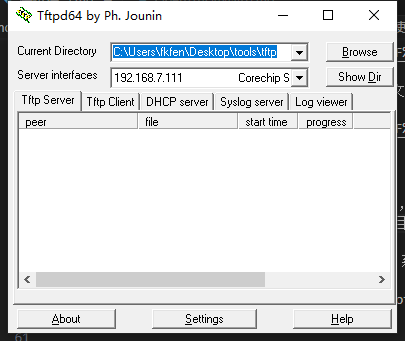
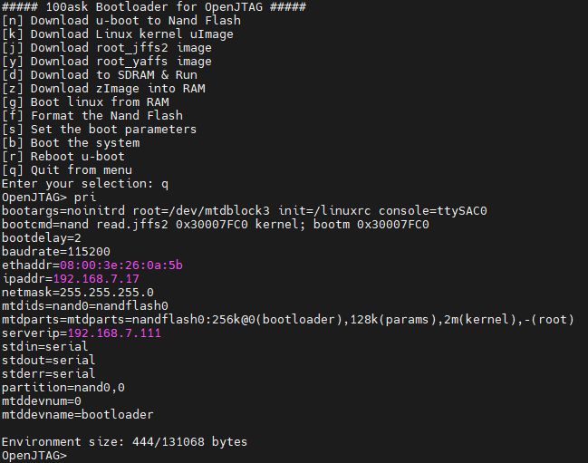

# 【JZ2440】使用 tftp+uboot 烧写内核和文件系统

开发板平面图：


## 使用 OpenJtag 工具烧写 u-boot

### eop烧写程序的安装（OpenJTAG）

1. OpenJTAG驱动安装

- 先使用电脑的高级重启选项，**禁用驱动强制证书认证**。
- 插入OpenJTAG，打开电脑设备管理器，选中“USB<=>JTAG&RS232”，更新驱动浏览本地驱动文件进行安装。

2. OpenOCD with GUI 的安装（oflash）

- 找到OpenOCD with GUI安装包，右键用管理员权限（如果没有管理员权限会报错）打开，按步骤完成安装。


- 安装完成后打开Windows的cmd命令终端，输入oflash，会跳出oflash烧写界面。


- **如果cmd窗口输入后不能直接烧写界面，需要找到OpenOCD安装目录下的bin目录，添加bin\oflash.exe的路径到电脑环境变量。**

### 使用 oflash 完成 u-boot 的烧写

1. 用cmd窗口进入到要烧写的bin文件所在的目标盘符，可以直接输入“oflash”开始烧写。

2. 根据图片提示完成 Nand Flash 或 Nor Flash 的 u-boot.bin 烧写；
    

3. 将开发板开关设置为Nand Flash启动，拔掉烧写器的连接线，重新上电。

## 使用 u-boot 完成系统内核和文件系统的烧写

### 使用 usb-dnw 工具完成系统烧写

1. 连接开发板 debug 的 usb 串口，将带有 u-boot 系统的开发板上电；

2. u-boot 启动过程中，使用空格将系统切换到 u-boot 命令行模式  


3. 接入传输文件的USB（debug串口usb旁边的USB口）。接入后打开 `zadig-2.3.exe` 安装USB驱动，如果无法自动识别可以选择 `Option -> list all` 列出所有设备，选择 `SEC S3C2410X Test B/D`，选中后选择 `libusb-win32` 驱动进行安装。  


4. 在命令终端选择对应选项烧写文件（选择对应选项n）。  


5. 打开电脑dnw_100task.exe，选择文件下载，很快文件烧写成功。  


### 使用 u-boot+tftp 工具完成系统烧写

1. Windows或Linux主机使用tftp工具建立一个服务器，要与开发板同网段且网络硬件能连接，并将需要更新的内核文件和文件系统放置在服务器软件（如 tftp32.exe）同目录下；  


2. 连接开发板 debug 的 usb 串口，将带有 u-boot 系统的开发板上电；

3. u-boot 启动过程中，使用空格将系统切换到 u-boot 命令行模式，并使用 q 进入菜单模式。  


4. 使用 `pri` 指令打印出 uboot 的环境变量，对需要修改的部分进行修改：

    修改开发板当前地址以及tftp服务器地址，可以先使用 ping {serverip} 的方式测试网络连接；

```bash
    OpenJTAG> setenv ipaddr 192.168.1.8 
    OpenJTAG> setenv serverip 192.168.1.5
    OpenJTAG> save
    OpenJTAG> reset
```

5. 使用 tftp 命令将 tftp 服务器中的文件下载到 SDRAM 中：

- 使用 tftp 命令将 tftp 服务器中的内核镜像文件下载到 SDRAM 中
```bash
    OpenJTAG> tftp 30000000 uImage_4.3
```

6. 将内核从 SDRAM 中烧写到 nandflash 中

- 擦除 kernel 分区。

    所谓的 kernel 分区其实只是 nandfalsh 中 0x00060000 - 0x00260000 这段地址空间。
```bash
    OpenJTAG> nand erase kernel
```

- 烧写到 nandflash 中。

    这条命令等价于：`OpenJTAG> nand write.jffs2 30000000 60000 200000`  
    这条命令的意思是：将 SDRAM 中 0x30000000 地址开始连续 0x200000 个字节写入 nandflash 0x60000 地址中去。
```bash
    OpenJTAG> nand write.jffs2 30000000 kernel
```

7. 下载烧写文件系统

    同样的方式，执行下列命令可以将文件系统烧写到 nandflash 中。
```bash
    OpenJTAG> tftp 30000000 fs_qtopia.yaffs2
    OpenJTAG> nand erase root
    OpenJTAG> nand write.yaffs 30000000 260000 2f76b40(为文件大小，默认十六进制)
    #将 SDRAM 中 0x30000000 地址开始连续 0x2f76b40(49769280) 个字节写入 nandflash 0x260000 地址中去。
```

8. 直接输入 boot 或重新上电自启动即可。


## 恢复出厂设置

