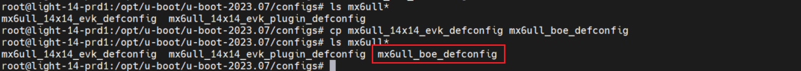

# imx6ull 移植 uboot2023.07

## 1. uboot 源码下载
### 1.1 源码压缩包下载
进入 uboot 源码下载网站下载对应的版本：
    [uboot源码下载地址](https://ftp.denx.de/pub/u-boot/)
    

### 1.2 源码解压和目录
将源码包使用传输工具传输到 Linux 系统下，使用 tar 命令解压：
> tar -jxvf u-boot-2023.07.tar.bz2


## 2. uboot 编译
### 2.1 复制 config 文件
进入源码的 `configs` 文件夹，把官方 config 文件复制出一个用于修改的 config 文件。


### 2.2 编译生成 .config 文件
在源码包主目录编译复制的defconfig文件：


### 2.3 编译生成镜像
输入编译语句，生成 u-boot-dtb.imx 镜像和设备树文件 u-boot.dtb 。
```bash
root@/opt/u-boot/u-boot-2023.07# make CROSS_COMPILE=arm-linux-gnueabihf-
scripts/kconfig/conf  --syncconfig Kconfig
  UPD     include/config.h
  CFG     u-boot.cfg
  ...
  ...
  DTC     arch/arm/dts/imx6dl-colibri-eval-v3.dtb
  SHIPPED dts/dt.dtb
  CAT     u-boot-dtb.bin
  CFGS    u-boot-dtb.cfgout
  MKIMAGE u-boot-dtb.imx
  OBJCOPY u-boot.srec
  COPY    u-boot.bin
  SYM     u-boot.sym
  COPY    u-boot.dtb
  OFCHK   .config
```

## 3. uboot 烧写和移植
### 3.1 使用 mfgtool 烧写程序
1. 将生成的 `u-boot-dtb.imx` 复制到 `Profiles\BOE-Linux\OS Firmware\files` 目录下；
2. 修改 `u-boot-dtb.imx` 的名称，根据 mfgtool 的配置文件格式修改。（默认格式，可以修改为 `u-boot-imx6ull14x14evk_emmc.imx` ）。
3. 使用 mfgtool 程序将 uboot 烧写进系统。