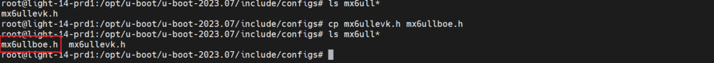
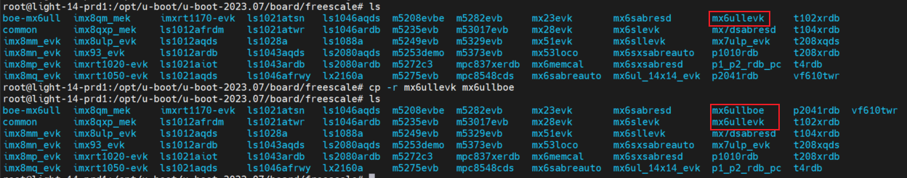
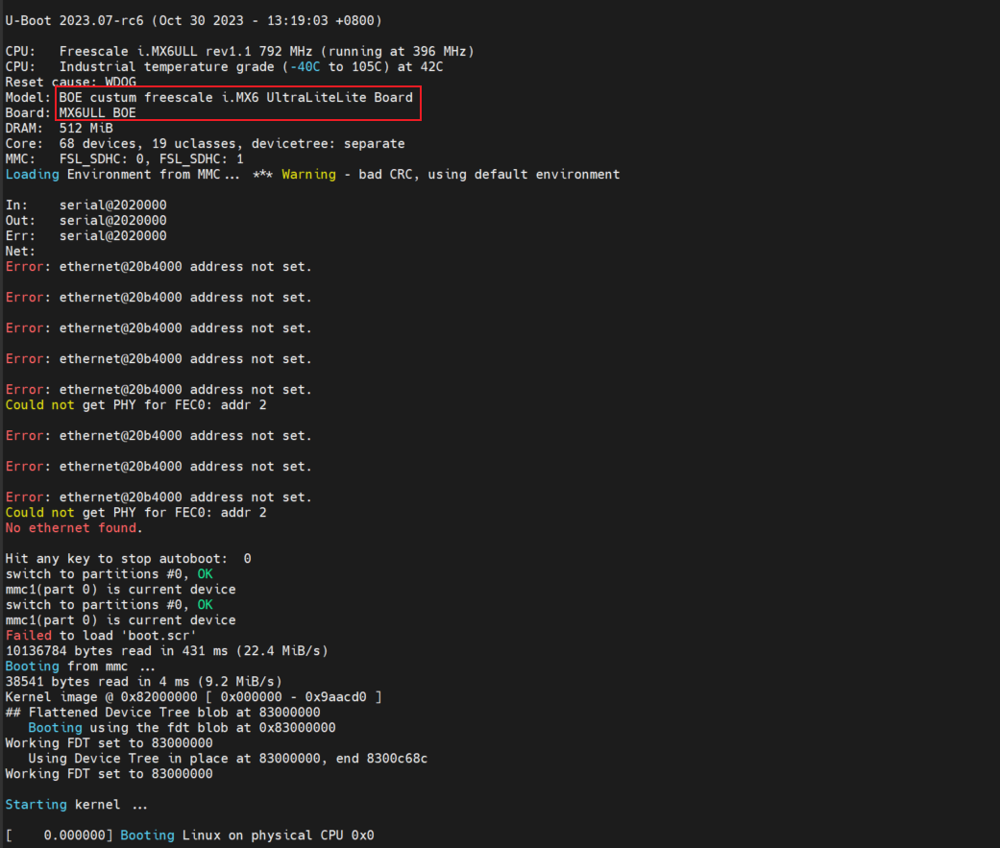
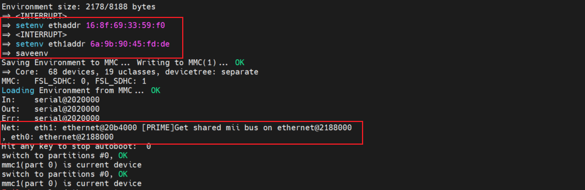
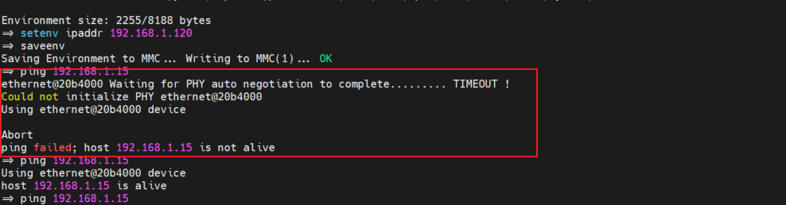
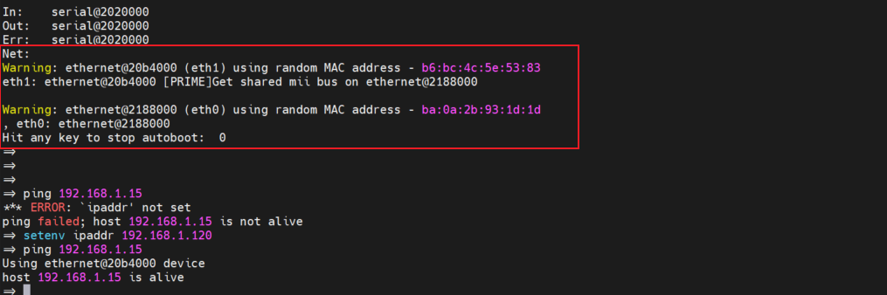
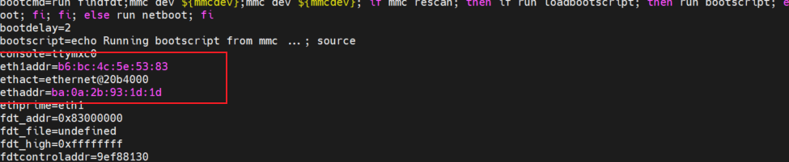

# imx6ull 移植 uboot2023.07

## 1. uboot 源码下载
### 1.1 源码压缩包下载
进入 uboot 源码下载网站下载对应的版本：
    [uboot源码下载地址](https://ftp.denx.de/pub/u-boot/)
    

### 1.2 源码解压和目录
将源码包使用传输工具传输到 Linux 系统下，使用 tar 命令解压：
> tar -jxvf u-boot-2023.07.tar.bz2


------------------------

## 2. uboot 源码修改

### 2.1 新增 `configs/mx6ull_boe_defconfig` 文件
1. 进入源码的 `configs` 文件夹，把官方 `mx6ull_14x14_evk_defconfig` 文件复制出一个用于修改的 `mx6ull_boe_defconfig` 文件。


2. 修改复制来的 `mx6ull_boe_defconfig` 配置文件，并做出修改：
    ```bash
    CONFIG_ARM=y
    CONFIG_ARCH_MX6=y
    CONFIG_TEXT_BASE=0x87800000
    CONFIG_SYS_MALLOC_LEN=0x1000000
    CONFIG_NR_DRAM_BANKS=1
    CONFIG_SF_DEFAULT_SPEED=40000000
    CONFIG_ENV_SIZE=0x2000
    CONFIG_ENV_OFFSET=0xC0000
    CONFIG_MX6ULL=y
    CONFIG_TARGET_MX6ULL_BOE=y  # 将目标开发板设置为自定义的开发板名
    CONFIG_DM_GPIO=y
    CONFIG_DEFAULT_DEVICE_TREE="imx6ull-boe"  # 将目标设备树设置为自定义的设备树名
    CONFIG_SYS_MEMTEST_START=0x80000000
    CONFIG_SYS_MEMTEST_END=0x88000000
    CONFIG_SUPPORT_RAW_INITRD=y
    ...
    CONFIG_SYS_I2C_MXC=y
    CONFIG_DM_MMC=y             # 新增
    ...
    CONFIG_NET_RANDOM_ETHADDR=y
    CONFIG_OF_LIBFDT_OVERLAY=y  # 新增
    CONFIG_RAMBLOCK=y           # 新增，指定启用RAM块设备支持，嵌入式系统或临时存储需求较大的应用程序，可以提供更高的性能和更低的延迟
    CONFIG_NET_RANDOM_ETHADDR=y # 新增，自动识别mac地址
    ```

### 2.3 新增 `include/configs/mx6ullboe.h` 板级头文件
1. 在 `include/configs` 目录下复制开发板对应的头文件 `mx6ullevk.h` ，命名为 `mx6ullboe.h`：

    

2. 修改 `mx6ullboe.h` 头文件开头的宏为自己的宏：
    ```h
    #ifndef __MX6ULLBOE_CONFIG_H
    #define __MX6ULLBOE_CONFIG_H
    ```

3. 还可以根据需求更改 `mx6ullboe.h` 头文件。  
里面有很多宏定义，如配置u-boot默认串口打印使用 uart 的第几个口，网口默认使用哪个网口等，也有一些 u-boot 环境变量的的默认配置。如果我们想要改变默认的uart和enet口，那就在 mx6ullboe.h 里面修改即可。

### 2.4 添加自定义的 `board/freescale/mx6ullboe` 板级文件夹
1. NXP 的 I.MX 系列芯片的所有板级文件夹都存放在 `board/freescale` 目录下，在这个目录下 有个名为 mx6ullevk 的文件夹，这个文件夹就是 NXP 官方 I.MX6ULL EVK 开发板的板级文件夹。复制 `mx6ullevk` 整个文件夹，将其重命名为 `mx6ullboe` 。

    

2. 修改 `board/freescale/mx6ullboe` 文件夹下的 `mx6ullevk.c` 文件名，将文件名改为 `mx6ullboe.c`

3. 修改 `board/freescale/mx6ullboe` 文件夹下的 `Makefile` 文件，将 `mx6ullevk` 改为 `mx6ullboe` 。
    ```makefile
    # SPDX-License-Identifier: GPL-2.0+
    # (C) Copyright 2016 Freescale Semiconductor, Inc.

    obj-y  := mx6ullboe.o
    ```

4. 修改 `board/freescale/mx6ullboe` 文件夹下的 `Kconfig` 文件，将 `mx6ullevk` 改为 `mx6ullboe` 相关的配置。其中 `CONFIG_TARGET_MX6ULL_BOE` 为 `mx6ull_boe_defconfig` 中修改的 `CONFIG_TARGET_MX6ULL_BOE` 宏。
    ```Kconfig
    if CONFIG_TARGET_MX6ULL_BOE

    config SYS_BOARD
    	default "mx6ullboe"

    config SYS_VENDOR
    	default "freescale"

    config SYS_CONFIG_NAME
    	default "mx6ullboe"

    config IMX_CONFIG
    	default "board/freescale/mx6ullboe/imximage.cfg"

    endif
    ```

5. 修改 `board/freescale/mx6ullboe` 文件夹下的 `imximage.cfg` 文件，将 `imximage.cfg` 中指定的目录修改为对应目录：
    ```cfg
    ...

    #ifdef CONFIG_USE_IMXIMG_PLUGIN
    /*PLUGIN    plugin-binary-file    IRAM_FREE_START_ADDR*/
    PLUGIN	board/freescale/mx6ullboe/plugin.bin 0x00907000
    #else

    #ifdef CONFIG_IMX_HAB
    CSF CONFIG_CSF_SIZE
    #endif

    ...
    ```

6. 修改 `board/freescale/mx6ullboe` 目录下的 `MAINTAINERS` 文件。修改 `MAINTAINERS` 文件，修改后的内容如下：
    ```MAINTAINERS
    MX6ULLEVK BOARD
    M:	Peng Fan <fengkang5579@boe.com.cn>
    S:	Maintained
    F:	board/freescale/mx6ullboe/
    F:	include/configs/mx6ullboe.h
    F:	configs/mx6ull_boe_defconfig
    F:	configs/mx6ull_boe_plugin_defconfig
    F:	configs/mx6ulz_boe_defconfig
    ```

### 2.5 在文件 `arch/arm/mach-imx/mx6/Kconfig` 添加板级文件选项
1. 在 `arch/arm/mach-imx/mx6/Kconfig`  中找到官方的配置 `TARGET_MX6ULL_14X14_EVK` ，复制官方选项配置的写法，复制一份自定义的选项配置在其后：
    ```Kconfig
    config TARGET_MX6ULL_14X14_EVK
  	    bool "Support mx6ull_14x14_evk"
  	    depends on MX6ULL
  	    select BOARD_LATE_INIT
  	    select DM
  	    select DM_THERMAL
  	    select IOMUX_LPSR
  	    imply CMD_DM

    config TARGET_MX6ULL_BOE
  	    bool "Support mx6ull_boe"
  	    depends on MX6ULL
  	    select BOARD_LATE_INIT
  	    select DM
  	    select DM_THERMAL
  	    select IOMUX_LPSR
  	    imply CMD_DM
    ```

2. 在 `arch/arm/mach-imx/mx6/Kconfig`  中找到官方的板级 `Kconfig` 的引用，复制一份自定义的选项配置在其后：
    ```Kconfig
    ...
    source "board/freescale/mx6ullevk/Kconfig"
    source "board/freescale/mx6ullboe/Kconfig"
    ...
    ```

### 2.6 在文件 `arch/arm/dts/` 自定义设备树
1. 将 `arch/arm/dts/` 目录下的 `imx6ullevk.dts` 文件复制一份，命名为 `imx6ullboe.dts` ；修改设备树文件内容如下， `model` 包含的关系到 `uboot` 启动的 `MODEL` 打印信息：
    ```dts
    ...
    /dts-v1/;

    #include "imx6ull.dtsi"
    #include "imx6ul-14x14-evk.dtsi"

    / {
    	model = "BOE custum freescale i.MX6 UltraLiteLite Board";
    	compatible = "fsl,boe-mx6ull", "fsl,imx6ull";
    };
    ...
    ```

2. 修改 `arch/arm/dts/Makefile` 文件，在编译 dtb 文件的步骤中加入 `imx6ullboe.dts` 文件：
    ```makefile
    dtb-$(CONFIG_MX6ULL) += \
	    imx6ull-14x14-evk.dtb \
	    imx6ull-boe.dtb \     # 新增
	    imx6ull-colibri-emmc-eval-v3.dtb \
	    imx6ull-colibri-eval-v3.dtb \
	    imx6ull-myir-mys-6ulx-eval.dtb \
	    imx6ull-seeed-npi-imx6ull-dev-board.dtb \
	    imx6ull-phytec-segin-ff-rdk-emmc.dtb \
	    imx6ull-dart-6ul.dtb \
	    imx6ull-somlabs-visionsom.dtb \
	    imx6ulz-bsh-smm-m2.dtb \
	    imx6ulz-14x14-evk.dtb
    ```


### 2.7 其他自定义修改
1. 修改 uboot 启动信息  
UBoot 启动信息中会有 “Board: MX6ULL 14x14 EVK” ，可以修改文件 `board/freescale/mx6ullboe` 的函数 `int checkboard(void)` 为：
    ```c
    int checkboard(void)
    {
    	if (is_cpu_type(MXC_CPU_MX6ULZ))
    		puts("Board: MX6ULZ BOE\n");
    	else
    		puts("Board: MX6ULL BOE\n");

    	return 0;
    }
    ```


--------------------
## 3. 编译 uboot 镜像

### 3.1 命令行编译
1. 编译生成 .config 文件
  
    在源码包主目录编译新增的 `mx6ull_boe_defconfig` 文件：
  
    

2. 编译生成镜像

    输入编译语句，生成 `u-boot-dtb.imx` 镜像和设备树文件 `u-boot.dtb` 。
    ```bash
    root@/opt/u-boot/u-boot-2023.07# make CROSS_COMPILE=arm-linux-gnueabihf-
    scripts/kconfig/conf  --syncconfig Kconfig
      UPD     include/config.h
      CFG     u-boot.cfg
      ...
      ...
      DTC     arch/arm/dts/imx6dl-colibri-eval-v3.dtb
      SHIPPED dts/dt.dtb
      CAT     u-boot-dtb.bin
      CFGS    u-boot-dtb.cfgout
      MKIMAGE u-boot-dtb.imx
      OBJCOPY u-boot.srec
      COPY    u-boot.bin
      SYM     u-boot.sym
      COPY    u-boot.dtb
      OFCHK   .config
    ```

### 3.2 设置脚本编译
1. 在 uboot 根目录下新建一个名为 build.sh 的 shell 脚本，在这个 shell 脚本里面输入如下内容：
    ```bash
    #!/bin/bash

    make ARCH=arm CROSS_COMPILE=arm-linux-gnueabihf- distclean
    make ARCH=arm CROSS_COMPILE=arm-linux-gnueabihf- mx6ull_boe_defconfig
    make ARCH=arm CROSS_COMPILE=arm-linux-gnueabihf-
    ```
2. 执行编译脚本

## 3. uboot 烧写和移植
### 3.1 使用 mfgtool 烧写程序
1. 将生成的 `u-boot-dtb.imx` 复制到 `Profiles\BOE-Linux\OS Firmware\files` 目录下；
2. 修改 `u-boot-dtb.imx` 的名称，根据 mfgtool 的配置文件格式修改。（默认格式，可以修改为 `u-boot-imx6ull14x14evk_emmc.imx` ）。
3. 使用 mfgtool 程序将 uboot 烧写进系统。
4. uboot 启动信息如下：  
可以看到通过设备树 `arch/arm/dts/imx6ull-boe.dts` 修改的 `MODEL` ，以及板级文件夹中 `board/freescale/mx6ullboe.c` 修改的 `BOARD` 内容已经修改为自定义内容。
    


## 4. uboot 网络环境配置
### 4.1 手动修改 uboot 的网络环境变量 MAC 地址
1. 在 3.1 中，最后 uboot 的启动信息出现了以下错误打印：
    ```bash
    Net:
    Error: ethernet@20b4000 address not set.

    Error: ethernet@20b4000 address not set.

    Error: ethernet@20b4000 address not set.

    Error: ethernet@20b4000 address not set.

    Error: ethernet@20b4000 address not set.
    Could not get PHY for FEC0: addr 2
    ```
    这是由于 uboot 没有设置网络环境变量，需要修改 uboot 物理 MAC 地址的内容。

2. 这里使用以下语句设置网口的 MAC 地址，具体的 MAC 地址也通过启动内核后的内核驱动识别的 MAC 地址的打印信息来获取：
    ```bash
    => setenv ethaddr 16:8f:69:33:59:f0
    => setenv eth1addr 6a:9b:90:45:fd:de
    => saveenv
    ```

3. 重启后，错误打印消失
    

4. 添加 ip 地址环境变量，可以 ping 通电脑：
    
    可以看到 uboot 网络连接正常。**其中的错误打印信息是由于物理链路（网线）未连接。**

### 4.2 修改 `mx6ull_boe_defconfig` 的网络环境变量自动识别 MAC 地址
1. 在 `configs/mx6ull_toto_defconfig` 文件中，在文件最后新增一个 uboot 环境变量 `CONFIG_NET_RANDOM_ETHADDR=y` ，使能随机生成 MAC 地址:
    ```defconfig
    ...
    CONFIG_NET_RANDOM_ETHADDR=y     # 新增
    ```
2. 修改完成后，重新编译 uboot，并烧录到开发板：  
    可以看到已经可以成功识别 mac 地址：
    
    可以看到环境变量中已经可以自动识别 mac 地址，生成环境变量 `eth1addr` 、 `ethact` 、 `ethaddr` ：
    


## 5. 修改 uboot 启动内核参数
### 5.1 设置启动选项
uboot 无法启动内核时，可能是内核启动选项设置错误，可以通过 `setenv bootargs` 设置启动选项，例如：
```bash
=>  setenv bootargs 'console=ttymxc0,115200 root=/dev/mmcblk1p2 rootwait rw'
=>  setenv bootcmd 'fatload mmc 1:1 80800000 zImage;fatload mmc 1:1 83000000 imx6ull-14x14-evk.dtb;bootz 80800000 - 83000000'
=>  saveenv
```

### 5.2 修改官方镜像的环境变量
根据自己烧写的内核镜像名称以及设备树名称，修改 UBOOT 启动的环境变量的内核文件名和设备树文件名。
```bash
# 修改前
board_name=EVK
board_rev=14X14
...
findfdt=if test $fdt_file = undefined; then if test $board_name = ULZ-EVK && test $board_rev = 14X14; then setenv fdt_file imx6ulz-14x14-evk.dtb; fi; if test $board_name = EVK && test $board_rev = 14X14; then setenv fdt_file imx6ull-14x14-evk.dtb; fi; if test $fdt_file = undefined; then echo WARNING: Could not determine dtb to use; fi; fi;
image=zImage
```
```bash
# 修改，
=> setenv findfdt "if test $board_name = EVK && test $board_rev = 14X14; then setenv fdt_file imx6ull-boe.dtb; fi;"
=> setenv image zImage-6.5.9
=> saveenv
```
