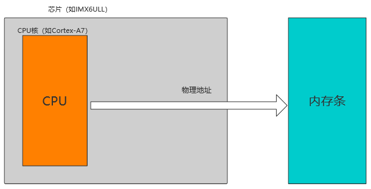

# imx6ull 内存映射

## 几种地址和内存的定义

1. **物理地址**：CPU地址总线上发出的地址,即CPU进行地址空间寻址的地址(作用:用于cpu地址空间寻址)。

2. **物理内存**: 主板上的物理内存条所提供的内存空间定义为物理内存(嵌入式中一般指DRAM的空间), 它属于物理地址的一部分, 也就是说每个物理内存单元的实际地址就是物理地址。

3. **IO内存**: 对外设寄存器的编址方式, 将物理地址的一部分划分出来用作IO地址空间(在这里指, 一类CPU（如Power PC、ARM等）把这些外设寄存器看做是内存的一部分、寄存器参与内存统一编址，通过一般的内存指令来访问这些外设寄存器，称为“I/O内存”), 比如imx6dl中gpio寄存器(0x209c000-0x20b7fff), MMDC寄存器(0x21b0000-0x21b3fff)(这里MMDC是DDR控制器)等等都看成IO内存。

4. **虚拟地址**: 应用程序看到的内存空间定义为虚拟地址空间, 其地址就叫做虚拟地址. 虚拟地址是硬件MMU与软件内存管理结合的产物，方便更高效率的使用RAM. 即需要MMU(内存管理单元)的支持。

## MMU

在linux环境直接访问物理内存是很危险的，如果用户不小心修改了内存中的数据，很有可能造成错误甚至系统崩溃。 为了解决这些问题内核便引入了MMU。在linux环境中， 我们开启了MMU之后想要读写具体的寄存器（物理地址），就必须用到物理地址到虚拟地址的转换函数

### MMU 的功能

MMU为编程提供了方便统一的内存空间抽象，其实我们的程序中所写的变量地址是虚拟内存当中的地址， 倘若处理器想要访问这个地址的时候，MMU便会将此虚拟地址（Virtual Address）翻译成实际的物理地址（Physical Address）， 之后处理器才去操作实际的物理地址。MMU是一个实际的硬件，并不是一个软件程序。具体功能如下：

- **保护内存**： MMU给一些指定的内存块设置了读、写以及可执行的权限，这些权限存储在页表当中，MMU会检查CPU当前所处的是特权模式还是用户模式，如果和操作系统所设置的权限匹配则可以访问，如果CPU要访问一段虚拟地址，则将虚拟地址转换成物理地址，否则将产生异常，防止内存被恶意地修改。

- **提供方便统一的内存空间抽象，实现虚拟地址到物理地址的转换**： CPU可以运行在虚拟的内存当中，虚拟内存一般要比实际的物理内存大很多，使得CPU可以运行比较大的应用程序。

### 开启 MMU 的作用

- 在没有启用 MMU 时，CPU在读取指令或者访问内存时便会将地址直接输出到芯片的引脚上，此地址直接被内存接收，这段地址称为物理地址；

- 当CPU开启了MMU时，CPU发出的地址将被送入到MMU，被送入到MMU的这段地址称为虚拟地址， 之后MMU会根据去访问页表地址寄存器然后去内存中找到页表（假设只有一级页表）的条目，从而翻译出实际的物理地址。

- 对于I.MX 6ULL 这种32位处理器而言，其虚拟地址空间共有4G(2^32),一旦CPU开启了MMU， 任何时候CPU发出的地址都是虚拟地址，为了实现虚拟地址到物理地址之间的映射， MMU内部有一个专门存放页表的页表地址寄存器，该寄存器存放着页表的具体位置， 用ioremap映射一段地址意味着使用户空间的一段地址关联到设备内存上， 这使得只要程序在被分配的虚拟地址范围内进行读写操作，实际上就是对设备（寄存器）的访问。

## TLB 

MMU 的地址转换过程中，当只有一级页表进行地址转换的时候，CPU每次读写数据都需要访问两次内存， 第一次是访问内存中的页表，第二次是根据页表找到真正需要读写数据的内存地址； 如果使用两级了表，那么CPU每次读写数据都需要访问3次内存，这样非常繁琐且耗费CPU的性能，为了解决这个问题，TLB（Translation Lookaside Buffer）便孕育而生。

### TLB 作用原理

在CPU传出一个虚拟地址时，MMU最先访问TLB，假设TLB中包含可以直接转换此虚拟地址的地址描述符， 则会直接使用这个地址描述符检查权限和地址转换，如果TLB中没有这个地址描述符， MMU才会去访问页表并找到地址描述符之后进行权限检查和地址转换， 然后再将这个描述符填入到TLB中以便下次使用，实际上TLB并不是很大， 那TLB被填满了怎么办呢？如果TLB被填满，则会使用round-robin算法找到一个条目并覆盖此条目。
