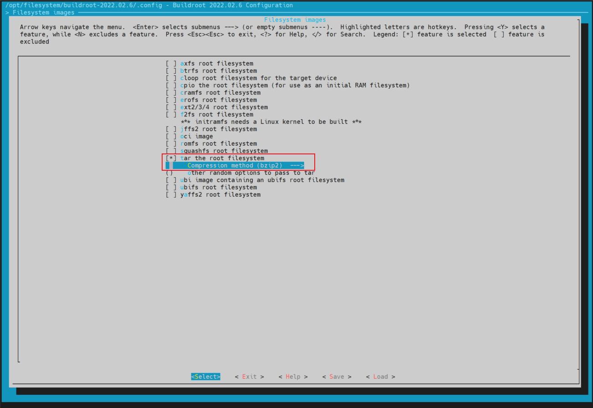

# imx6ull 移植 buildroot-2022.02

## 1. buildroot 源码下载
进入 buildroot 官网 [buildroot.org](buildroot.org) ，选择右上角菜单栏的 "DOWNLOAD" 选项，进入如下界面。


### 1.1 源码压缩包下载
选择图中的连接地址 http://buildroot.net/downloads/ 可以进入到 buildroot 最新版之前所有版本的下载地址，选择对应版本下载即可。

### 1.2 git 获取源码（推荐）
选择图中的 git 链接，通过指定标签（仓库的 tag 可以查看 GitHub 的 buildroot 仓库： https://github.com/buildroot/buildroot ）的方式获取单个版本的源码，指定 `--depth=1` 指定只获取最新的版本。
```bash
root@light-14-prd1:/opt# git clone -b 2022.02.6 --depth=1 https://gitlab.com/buildroot.org/buildroot.git
Cloning into 'buildroot'...
remote: Enumerating objects: 16500, done.
remote: Counting objects: 100% (16500/16500), done.
remote: Compressing objects: 100% (15479/15479), done.
remote: Total 16500 (delta 1025), reused 10329 (delta 656), pack-reused 0
Receiving objects: 100% (16500/16500), 8.01 MiB | 2.67 MiB/s, done.
Resolving deltas: 100% (1025/1025), done.
Note: checking out '374f83630bafe7371ecd751cf07e3e7c0ce1c71e'.

You are in 'detached HEAD' state. You can look around, make experimental
changes and commit them, and you can discard any commits you make in this
state without impacting any branches by performing another checkout.

If you want to create a new branch to retain commits you create, you may
do so (now or later) by using -b with the checkout command again. Example:

  git checkout -b <new-branch-name>

```

## 2. buildroot 添加板级文件
1. 在 `board/freescale/` 目录下复制一份 `imx6ullevk` 目录，并重命名为 `imx6ullboe` ；
2. 在 `imx6ullboe` 中创建一个覆写文件夹，命名为 `rootfs_overlay` ，并根据需求将需要覆写的文件添加到该文件夹中。注意该文件作用在完成根文件系统的 `output/target` 文件后，打包文件系统镜像前，作用是覆写文件系统的文件，如果与 buildroot 创建的系统文件重名，会覆盖掉同名系统文件；
3. 在 `imx6ullboe` 中创建一个多用户表，命名为 `users_table.txt` ，用于创建非 root 账户、密码以及登录权限等。
    

## 3. buildroot 源码的配置
### 3.1 创建自己的 buildroot 配置
将 `configs/` 目录下的 `imx6ullevk_defconfig` 复制一份，然后修改为 `imx6ullboe_defconfig` ，便于保存自己的配置。

### 3.2 修改 buildroot 配置
1. 在 buildroot 主目录下，使用 `make imx6ullboe_defconfig` 命令将 defconfig 的配置导出，在主目录生成 `.config` 文件。
    

2. 在 buildroot 主目录下，使用 `make menuconfig` 命令修改 `.config` 配置，会生成图形界面的配置，根据需要修改相应的配置，修改完成后的配置会设置到 `.config` 文件 ：

    

    -  `Target options  --->` :
        

    - `Build options  --->` :
        

    - `Toolchain  --->` :  
    红框部分为需要根据交叉编译环境修改的配置，包括**路径、交叉编译器前缀、交叉编译器的 GCC 版本、交叉编译器引用的内核头文件版本、交叉编译器用的 C 语言库类型**，下面的其他语言和库支持需要根据实际的交叉编译器版本和需求进行修改。  
    注意：版本定义在交叉编译器路径下的 `arm-linux-gnueabihf/libc/usr/include/linux/version.h` 头文件，版本定义在 `LINUX_VERSION_CODE` 宏定义，该宏的的数值为十进制，需要转为十六进制看版本。如 327680 转为十六进制为0x50000，表示内核头文件版本为 v5.00.00
        
    
    - `System configuration  --->` :  
    红框部分为修改过的配置。  
        - `Init system` ，为 Linux 的启动方式，一般可以使用的启动有：BusyBox 、 systemV 、 OpenRC 、 systemd 。
        - `/bin/sh`，为选择的默认 shell ，一般设置为 bash 。
        - `timezone list`，为时区列表，设置为 "asia" 后系统将不包含多余的时区列表，只保留亚洲时区。时区列表在文件系统的 `/usr/share/zoneinfo` 目录下。
        - `default local time`，为默认时区，设置系统的默认时区，这里设置为亚洲上海，为东八区CST时间。系统烧写完成后，可以使用 `timedatectl` 命令查看当前系统的时间详细信息，其中包含当前设置的时区。
        - `Path to the users tables` ，用于指定多用户表的路径，用于生成多用户的文件系统。
        
        - `Root filesystem overlay directories` ，用于指定覆盖文件的路径，可以在该指定的目录下按照 `Linux` 根目录形式创建自己的文件，如需要添加一个 `/etc/profile` ，可以在目录下创建一个 `etc` 目录，在目录中新建一个 profile 文件，如果新建文件与原系统文件冲突，则新建文件会覆盖掉原系统文件。
    
    - ` Kernel  --->` :  
    用于指定编译内核版本，这里我们不使用 buildroot 编译内核，所以不使能 `Linux Kernel` 选项。
        
    
    - `Target packages  --->` ：  
    红框部分表示使用自定义的 `busybox.config` 配置，不使用默认的配置，可以将修改后的 `output/build/busybox-1.35.0/.config` 配置文件备份到该文件，避免频繁修改。  
    注意：这里的 `BusyBox` 选项不过不采用自己定义命令行工具的方式，建议开启，否则可能导致进入不到命令行界面。
        

    - `Filesystem images  --->`:  
    指定生成的文件系统镜像格式，这里只需要生成 tar.bz2 格式的文件系统，所以只选择 `tar.bz2` 格式。
        

    - `Bootloaders  ---> ` :  
    用于指定编译引导程序，这里我们不使用 buildroot 编译 uboot ，所以不使能 `U-Boot` 选项。
        
    
    - `Host utilities  ---> ` :  
    保持默认，根据需求删改。
    
    - `Legacy config options  --->` :  
    保持默认，根据需求删改。

3. 在 buildroot 主目录下，使用 `make savedefconfig` 命令将 `.config` 配置保存到 `imx6ullboe_defconfig` 文件，可以备份到其他文件中。


### 3.3 编译 buildroot 镜像文件
1. 在 buildroot 主目录下，使用 `make` 命令编译 buildroot 镜像文件。
    

2. 编译完成后，在 `output/images` 目录下，会生成 `rootfs.tar.bz2` 文件，该文件为 buildroot 镜像文件。

### 3.4 烧写 uboot 镜像文件
使用 mfgtools 将文件系统烧写到开发板。烧写后启动的系统展示如下：
- `banner` 欢迎语展示：
    

- `timezone` 时区展示：
    