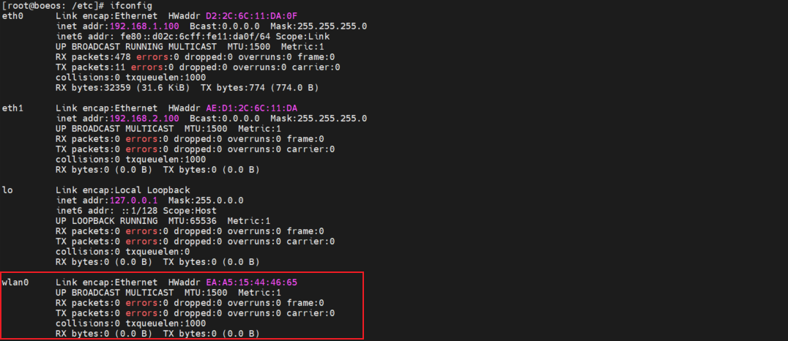
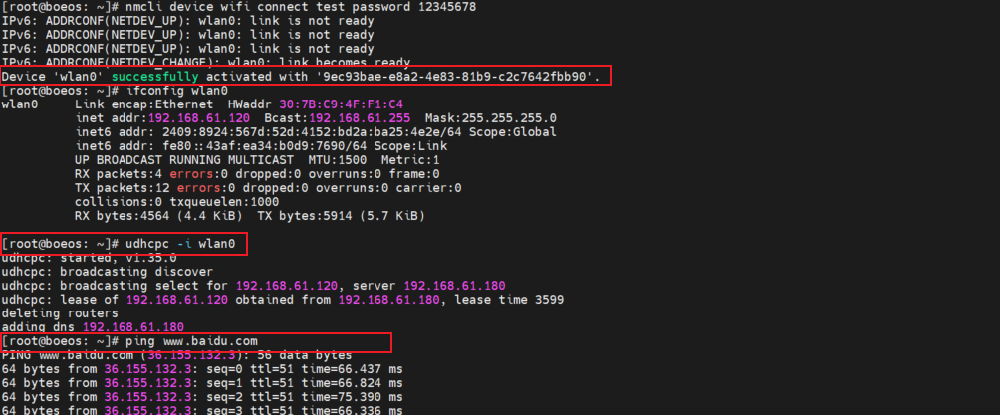
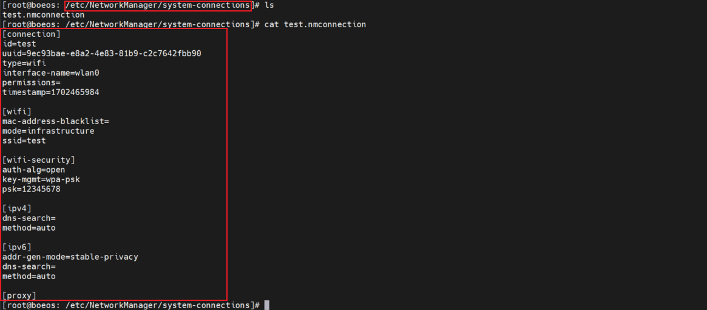
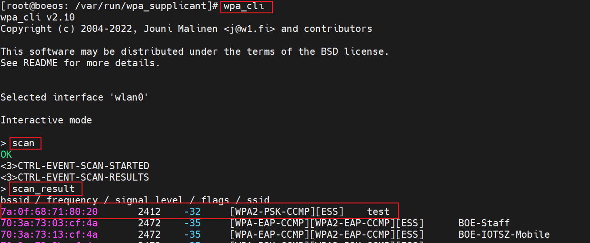
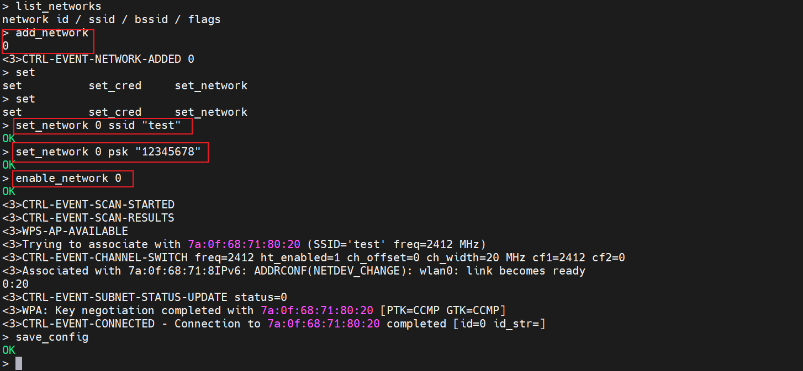
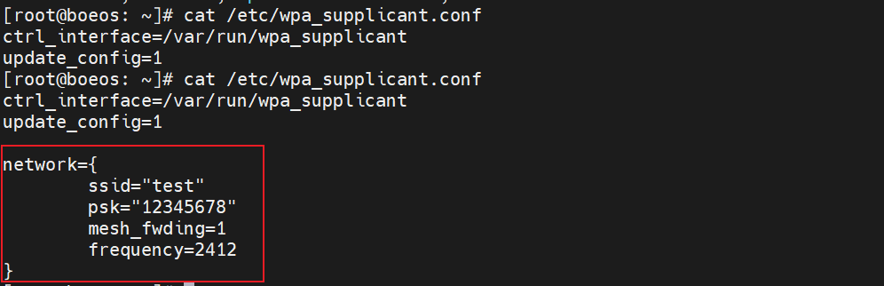
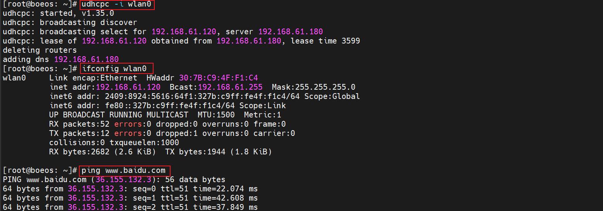
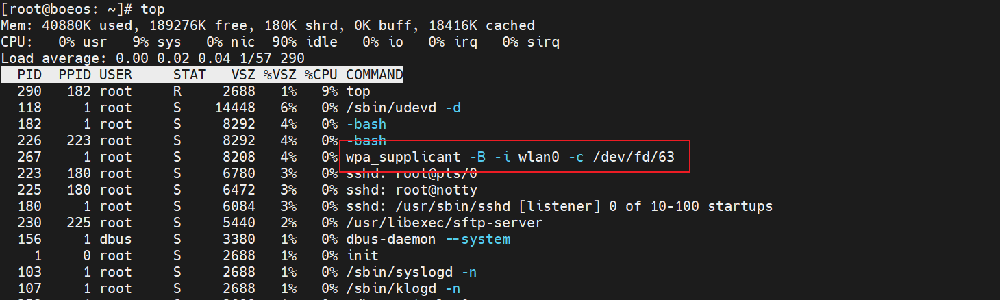

# 1. WIFI 驱动安装
## 1.1. 飞凌板载 `rtl8723du` 驱动安装
1. 在飞凌提供的 linux-4.1.15 版本的内核中，板载 `rtl8723du` 驱动是以模块的形式存在的，所以需要先安装 `rtl8723du` 模块，安装命令如下：
```bash
    # 采用 modprobe 自动依赖的方式进行安装模块
    # 使用后系统会在 /lib/module/<$(uname -r)> 目录下的搜索模块，搜索不到会报错
    modprobe 8723du

    # 采用 insmod 手动输入路径安装
    insmod /lib/modules/4.1.15-00070-gb52e1ec/kernel/drivers/net/wireless/realtek/rtl8723DU/8723du.ko
```

2. 这里由于制作的文件系统镜像与内核镜像的名称不同，所以需要手动指定内核模块的路径。安装结果如下：


3. 安装完成后，可以看到生成了 `wlan0` 网卡，表明 `rtl8723du` 驱动已安装成功。



# 2. WIFI 连接的必备工具
linux 系统下的 WIFI 连接需要用到 WIFI 连接工具 `wpa_supplicant`，该工具是比较常用的无线网络连接工具，需要在 buildroot 工具链中选择并编译，添加到文件系统中。

## 2.1. 将 `wpa_supplicant` 添加到文件系统
可以使用 `menuconfig` 工具的搜索功能，搜索 `wpa_supplicant` 工具的相关配置，并编译。

1. `menuconfig` 下进行相关配置
- `menuconfig` 下使用 `/` 搜索功能搜索 `wpa_supplicant` 工具，选中如下：
    
- 选择 `wpa_supplicant` 工具的配置选项，这里为了适配各类 WIFI ，将所有配置全部选中：
    

2. `CONFIG` 配置宏展示如下：
    ```CONFIG
    BR2_PACKAGE_WPA_SUPPLICANT--->
        BR2_PACKAGE_WPA_SUPPLICANT
        BR2_PACKAGE_WPA_SUPPLICANT_NL80211
        BR2_PACKAGE_WPA_SUPPLICANT_WEXT
        BR2_PACKAGE_WPA_SUPPLICANT_WIRED
        BR2_PACKAGE_WPA_SUPPLICANT_IBSS_RSN
        BR2_PACKAGE_WPA_SUPPLICANT_AP_SUPPORT
            BR2_PACKAGE_WPA_SUPPLICANT_WIFI_DISPLAY
            BR2_PACKAGE_WPA_SUPPLICANT_MESH_NETWORKING
        BR2_PACKAGE_WPA_SUPPLICANT_AUTOSCAN
        BR2_PACKAGE_WPA_SUPPLICANT_EAP
        BR2_PACKAGE_WPA_SUPPLICANT_HOTSPOT
        BR2_PACKAGE_WPA_SUPPLICANT_DEBUG_SYSLOG
        BR2_PACKAGE_WPA_SUPPLICANT_WPS
        BR2_PACKAGE_WPA_SUPPLICANT_WPA3
        BR2_PACKAGE_WPA_SUPPLICANT_CLI
        BR2_PACKAGE_WPA_SUPPLICANT_WPA_CLIENT_SO
        BR2_PACKAGE_WPA_SUPPLICANT_PASSPHRASE
        BR2_PACKAGE_WPA_SUPPLICANT_CTRL_IFACE
        BR2_PACKAGE_WPA_SUPPLICANT_DBUS
        BR2_PACKAGE_WPA_SUPPLICANT_DBUS_INTROSPECTION
    ```

# 3. WIFI 连接方式
## 3.1. 在集成 `NetworkManager` 进程的环境下连接
（查阅资料发现 `NetworkManager` 工具一般用在桌面环境，尝试将文件修改为 `systemd` 启动方式，并使用对应的 `systemd-network` 进程服务进行 WIFI 连接）

`NetworkManager` 配置无线网络采用的是 `nmcli` 命令对无线连接进行设置并写入到配置文件，再调用 `wpa_supplicant` 工具对无线网络进行连接，调用过程在系统后台，无需细节配置。`nmcli` 命令是 `NetworkManager` 集成的命令，功能很强大，具体的可以使用命令+help的方式查看具体功能。

1. 使用 `nmcli` 命令对无线网络进行搜索：
    ```bash
        # 使用 wifi 命令对 device 对象中的进行
        # nmcli 命令格式为 nmcli {OBJECT {COMMAND <param> } }
        # 这里由于所处环境 WIFI 较多，使用 grep 管道进行筛选
        nmcli device wifi list | grep test
    ```
    
    结果如下，也可以看到 WIFI 的相关参数：

    

2. 使用 `nmcli` 命令对无线网卡进行连接，配置完成后会生成配置文件，重启设备也会自动连接到该WIFI：
    ```bash
        # 使用 wifi 命令对 device 对象中的进行
        # nmcli 命令格式为 nmcli {OBJECT {COMMAND <param> } }
        # 这里由于所处环境 WIFI 较多，使用 grep 管道进行筛选
        nmcli device wifi connect test password 12345678
    ```

    结果如下，也可以看到 WIFI 成功连接，完成连接后需要使用 udhcpc 命令自动获取 ip 地址和 dns 就可以连接到外网：

    

3. 配置完成后，重启设备，会自动连接到 WIFI，在 `/etc/NetworkManager/system-connections` 目录下会看到上述命令设置的 WIFI 配置文件 `test.nmconnection` ：
    

## 3.2. 在集成 `systemd-network` 进程的环境下连接

## 3.3. 在无网络守护进程的环境下连接
在无任何网络守护进程的环境下，需要直接使用 `wpa_supplicant` 工具对 WIFI 进行连接，需要手动配置网络连接信息。

### 3.3.1. `wpa_supplicant` 软件包简介
wpa_supplicant 是跨平台的 WPA 请求者程序（supplicant），支持 WEP、WPA 和 WPA2(IEEE 802.11i).。可以在桌面、笔记本甚至嵌入式系统中使用。

wpa_supplicant 是在客户端使用的 IEEE 802.1X/WPA 组件，支持与 WPA Authenticator 的交互，控制漫游和无线驱动的IEEE 802.11 验证和关联。

软件包提供了主程序 `wpa_supplicant` ，密码工具 `wpa_passphrase` 和文字界面前端 `wpa_cli` .

软件包连接 WIFI 的方式有以下几种：

1. 使用 `wpa_cli` 连接
    - 使用 `wpa_cli` 前，需要先为 wpa_supplicant 指定一个控制接口，且它需要获得更新配置的权限。先创建一个最小配置：
        ```bash
        # /etc/wpa_supplicant.conf 的最小配置文件内容如下
        ctrl_interface=/var/run/wpa_supplicant
        update_config=1
        ```

    - 接下来启动 wpa_supplicant ：
        ```bash
        wpa_supplicant -B -i wlan0 -c /etc/wpa_supplicant.conf
        ```

    - 完成后，执行 `wpa_cli` 命令，进入 `wpa_cli` 命令行模式，输入 `scan` 命令搜索当前环境的 WIFI ，再输入  `scan_result` 命令将扫描结果显示出来，可以看到已经搜索到名为 test 的测试网络 WIFI ：

        

    - 在 `wpa_cli` 命令行模式下完成以下操作：
        ```bash
        > list_networks #列出当前可用的配置
        > add_network   #新增网络配置
        > set_network 0 ssid "test" # 设置网络N的ssid名称
        > set_network 0 psk "12345678" # 设置网络N的密码，无密码需要设置 set_network 0 key_mgmt NONE
        > enable_network 0 # 连接
        ```

        结果如下图:

        

    - 在 `wpa_cli` 命令行模式下输入 `save_config` ，将配置保存到指定的 `/etc/wpa_supplicant.conf` 文件中，  可以看到配置文件已经改变，网络配置已经写入成功：

        

    - 在 `wpa_cli` 命令行模式下输入 `quit` 指令退出 `wpa_cli` 命令行模式，使用 `udhcpc` 命令获取 IP 地址，  测试后可以成功上网：

        

2. 使用 `wpa_passphrase` 连接
    - 用命令行工具 wpa_passphrase 生成 wpa_supplicant 所需的最小配置，可以快速连接到已知 SSID 的无线网络。  例如：
        ```bash
        # $ wpa_passphrase MYSSID passphrase
        network={
            ssid="MYSSID"
            #psk="passphrase"
            psk=59e0d07fa4c7741797a4e394f38a5c321e3bed51d54ad5fcbd3f84bc7415d73d
        }
        ```

    - 上例表明，wpa_supplicant 可以与 wpa_passphrase 协同工作，只需简单地这样做即可：
        ```bash
        # wpa_supplicant -B -i interface -c <(wpa_passphrase MYSSID passphrase)
        ```

    - 测试结果发现进程在后台运行，使用 udhcpc 命令获取 IP 地址，测试后可以成功上网：

        

