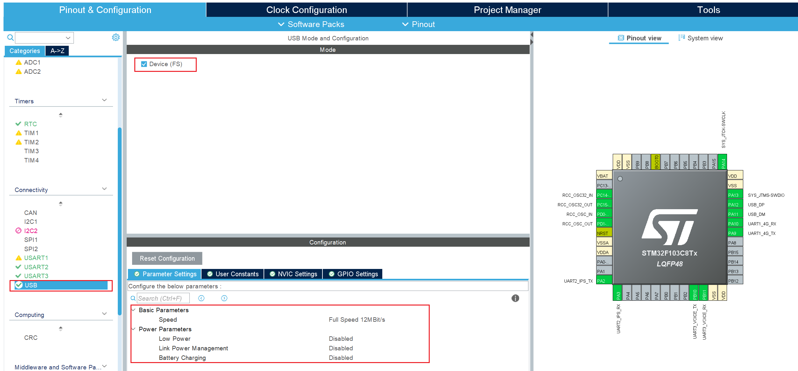
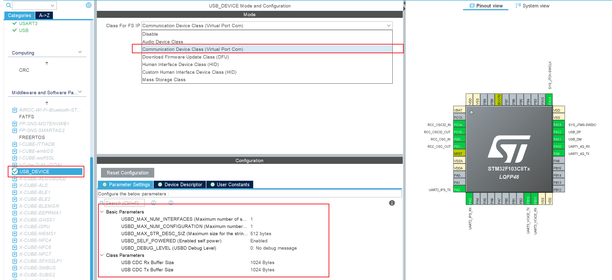
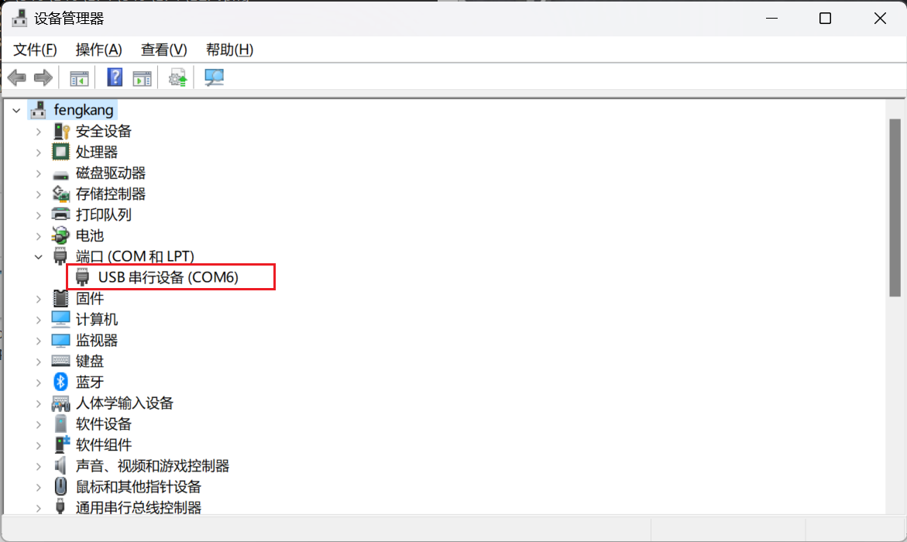
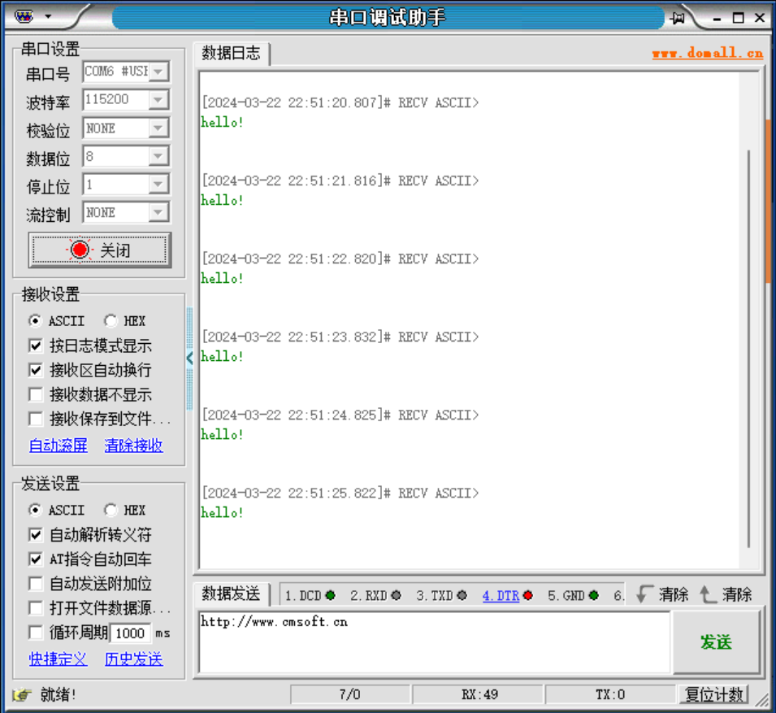

# USB 虚拟打印串口
文章主要目的是利用 stm32 芯片的 usb 接口，植入 usb-cdc 驱动的

以下实例的开发环境如下：
- 应用芯片为 STM32F103C8T6 ；
- MDK-ARM 版本为 v5.34.0 ；
- STM32CubeMX 版本为 v6.10.0 ；

## 1. STM32CubeMX 配置
这里主要修改与 USB 虚拟串口相关的配置，其他工程创建细节不再赘述。

### 1.1. 接口配置
选择 `“Connectivity”` 目录下的 USB 接口，选择 `“Device（FS）”` ，其他具体配置保持默认。



### 1.2. 中间件和软件配置
选择 `“Middleware and Software Packs”` 目录下的 `USB DEVICE`，选择 `“Communication Device Class(Vitural Port Com)”` ，即 USB-cdc 驱动，USB转串口驱动。



### 1.3. 创建工程

## 2. 代码修改和测试
### 2.1. 代码增加重定向
在生成工程代码的 main.c 文件中，增加头文件和重定向函数：
```c
/* Private includes ----------------------------------------------------------*/
/* USER CODE BEGIN Includes */
#include <stdarg.h>
#include "usbd_cdc_if.h"
/* USER CODE END Includes */
```

```c
/* USER CODE BEGIN PV */
unsigned char g_usb_temp[64];

void USBVcom_pringf(const char *format,...)
{
  unsigned short len;

  va_list args;
  va_start(args, format);
  len = vsnprintf((char *)g_usb_temp, sizeof(g_usb_temp)+1, (char *)format, args);
  va_end(args);

  CDC_Transmit_FS(g_usb_temp, len);
}
/* USER CODE END PV */
```

### 2.2. 增加应用测试代码
在主循环中新增 USB 串口打印，每秒循环打印 hello! 字样：
```c
  /* Infinite loop */
  /* USER CODE BEGIN WHILE */
  while (1)
  {
    /* USER CODE END WHILE */

    /* USER CODE BEGIN 3 */
      USBVcom_pringf("hello!\n");
      HAL_Delay(1000);
  }
  /* USER CODE END 3 */
```

### 2.3. 测试验证
编译并烧写代码到开发板中，将 USB 接入电脑，注意需要拔下 ST-LINK 烧写工具。

任务管理器中出现串口设备：


打开任意串口工具，设置为对应的通讯参数，发现循环打印信息出现：
