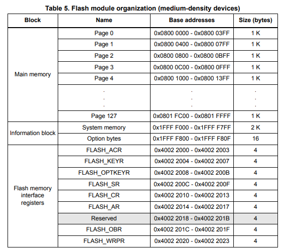

# stm32 标准库之内部 flash 使用
文章主要目的是利用 stm32 芯片的 flash 接口，实现：
- 以页为单位写入写数组的数据；
- 从 FLASH 读取写入的数据到读数组：

以下实例的开发环境如下：
- 应用芯片为 STM32F103C8T6 ；
- MDK-ARM 版本为 v5.34.0 ；
- 标准库版本为 v3.6.0 ；
- FreeRTOS 库版本为 v202406.01-LTS ；

可参考官方手册：
- [PM0075-STM32F10xxx Flash memory microcontrollers](https://www.st.com.cn/resource/en/programming_manual/pm0075-stm32f10xxx-flash-memory-microcontrollers-stmicroelectronics.pdf)

## 1. stm32 的内部 flash 详解
### 1.1. 简介
STM32F10xxx 系列内置的 Flash 可以通过两种方式进行编程访问：
- ICP （ in-circuit programming ）：
    - ICP 方式用于更新全部的 Flash 内存。使用 JTAG 、 SWD 接口或者 bootloader 载入用户应用到微处理器，通过软件对 Flash 进行编程；
- IAP （in-application programming）：
    - IAP 方式可以使用微处理器支持的任何通讯接口（I/Os，USB，CAN，UART，IIC，SPI等）下载程序数据到内存；
    - IAP 方式允许用户在程序运行时，重编写 Flash 内存。不过有部分程序必须通过 ICP 方式进行编程。

Flash接口基于AHB协议实现指令访问和数据访问。它实现了一个预取缓冲区，可以加速CPU代码的执行。它还实现了执行闪存操作（编程/擦除）所需的逻辑。编程/擦除操作可以在整个产品电压范围内执行。还实现了读/写保护和选项字节。

### 1.2. flash 的通用结构
这里测试环境是 stm32f103c8t6，是 medium-density 系列微处理器，medium-density 系列的 flash 结构如下：


闪存由 32 位宽存储单元组成，可以用于存储代码和数据常量。

图中的 信息块(Information block)分为两部分：
- 系统内存（System memory）：
    - 用于在系统内存启动模式下启动设备。该区域由STMicroelectronics保留，并包含用于通过USART1串行接口重新编程闪存的引导加载程序。该区域在设备制造时由ST编程，并防止意外的写入/擦除操作。
    - 在连接线设备中，引导加载程序可以通过以下接口之一激活：USART1、USART2（重映射）、CAN2（重映射）或USB OTG FS设备模式（DFU：设备固件升级）。USART外设使用内部8 MHz振荡器（HSI）运行。然而，CAN和USB OTG FS只有在外部8 MHz、14.7456 MHz或25 MHz时钟（HSE）存在时才能正常工作。
- 选项字节（Option bytes）：
    - 对主内存块和选项字节的写入操作由嵌入式闪存编程/擦除控制器（FPEC）管理。编程/擦除操作所需的高电压由内部生成。

### 1.3. flash 的读操作
内置 flash 可以作为公共存储空间直接寻址。

### 1.4. flash 编程和擦除控制器
FPEC（Flash program and erase controller）用于处理编程和擦除闪存操作，包含七个 32 位寄存器：
- FPEC key register (FLASH_KEYR)
- Option byte key register (FLASH_OPTKEYR)
- Flash control register (FLASH_CR)
- Flash status register (FLASH_SR)
- Flash address register (FLASH_AR)
- Option byte register (FLASH_OBR)
- Write protection register (FLASH_WRPR)

1. **闪存解锁**
    - 复位后，FPEC 块处于保护状态，FLASH_CR 寄存器不能以写模式访问，需要向 FLASH_KEYR 寄存器写入解锁序列来打开 FPEC 模块。
    - 这个解锁序列由两个写周期组成，分别向 FLASH_KEYR 地址写入两个密钥值（KEY1和KEY2）。如果解锁序列错误，FPEC模块和FLASH_CR寄存器将被锁定，直到下一次复位。此外，错误的密钥序列会返回总线错误。如果在第一个写周期中KEY1不匹配，或者在第二个写周期中KEY1正确但KEY2不匹配，都会触发总线错误。
    - 用户软件可以通过将FLASH_CR寄存器的LOCK位设置为1来锁定FPEC模块。在这种情况下，可以通过向FLASH_KEYR写入正确的密钥序列来解锁FPEC。

2. **主闪存编程**
    - 主闪存可以以 16 位为单位进行编程。当 CPU 向主闪存地址写入一个半字（16位）数据，并且 FLASH_CR 寄存器的 PG 位被设置时，编程操作开始。
    - 如果尝试写入非半字长度的数据，FPEC 会返回总线错误。
    - 如果在编程过程中（BSY位被设置）发起读/写操作，CPU会暂停，直到当前的主闪存编程操作完成。

3. **标准编程模式**
    - 在这种模式下，CPU通过执行标准的半字（16位）写操作来编程主闪存。FLASH_CR 寄存器中的 PG 位必须被设置。FPEC会预先读取目标主闪存地址的值，并检查该位置是否已被擦除。如果没有被擦除，编程操作将被跳过，并且FLASH_SR 寄存器中的 PGERR 位会发出警告（唯一的例外是当编程值为0x0000时，此时该位置会被正确编程为0x0000，且PGERR位不会被设置）。
    - 如果目标主闪存地址被 FLASH_WRPR 寄存器写保护，编程操作也会被跳过，并且FLASH_SR寄存器中的 WRPRTERR 位会发出警告。
    - 编程操作的结束由 FLASH_SR 寄存器中的EOP位指示。

4. **标准模式下的主闪存编程步骤如下：**
    - 通过检查 FLASH_SR 寄存器中的 BSY 位，确认没有正在进行的主闪存操作。
    - 设置 FLASH_CR 寄存器中的 PG 位。
    - 在目标地址执行数据写入（半字）。
    - 等待 BSY 位被复位。
    - 读取已编程的值并进行验证。
    - 注意：当 FLASH_SR 寄存器中的BSY位被设置时，寄存器无法以写模式访问。

5. **闪存擦除**
    - **页擦除**
        可以使用FPEC的页擦除功能擦除闪存的一页。擦除一页的步骤如下：
        - 通过检查 FLASH_CR 寄存器中的 BSY 位，确认没有正在进行的闪存操作。
        - 设置 FLASH_CR 寄存器中的 PER 位。
        - 编程 FLASH_AR 寄存器以选择要擦除的页。
        - 设置 FLASH_CR 寄存器中的 STRT 位。
        - 等待 BSY 位被复位。
        - 读取已擦除的页并进行验证。
    - **全片擦除**（Mass Erase）
    全片擦除命令可用于完全擦除闪存的用户页。信息块不受此操作影响。推荐的操作步骤如下：
        - 通过检查FLASH_SR寄存器中的BSY位，确认没有正在进行的闪存操作。
        - 设置FLASH_CR寄存器中的MER位。
        - 设置FLASH_CR寄存器中的STRT位。
        - 等待BSY位被复位。
        - 读取所有页并验证。

6. **选项字节编程**
    - 选项字节的编程方式与普通用户地址不同。选项字节的数量限制为8个（4个用于写保护，1个用于读保护，1个用于配置，2个用于用户数据存储）。在解锁FPEC后，用户需要通过向FLASH_OPTKEYR寄存器写入相同的密钥（KEY1和KEY2）来授权选项字节的编程，以设置FLASH_CR寄存器中的OPTWRE位（密钥值请参考第2.3.1节）。然后，用户需要设置FLASH_CR寄存器中的OPTPG位，并在目标闪存地址执行半字写操作。
    - FPEC会预先读取目标选项字节的值，并检查其是否已被擦除。如果没有被擦除，编程操作将被跳过，并且FLASH_SR寄存器中的PGERR位会发出警告。编程操作的结束由FLASH_SR寄存器中的EOP位指示。
    - FPEC会取最低有效位（LSB）并自动计算最高有效位（MSB，即LSB的补码），然后开始编程操作。这确保了选项字节及其补码始终正确。操作步骤如下：
        - 通过检查FLASH_SR寄存器中的BSY位，确认没有正在进行的闪存操作。
        - 解锁FLASH_CR寄存器中的OPTWRE位。
        - 设置FLASH_CR寄存器中的OPTPG位。
        - 向目标地址写入数据（半字）。
        - 等待BSY位被复位。
        - 读取已编程的值并进行验证。
    - 当闪存读保护选项从“保护”状态更改为“未保护”状态时，会在重新编程读保护选项之前执行主闪存的全片擦除。如果用户更改的是读保护选项以外的其他选项，则不会执行全片擦除。读保护选项字节的擦除状态用于保护闪存。

7. **擦除过程**
    选项字节擦除序列（OPTERASE）如下：
    - 通过读取FLASH_SR寄存器中的BSY位，确认没有正在进行的闪存操作。
    - 解锁FLASH_CR寄存器中的OPTWRE位。
    - 设置FLASH_CR寄存器中的OPTER位。
    - 设置FLASH_CR寄存器中的STRT位。
    - 等待BSY位被复位。
    - 读取已擦除的选项字节并验证。

### 1.5. 保护机制
闪存的用户区域可以防止不受信任的代码读取。

闪存的页面也可以防止由于程序计数器上下文丢失而导致的不必要的写入。写入保护的粒度如下：
- 对于低密度和中密度设备，写入保护粒度为**4页**。
- 对于高密度和连接线设备，写入保护粒度为**2页**。

#### 1.5.1 读取保护
通过设置 RDP 选项字节并应用系统复位来重新加载新的RDP选项字节，可以激活读取保护。

一旦保护字节被编程：
- 主闪存的读取访问不被允许，除非是用户代码（当从主闪存本身启动且调试模式未激活时）。
- 对于低密度和中密度设备，页面 0-3 自动被写保护；对于高密度和连接线设备，页面0-1自动被写保护。其余内存可以通过从主闪存执行的代码进行编程（用于IAP、常量存储等），但在调试模式或从嵌入式SRAM启动时，它受到写/擦除保护（但不包括全片擦除）。
- 所有与加载和执行嵌入式SRAM代码相关的功能仍然有效（JTAG/SWD和从嵌入式SRAM启动），这可以用于禁用读取保护。当读取保护选项字节更改为内存未保护值时，会执行全片擦除。
- 当从嵌入式SRAM启动时，不允许通过代码访问闪存，也不允许通过DMA1和DMA2进行数据读取。
- 不允许通过JTAG、SWV（串行线查看器）、SWD（串行线调试）、ETM和边界扫描进行闪存数据读取。

当RDP选项字节及其补码包含表6中所示的值对时，闪存受到保护。

**注意**：擦除选项字节块不会触发全片擦除，因为擦除值（0xFF）对应于受保护的值。

**解除保护**
要从嵌入式SRAM禁用读取保护：
1. 擦除整个选项字节区域。此时，读取保护代码（RDP）将为0xFF，但读取保护仍然启用。
2. 编程正确的RDP代码0x00A5以解除内存保护。此操作首先强制对主闪存进行全片擦除。
3. 复位设备（POR复位）以重新加载选项字节（以及新的RDP代码），并禁用读取保护。

**注意**：可以使用引导加载程序禁用读取保护（在这种情况下，仅需系统复位以重新加载选项字节）。更多详细信息请参考AN2606。

#### 1.5.2 写入保护
在高密度和连接线设备中，从页面0到页面61，写入保护以每2页的粒度实现。剩余内存块（在高密度设备中为页面62到255，在连接线设备中为页面62到127）一次性写保护。

在低密度和中密度设备中，写入保护以每4页的粒度实现。

如果对受保护的页面执行编程或擦除操作，闪存会在闪存状态寄存器（FLASH_SR）中返回保护错误标志。

通过配置WRP[3:0]选项字节并应用系统复位以重新加载新的WRPx选项字节，可以激活写入保护。

**解除保护**
要禁用写入保护，提供了两种应用场景：
- **场景1**：在写入保护解除后禁用读取保护：
  1. 使用闪存控制寄存器（FLASH_CR）中的OPTER位擦除整个选项字节区域。
  2. 编程正确的RDP代码0x00A5以解除内存保护。此操作首先强制对主闪存进行全片擦除。
  3. 复位设备（系统复位）以重新加载选项字节（以及新的WRP[3:0]字节），并禁用写入保护。
- **场景2**：在写入保护解除后保持读取保护激活，适用于使用用户引导加载程序进行应用程序内编程：
  1. 使用闪存控制寄存器（FLASH_CR）中的OPTER位擦除整个选项字节区域。
  2. 复位设备（系统复位）以重新加载选项字节（以及新的WRP[3:0]字节），并禁用写入保护。

## 2. 常规读写操作
### 2.1. 读操作
读操作相对简单，直接使用指针访问即可。

### 2.2. 写操作
标准模式下，CPU 通过执行标准的半字（16位）写操作来编程主闪存。

写操作时，如果发现写入地址的内容没有被擦除（即全置1，数据 0xff），编程操作将被跳过，并且 FLASH_SR 寄存器中的 PGERR 位会发出警告。
- 如果目标主闪存地址被 FLASH_WRPR 寄存器写保护，编程操作也会被跳过，并且FLASH_SR寄存器中的 WRPRTERR 位会发出警告。
- 编程操作的结束由 FLASH_SR 寄存器中的EOP位指示。

**标准模式下的主闪存编程步骤如下：**
1. 检查 FLASH_SR 寄存器中的 BSY 位，确认没有正在进行的主闪存操作。
2. 设置 FLASH_CR 寄存器中的 PG 位。
3. 在目标地址执行数据写入（半字）。
4. 等待 BSY 位被复位。
5. 读取已编程的值并进行验证。

注意：当 FLASH_SR 寄存器中的 BSY 位被设置时，寄存器无法以写模式访问。

### 2.3. 状态寄存器 FLASH_SR
**FLASH_SR** ：flash 状态寄存器，关键位如下：
- Bit 5 EOP: 操作结束，硬件完成编程或擦除完成时，由硬件置11；
- Bit 4 WRPRTERR: 写保护错误，硬件写被写保护的地址时，由硬件置1；
- Bit 2 PGERR: 编程错误，编程时地址内容不是 0xFFFF 时，由硬件置1；
- Bit 0 BSY: 繁忙，表示正在执行 flash 操作。

## 2. 读/写操作代码 demo
内部 flash 的读写代码如下：
```c
#include <stdio.h>
#include "FreeRTOS.h"
#include "task.h"
#include "uart.h"
#include "stm32f10x_flash.h"

#define FLASH_START_ADDR ((uint32_t)0x08000000) /* 该芯片的 flash 起始地址为 0x0800 0000 */
#define FLASH_PAGE_SIZE (1024)                  /* 该芯片的 flash 页大小为 1K */

uint8_t flash_read_buf[FLASH_PAGE_SIZE];        /* 读缓存（按页） */
uint8_t flash_write_buf[FLASH_PAGE_SIZE];       /* 写缓存（按页） */

/**
 * @brief 擦除指定页（扇区）
 * @param sectorAddress 指定页（扇区）的起始地址，按页大小擦除（stm32f103c8t6 是 1K ）
 * @return FLASH_Status stm32标准库中 flash 的状态码
 */
static FLASH_Status flash_erase_sector(uint32_t sectorAddress)
{
    return FLASH_ErasePage(sectorAddress);
}

/* 按页读 flash 数据 */
void flash_disk_read(unsigned char *buff, unsigned long sector, unsigned int count)
{
    uint16_t i;
    unsigned long addr = FLASH_START_ADDR + sector * FLASH_PAGE_SIZE;
    for (i = 0; i < FLASH_PAGE_SIZE * count; i++)
    {
        buff[i] = *(__IO uint16_t *)(addr + i);
    }
}

/* 按页写 flash */
FLASH_Status flash_disk_write(unsigned char *buff, unsigned long sector, unsigned int count)
{
    FLASH_Status status;
    uint16_t i;
    unsigned long addr = FLASH_START_ADDR + sector * FLASH_PAGE_SIZE;

    /* 写入前需要先解锁 */
    FLASH_Unlock();

    /* 如果 flash 错误寄存器标记出现了 PG 错误，则清除错误位后，对该页先进行擦除 */
    if (SET == FLASH_GetFlagStatus(FLASH_FLAG_PGERR))
    {
        FLASH_ClearFlag(FLASH_FLAG_PGERR);
        flash_erase_sector(addr);
    }

    /* 循环写入写缓冲数组的数据，由于 flash 写入时，必须按 16 位写入，这里使用移位方式一次写入两个 8 位数据 */
    for (i = 0; i < FLASH_PAGE_SIZE * count; i += 2)
    {
        // 8 位拼成 16 位写入
        status = FLASH_ProgramHalfWord(addr + i, buff[i] + (buff[i + 1] << 8));
        if (status != FLASH_COMPLETE)
        {
            // printf("flash_disk_write -> FLASH_ProgramOptionByteData :: error!, %d\n", status);// 写入失败
        }
    }
    // printf("flash_disk_write -> FLASH_ProgramOptionByteData :: success!\n");
    /* 锁住flash */
    FLASH_Lock();

    return status;
}

/* flash 调用测试任务 */
void flash_test_task(void *parameter)
{
    int i = 0;
    for (i = 0; i < FLASH_PAGE_SIZE; i++)
        flash_write_buf[i] = i % 100;

    while (1)
    {
        flash_disk_write(flash_write_buf, 60, 1);
        vTaskDelay(5000);
        flash_disk_read(flash_read_buf, 60, 1);

        /* 循环打印读缓冲内容 */
        for (i = 0; i < FLASH_PAGE_SIZE; i++)
        {
            UART_Send_Byte(USART1, flash_read_buf[i]);
        }
        vTaskDelay(5000);
    }
}

int main(void)
{
    TaskHandle_t flash_handle_t;
    NVIC_PriorityGroupConfig(NVIC_PriorityGroup_4);

    /* flash task */
    xTaskCreate((TaskFunction_t)flash_test_task, "flash", 512, NULL, 3, &flash_handle_t);

    vTaskStartScheduler();
    while (1)
    {
    }
}
```
