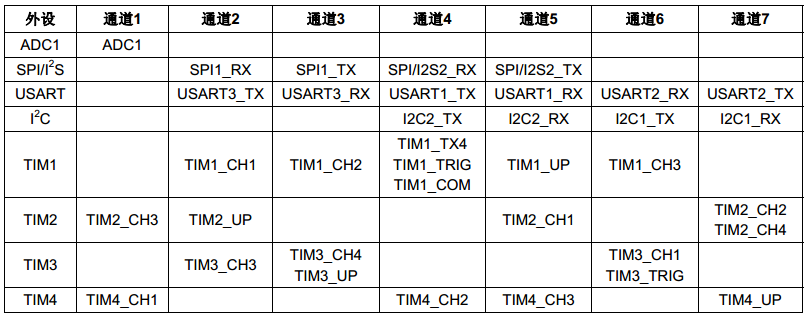
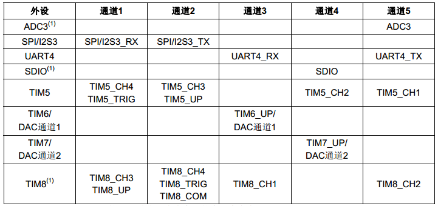

# STM32 标准库 DMA 的使用
DMA(Direct Memory Access)—直接存储器存取，是单片机的一个外设，它的主要功能是用来搬数据，但是不需要占用CPU， 即在传输数据的时候，CPU可以干其他的事情，好像是多线程一样。数据传输支持从外设到存储器或者存储器到存储器， 这里的存储器可以是SRAM或者是FLASH。

## 1. DMA 的基本概念和配置
DMA 的配置主要有一下基本配置信息：
1. DMA 通道；
2. DMA 传输方向；
3. DMA 外设地址是否自增；
4. DMA 内存地址是否自增；
5. DMA 外设数据大小；
6. DMA 内存数据大小；
7. DMA 传输模式；
8. DMA 传输优先级；
9. DMA 中断配置；
10. DMA 标志位识别；

### 1.1. DMA 的通道
STM32 的 DMA具有12个独立可编程的通道，其中DMA1有7个通道，DMA2有5个通道，每个通道对应不同的外设的DMA请求。 虽然每个通道可以接收多个外设的请求，但是同一时间只能接收一个，不能同时接收多个。


**注意：DMA2 只存在于大容量产品和互联型产品中，其中ADC3、SDIO和TIM8的DMA请求只在大容量产品中存在。**




```c
// DMA 标准库中通道定义如下，具体外设地址可以查看 stm32f10x.h 文件：
/** @defgroup DMA_Exported_Constants
  * @{
  */

#define IS_DMA_ALL_PERIPH(PERIPH) (((PERIPH) == DMA1_Channel1) || \
                                   ((PERIPH) == DMA1_Channel2) || \
                                   ((PERIPH) == DMA1_Channel3) || \
                                   ((PERIPH) == DMA1_Channel4) || \
                                   ((PERIPH) == DMA1_Channel5) || \
                                   ((PERIPH) == DMA1_Channel6) || \
                                   ((PERIPH) == DMA1_Channel7) || \
                                   ((PERIPH) == DMA2_Channel1) || \
                                   ((PERIPH) == DMA2_Channel2) || \
                                   ((PERIPH) == DMA2_Channel3) || \
                                   ((PERIPH) == DMA2_Channel4) || \
                                   ((PERIPH) == DMA2_Channel5))
```

### 1.2. DMA 传输方向
DMA 传输方向分为：从外设到存储器，从存储器到外设，从存储器到存储器。具体的方向 DMA_CCR 位4 DIR 配置：0表示从外设到存储器，1 表示从存储器到外设。

```c
// DMA 标准库中传输方向定义如下：
#define DMA_DIR_PeripheralDST              ((uint32_t)0x00000010)
#define DMA_DIR_PeripheralSRC              ((uint32_t)0x00000000)
```

### 1.3. DMA 数据传输格式
要想数据传输正确，源和目标地址存储的数据宽度还必须一致，串口数据寄存器是 8 位的， 所以我们定义的要发送的数据也必须是8位。外设的数据宽度由 DMA_CCRx 的 PSIZE[1:0] 配置， 可以是 8/16/32 位，存储器的数据宽度由 DMA_CCRx 的 MSIZE[1:0] 配置，可以是 8/16/32 位。

- DMA 数据大小主要设置有：
  - DMA_PeripheralDataSize_Byte ： 按字节，8位；
  - DMA_PeripheralDataSize_HalfWord ： 按半字，16位；
  - DMA_PeripheralDataSize_Word ： 按字，32位；

在DMA控制器的控制下，数据要想有条不紊的从一个地方搬到另外一个地方，还必须正确设置两边数据指针的增量模式。 外设的地址指针由 DMA_CCRx 的 PINC 配置，存储器的地址指针由 MINC 配置。

- DMA 数据指针增量模式主要设置有：
  - DMA_MemoryInc_Enable ： 使能；
  - DMA_MemoryInc_Disable ： 禁用；

以串口向电脑发送数据为例，要发送的数据很多， 每发送完一个，那么存储器的地址指针就应该加1，而串口数据寄存器只有一个， 那么外设的地址指针就固定不变。具体的数据指针的增量模式由实际情况决定。

### 1.4. DMA 传输模式
DMA 传输模式分为循环和正常模式，循环模式就是一直循环搬运数据，直到关闭DMA通道，正常模式就是传输一次数据关闭DMA通道。

- DMA 传输模式主要设置有：
  - DMA_Mode_Normal ： 正常模式；
  - DMA_Mode_Circular ： 循环模式；

### 1.5. DMA 传输优先级
DMA 传输优先级分为4个等级：非常高、高、中和低，优先级越高，响应速度越快。

当发生多个 DMA 通道请求时，就意味着有先后响应处理的顺序问题，这个就由仲裁器管理。仲裁器管理 DMA 通道请求分为两个阶段。 
- 第一阶段属于软件阶段，可以在 DMA_CCRx 寄存器中设置，有4个等级：非常高、高、中和低四个优先级。
- 第二阶段属于硬件阶段， 如果两个或以上的DMA通道请求设置的优先级一样，则他们优先级取决于通道编号，编号越低优先权越高，比如通道0高于通道1。 在大容量产品和互联型产品中， DMA1控制器拥有高于DMA2控制器的优先级。

- DMA 传输优先级主要设置有：
  - DMA_Priority_High ： 高优先级；
  - DMA_Priority_Medium ： 中等优先级；
  - DMA_Priority_Low ： 低优先级；
  - DMA_Priority_VeryHigh ： 非常高优先级；

### 1.6. DMA 中断
DMA 中断包括传输完成中断、半传输完成中断、传输错误中断、传输中断。

- DMA 中断主要设置有：
  - DMAx_IT_GLx ： 传输中断标志；
  - DMAx_IT_TCx ： 传输完成标志；
  - DMAx_IT_HTx ： 半传输完成标志；
  - DMAx_IT_TEx ： 传输错误标志；

查询 DMA 通道状态时，对应的 DMA_FLAG 标志位包括传输完成标志、半传输完成标志、传输错误标志、传输中断标志。

- DMA 标志位主要设置有：
  - DMAx_FLAG_GLx ： 传输中断标志；
  - DMAx_FLAG_TCx ： 传输完成标志；
  - DMAx_FLAG_HTx ： 半传输完成标志；
  - DMAx_FLAG_TEx ： 传输错误标志；

## 2. DMA 的使用
DMA 的使用主要分为以下几步：
1. 使能 DMA 时钟；
2. 配置 DMA 通道配置；
3. 使能 DMA 通道，进行传输；
4. 检查 DMA 传输状态；
5. 关闭 DMA 通道；

### 2.1. DMA存储器到存储器模式实验
存储器到存储器模式可以实现数据在两个内存的快速拷贝。我们先定义一个静态的源数据，存放在内部FLASH， 然后使用DMA传输把源数据拷贝到目标地址上（内部SRAM），最后对比源数据和目标地址的数据，看看是否传输准确 。

```c
// 当使用存储器到存储器模式时候，通道可以随便选，没有硬性的规定
#define DMA_CHANNEL     DMA1_Channel6
#define DMA_CLOCK       RCC_AHBPeriph_DMA1

// 传输完成标志
#define DMA_FLAG_TC     DMA1_FLAG_TC6

// 要发送的数据大小
#define BUFFER_SIZE     32

/* 定义aSRC_Const_Buffer数组作为DMA传输数据源
* const关键字将aSRC_Const_Buffer数组变量定义为常量类型
* 表示数据存储在内部的FLASH中
*/
const uint32_t aSRC_Const_Buffer[BUFFER_SIZE]=
{
    0x01020304,0x05060708,0x090A0B0C,0x0D0E0F10,
    0x11121314,0x15161718,0x191A1B1C,0x1D1E1F20,
    0x21222324,0x25262728,0x292A2B2C,0x2D2E2F30,
    0x31323334,0x35363738,0x393A3B3C,0x3D3E3F40,
    0x41424344,0x45464748,0x494A4B4C,0x4D4E4F50,
    0x51525354,0x55565758,0x595A5B5C,0x5D5E5F60,
    0x61626364,0x65666768,0x696A6B6C,0x6D6E6F70,
    0x71727374,0x75767778,0x797A7B7C,0x7D7E7F80
};
/* 定义DMA传输目标存储器
* 存储在内部的SRAM中
*/
uint32_t aDST_Buffer[BUFFER_SIZE];

/* DMA 初始化 */
void DMA_Config(void)
{
    DMA_InitTypeDef DMA_InitStructure;

    // 开启DMA时钟
    RCC_AHBPeriphClockCmd(DMA_CLOCK, ENABLE);
    // 源数据地址
    DMA_InitStructure.DMA_PeripheralBaseAddr =
        (uint32_t)aSRC_Const_Buffer;
    // 目标地址
    DMA_InitStructure.DMA_MemoryBaseAddr = (uint32_t)aDST_Buffer;
    // 方向：外设到存储器（这里的外设是内部的FLASH）
    DMA_InitStructure.DMA_DIR = DMA_DIR_PeripheralSRC;
    // 传输大小
    DMA_InitStructure.DMA_BufferSize = BUFFER_SIZE;
    // 外设（内部的FLASH）地址递增
    DMA_InitStructure.DMA_PeripheralInc = DMA_PeripheralInc_Enable;
    // 内存地址递增
    DMA_InitStructure.DMA_MemoryInc = DMA_MemoryInc_Enable;
    // 外设数据单位
    DMA_InitStructure.DMA_PeripheralDataSize =
        DMA_PeripheralDataSize_Word;
    // 内存数据单位
    DMA_InitStructure.DMA_MemoryDataSize = DMA_MemoryDataSize_Word;
    // DMA模式，一次或者循环模式
    DMA_InitStructure.DMA_Mode = DMA_Mode_Normal ;
    //DMA_InitStructure.DMA_Mode = DMA_Mode_Circular;
    // 优先级：高
    DMA_InitStructure.DMA_Priority = DMA_Priority_High;
    // 使能内存到内存的传输
    DMA_InitStructure.DMA_M2M = DMA_M2M_Enable;
    // 配置DMA通道
    DMA_Init(DMA_CHANNEL, &DMA_InitStructure);
    // 使能DMA
    DMA_Cmd(DMA_CHANNEL,ENABLE);
}

/* 存储器数据对比 */
uint8_t Buffercmp(const uint32_t* pBuffer,
                uint32_t* pBuffer1, uint16_t BufferLength)
{
    /* 数据长度递减 */
    while (BufferLength--) {
        /* 判断两个数据源是否对应相等 */
        if (*pBuffer != *pBuffer1) {
            /* 对应数据源不相等马上退出函数，并返回0 */
            return 0;
        }
        /* 递增两个数据源的地址指针 */
        pBuffer++;
        pBuffer1++;
    }
    /* 完成判断并且对应数据相对 */
    return 1;
}

int main(void)
{
    /* 定义存放比较结果变量 */
    uint8_t TransferStatus;

    /* LED 端口初始化 */
    LED_GPIO_Config();

    /* 设置RGB彩色灯为紫色 */
    LED_PURPLE;

    /* 简单延时函数 */
    Delay(0xFFFFFF);

    /* DMA传输配置 */
    DMA_Config();

    /* 等待DMA传输完成 */
    while (DMA_GetFlagStatus(DMA_FLAG_TC)==RESET)
    {

    }

    /* 比较源数据与传输后数据 */
    TransferStatus=Buffercmp(aSRC_Const_Buffer, aDST_Buffer, BUFFER_SIZE);

    /* 判断源数据与传输后数据比较结果*/
    if (TransferStatus==0)
    {
        /* 源数据与传输后数据不相等时LED1亮 */
        LED1_ON;
    }
    else
    {
        /* 源数据与传输后数据相等时LED2亮*/
        LED2_ON;
    }

    while (1)
    {
    }
}
```

### 2.2. DMA存储器到外设模式实验
1. 配置USART通信功能；
2. 设置串口DMA工作参数；
3. 使能DMA；
4. DMA传输同时CPU可以运行其他任务。

```c
/* 宏定义 */
// 串口工作参数宏定义
#define  DEBUG_USARTx                   USART1
#define  DEBUG_USART_CLK                RCC_APB2Periph_USART1
#define  DEBUG_USART_APBxClkCmd         RCC_APB2PeriphClockCmd
#define  DEBUG_USART_BAUDRATE           115200

// USART GPIO 引脚宏定义
#define  DEBUG_USART_GPIO_CLK           (RCC_APB2Periph_GPIOA)
#define  DEBUG_USART_GPIO_APBxClkCmd    RCC_APB2PeriphClockCmd

#define  DEBUG_USART_TX_GPIO_PORT       GPIOA
#define  DEBUG_USART_TX_GPIO_PIN        GPIO_Pin_9
#define  DEBUG_USART_RX_GPIO_PORT       GPIOA
#define  DEBUG_USART_RX_GPIO_PIN        GPIO_Pin_10

// 串口对应的DMA请求通道
#define  USART_TX_DMA_CHANNEL     DMA1_Channel4
// 外设寄存器地址
#define  USART_DR_ADDRESS        (USART1_BASE+0x04)
// 一次发送的数据量
#define  SENDBUFF_SIZE            5000

/* 串口 DMA 传输配置 */
void USARTx_DMA_Config(void)
{
    DMA_InitTypeDef DMA_InitStructure;

    // 开启DMA时钟
    RCC_AHBPeriphClockCmd(RCC_AHBPeriph_DMA1, ENABLE);
    // 设置DMA源地址：串口数据寄存器地址*/
    DMA_InitStructure.DMA_PeripheralBaseAddr = USART_DR_ADDRESS;
    // 内存地址(要传输的变量的指针)
    DMA_InitStructure.DMA_MemoryBaseAddr = (u32)SendBuff;
    // 方向：从内存到外设
    DMA_InitStructure.DMA_DIR = DMA_DIR_PeripheralDST;
    // 传输大小
    DMA_InitStructure.DMA_BufferSize = SENDBUFF_SIZE;
    // 外设地址不增
    DMA_InitStructure.DMA_PeripheralInc = DMA_PeripheralInc_Disable;
    // 内存地址自增
    DMA_InitStructure.DMA_MemoryInc = DMA_MemoryInc_Enable;
    // 外设数据单位
    DMA_InitStructure.DMA_PeripheralDataSize =
        DMA_PeripheralDataSize_Byte;
    // 内存数据单位
    DMA_InitStructure.DMA_MemoryDataSize = DMA_MemoryDataSize_Byte;
    // DMA模式，一次或者循环模式
    DMA_InitStructure.DMA_Mode = DMA_Mode_Normal ;
    //DMA_InitStructure.DMA_Mode = DMA_Mode_Circular;
    // 优先级：中
    DMA_InitStructure.DMA_Priority = DMA_Priority_Medium;
    // 禁止内存到内存的传输
    DMA_InitStructure.DMA_M2M = DMA_M2M_Disable;
    // 配置DMA通道
    DMA_Init(USART_TX_DMA_CHANNEL, &DMA_InitStructure);
    // 使能DMA
    DMA_Cmd (USART_TX_DMA_CHANNEL,ENABLE);
}

/**
* @brief  主函数
* @param  无
* @retval 无
*/
int main(void)
{
    uint16_t i;
    /* 初始化USART */
    USART_Config();

    /* 配置使用DMA模式 */
    USARTx_DMA_Config();

    /* LED GPIO 初始化 */
    LED_GPIO_Config();

    //printf("\r\n USART1 DMA TX 测试 \r\n");

    /*填充将要发送的数据*/
    for (i=0; i<SENDBUFF_SIZE; i++) {
        SendBuff[i]  = 'P';

    }

    /*为演示DMA持续运行而CPU还能处理其它事情，持续使用DMA发送数据，量非常大，
    *长时间运行可能会导致电脑端串口调试助手会卡死，鼠标乱飞的情况，
    *或把DMA配置中的循环模式改为单次模式*/

    /* USART1 向 DMA发出TX请求 */
    USART_DMACmd(DEBUG_USARTx, USART_DMAReq_Tx, ENABLE);

    /* 此时CPU是空闲的，可以干其他的事情 */
    //例如同时控制LED
    while (1) {
        LED1_TOGGLE
        Delay(0xFFFFF);
    }
}
```