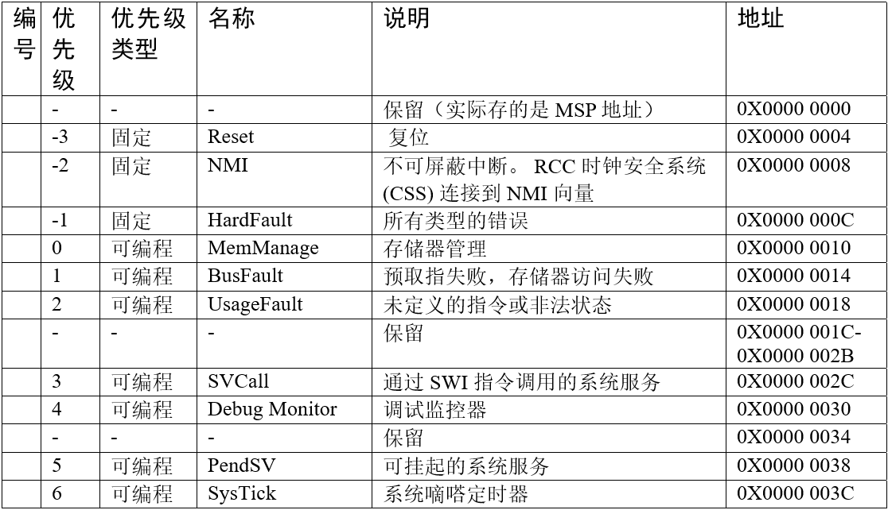
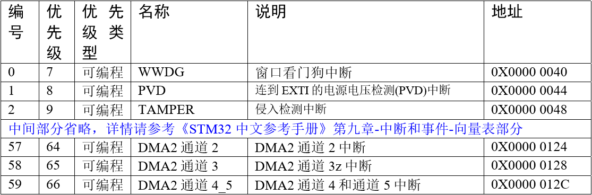
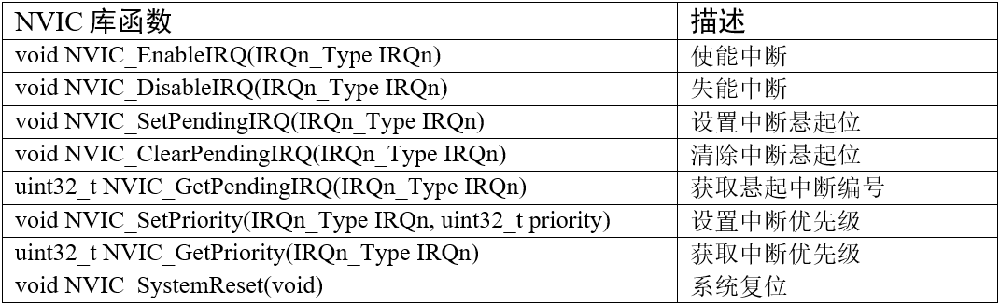
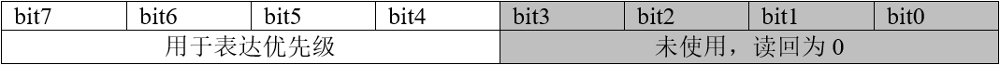
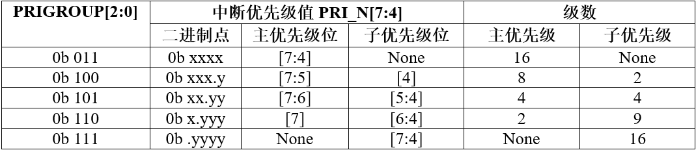
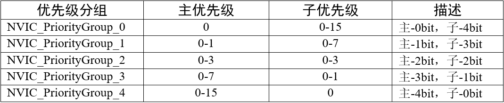

# STM32 中断应用
STM32中断非常强大，每个外设都可以产生中断。

如无特别说明，异常就是中断，中断就是异常，请不要刻意钻牛角尖较劲。

## 1. 异常类型
F103 在内核水平上搭载了一个异常响应系统，支持为数众多的系统异常和外部中断。其中系统异常有8个（如果把 Reset 和 HardFault 也算上的话就是10个）， 外部中断有 60 个。除了个别异常的优先级被定死外，其它异常的优先级都是可编程的。

具体的系统异常和外部中断可在标准库文件 `stm32f10x.h` 这个头文件查询到，在 `IRQn_Type` 这个结构体里面包含了 F103 系列全部的异常声明。

**F103系统异常清单**


**F103外部中断清单**


## 2. NVIC简介
NVIC 是嵌套向量中断控制器，控制着整个芯片中断相关的功能，它跟内核紧密耦合，是内核里面的一个外设。芯片厂商在设计芯片的时候对内核的 NVIC 进行裁剪，把不需要的部分去掉，可以说 STM32 的 NVIC 是 Cortex-M3 中 NVIC 的一个子集。

### 2.1. NVIC寄存器简介
在固件库中，NVIC的结构体定义可谓是颇有远虑，给每个寄存器都预留了很多位，恐怕为的是日后扩展功能。 不过STM32F103 只用了部分，具体使用了多少可参考《Cortex-M3 内核编程手册》-4.3.11:NVIC寄存器映射。

*代码清单:中断-1 NVIC结构体定义，来自固件库头文件：core_cm3.h*
```c
typedef struct {
    __IO uint32_t ISER[8];       // 中断使能寄存器
    uint32_t RESERVED0[24];
    __IO uint32_t ICER[8];       // 中断清除寄存器
    uint32_t RSERVED1[24];
    __IO uint32_t ISPR[8];       // 中断使能悬起寄存器
    uint32_t RESERVED2[24];
    __IO uint32_t ICPR[8];       // 中断清除悬起寄存器
    uint32_t RESERVED3[24];
    __IO uint32_t IABR[8];       // 中断有效位寄存器
    uint32_t RESERVED4[56];
    __IO uint8_t  IP[240];       // 中断优先级寄存器(8Bit wide)
    uint32_t RESERVED5[644];
    __O  uint32_t STIR;          // 软件触发中断寄存器
}  NVIC_Type;
```

在配置中断的时候我们一般只用 ISER、ICER 和 IP 这三个寄存器，ISER 用来使能中断，ICER 用来失能中断，IP 用来设置中断优先级。

### 2.2. NVIC 中断配置固件库
固件库文件 core_cm3.h 的最后，还提供了 NVIC 的一些函数，这些函数遵循 CMSIS 规则，只要是 Cortex-M3 的处理器都可以使用，具体如下：




## 3. 优先级的定义
### 3.1. 优先级定义
NVIC 有一个专门的寄存器：中断优先级寄存器 NVIC_IPRx ，用来配置外部中断的优先级，IPR 宽度为8bit，原则上每个外部中断可配置的优先级为 0~255 ，数值越小，优先级越高。但是绝大多数 CM3 芯片都会精简设计，以致实际上支持的优先级数减少，在 F103 中，只使用了高 4bit，如下所示：



用于表达优先级的这 4bit，又被分组成抢占优先级和子优先级。如果有多个中断同时响应，抢占优先级高的就会抢占抢占优先级低的优先得到执行， 如果抢占优先级相同，就比较子优先级。如果抢占优先级和子优先级都相同的话，就比较他们的硬件中断编号，编号越小，优先级越高。

### 3.2. 优先级分组
优先级的分组由内核外设SCB的应用程序中断及复位控制寄存器 AIRCR 的 PRIGROUP[10:8] 位决定，F103分为了5组，具体如下：主优先级=抢占优先级



设置优先级分组可调用库函数 NVIC_PriorityGroupConfig() 实现，有关 NVIC 中断相关的库函数都在库文件 misc.c 和 misc.h 中。

*代码清单:中断-2 中断优先级分组库函数NVIC_PriorityGroupConfig()*
```c
/**
* 配置中断优先级分组：抢占优先级和子优先级
* 形参如下：
* @arg NVIC_PriorityGroup_0: 0bit for抢占优先级
*                            4 bits for 子优先级
* @arg NVIC_PriorityGroup_1: 1 bit for抢占优先级
*                            3 bits for 子优先级
* @arg NVIC_PriorityGroup_2: 2 bit for抢占优先级
*                            2 bits for 子优先级
* @arg NVIC_PriorityGroup_3: 3 bit for抢占优先级
*                            1 bits for 子优先级
* @arg NVIC_PriorityGroup_4: 4 bit for抢占优先级
*                            0 bits for 子优先级
* @注意 如果优先级分组为0，则抢占优先级就不存在，优先级就全部由子优先级控制
*/
void NVIC_PriorityGroupConfig(uint32_t NVIC_PriorityGroup)
{
    // 设置优先级分组
    SCB->AIRCR = AIRCR_VECTKEY_MASK | NVIC_PriorityGroup;
}
```




## 4. 中断编程
在配置每个中断的时候一般有3个编程要点：

1. 使能外设某个中断，这个具体由每个外设的相关中断使能位控制。比如串口有发送完成中断，接收完成中断，这两个中断都由串口控制寄存器的相关中断使能位控制。

2. 初始化 NVIC_InitTypeDef 结构体，配置中断优先级分组，设置抢占优先级和子优先级， 使能中断请求。 NVIC_InitTypeDef 结构体在固件库头文件 misc.h 中定义。

    - *代码清单:中断-3 NVIC初始化结构体*
        ```c
        typedef struct {
            uint8_t NVIC_IRQChannel;                    // 中断源
            uint8_t NVIC_IRQChannelPreemptionPriority;  // 抢占优先级
            uint8_t NVIC_IRQChannelSubPriority;         // 子优先级
            FunctionalState NVIC_IRQChannelCmd;         // 中断使能或者失能
        } NVIC_InitTypeDef;
        ```
    - 有关NVIC初始化结构体的成员我们一一解释下：
        1. NVIC_IROChannel：用来设置中断源，不同的中断中断源不一样，且不可写错，即使写错了程序也不会报错，只会导致不响应中断。 具体的成员配置可参考stm32f10x.h头文件里面的IRQn_Type结构体定义，这个结构体包含了所有的中断源。

            *代码清单:中断-4 IRQn_Type中断源结构体*
            ```c
            typedef enum IRQn {
                //Cortex-M3 处理器异常编号
                NonMaskableInt_IRQn      = -14,
                MemoryManagement_IRQn    = -12,
                BusFault_IRQn            = -11,
                UsageFault_IRQn          = -10,
                SVCall_IRQn              = -5,
                DebugMonitor_IRQn        = -4,
                PendSV_IRQn              = -2,
                SysTick_IRQn             = -1,
                //STM32 外部中断编号
                WWDG_IRQn                = 0,
                PVD_IRQn                 = 1,
                TAMP_STAMP_IRQn          = 2,

                // 限于篇幅，中间部分代码省略，具体的可查看库文件stm32f10x.h

                DMA2_Channel2_IRQn       = 57,
                DMA2_Channel3_IRQn       = 58,
                DMA2_Channel4_5_IRQn     = 59
            } IRQn_Type;
            ```
        2. NVIC_IRQChannelPreemptionPriority：抢占优先级，具体的值要根据优先级分组来确定， 具体参考表格 优先级分组真值表 优先级分组真值表。

        3. NVIC_IRQChannelSubPriority：子优先级，具体的值要根据优先级分组来确定， 具体参考表格 优先级分组真值表 优先级分组真值表。

        4. NVIC_IRQChannelCmd：中断使能（ENABLE）或者失能（DISABLE）。 操作的是NVIC_ISER和NVIC_ICER这两个寄存器。

3. 编写中断服务函数

    在启动文件 startup_stm32f10x_hd.s 中我们预先为每个中断都写了一个中断服务函数，只是这些中断函数都是为空，为的只是初始化中断向量表。 实际的中断服务函数都需要我们重新编写，为了方便管理我们把中断服务函数统一写在stm32f10x_it.c这个库文件中。

    关于中断服务函数的函数名必须跟启动文件里面预先设置的一样，如果写错，系统就在中断向量表中找不到中断服务函数的入口， 直接跳转到启动文件里面预先写好的空函数，并且在里面无限循环，实现不了中断。

## 5. 补充说明
后续其他例程的某个外设配置过程的自定义函数如NVIC_Configuration()分别执行了 NVIC_PriorityGroupConfig() 配置中断优先级分组，NVIC_Init(&NVIC_InitStructure) 配置结构体赋值的将要设置的中断向量和其优先级， 注意这里的 NVIC_PriorityGroupConfig是整个程序中只需要设置一次 。

当设置好了中断优先级分组，其他各种外设对应的中断向量的中断优先级既是基于目前设置分组来解读， 假设配置为NVIC_PriorityGroup_0或者NVIC_PriorityGroup_4，那么给多个外设分别填充NVIC_InitStructure的子优先级或主优先级是无效的，所以说如果工程里面有用到许多的外设中断，那么在确定了想用哪一种优先级分组后再给每个外设对应的中断向量配置优先级。

在其他例程中很多将NVIC_PriorityGroupConfig写在了每个外设自己的中断配置函数里面，有些可能多个外设配置函数下重复了NVIC_PriorityGroupConfig()这句， 这里提醒用户后续编写自己程序时只需要调用一次即可，若重复调用相当于对中断相关寄存器重复赋值多次取最后一次赋值，并且从代码布局逻辑来说,NVIC_PriorityGroupConfig适合放在main()函数中。