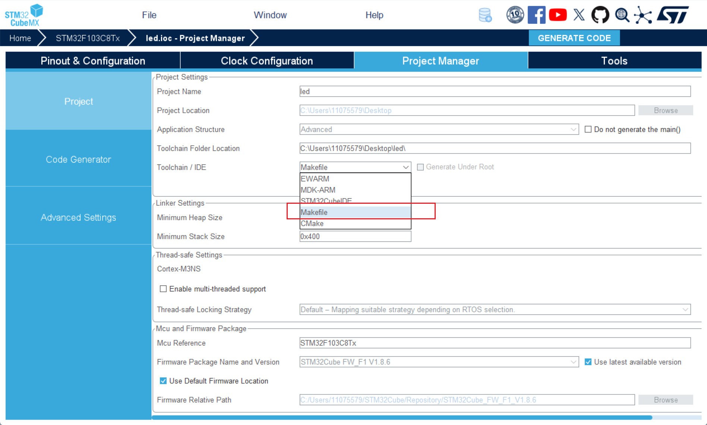
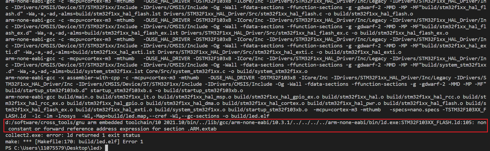
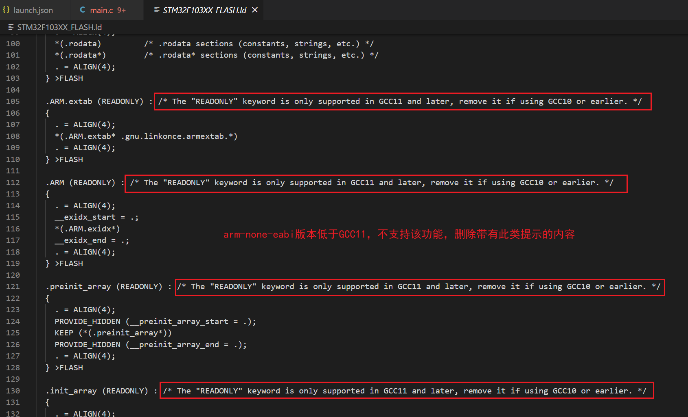
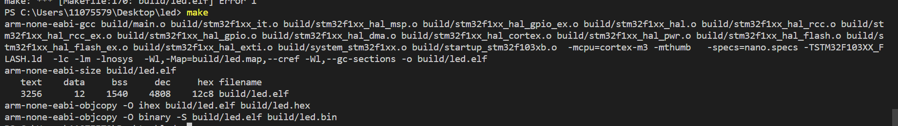
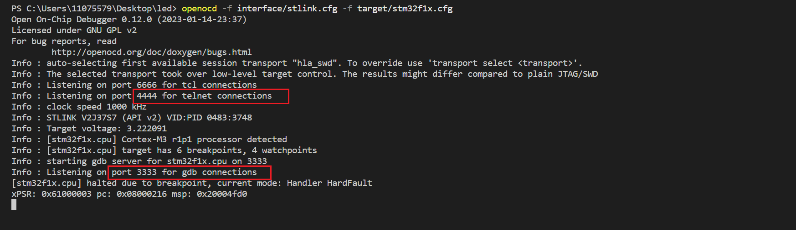
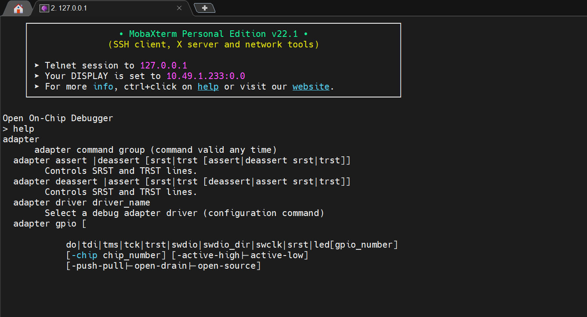
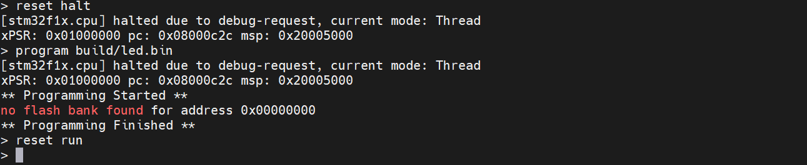
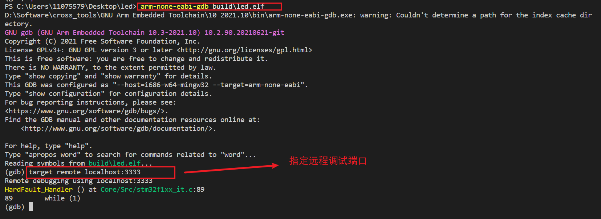
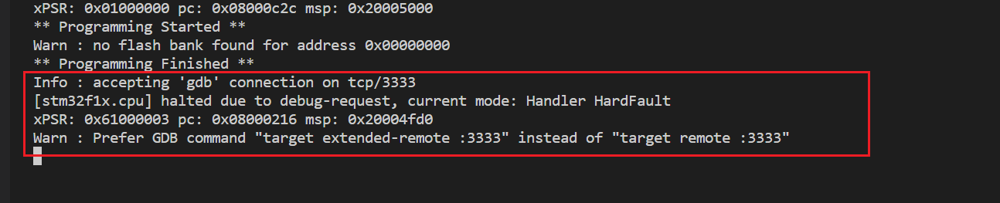

# Windows 系统使用 w64devkit 预建工具链编译环境


## 1. 工具链的介绍和下载
### 1.1. w64devkit 工具链
[ MinGW-w64 ](https://www.mingw-w64.org/downloads/) 官网提供了用于 Windows 开发的工具链项目 [w64devkit](https://github.com/skeeto/w64devkit)。

w64devkit 是一个轻量级的 Windows 64 位开发工具链，基于 MinGW-w64 和 BusyBox-w32，专为 C/C++ 开发 设计。

它提供了完整的 GCC 编译器、GDB 调试器、Make 构建工具等，无需复杂安装，解压即可使用，适合快速搭建开发环境或嵌入式开发。

### 1.2. arm-none-eabi-gcc 嵌入式交叉编译工具链
如果需要编译 stm32 等 cortex-m 非 Linux 嵌入式项目的代码，还需要安装对应的交叉编译工具链，如 [arm-none-eabi-gcc](https://developer.arm.com/tools-and-software/open-source-software/developer-tools/gnu-toolchain/gnu-rm/downloads) 。

### 1.3. OpenOCD 调试工具
[OpenOCD（Open On-Chip Debugger）](https://openocd.org/pages/getting-openocd.html) 是一个开源的调试工具，支持多种嵌入式设备，包括 STM32 等 ARM Cortex-M 系列的微控制器。

OpenOCD 可以通过 JTAG 或 SWD 接口连接到嵌入式设备，并提供调试功能，如单步执行、断点设置、寄存器查看等。

OpenOCD 还可以与 GDB 调试器配合使用，实现远程调试。

### 1.4. 安装步骤
以上工具链的安装都是直接解压即可，解压完后将各自的 bin 可执行文件的路径添加到 Windows 的 Path 环境变量中即可使用。

## 2. 使用 w64devkit + arm-none-eabi-gcc 编译项目
为了方便，这里使用 `STM32CubeMX` 生成 `Makefile` 项目，然后使用 `w64devkit` 工具链中的 `make` 工具和交叉编译器 `arm-none-eabi-gcc` 进行编译。

### 2.1. 使用 STM32CubeMX 构建项目并编译
1. 在 `Windows` 系统中，可以使用 `STM32CubeMX` 生成自带 `Makefile` 的项目。
    

### 2.2. 使用 w64devkit 编译项目
1. 打开生成的项目文件夹，找到 `Makefile` 文件所在的路径，右键或者使用其他终端工具进入该文件路径的命令行模式，输入 `make` 命令，开始编译项目。会产生如下错误。

2. 编译过程中，如果提示链接脚本 `STM32F103XX_FLASH.ld` 执行错误
    

3. 根据错误提示，打开 `STM32F103XX_FLASH.ld` 文件，发现是交叉编译器的 GCC 版本低于最低要求，根据文件中的提示内容，删除不支持的部分。
    

4. 重新使用 make 命令，编译完成后，会在项目文件夹中生成 `build` 文件夹，其中包含生成的可执行文件 `*.elf` 和 `*.bin`。
    

## 3. 代码烧写
代码烧写需要用到 OpenOCD 调试工具，以及烧写器，这里使用的是 STLink 作为烧写器。

### 3.1. 使用 OpenOCD 连接烧写器
1. 运行 OpenOCD，并指定配置文件路径，如：
    ```bash
    openocd -f interface/stlink.cfg -f target/stm32f1x.cfg
    ```

    其中接口的配置文件和目标配置文件都放在 openocd 解压后的 `share\openocd\scripts` 文件夹中，命令好运行结果如下：

    

    **注意：如果需要指定端口，需要在命令行添加对应的指令命令，如：**
    ```bash
    openocd -f interface/stlink.cfg -f target/stm32f1x.cfg -c "gdb_port 3333" -c "telnet_port 4444" -c "tcl_port 6666"
    ```

2. 上述截图表示 OpenOCD 成功连接到 STLink，并成功识别到目标芯片，从打印信息可以看出：
    - 4444 端口用于 telnet 远程连接；
    - 6666 端口用于 tcp 远程连接；
    - 3333 端口用于 gdb 远程连接。

3. 使用远程终端工具的 telnet 功能远程连接到 4444 端口，连接成功后，会进入 OpenOCD 命令行，可以输入 `help` 命令查看 OpenOCD 支持的命令。
    

4. 在远程终端的 OpenOCD 命令行中，输入 `reset halt` 命令，使芯片进入 halt 状态，然后输入 `program build/led.bin` 命令，将编译生成的 bin（调试时可以选择 elf ） 文件烧写到芯片中，最后输入 `reset run` 命令，使芯片重新运行。
    

    **其他 openocd 的命令可以参考文章：**[OpenOCD简明指南](https://nanjo712.github.io/2024/07/28/OpenOCD%E7%AE%80%E6%98%8E%E6%8C%87%E5%8D%97/#program)

### 3.2. 使用 GDB 调试
1. 使用交叉编译工具链中的 GDB 调试器，输入命令 `arm-none-eabi-gdb <target.elf>` 载入 elf 格式的程序，载入后使用 `target remote <remote address>:<port>` 指定远程调试器的地址和端口，如：

    

2. 载入程序后可以看到程序运行结果的打印信息；

3. 返回 openocd 程序运行的终端界面，会看到 openocd 连接 gdb 调试器成功的打印信息：

    

4. 在 GDB 调试页面进行调试：
    常见命令有：
    ```bash
    (gdb) load  # 烧录程序到 flash
    (gdb) monitor reset halt    # 暂停 CPU
    (gdb) monitor reset               # 复位
    (gdb) continue
    ```

此方法用于命令行模式调试程序，如果不太数量可以使用 vscode 作为调试器，具体方法可以参考：[使用VS Code + OpenOCD + GDB 调试程序](03.使用VS%20Code+OpenOCD+GDB调试程序.md) 。