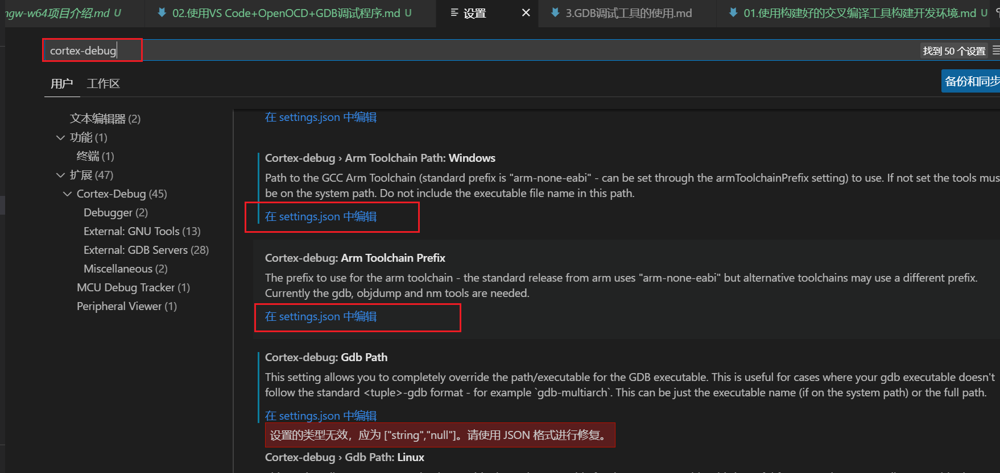
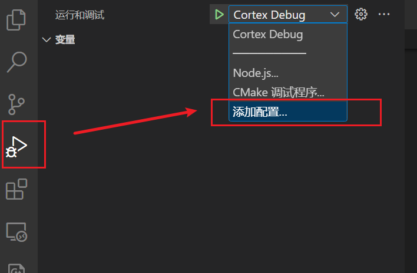
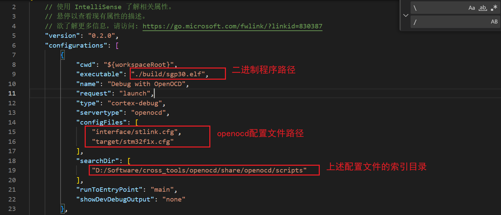
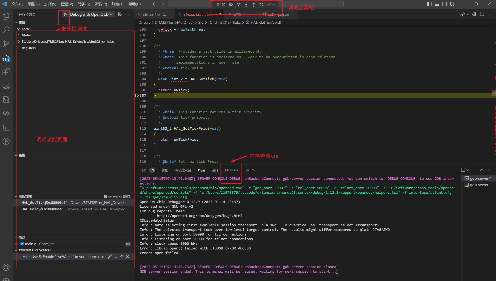

# 使用VS Code + OpenOCD + GDB 调试程序
主要用于调试 ARM Cortex-M 系列微控制器，如 STM32 系列微控制器。


## 1. 环境安装
### 1.1. 必要调试组件安装
1. [VS Code](https://code.visualstudio.com/)
2. [OpenOCD](https://openocd.org/pages/getting-openocd.html)
3. [arm-none-eabi-gdb](https://developer.arm.com/tools-and-software/open-source-software/developer-tools/gnu-toolchain/gnu-rm/downloads)

以上软件安装比较简单，这里不再赘述。

### 1.2. VSCode插件安装和路径配置
1. 在 vscode 软件的侧边 “拓展” 栏搜索 “Cortex-Debug” 插件，直接安装；

2. 安装完成后需要配置插件调用 openocd 和 gdb 的路径。打开需要调试的项目文件夹，选择 vscode 上面功能栏 `“文件” -> “首选项” -> “设置”` ，在设置栏搜索插件的相关设置：

    

3. 选择 “在 setting.json 中编辑” ，在打开的 setting.json 文件最后面中添加 openocd 工具、gdb 调试器、交叉编译器的可执行文件路径，这里只设置了 Windows 系统下的路径：

    ```json
        "cortex-debug.openocdPath.windows": "D:/Software/cross_tools/openocd/bin/openocd.exe",
        "cortex-debug.armToolchainPath.windows": "D:/Software/cross_tools/GNU Arm Embedded Toolchain/10 2021.10/bin",
        "cortex-debug.gdbPath.windows": "D:/Software/cross_tools/GNU Arm Embedded Toolchain/10 2021.10/bin/arm-none-eabi-gdb.exe"
    }
    ```

## 2. 调试代码
### 2.1. vscode 调试工具的使用
1. 打开VS Code，点击左侧的 “运行与调试” 功能页（*如果提示项目没有 launch.json 文件，则点击 “创建 launch.json 文件” 新建*），点击 “添加配置”：

    

2. 系统会自动打开一个 launch.json 文件，选择 “{}Cortex Debug：OpenOCD” 模板：

    

3. 系统会自动生成一个 launch.json 文件，下图未需要修改的三项主要配置，这里以 STM32F103C8T6 为例，修改后的 launch.json 文件如下：

    

4. 返回 “运行与调试” 栏直接选择配置好的调试器，点击运行即可进入调试页面开始调试：

    