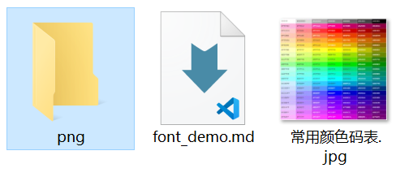

# 标题
## 二级
### 三级
#### 四级
##### 五级
###### 六级
正文

>引用
>>第二层引用
>>>第三层引用
>>>>第四层引用

**加粗**

*倾斜*

***粗斜体***

**有序列表：**
1. 列表1
2. 列表2
3. 列表3
...

**无序列表：**
- 列表1
- 列表2
- 列表3


```c
代码段
#include <stdio.h>

int main()
{
    printf("hello world!\n");
}
```

正文中代码段：` printf("hello world!\n");`



[链接](https://www.runoob.com)

| 左对齐 | 右对齐 | 居中对齐 |
| :-| -: | :-: |
| 单元格左 | 单元格右 | 单元格居中 |
| 单元格左 | 单元格右 | 单元格居中 |

-------------------------------------
一下是HTML可支持的格式，GitHub不支持。

<font face="黑体">我是黑体字</font>

<font face="微软雅黑">我是微软雅黑</font>

<font face="STCAIYUN">我是华文彩云</font>

<font color=red>我是红色</font>

<font color=#008000>使用色码，我是绿色</font>

<font color=#FFB3FF>使用色码，我是粉色</font>

<font color=Blue>我是蓝色</font>

<font size=5>我是尺寸</font>

<font face="黑体" color=green size=5>我是黑体，绿色，尺寸为5</font>
