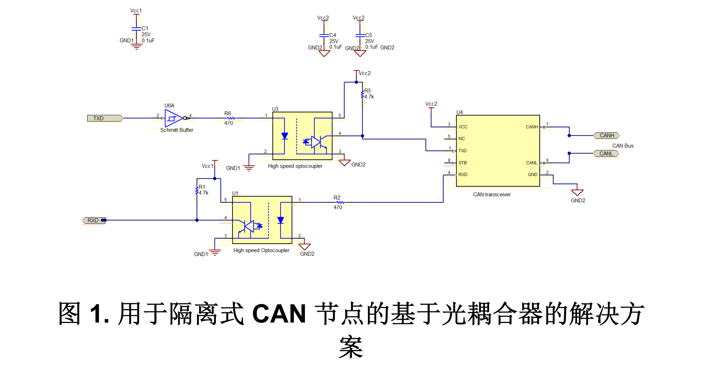
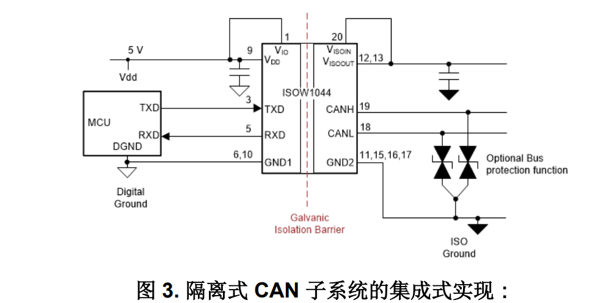

# CAN 典型电路设计

参考文档：
- TI 德州仪器：
    - [TCAN1462 数据表 - TCAN1462-Q1 和 TCAN1462V-Q1 具有信号改善功能 (SIC)、待机模式和故障保护功能的汽车类 CAN FD 收发器 数据表 (Rev. A)](https://www.ti.com.cn/cn/lit/gpn/tcan1462-q1)
    - [ZHCABM1 应用手册 - 保护汽车 CAN 总线系统免受 ESD 过压事件的影响](https://www.ti.com.cn/cn/lit/pdf/zhcabm1)
    - [ZHCAAF5 应用手册 - 如何在隔离式 CAN 系统中隔离信号和电源 (Rev. C)](https://www.ti.com.cn/cn/lit/pdf/zhcaaf5)
    - [ZHCAAP2 应用手册 - 如何为空间受限型工业应用设计隔离式 CAN 端口](https://www.ti.com.cn/cn/lit/pdf/zhcaap2)
    - [ZHCAAG9 应用手册 - 有关隔离式 CAN 总线设计的几大设计问题 (Rev. A)](https://www.ti.com.cn/cn/lit/pdf/zhcaag9)

- 安森美 onsemi：
    - [AND8169/D - EMI/ESD Protection Solutions for the CAN Bus](https://www.onsemi.cn/download/application-notes/pdf/and8169-d.pdf)

## 1. CAN 标准
CAN 是一个双线差分通信接口，其物理层根据 ISO 11898-2 标准定义。该物理层包含 CAN 收发器和双绞线，后
者将所有的 CAN 节点连接在一起。连接 CAN 收发器和电缆的两条线路被称为 CANH 和 CANL。另外，还建议用
一个分裂终端来端接 CANH 和 CANL 线路，以避免信号反射和高频噪声。图 1-1 展示了典型的 CAN 总线设置。

CAN 协议可支持不同的速度。具体包括：
- 低速 (LS CAN)：高达 125kbps
- 高速 (HS CAN)：高达 1Mbps
- 灵活数据速率 (CAN FD)：高达 5Mbps
- 具有信号改善功能的 CAN (CAN SIC)：高达 8Mbps
- CAN XL：高达 10-20 Mbps（尚未发布）

## 2. CAN 接口的典型设计
    

## 2. CAN 接口的隔离设计
### 2.1 光耦合器的隔离解决方案
以往，系统设计人员使用光耦合器来创建用于隔离 CAN 节点的分立式解决方案。图 1 中显示的这种基于光耦合器的方法需要两个用于发送和接收数据的高速光耦合器、一个 CAN 收发器、一个用于驱动发送光耦合器的 LED 的施密特缓冲器、旁路电容器以及若干个用于正确偏置的电阻器。

基于光耦合器的解决方案需要使用大量外部元件，这增加了布板空间，并带来潜在的可靠性问题。与分立式光耦合器方法相比，用于稳健可靠系统运行的高压隔离等现代数字隔离器解决方案更为可靠，具有更低的时基故障 (FIT) 率和更小的整体解决方案尺寸。

### 2.2 隔离电源的分立式实现

图 1 所示为隔离式 CAN 子系统的分立式信号和电源隔离方案的示例。隔离式 CAN 功能是通过一个数字隔离器 ISO7721 以及一个带灵活数据速率和故障保护的CAN 收发器 TCAN1042H 来实现的，其中数字隔离器在每个方向为发送 (TXD) 和接收 (RXD) 信号提供一个通道。

SN6501 是一款推挽式变压器驱动器，可与外部变压、整流二极管和 LDO 结合使用以产生隔离电源。根调节需要，LDO 为可选件。对于变压器初级侧最高50mA 的变压器驱动器电流而言，SN6501 足以满足求。如果需要更大的驱动电流，1A 驱动电流的N6505A 或者 SN6505B 可能更合适。

将图 1 中的分立式隔离器和 CAN 替换为隔离式 CAN器件，则可实现如图 2 所示的简化信号链。隔离式电源解决方案与之前的分立式实现方案相同。本设计中的隔离式 CAN 器件 ISO1042 使器件数量减少了一个，缩短了循环时间，同时提供了高级别的保护。该解决方案具有先前分立解决方案的所有优点，却没有任何其他缺点。

如果系统中有多个隔离式 CAN 器件由同一个隔离式电源供电，则该架构可使信号链部分变得紧凑，因为LDO 的输出可用于为所有隔离式 CAN 器件供电。TIDA-01255 是分立式实现的详细参考设计，适用于汽车和工业 CAN 系统。

- 该解决方案的优势：
    - 采用外部变压器，功率传输效率更高（约 70%至 80%）。
    - 通过降低变压器驱动器的开关频率，尽可能减少辐射。
    - 可灵活使用任何 CAN 收发器或数字隔离器或单片隔离式 CAN。
    - 隔离式电源能够为多个隔离式 CAN 收发器提供电流。
- 该解决方案的缺点：
    - 采用分立式元件，占用的布板空间更大。
    - 变压器体积大且需要更高的高度，这限制了电路板堆叠的紧密度。
    - 每个隔离元件都需要单独认证。

### 2.3 带隔离式电源的隔离式 CAN
隔离式 CAN 和电源的功能同样可以用 ISOW1044 来实现。ISOW1044 是一款将所有隔离功能和 CAN FD 收发器集成到单个 20-SOIC 封装中的器件，如图 3 所示。ISOW1044 在芯片内部集成变压器，这不仅在 X 和 Y 维度上节省了空间，在 Z（高度）维度上也是如此。此外，ISOW1044 包含一个单独的 10Mbps GPIO 通道，有助于进一步去除板上其他数字隔离器或光耦合器。

- 该解决方案的优势：
    - 紧凑型解决方案，所需高度更低。
    - 只有一个隔离元件，易于认证和设计。
    - 减轻了寻找合适额定值的变压器的负担。
    - 低辐射设计，确保最终系统能够在两层 PCB 上仅使用两个铁氧体磁珠就满足 CISPR 32 B 类设备辐射限制要求。
- 该解决方案的缺点：
    - 采用片上变压器，将功率传输效率限制在 47%。
    - 采用集成式变压器，开关频率更高，因此辐射通常高于分立式实现。
    - 最适合从根本上而言单个 CAN 接口需要隔离式电源的系统，因为该器件仅为内部 CAN 收发器生成隔离电源，额外输出电流最高 20mA。

## 4. CAN 接口的电路设计要求
总线每一端的终端可以是单个 120Ω 电阻器，位于在电缆上或终端节点中。如果总线的共模电压需要进行滤波和
稳压，则可以采用分裂终端，请参阅图 11-2。分裂终端通过滤除差分信号线路上可能存在的高频共模噪声来改善
网络的电磁辐射行为。

## 5. CAN 接口的布局指南
- 将保护和滤波电路放置于尽可能靠近总线连接器 J1 的位置，以防止瞬变、ESD 和噪声传播到电路板。以下布
局示例显示了一个可选瞬态电压抑制 (TVS) 二极管 D1；如果系统级要求超过收发器的额定值，则可以采用该
二极管。本示例中也显示了可选的总线滤波电容 C4 或 C5。
- 朝信号路径的方向设计总线保护组件。不得将瞬态电流从信号路径强行转移至保护器件。
- 去耦电容应尽可能靠近收发器的电源引脚 VCC 和 VIO 放置。
- 当旁路电容和保护器件连接电源和接地时，应至少使用两个过孔以更大限度减少布线电感和过孔电感。
- 以下布局示例展示了如何在 CAN 节点上实现分裂终端。此终端分为 R4 和 R5 两个电阻，终端的中心或分接抽
头通过电容 C3 接地。分裂终端为总线提供共模滤波。有关终端概念和终端电阻所需的额定功率的信息，请参
阅 CAN 终端和 CAN 总线短路电流限制。

## 6. CAN 接口的 EMI/EMC 设计
## 6.1. CAN 接口的 EMI/ESD 电路设计
共模扼流圈、电容器和TVS二极管的组合可用于解决最严格的EMI辐射和抗扰度要求，如图17所示。进入CAN节点的噪声由扼流滤波器和电容CH1和CL1的电感形成的二阶滤波器衰减。相比之下，电容 CH2 和 CL2 提供了一个滤波器，以降低从收发器流出的辐射或噪声。双向TVS二极管的作用是将CAN总线上的瞬态电压干扰钳位到安全值。
