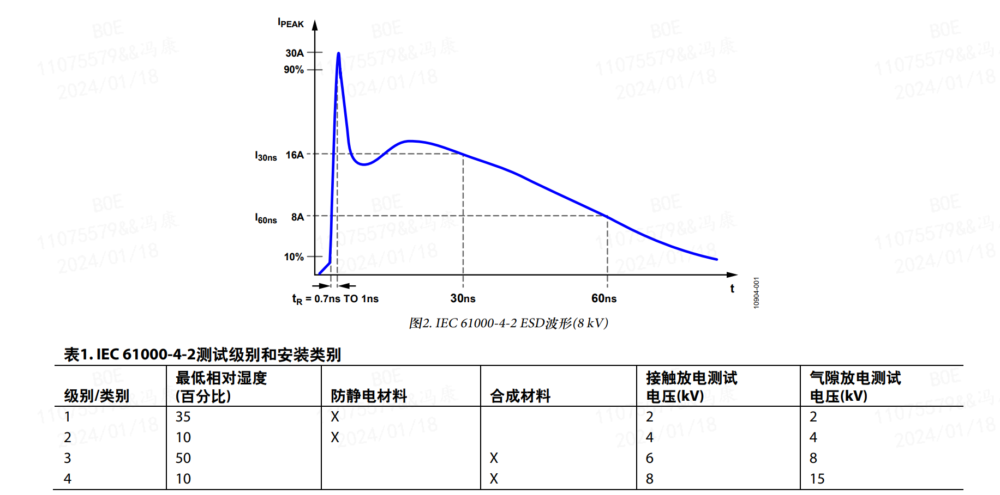
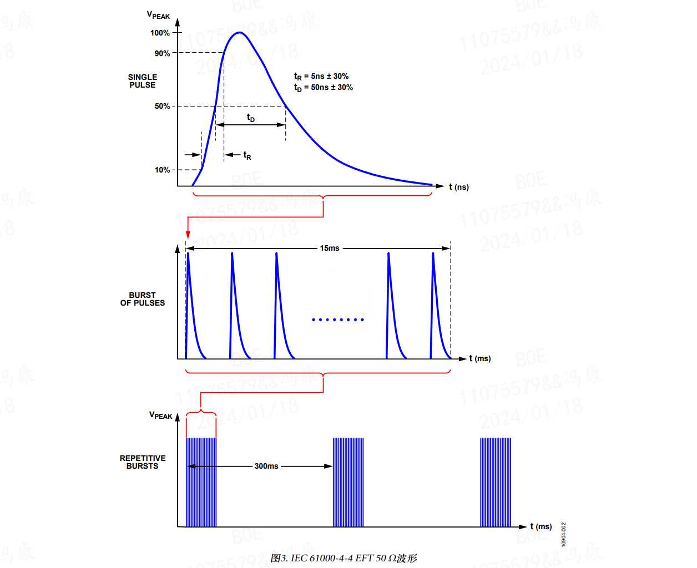
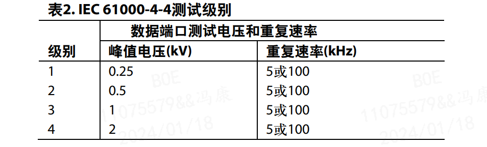
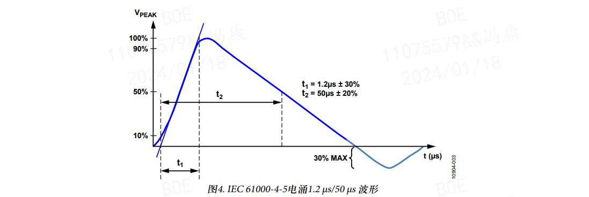
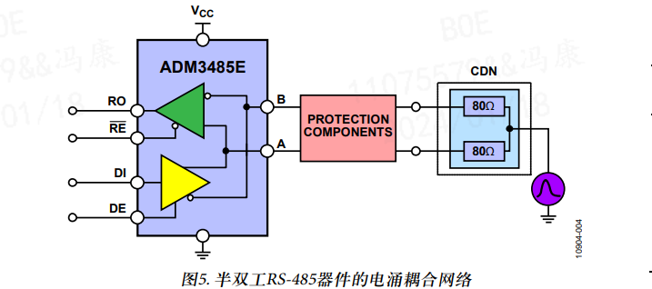
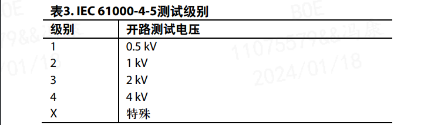
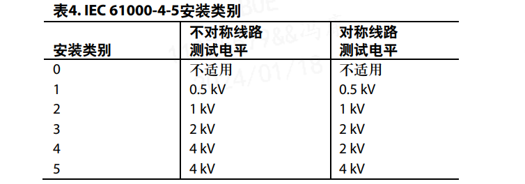
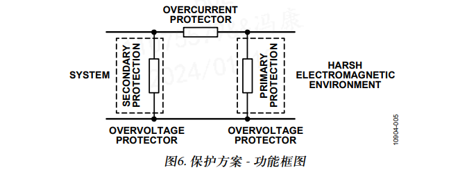

# 电磁兼容性
参考文档：
- ADI ：
    - [AN-1161 应用笔记 - EMC兼容RS-485通信网络](https://www.analog.com/media/cn/technical-documentation/application-notes/AN-1161_cn.pdf)

EMC是指电子系统在目标电磁环境下保持良好性能且不会向该环境中引入大量电磁干扰的能力。电磁环境包含辐射和传导能量。因此，EMC也包含两方面，即辐射和敏感度。

辐射是指产品不必要地产生电磁能量。为了打造一种具备电磁兼容性的环境，通常需要控制辐射。

敏感度是一种用于衡量电子产品容忍其他电磁产品的辐射或传导电磁能量影响或其他电磁影响的能力指标。抗扰度与敏感度相反。敏感度高的设备抗扰度低。

国际电工委员会(IEC)是致力于制定和发布所有电气、电子和相关技术国际标准的全球领先组织。自1996年以来，向欧盟出售或在欧盟范围内出售的所有电子设备都必须达到IEC 61000-4-x规范定义的EMC级别。

IEC 61000规范定义了一组EMC抗扰度要求，适用于在住宅、商业和轻工业环境中使用的电气和电子设备。这组规范包括以下三种类型的高电压瞬变，设计人员需要确保数据通信线路不受这些瞬变的损害。这三种类型分别是：
- IEC 61000-4-2静电放电(ESD)
- IEC 61000-4-4电快速瞬变(EFTs)
- IEC 61000-4-5电涌抗扰度(Surge)

## 1. 静电放电（ESD）
ESD是指两个电位不同的带电体之间因为近接触或电场的传导而突然产生静电电荷的传输。其特性是在较短的时间内有较大的电流。

物体会因为许多机制而带电。仅仅是与另一个带电体接触也会产生电荷。摩擦效应也会导致产生电荷，也就是两个
物体相互摩擦产生静电。此外还有一种现象是感应起电，也就是通过感应产生电荷。这种情况下，带电体之间没有实质接触，但只要二者在同一个电场内，也还是会产生电荷。

IEC 61000-4-2测试的主要目的是确定系统在工作过程中对系统外部ESD事件的抗扰度。IEC 61000-4-2规定要使用两种耦合方法测试，即接触放电和空气放电。接触放电是指放电枪直接与受测装置相连。空气放电使用更高的测试电压，
但不会直接接触受测装置。

使用空气放电法进行测试时，放电枪的带电极向受测装置移动，直到产生放电在整个气隙上形成一道电弧。放电枪不会直接接触受测装置。许多因素会影响空气放电测试的结果和可重复性，包括湿度、温度、气压、距离以及接近受测装置的速度。此方法可以更好地表现实际的ESD事件，但可重复性不强。因此，接触放电是首选的测试方法。

IEC 61000-4-2规定了不同环境状况下的电压测试级别，此外还有电流波形。表1显示了环境和测试电压之间的关系。
应该根据最终产品所处的实际安装条件和环境状况选择测试级别。

1级最轻微，4级最严重。1级和2级适合拥有防静电材料的受控环境中安装的产品。3级和4级适合情况更严重的环境中安装的产品，这类环境下更常发生带有较高电压的ESD事件。

图2显示了规范中描述的8 kV接触放电电流波形。部分需要注意的关键波形参数是不到1 ns的快速上升时间和大约60 ns的短脉冲宽度。这相当于脉冲的总能量在数十mJ范围内。该测试是按单次放电进行的。测试点可能承受至少10次正极放电和10次负极放电。推荐的放电间隔为1 s。

## 2. 电快速瞬变（EFT）
电快速瞬变测试涉及将大量极快的瞬变脉冲耦合到信号线上，以表示与外部开关电路关联的瞬变干扰，这类电路能够以容性方式耦合至通信端口。这可能包括继电器和开关触点抖动，或者因为感性或容性负载切换而产生的瞬变，而所有这些在工业环境中都很常见。IEC 61000-4-4中定义的EFT测试尝试模拟因为这些类型的事件产生的干扰。

图3显示了EFT 50 Ω负载波形。通过输出阻抗为50 Ω的发生器从50 Ω阻抗两端的电压这一角度描述了EFT波形。输出波形包括一个15 ms的突发5 kHz高电压瞬变，其重复间隔为300 ms。每个单独的脉冲都有5 ns的上升时间和50 ns的脉冲持续时间，在波形上升沿和下降沿的50%那一点测得。与ESD瞬变类似，EFT脉冲的特性也是快速上升时间和短脉冲宽度。单次脉冲的总能量类似于ESD脉冲。施加于数据端口的电压可以高达2 kV。

这些快速突发瞬变利用一个容性夹钳耦合至通信线路。EFT通过夹钳而非直接接触以容性方式耦合至通信线路。这样也降低了因为EFT发生器的低输出阻抗而产生的负载。夹钳和电缆之间的耦合电容取决于电缆直径以及电缆上的屏蔽层和绝缘层。

IEC 61000-4-4规定了不同环境状况下的电压测试级别。表2显示了不同测试级别对应的测试电压和脉冲重复速率。应该根据最终产品所处的最现实的安装条件和环境状况选择测试级别。一般采用5 kHz的重复速率，但此速率通常取决于终端制造商的规范。

- 1级 表示保护措施很好的环境
- 2级 表示受保护的环境
- 3级 表示典型的工业环境
- 4级 表示恶劣的工业环境

## 3. 电涌（Surge）—— 以 RS485 为例
电涌瞬变通常由开关操作造成的过压情况或雷击造成。开关瞬变的起因可能是电力系统切换、配电系统中的负载变化或各种系统故障(例如安装时与接地系统形成短路和电弧故障)。雷击瞬变的起因可能是附近的雷击导致向电路中注入了较大的电流和电压。IEC 61000-4-5定义了在容易受到这些电涌现象影响的情况下用于评估电子电气设备抗扰度的波形、测试方法和测试级别。

波形规定为开路电压和短路电流形式的波形发生器输出。介绍了两种波形。10 µs/700 µs组合波形用于连接对称通信线路测试端口，例如电话交换线。1.2 µs/50 µs组合波形发生器用于其他所有情况，尤其是短距离信号连接。对于RS-485端口，主要使用1.2 µs/50 µs波形。波形发生器的有效输出阻抗为2 Ω，因此电涌瞬变拥有与之关联的大电流。

图4显示了1.2 µs/50 µs电涌瞬变波形。ESD和EFT拥有类似的上升时间、脉冲宽度和能量级别。对于电涌，脉冲的上升时间为1.25 µs ，脉冲宽度为50 µs 。电涌脉冲的能量级别可以达到ESD或EFT脉冲能量级别的三到四个数量级。因此，电涌瞬变可以视作是EMC瞬变规范中最严重的一种。由于ESD和EFT之间的相似性，相应的电路保护设计也很相似，但是由于电涌的能量大，因此必须采取不同的处理方式。在开发保护电路时，如果既要保持成本效益，又要提高数据端口针对这三种瞬变的抗扰度，这就是主要问题之一。

电阻将电涌瞬变耦合至通信线路。图5显示了半双工RS-485器件的耦合网络。并联电阻总和为40 Ω。对于半双工器件，
每个电阻为80 Ω。

表3显示了IEC 61000-4-5中定义的测试级别。X级可以高于、低于或介于其他级别之间。这通常在产品标准中指定。应该根据安装条件选择测试级别。根据规范中的定义，有六种安装类别。
- 0类(保护措施良好的电气环境)
- 1类(部分保护的电气环境)
- 2类(即使是短距离也实现了电缆妥善分离的电气环境)
- 3类(电力线和信号线并行布设的电气环境)
- 4类(在这种电气环境下，互连电缆的布线方式像室外电缆一样与电力线混在一起，而且电缆同时用于电子和电气回路)
- 5类(在这种电气环境下，电子设备与电信线缆连在一起，而且有一些架空的电力线在不算密集的空间内)
- X类(产品规格中指定的特殊情况)0类没有关联的电涌瞬变处理措施。5类的瞬变应力程度最严重。

有关安装类别及每种类别对应的电涌电压的概要如表4所示。表4显示对称和不对称线路两种情况下，线至地耦合的各类别相关测试电压。必须了解最终环境类别，这样才能确保产品对相应的威胁级别具有抗扰性。

在电涌测试期间，向数据端口施加五次正脉冲和五次负脉冲，每次脉冲之间的最大间隔为1分钟。根据标准的规定，应该将器件设置在正常工作条件下进行测试。

## 4. 通过/失败标准
对受测系统施加瞬变后，根据四种通过/失败标准对测试结果进行分类。下面列出了这些通过/失败标准，并举例说明了每种标准可能与RS-485收发器之间存在何种联系：
- A. 性能正常；在施加瞬变期间或之后不会出现位错误。
- B. 暂时丧失功能或性能暂时降低，无需操作人员介入；在施加瞬变期间以及之后一段时间可能会出现位错误。
- C. 暂时丧失功能或性能暂时降低，需要操作人员介入；可能发生闩锁事件，可在上电复位之后消除，不会对器件造成永久性损坏或性能降级。
- D. 丧失功能，且对设备造成永久性损坏。器件未通过测试。

标准A是最理想的，标准D是无法接受的。永久性损坏会导致系统停机，并产生维修和更换费用。对于任务关键型系统，标准B和标准C也是无法接受的，因为系统必须在出现瞬变事件期间仍然能保持正常工作。

## 5. 保护原理
有三种主要方式可用于预防EMC问题。
- 从源头抑制瞬变。
- 让耦合路径尽可能低效。
- 降低器件对瞬变干扰的敏感度。

通常不可能消除瞬变的源头，例如，无法控制在哪里发生雷击。最终产品安装之后，降低耦合的可能性通常就不在制造商的控制范围内。为了确保产品符合EMC标准，制造商通常有必要增强对数据端口的保护，以便降低产品对瞬变干扰的敏感度。

设计瞬变保护电路时，请考虑以下事项：
- 必须防止或限制瞬变造成的损坏，让系统能够在性能影响最低的情况下恢复正常工作。
- 保护方案应该足够稳健，以便应对系统在电场中可能遇到的各种类型的瞬变和电平。
- 瞬变时长是一个重要因素。对于较长的瞬变，热效应会导致某些保护方案失效。
- 正常工作条件下，保护电路应该不会干扰系统工作。
- 如果保护电路在过应力期间失效，应该以保护系统的方式失效。
主要有两种类型的保护方案可用于针对瞬变提供保护。过流保护用于限制峰值电流，过压保护用于限制峰值电压。

市场上有各种各样的过流和过压保护技术及元件，每一种都各有利弊。为系统开发保护方案通常既需要用到过压保护器件，也需要用到过流保护器件。

图6显示了某种保护方案的典型设计。这种设计具有主保护和次级保护。主保护可将大部分瞬变能量从系统转移开，通常位于系统和环境之间的接口。它能够将瞬变转移到地，从而移走绝大部分的能量。

次级保护的目的是保护系统各个部件，使其免受主保护允许通过的任何瞬变电压和电流的损坏。次级保护通常更侧重于面向受保护系统的具体部件。它经过优化，可以确保针对上述残余瞬变提供保护，同时还允许系统的这些敏感部件正常工作。必须确保主设计和次级设计能够一起配合系统输入/输出，以便最大限度地降低对受保护电路造成的应力。

这些设计一般在主保护器件和次级保护器件之间会有一个协调元件，例如电阻或非线性过流保护器件，以确保能够进行协调。

