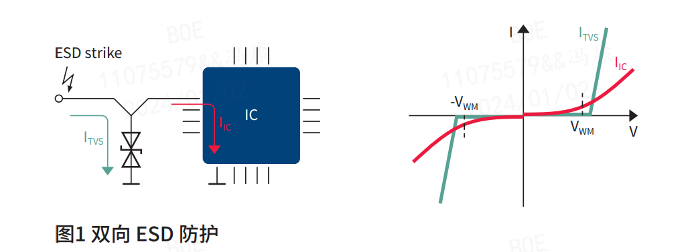
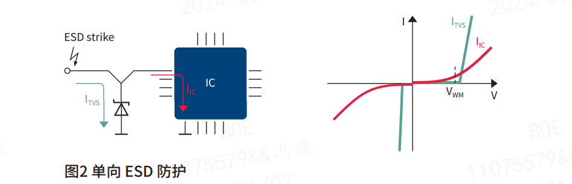
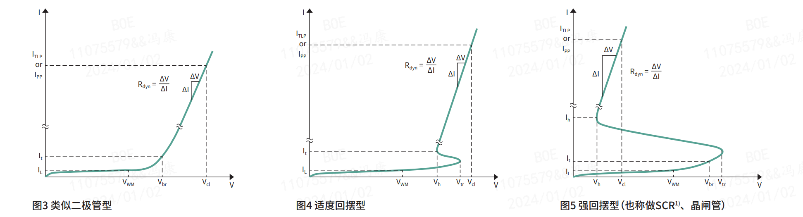
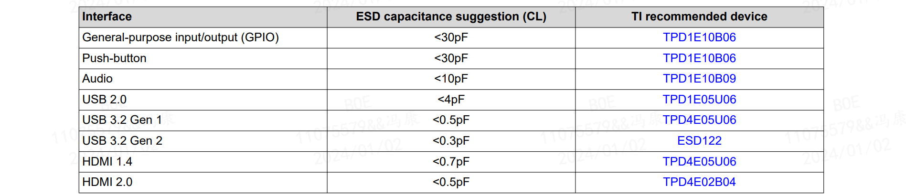
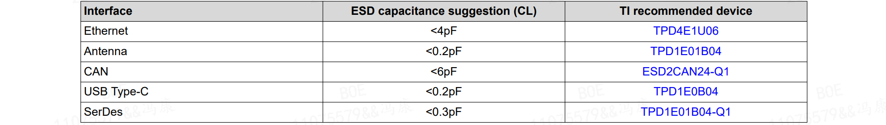
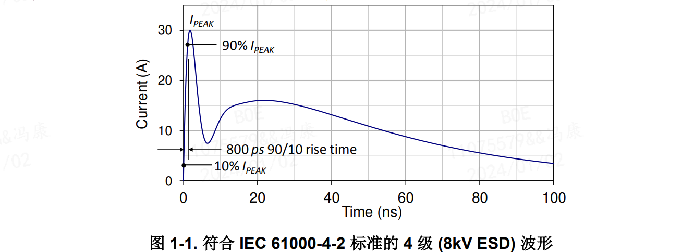
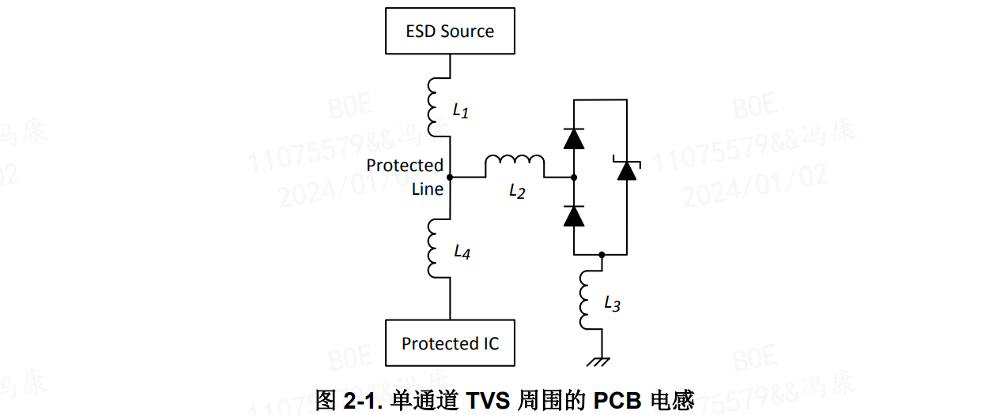
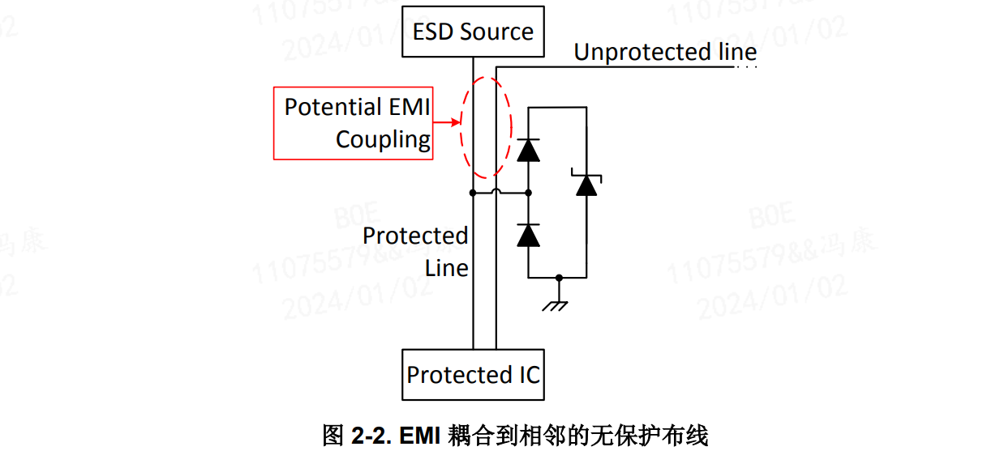

# ESD 电路设计
参考文章：
- TI:
    - [ZHCABL9-ESD 保护布局指南 (Rev. A)](https://www.ti.com.cn/cn/lit/pdf/zhcabl9)
    - [**ZHCABR8a-用于 USB 接口的 ESD 和浪涌保护 (Rev. A)**](https://www.ti.com.cn/cn/lit/pdf/zhcabr8)
    - [ZHCAAB6-ESD 包装和布局指南 (Rev. B)](https://www.ti.com.cn/cn/lit/pdf/zhcaab6)
    - [SSZB130d-System-Level ESD Protection Guide](https://www.ti.com.cn/cn/lit/pdf/sszb130)

- infineon:
    - [理解静电放电（ESD）防护器件的特性参数](https://www.infineon.com/cms/cn/product/esd-and-surge-protection/low-capacitance-esd-devices/#!?fileId=5546d4626e651a41016e89664a851d92)

- NXP:
    - [AN10897-A guide to designing for ESD and EMC](https://www.nxp.com.cn/docs/en/application-note/AN10897.pdf)

- nexperia：
    - [Nexperia_document_brochure_ESD-Protection-Applications_022017](https://assets.nexperia.cn/documents/brochure/Nexperia_document_brochure_ESD-Protection-Applications_022017.pdf)

2021年中国TVS/ESD防护器件前五大厂商分别为安世半导体（Nexperia）、力特（Littelfuse）、安森美（ONSemiconductor）、意法半导体（STMicroelectronics）和韦尔股份，合计占中国市场份额约为27.6%。中国市场本土骨干企业包括闻泰科技（安世半导体）、韦尔股份、维安电子、捷捷微电、芯导科技、乐山无线电、槟城电子、苏州固锝、银河微电、扬杰科技等。

## 0. ESD 器件
### 0.1. ESD 器件
双向 ESD 防护器件一般是对称的（图1）。它们既可以用于传输双极性信号的信号线 (-VWM ≤ Vsignal ≤ VWM)，也适用于单极性信号 (0 ≤ Vsignal ≤ VWM)。 
    

单向 ESD 防护器件是非对称的（图2），一般只用于单极性信号线 (0 ≤ Vsignal ≤ VWM)。实际中，类似于齐纳二极管，它们反向用在电路中。行业的惯例是将电压和电流的方向指定为正方向，例如应用中的电压。
    

### 0.2. 电流-电压（I-V）特性类型（比例仅供参考）： 

1. 类似二极管型
    - 特点和好处：
        - 特性简单，易于使用
        - 良好的防护性能
        - 低电压过冲，响应快速
    - 最佳适用于：
        - 需要快速响应的应用
        - 多用途和低速率的应用：按键、开关、音频接口、GPIO、触摸屏

2. 适度回摆型
    - 特点和好处：
        - 改善了的防护性能（Vcl）
        - 可实现低电容（CL）
        - VWM 与 Vcl 之间的极好平衡
    - 最佳适用于：
        - 类似二极管型相同的应用
        - 高速率I/O和射频应用

3. 强回摆型
    - 特点和好处：
        - 最佳的防护性能（Vcl）
        - 可实现低电容（CL
    - 最佳适用于：
        - 射频应用
        - 具有极其严格Vcl要求的应用：
            - 高数据传输速率的应用，LVDS
            - 采用纳米级别芯片技术的超精密结构SoC I/O

4. 进一步理解 I-V 曲线参数 ：
    - **Vh、Ih – 维持电压、维持电流**
        - 对SCR器件来说，Vh < VWM。Vh是电压的局部极小值，Ih 是相应的电流。Vh和Ih 必须根据导线上驱动DC电压/电流的能力来折中选取，以防止器件进入闭锁（latch-up）状态 。
        - 对适度回摆型器件，Vh > VWM。Ih没有定义。Vh是在固定的测试电流It 下测得的。
    - **Vbr – 击穿电压** – 在指定的测试电流It下测量得到。
    - **Vtr – 触发电压** – 在器件开启（触发）并回摆到Vh的最大电压。对于回摆型器件，Vtr比 Vbr略高。Vtr是通过设计验证的。
    - **IL – 漏电流** – 器件工作在VWM时，流经器件的电流。
    - **Rdyn – 动态电阻** – 描述器件在传导ESD时I-V特性的陡度。Rdyn的值越低，相对应的防护性能越好，也可以用来预测器件手册中未给出的在不同冲击级别（ITLP）时的Vcl值。

### 0.3. ESD 重要选择参数：
- CL – 寄生电容 – 对高速和射频应用非常重要，对通用和低速应用而言较为次要。
    
    

- VWM – 最高工作电压 – 必须大于或等于被保护导线上的信号在指定的操作期间的最
高电压（参见图6）。常见防护器件的VWM一般与系统标准以及I/O电压（VIO、Vbus）相匹
配，例如2.1 V、3.3 V、5 V。

- Vcl – 嵌位电压 – 对防护性能最为重要的指标。 对于给定的冲击级别（ITLP 、IPP），Vcl
必须低于IC的失效电压（如果预知的话），否则越低越好。

### 0.4. 其他器件参数/特性
- Linearity – 在和射频收发器相关的应用中，例如手机，信号线上的 ESD 防护器件也会产生谐波干扰，因此EMI/EMC可能是一个须要关注的问题。针对线性度进行优化了的 ESD 防护器件可以减少谐波失真和互调干扰。

- IL – 插入损耗 – 与CL高度相关，仅对高速/射频应用比较重要。

- VESD – 最大静电放电电压 – 波形参见IEC61000-4-2。

- IPP – 最大脉冲电流 – 也被称为浪涌电流，参见IEC61000-4-5。

## 1. ESD 布局设计
ESD 事件通常通过用户接口（如电缆连接）或人工输入设备（如键盘上的某个按键）迫使电流 Iesd （参阅 图
1-1）迅速进入系统。使用 TVS 保护系统免受 ESD 影响，取决于 TVS 能否将 Iesd 分流到地。设计人员无法控制 Iesd，所以降低对地阻抗是将 Vesd 最小化的主要方法。

降低阻抗需要解决一些难题。主要问题在于，阻抗不能为零，否则受保护的信号线路就会对地短路。为了能够在
实际中应用电路，受保护的线路需要能够保持一定的电压，通常具有高对地阻抗。这就是 TVS 适用的原因。

### 1.1. TVS 选型
TVS 通常设计成在其整体设计限制允许的范围内为 Iesd 提供尽可能低的接地阻抗

## 2. ESD 布局设计
### 2.1. 优化阻抗以耗除 ESD
下图为PCB的寄生电容图，在PCB设计中，ESD 设计是必须考虑的。

为了让ESD效果达到最佳，理想情况下应该保证:
- 寄生电容 L4>>L1。设计规则允许的情况下将 TVS 布放到接近到 ESD 源的位置，同时使受保护 IC 远离 TVS。
- 寄生电容 L2不存在。受保护线路应直接从 ESD 源连接到 TVS 的引脚，理想情况是路径上没有过孔。
- 寄生电容 L3不存在。L3 是 TVS 和接地端之间的电感。该电感值应尽可能地降低，并且可能是影响 VESD 的最主要寄生效应。

总结：
- 尽可能减小 ESD 源与通过 TVS 的接地路径之间的电感
- 在设计规则允许的情况下，将 TVS 放置在连接器附近
- 使受保护 IC 与 TVS 之间的距离远远超过 TVS 到连接器的距离
- 请勿在 TVS 和受保护线路之间使用残桩，直接从 ESD 源布线到 TVS
- 尽可能减小 TVS 与接地之间的电感至关重要

### 2.2. 限制 ESD 带来的 EMI
下图为ESD保护的线路附近有无保护的线路图。

即便 L1 处没有电感，ESD 期间快速变化的电场也会耦合到附近的电路上，从而在意外的电路上产生不需要的电压。L1 的任何电感都会放大 EMI。

**应避免图中这种做法**。

如果 ESD 源与 TVS 之间的受保护线路有任何过孔，这些原则同样适用于过孔穿过的任何层，无保护线路不应当
临近过孔。

总结：
- 请勿在 ESD 源和 TVS 之间的区域中布置未受保护的电路。
- 在设计规则允许的情况下，将 TVS 放置在连接器附近。
- 如果可能，在 ESD 源和 TVS 之间使用直线布线。
- 如果必须使用拐角，应首选曲线，可接受的最大角度为 45°。

### 2.3. 通过过孔进行布线
总结
- 如果可能，避免 ESD 源和 TVS 之间的过孔
- 如果在 ESD 源和受保护 IC 之间需要过孔，请在使用过孔之前直接从 ESD 源布线到 TVS

### 2.4. 优化 ESD 的接地方案
- 将 TVS 接地引脚直接连接到同一层的接地平面，确保该接地平面在附近有缝合到相邻内部接地平面的过孔
- 尽可能使用多个接地平面
- 使用机箱螺丝，连接到 PCB 接地，放置在 TVS 和 ESD 源附近（例如，连接器接地屏蔽层）
- 使用大直径和大钻孔的过孔，以降低阻抗

## 3. 常见电路的 ESD 选型
### 3.1. USB2.0 
#### 3.1.1. 关键参数：
- **Working Voltage(Vrwm)**：
    - D+/D- ： 3.6V；
    - VBUS : 5.5V;
- **Capacitance(Cl)**：<4pF;
- **ESD Rating (kV)** : IEC 61000-4-2;
#### 3.1.2. 选型示例
- D+/D-
    - TI : 
        - 单路： TPD1E01B04 （双向）、 ESD321 （单向、0402）
        - 四路： TPD4E02B04
    - 
- VBUS
    - TI :
        - 单路： TPD1E10B06 （单向）

### 3.2. RF Antenna 
#### 3.2.1. 关键参数：
- **Working Voltage(Vrwm)**：3.6V;
- **Capacitance(Cl)**：<0.2pF;
- **ESD Rating (kV)** : IEC 61000-4-2;

### 3.3. CAN
#### 3.3.1. 关键参数：
- **Working Voltage(Vrwm)**：24V;
- **Capacitance(Cl)**：<6pF;
- **ESD Rating (kV)** : IEC 61000-4-2;

### 3.4. Ethernet
#### 3.3.1. 关键参数：
- **Working Voltage(Vrwm)**：3.6V、5.5V;
- **Capacitance(Cl)**：<4pF;
- **ESD Rating (kV)** : IEC 61000-4-2;
- **建议**：信号范围为1V-2.5V，建议将单向ESD保护器件用于以太网应用，因为它们在负方向上提供出色的保护。电容也需要考虑在内，特别是对于千兆以太网（建议使用<5 pF）。

### 3.4. SD- and SIM-Card
#### 3.3.1. 关键参数：
- **Working Voltage(Vrwm)**：5.5V;
- **Capacitance(Cl)**：<6pF;
- **ESD Rating (kV)** : IEC 61000-4-2;
- **说明**：SD 卡有 7 个需要 ESD 保护的引脚：4 个数据引脚（DAT0、DAT1、DAT2、DAT3）、
时钟引脚 （CLK）、输入和输出命令 （CMD IO） 以及 2.6V 至 3.3V 电源引脚 （VDD）。最快的SD速度等级的顺序写入速度为90 Mbps （VSC90），因此这些接口线路上的电容不需要最小化。SIM卡具有相似的规格，不需要将电容最小化。
- **解决方案**：ESD解决方案的尺寸必须尽可能小，因为SD卡周围的电路板空间非常有限。该TPD4E101DPW是业内最小的 4 通道 ESD 器件之一，但也可以使用单通道器件来最大限度地减小电路板空间。