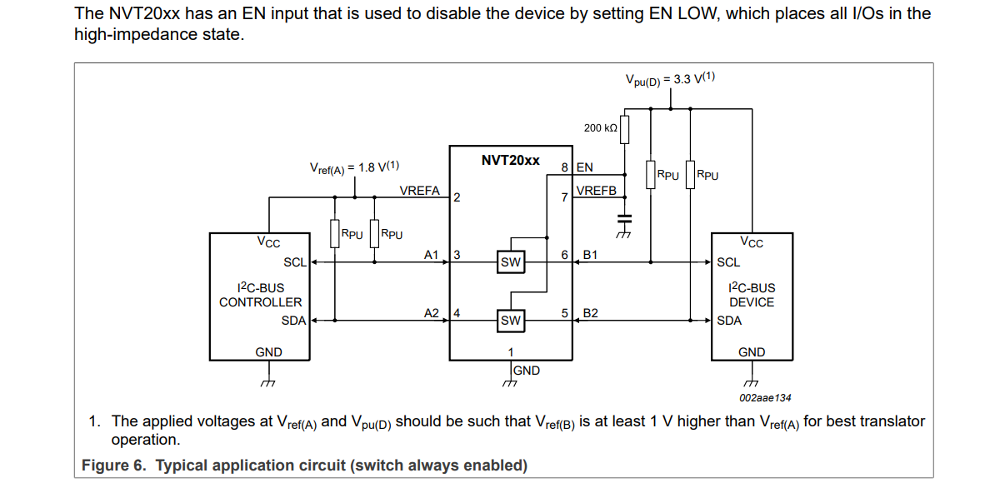
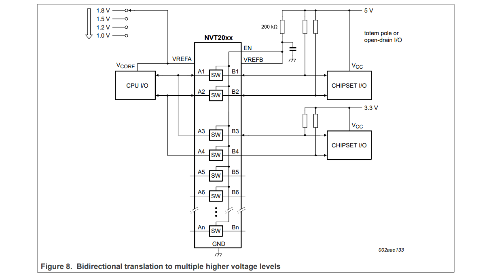

# 常见USB设计图
可参考设计资料：
- littelfuse:
    - [Why does USB 2.0 need Circuit Protection?](https://www.littelfuse.com/~/media/electronics_technical/application_notes/usb/littelfuse_why_does_usb_2_0_need_circuit_protection_application_note.pdf)
    - [Protecting the Universal Serial Bus from
Over Voltage and Overcurrent Threats](https://www.littelfuse.com/~/media/electronics_technical/application_notes/usb/littelfuse_protecting_the_universal_serial_bus_from_over_voltage_and_overcurrent_application_note.pdf)
## 1. 设计电路思维
### 1.1 限流
- 使用 PPTC 自恢复保险丝限流；
- 使用功率电子开关限流。在使用 USB hub 的电路中，一般有电源控制引脚，使用功率电子开关可以对拓展 USB 的电源进行开关控制和限流，具体设计可以参考以下数据手册：
    - TPS20xxB 系列（TI），TPS2041B 等；
    - MIC2026 系列（MICROCHIP），MIC2026-1YM 等。

## 2. 不同电压的 IIC 通讯电路设计电路
### 2.1 设计电路 1 ： 使用电压电平转换器
源自 NXP 的 NVT2001_NVT2002 芯片手册典型设计图：[NVT2001_NVT2002 Datasheet](https://www.nxp.com.cn/docs/en/data-sheet/NVT2001_NVT2002.pdf)。

立创商城所属类目: **逻辑器件 -> 转换器/电平移位器**。

- 两种电压间通讯：

- 三种电压间通讯：

很显然，使用该方法有以下有点：
- 更适用于多种不同电压的情况下使用，也适用于总线需要挂载多个设备的情况。
    
