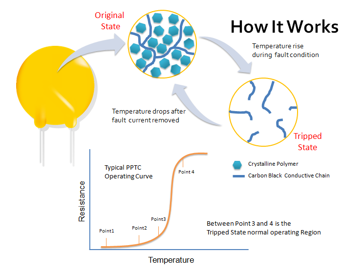
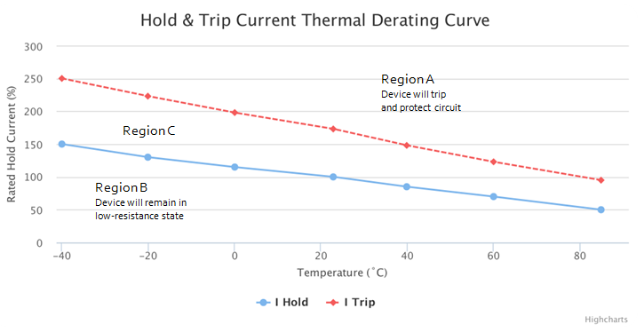

# PPTC 自恢复保险丝电路设计
参考文章：
- 富致科技:
    - [PPTC介绍](http://www.fuzetec.com.cn/technology.php?gid=1)

-  Littelfuse:
    - [Fundamentals of Resettable Functionality in PPTC Devices](https://www.littelfuse.com/~/media/electronics/technical_papers/resettable_ptcs/littelfuse_fundamentals_of_resettable_functionality_in_pptc_devices_technical_paper.pdf.pdf)
    - [Why does USB 2.0 need Circuit Protection?](https://www.littelfuse.com/~/media/electronics_technical/application_notes/usb/littelfuse_why_does_usb_2_0_need_circuit_protection_application_note.pdf)

- NXP:
    - [AN10897-A guide to designing for ESD and EMC](https://www.nxp.com.cn/docs/en/application-note/AN10897.pdf)

- nexperia：
    - [Nexperia_document_brochure_ESD-Protection-Applications_022017](https://assets.nexperia.cn/documents/brochure/Nexperia_document_brochure_ESD-Protection-Applications_022017.pdf)

国内市场占有率和排名来看，在中国市场主要厂商有TE、聚鼎科技、维安、Bourns和富致科技等。PPTC主要作用是过流保护。

## 0. PPTC 器件
### 0.1. PPTC 理论概述
高分子聚合物正温度系数材料(PPTC, PTC Thermister, PTC Variable Resister, Variable Resistance PTC Thermistor, Variable Resistor, Current Limiter)与元件之技术，为一整合先进高分子材料科学、导电材料科学及创新的制程工程、并依据电子电机基础理论设计而成。此种材料与元件的电阻值会随着温度上升而呈现剧烈的上升。当过电流与过电压二者同时或任一情况单独发生时，依据电工原理而产生热能(能量E=电流I×电压V)，元件因之发热。这样的加热状况会造成高分子的结构，由结晶相转变成非晶相结构，使得元件电阻值提升千万倍以上，并因此造成跳脱/开路(Trip/Open)的状态，进而保护了电路。而当过电流状态消除后，热能消失，元件的电阻又回复到正常状态

### 0.2. 可复式保险丝的工作原理 
利用电极或导线贴附在PPTC材料的两面，并以串联于电路上的方式保护电路。在正常的操作情况下，元件的电阻值处于极低的状态下(微殴姆)，电流可以无限制的通过PPTC元件；但是当过电流的状况产生时，PPTC元件会因此发热而使得电阻值快速上升。当电阻值快速上升到几近绝缘态时，就会将电路上的电流切断，以保护电路上其他的机构与元件，直到过电流状况去除，PPTC元件冷却后，其电阻值即下降到与其初使值相近。此时，可复式保险丝（PPTC）即“回复”到可再次通过电流的状态。
    

### 0.3. 跳闸电流和保持（工作）电流
保险丝的跳闸（逃脱）电流（IT）与工作电流（IH）数值是定义在摄氏23度的环境状况下。一般来说，跳脱电流约是工作电流的两倍。PPTC产品在正常的工作电流（IH）上或是低于工作电流的环境下使用，并不会进入开路/跳脱的状态；而在跳脱电流（IT）上或是高于跳脱电流时则进入开路/跳脱状态。然而，由于存在正温度系数（PTC）效应，跳脱电流与工作电流会随着环境温度的改变而产生剧烈的变化。例如下图所示，在摄氏85度时电流会衰减至50%，而在摄氏-40度的环境下，电流会上升至150%。
    

## 1. 重要选型参数
- I hold：维持电流；
- V max. ：可承受的最大电压；
- T trip：规定电流下的最大动作时间；
- R：一定温度下测得的零功率电阻；
- I trip：动作电流；
- I max.：可承受的最大电流；
- P d：高阻状态下的稳态功耗；
- R 1max.：经动作或回焊一小时后在室温下所测得的最大电阻值。

### 1.1. Ih 维持电流
PPTC 的维持电流定义为 PPTC 的最大不动作电流（维持电流），即在规定的环境温度(优先 25℃ )下，PPTC 始终保持
其低电阻态的最大电流。在选型时自恢复保险丝的维持电流应大于线路的正常工作电流，否则会影响线路正常工作。I h 选的太低，PPTC 会误动作，阻值会变大影响 PPTC 的使用寿命及线路的正常工作。I h 也不能选的太大，否则当异常过电流发生时 PPTC 动作电流较大，反应时间较慢，在要求的保护电流下没有动作或动作的较慢，达不到预期的保护效果。

### 1.2. Vmax 最大工作电压
Vmax 应大于或等于被保护线路的工作电压，否则容易导致 PPTC 失效。当 PPTC 处于保护状态，即高电阻状态时，被
保护电路的系统电压会加在 PPTC 的两端，PPTC 应有足够的承受能力，否则故障电流排除后 PPTC 将难以恢复到初始的低阻状态，对 PPTC 的使用寿命有影响。

### 1.3. 环境温度
PPTC 对环境温度较敏感，在较高的环境温度下，PPTC 的 Ih 要降额选取，具体可参考规格书。

### 1.4. 封装形式
有插件封装和贴片封装两大系列。贴片器件功率等级（维持电流及最大耐压值）相对于插件器件会整体小一些。

