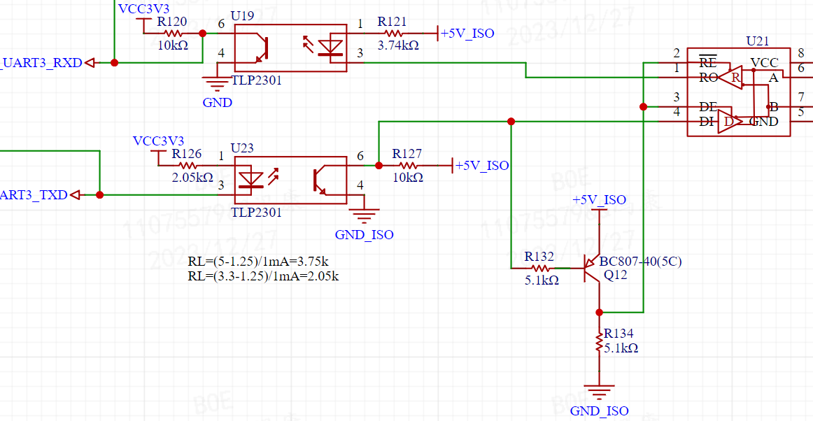
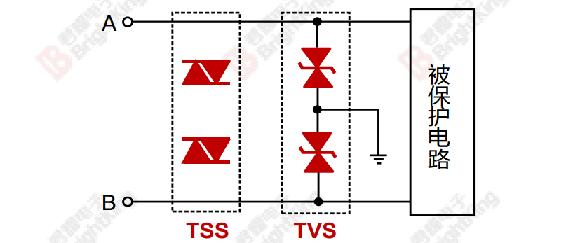
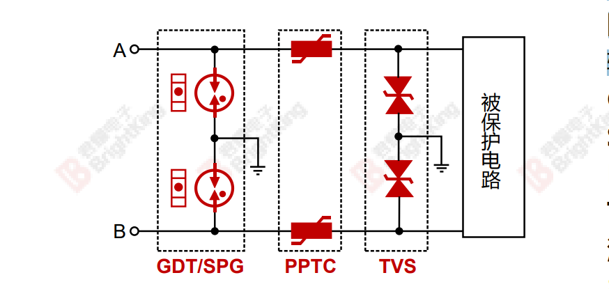
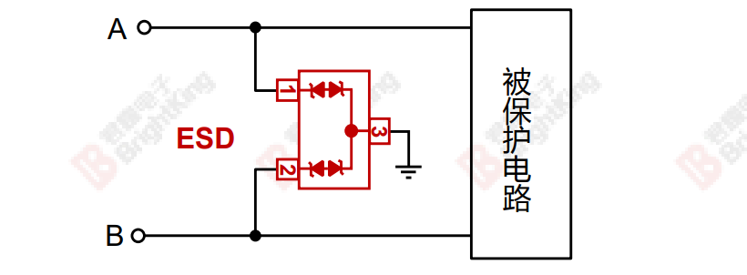
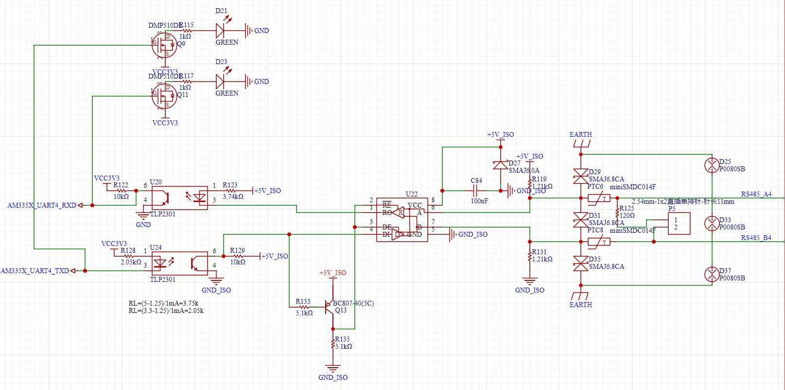

# RS485 典型电路设计

参考资料：
- TI : 
    - [ZHCAA89 应用手册 - RS-485 设计指南 (Rev. D)](https://www.ti.com.cn/cn/lit/pdf/zhcaa89)

## 1. RS485 标准
TIA/EIA-485-A是电信业使用最广泛的传输线路标准，描述了RS-485接口的物理层，通常与Profibus、Interbus、Modbus或BACnet等更高层协议配套使用，能够在相对较长的距离内实现稳定的数据传输。

然而，在实际应用中，雷击、电力线感应和直接接触、电源波动、感应开关以及静电放电会通过产生较大瞬变电压对RS-485收发器造成损害。设计人员必须确保设备不仅能在理想条件下工作，而且能够在实际可能遇到的恶劣环境下正常工作。为了确保这些设计能够在电气条件恶劣的环境下工作，各个政府机构和监管机构实施了EMC法规。如果设计的产品符合这些法规，就可以让最终用户确信它们在恶劣的电磁环境下也能正常工作。

在工业与仪器仪表应用中，常常需要在距离很远的多个系统之间传输数据。RS-485总线标准是I&I应用中使用最广泛的物理层总线设计标准之一。RS-485的应用包括过程控制网络、工业自动化、远程终端、楼宇自动化(例如、暖通空调(HVAC)、保安系统)、电机控制和运动控制。

使RS-485成为I&I通信应用理想之选的关键特性如下：
- 长距离链路 - 最长4000英尺。
- 可通过一对绞线电缆进行双向通信。
- 差分传输增加噪声抗扰度，减少噪声辐射。
- 可将多个驱动器和接收器连接至同一总线。
- 宽共模范围(−7 V至+12 V)允许驱动器与接收器之间存在地电位差。
- TIA/EIA-485-A允许数十Mbps的数据速率。

## 2. RS485的隔离设计
1. 可以使用光耦进行信号隔离，将CPU的信号与RS485转换芯片的信号进行隔离，避免电气连接，降低CPU损坏概率，该方法需要注意以下要点：
    - 光耦的选型需要考虑隔离距离、传输速率、光信号电平、开关时间等参数，需要根据光耦性能计算电阻大小；
    - 光耦的两侧在 layout 时需要特别注意地的隔离；
    

2. 可以利用数字隔离器实现485电路隔离；
3. 可以利用集成隔离485芯片实现485电路隔离。

## 3. RS485的保护电路设计
1. 浪涌保护电路：
    - 一级浪涌保护电路：采用TVS或半导体放电管TSS对RS485接口进行浪涌防护，可获得较高的浪涌防护等级。
    
    - 两级浪涌保护电路：第一级采用GDT进行防护，第二级采用TVS进行防护，在获得较高浪涌防护等级的同时，可获得较低的钳位电压。
    

2. 静电保护电路
    - 采用专用485防护ESD器件对RS485的数据线进行防护:
    

## 4. RS485的电路设计示例
1. 示例电路1：
    

