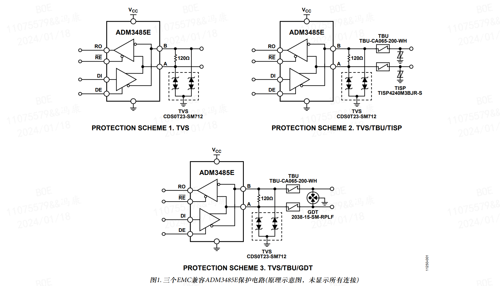
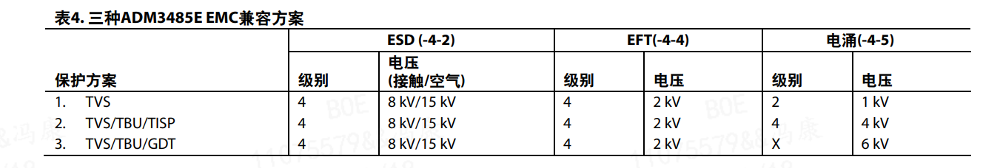
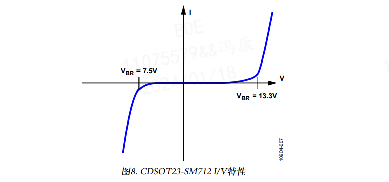
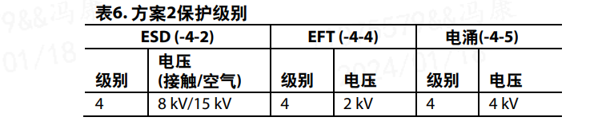
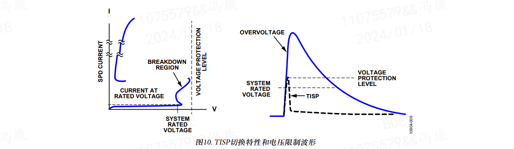
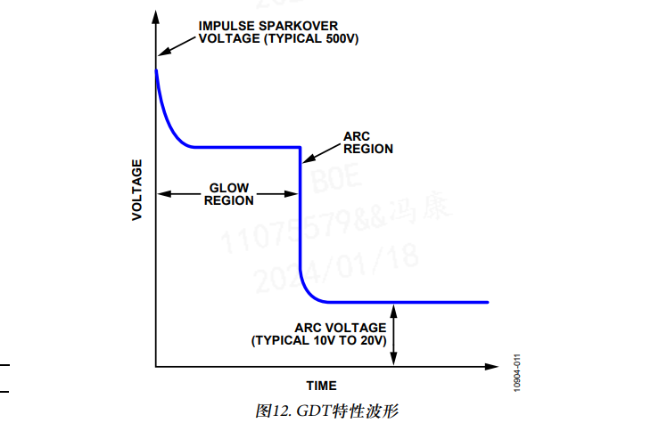

# EMC标准的 RS485 电路
参考文档：
- ADI ：
    - [电路笔记 CN-0313 - EMC COMPLIANT RS-485收发器保护电路](https://www.analog.com/media/cn/reference-design-documentation/reference-designs/CN0313_cn.pdf)
    - [AN-1161 应用笔记 - EMC兼容RS-485通信网络](https://www.analog.com/media/cn/technical-documentation/application-notes/AN-1161_cn.pdf)

## 1. RS485 标准
见 [RS485典型电路设计.md](./RS485典型电路设计.md#1-rs485-标准)

## 2. 电磁兼容性
见 [EMC设计简介.md](../EMC设计/EMC设计简介.md)

## 3. EMC 电路设计示例
EMC瞬变事件在时间上会有变化，因此保护元件必须具有动态性能，而且其动态特性需要与受保护器件的输入/输出极相匹配，这样才能实现成功的EMC设计。元件数据手册通常只包含直流数据，由于动态击穿和I/V特性可能与直流值存在很大差异，因此这些数据没有太多价值。必须进行精心设计并确定特性，了解受保护器件的输入/输出级的动态性能，并且使用保护元件，才能确保电路达到EMC标准。

本应用笔记介绍具有完整特性的三种不同EMC兼容解决方案。每种解决方案都经过独立外部EMC兼容性测试公司的认证，而且各方案针对ADI公司的ADM3485E 3.3 V RS-485收发器提供不同的成本/保护级别，并使用可选的Bourns外部电路保护元件提供增强的ESD保护。所用的Bourns外部电路保护元件包括瞬变电压抑制器(CDSOT23-SM712)、瞬变闭锁单元(TBU-CA065-200-WH)、晶闸管电涌保护器(TISP4240M3BJR-S)和气体放电管(2038-15-SM-RPLF)。

每种解决方案都经过特性测试，确保了保护元件的动态I/V性能可以保护ADM3485E RS-485总线引脚的动态I/V特性。
ADM3485E的输入/输出级之间的交互，配合外部保护元件，共同防止受到瞬变事件的损害。
    

三种方案的防护等级：

### 3.1 保护方案1——TVS
原理图见上图的 “PROTECTION SCHEME 1. TVS”。

EFT和ESD瞬变的能量级别类似，电涌波形的能量级别则高出三到四个数量级。针对ESD和EFT的保护可通过相似的方式完成，针对高级别电涌的保护解决方案则更为复杂。第一个解决方案描述四级ESD和EFT和二级电涌保护。本应用笔记描述的所有电涌测试中都使用1.2 μs/50 μs 波形。

此解决方案使用Bourns公司的CDSOT23-SM712瞬变电压抑制器(TVS)阵列，它包括两个双向TVS二极管，如图7所示。表5显示针对ESD、EFT和电涌瞬变的电压保护级别。

TVS是基于硅的器件。在正常工作条件下，TVS具有很高的对地阻抗；理想情况下它是开路。保护方法是将瞬变导致的过压箝位到电压限值。这是通过PN结的低阻抗雪崩击穿实现的。当产生大于TVS的击穿电压的瞬变电压时，TVS会将瞬变箝位到小于保护器件的击穿电压的预定水平。瞬变立即受到箝位(< 1 ns)，瞬变电流从受保护器件转移至地。

重要的是要确保TVS的击穿电压在受保护引脚的正常工作范围之外。如图8所示，CDSOT23-SM712的独有特性是具有+13.3 V和–7.5 V的非对称击穿电压，与+12 V至–7 V的收发器共模范围相匹配，从而提供最佳保护，同时最大限度地减小对ADM3485E RS-485收发器的过压应力。

### 3.1 保护方案1——TVS/TBU/TISP
原理图见上图的 “PROTECTION SCHEME 2. TVS/TBU/TISP”。

以前的解决方案可提供最高四级ESD和EFT保护，但只能提供二级电涌保护。为了提高电涌保护级别，保护电路变得更加复杂。本节介绍的保护方案最高可以提供四级电涌保护。

CDSOT23-SM712专门针对RS-485数据端口设计。以下两套解决方案基于CDSOT23-SM712构建，提供更高级别的电路保护。在此解决方案中，CDSOT23-SM712提供次级保护，TISP4240M3BJR-S则提供主保护。

主保护器件和次级保护器件之间的协调以及过流保护是利用TBU-CA065-200-WH实现的。表6显示了使用此解决方案针对ESD、EFT和电涌瞬变进行保护的相应电平。图9代表了完整的解决方案。

当瞬变能量施加于保护电路时，TVS将会击穿，通过提供低阻抗的接地路径来保护器件。由于电压和电流较高，还必须通过限制通过的电流来保护TVS。这可采用瞬变闭锁单元(TBU)实现，它是一个主动高速过流保护元件。此设计中的TBU是Bourns公司的TBU-CA065-200-WH。

TBU可阻挡电流，而不是将其分流至地。作为串联元件，它会对通过器件的电流做出反应，而不是对接口两端的电压做出反应。TBU是一个高速过流保护元件，具有预设电流限值和耐高压能力。当发生过流，TVS由于瞬变事件击穿时，TBU中的电流将升至器件设置的限流水平。此时，TBU会在不足1 µs时间内将受保护电路与电涌断开。

在瞬变的剩余时间内，TBU保持在受保护阻隔状态，通过受保护电路的电流非常小(<1 mA)。在正常工作条件下，TBU具有低阻抗，因此它对正常电路工作的影响很小。在阻隔模式下，它具有很高的阻抗以阻隔瞬变能量。在瞬变事件后，TBU自动重置到低阻抗状态，让系统恢复正常工作。与所有过流保护技术相同，TBU具有最大击穿电压，因此
主保护器件必须箝位电压，并将瞬变能量重新引导至地。

这通常使用气体放电管或固态晶闸管等技术实现，例如完全集成电涌保护器件(TISP)。TISP充当主保护器件。超过其预定义保护电压时，它提供瞬变开路低阻抗接地路径，从而将大部分瞬变能量从系统和其他保护器件转移开。

TISP的非线性电压-电流特性通过转移产生的电流来限制过压。作为晶闸管，TISP具有非连续电压-电流特性，它是由于高电压区和低电压区之间的切换动作而导致的。图10显示了器件的电压-电流特性。在TISP器件切换到低电压状态之前，它具有低阻抗接地路径以分流瞬变能量，雪崩击穿区域则导致了箝位动作。

在限制过压的过程中，受保护电路短暂暴露在高压下，因而在切换到低压保护打开状态之前，TISP器件处在击穿区域。TBU将保护下游电路，防止由于这种高电压导致的高电流造成损坏。当转移电流降低到临界值以下时，TISP器件自动重置，以便恢复正常系统运行。

如前文所述，所有三个元件协同工作，与系统输入/输出配合，一起针对高电压电流瞬变为系统提供保护。

### 3.1 保护方案1——TVS/TBU/GDT
原理图见上图的 “PROTECTION SCHEME 3. TVS/TBU/GDT”。

我们通常需要四级以上的电涌保护。图11所示的保护方案最高可针对6 kV的电涌瞬变为RS-485端口提供保护。它的工作方式类似于保护方案2；但此电路采用气体放电管(GDT)取代TISP来保护TBU，从而保护次级保护器件TVS。相对于“保护方案2”部分介绍的TISP，GDT可针对更大的过压和过流应力提供保护。此保护方案的GDT是Bourns公司的2038-15-SM-RPLF。TISP的额定电流是220 A，GDT的额定电流则是5 kA(按单位导体计算)。表7总结了此设计提供的保护级别。

GDT主要用作主保护器件，提供低阻抗接地路径以防止过压瞬变。当瞬变电压达到GDT火花放电电压时，GDT将从高阻抗关闭状态切换到电弧模式。在电弧模式下，GDT成为虚拟短路，提供瞬变开路电流接地路径，将瞬变电流从
受保护器件上转移开。

图12显示GDT的典型特性。当GDT两端的电压增大时，放电管中的气体由于产生的电荷开始电离。这称为辉光区。
在此区域中，增加的电流将产生雪崩效应，将GDT转换为虚拟短路，允许电流通过器件。在短路事件中，器件两端产生的电压称为弧电压。辉光区和电弧区之间的转换时间主要取决于器件的物理特性。

