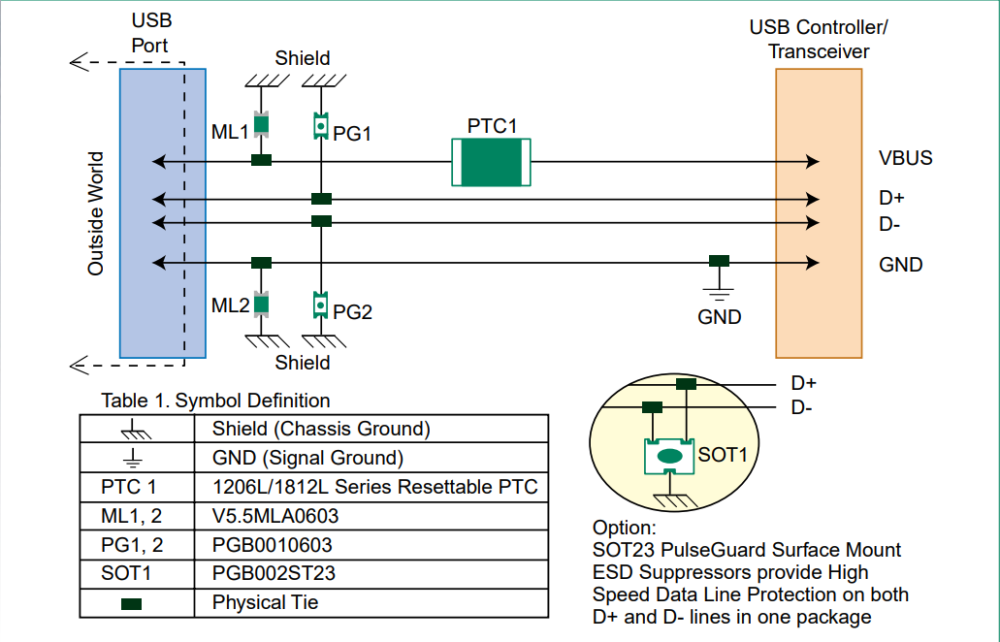

# 常见USB设计图
可参考设计资料：
- littelfuse:
    - [Why does USB 2.0 need Circuit Protection?](https://www.littelfuse.com/~/media/electronics_technical/application_notes/usb/littelfuse_why_does_usb_2_0_need_circuit_protection_application_note.pdf)
    - [Protecting the Universal Serial Bus from
Over Voltage and Overcurrent Threats](https://www.littelfuse.com/~/media/electronics_technical/application_notes/usb/littelfuse_protecting_the_universal_serial_bus_from_over_voltage_and_overcurrent_application_note.pdf)
## 1. 设计电路思维
### 1.1 限流
- 使用 PPTC 自恢复保险丝限流；
- 使用功率电子开关限流。在使用 USB hub 的电路中，一般有电源控制引脚，使用功率电子开关可以对拓展 USB 的电源进行开关控制和限流，具体设计可以参考以下数据手册：
    - TPS20xxB 系列（TI），TPS2041B 等；
    - MIC2026 系列（MICROCHIP），MIC2026-1YM 等。

## 2. 设计电路
### 2.1 设计电路 1
源自 littelfuse 的设计图。

电路中：
- ML1,2 是压敏电阻。作用是过压保护，发生过压时钳位到较低电压。
- PG1,2 是 ESD 保护二极管。作用是过压保护。
- SOT1 是 ESD 保护二极管（高速信号用）。作用是过压保护。
- PTC1 是自恢复保险丝。作用是过流保护。
    
