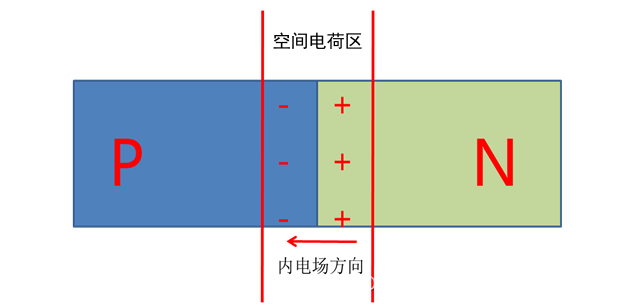
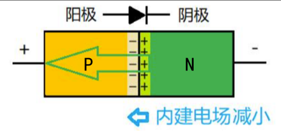
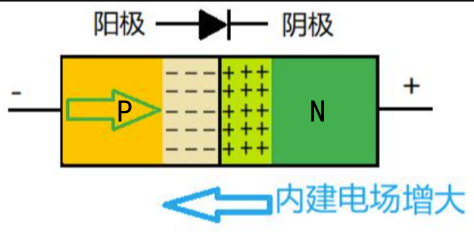
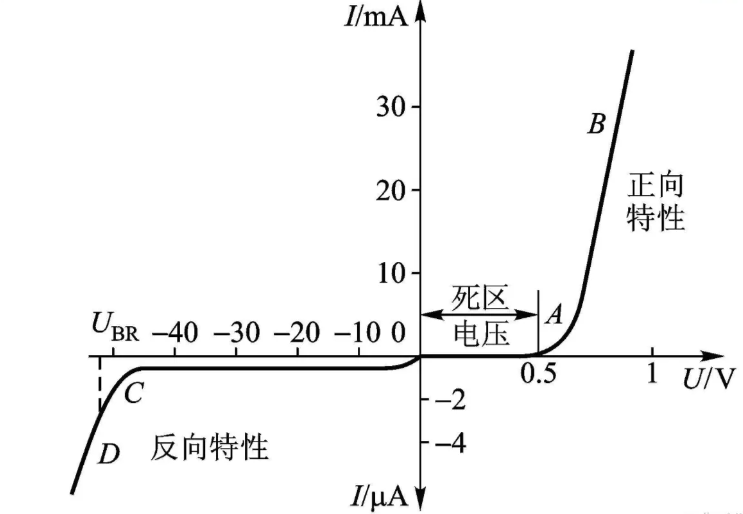

# 二极管的工作原理
二极管是一种具有单向导电特性的器件，其本质是一个封装了的PN结。

根据导电材料的不同，可分为两种类型：硅二极管（硅管）和锗二极管（锗管）。

## 1. 基础原理
在 PN 结的原理学习中需要用到一些基本的物理、化学知识：

- **半导体** ：导电性能介于导体和绝缘体之间的物质。
    - 物质的导电性能是由它的内部原子结构所决定的，原子对电子的束缚能力越强，越不容易失去电子，也就越不容易形成自由电子，从而导电性能越差，同理原子对电子的束缚能力越弱，就越容易失去电子，也就容易形成自由电子，从而导电性能越好，比如低价元素容易失去电子形成自由电子因此它容易导电是导体，而高价元素不容易失去电子，无自由电子的形成因此不容易导电。因此中间元素（如四价元素硅）对电子的束缚能力介于导体与绝缘体之间因此常被制成半导体。

- **自由电子** ：价电子在热运动（热激发）的作用下，获得能量挣脱原子的束缚成为自由电子。

- **空穴** ：价电子在热运动（热激发）的作用下，获得能量挣脱原子的束缚成为自由电子的同时在共价键中留下一个空位置，称为空穴，原子因失去一个电子而带正电，所以一般我们也说空穴带正电荷。

- **多子** ：即多数载流子。 

- **少子** ：即少数载流子。

- **载流子** ：简单地说就是运载电荷物质，可以是自由电子或空穴。

- **内电场** ：当N型和P型半导体接触时，由于自由载流子（电子和空穴）浓度的不平衡，会在PN结界面附近形成内电场。内电场的方向从N型区指向P型区，以平衡两种载流子的浓度差。

- **耗尽层** ：内电场的作用是移除PN结附近的自由载流子，形成一个耗尽层，其中载流子浓度接近于零。耗尽层的宽度取决于PN结的掺杂浓度和温度。掺杂浓度越高，耗尽层越宽；温度越高，耗尽层越薄。

- **扩散运动** ：物质总是从高浓度流向低浓度，载流子这种由于浓度差而产生的运动称为扩散运动。

- **漂移运动** ：载流子在电场力作用下的运动称为漂移运动。

## 2. 二极管的结构和原理
### 2.1. 二极管内部结构

二极管其实就是一个封装好了的 PN 结，有 P 型半导体和和 N 型半导体结合组成，如下图所示：

- 蓝色区域为 N 型半导体：
    - N 型半导体就是在本征半导体（也就是纯净的硅片）上掺杂五价元素（如磷）形成的半导体，磷原子 P 取代了纯净硅片上的硅原子 Si 。
    - 因为磷原子最外层带五个电子，与最外层带四个电子的硅原子形成共价键，形成 8 电子的稳定结构后，将会剩下一个带负电荷的电子，而“负”在英文中为 Negative ，因此此种半导体就称为 N 型半导体。
    - 其多子是自由电子，少子是空穴。

- 黄色区域为P型半导体:
    - P型半导体就是在本征半导体（也就是纯净的硅片）上掺杂三价元素（如硼）形成的半导体，硼原子取代了纯净硅片上的硅原子。
    - 因为硼原子最外层只带三个电子，与最外层带四个电子的硅原子形成共价键，形成 8 电子的稳定结构后，将会产生一个带正电荷的空穴，而“正”在英文中为 Positive ，取名 P 型半导体。
    - 其多子是空穴，少子是自由电子。

- 注意：
    - P 型半导体内部不全是空穴，也有自由电子，只是没有 N 型半导体那么多。
    - 虽然P型有空穴，N型有自由电子，但 P型、N型半导体整体电性为中（自由电子和空穴都会和原子核形成静电平衡）。

### 2.2. 二极管的内电场
P 型半导体和和 N 型半导体结合组成 PN 结后，由于浓度差的存在，P 区的带正电荷多子空穴必然流入低浓度的 N 区中与 N 区的自由电子结合。N 区中的带负电荷的多子自由电子必然流入低浓度的 P区中与P区的空穴结合，（它们两的电流方向一致，也即 PN 结中电流是其两者相加。）

P 区因为空穴的流入 N 区将在靠近 N 区的一面形成负离子区，N 区因为自由电子的流入 P 区将在靠近 P 区的一面形成正离子区，这一正负离子区合称空间电荷区（也称耗尽层）。

空间电荷区将形成内电场（会使得载流子产生漂移运动）将阻碍扩散运动，两种运动相互作用于载流子，载流子则会呈现一种平衡状态。

### 2.3. 二极管的的导通原理
- **PN 结的正向导通** ：
    - 在 PN 结上加正向偏置电压。将会打破上述的平衡状态，外电场将抵消内电场，此时 PN 结中的多子（ P 区的多子空穴与 N 区的多子自由电子的总和）将会从 P 区到 N 区运动形成导通电流。
    - 正向偏置电压要达到一定条件（硅为0.7V，锗为0.3V）才能抵消内电场（部分抵消则为不完全开启，抵消则为完全开启），才能导通（这也是二极管为什么要开机启电压的根本原因）。
    - 

- **PN 结的反向截止** ：
    - 在 PN 结上加反向偏置电压。将会打破上述的平衡状态，外电场与内电场叠加，此时 PN 结中的少子（ P 区的少子自由电子与 N 区的少子空穴的总和）将在叠加后电场的作用下产生漂移运动将会从 N区到 P区运动）。
    - 因为少子很少即便所有的少子都参加漂移运动，反向电流也很小，在实际情况下忽略不计。因此认为PN结加反向电压时将截止，不导通。
    - 

### 2.4. 二极管的击穿
- **齐纳击穿** ：
    - 因为 PN结掺杂浓度高，使其耗尽层很薄，根据电场强度 E=u/d，但 d很小时，很小的反向电压u 都会产生很大的电场强度，随着强电场的作用下，将直接破坏共价键以致生产更多的空穴与自由电子对，形成大的电路流，PN将因此烧坏。

- **雪崩击穿** ：
    - 根据电场强度 E=u/d，当反向电压很大时，电场强度也将增大，此时 PN结中的少子漂移运动的速度将很快，撞击在共价键中将破坏共价键，从而产生空穴和自由电子对，反向电流将增大，PN结有可能将因此烧坏。

- **热击穿** ：
    - 齐纳击穿和雪崩击穿，这两种击穿是可逆的。还有一种击穿，是反向电流限制不住，导致PN结过热，直接烧毁，称为热击穿，热击穿不可逆。

### 2.5. 二极管的结电容
PN结的电荷量，根据外加电场的变化而变化，这种现象呈现电容效应，称为结电容Cj。结电容影响 PN结的工作频率，在高速开关状态下，可能会导致PN结的单向导电性变差。结电容又可以分为势垒电容Cb和扩散电容Cd（Cj=Cb+Cd）。

- **势垒电容** ：此值大小与PN结的截面面积成正比，与空间电荷区厚度成反比。且此值只有在外加电路变化时，才起作用。外加电压频率越高，势垒电容作用越明显。

- **扩散电容** ：此值只在正向偏置时起作用。正向偏置电压越高，非平衡少子越多。扩散电容越明显。

结电容由势垒电容与扩散电容组成，PN结面积越大，它能承受的电流也就越大，但同时其结电容也就越大，因此面积大的 PN结适合用于大电流，低频电流中，如整流管。

PN结面积越小，它能承受的电流也就越小，其结电容越小，因此面积小的 PN结适合用于小电流，高频电流中，如脉冲数字电路中的开关管。

## 3. 二极管的伏安特性
当加在二极管上的正向电压较小时，正向电流几乎等于零。只有当二极管两端电压超过某一数值Uon 时，正向电流才明显增大。将 Uon称为死区电压。

死区电压与二极管的材料有关。一般硅二极管的死区电压为0.5V-0.7V左右，锗二极管的死区电压为0.2V-0.3V左右。

