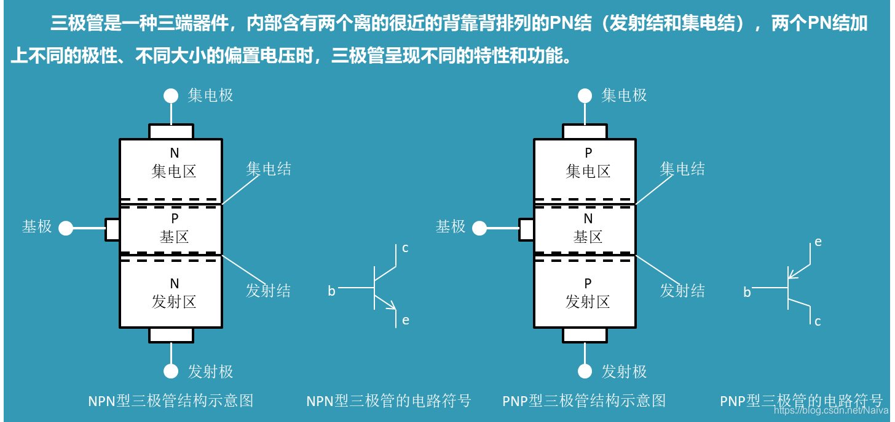

# 三极管的工作原理

## 1. 三极管
三极管全称是“晶体三极管”，也被称作“晶体管”，是一种具有放大功能的半导体器件。通常指本征半导体三极管，即BJT管。

典型的三极管由三层半导体材料，有助于连接到外部电路并承载电流的端子组成。施加到晶体管的任何一对端子的电压或电流控制通过另一对端子的电流。

## 2. 三极管的结构
### 2.1. 三极管的组成

三极管是电流放大器件，有三个极，分别叫做集电极C，基极B，发射极E。分成NPN和PNP两种。
- 基极：用于激活晶体管。（名字的来源，最早的点接触晶体管有两个点接触放置在基材上，而这种基材形成了底座连接。）
- 集电极：三极管的正极。（因为收集电荷载体）
- 发射极：三极管的负极。（因为发射电荷载流子）

### 2.2. NPN 三极管的内部结构
晶体三极管是 P型和 N型半导体的有机结合，两个 PN结之间相互影响，可以是NPN组合，也或以是PNP组合，使 PN结功能发生了质的飞跃。

三极管内部：
- 发射区高掺杂，即发射区与集电区相比具有杂质浓度高出数百倍（导电能力比基区、集电区强得多）。
    - 发射区的高掺杂是为了保证有足够多的自由电子（或空穴）从发射区流向集电区。
- 基区很薄（中间存不住很多电子（PNP型）或者空穴（NPN型）），且参杂的杂质浓度较低。
    - 其中基区做的很薄是为了让发射区的自由电子（或空穴）更容易穿过基区，进入集电区；
    - 基区参杂的浓度较低是为了形成较少的基极电流 Ib ，让更多的自由电子（或空穴）流向集电区。
    - 由于发射区流出的自由电子（或空穴）的数量是一定的，如果基区参杂的杂志浓度过高，可能会导致进入基极的自由电子（或空穴）过多，基极电流 Ib 过大，从而使进入集电区的自由电子（或空穴）变少。
- 集电区做的面积最大，参杂的杂质浓度没有发射区高。

下图以 NPN三极管为例，PNP三极管结构类似。

e–b间的PN结叫发射结，c–b间的PN结叫集电结，b是两个PN结的公共电极。三极管导电方向由发射结的方向来决定。

三极管有从发射极流入和从发射极流出两种导电形式。为了区别这两种形式，规定箭头从e极指向b极的三极管表示PNP型。

在NPN型三极管中，发射极通过注入载流子（电子）来提供电流，而在PNP型中，发射极通过注入空穴来提供电流。

## 3. 三极管的工作原理
三极管的内部结构设计导致三极管的正常工作状态有三个，放大、截止、饱和。

### 3.1. 三极管截止状态的工作原理
当三极管的发射结反偏，且集电结也反偏时，此时，三极管就会进入截止状态。此时三极管的电流非常小，通常认为为零。在截止状态下，三极管不会放大信号，也不会作为开关使用。

- **发射结反偏** （Emitter Reverse Bias）：
    - 当发射结两端的电压为正（对于NPN型）或负（对于PNP型）时，发射结处于反偏状态。在这种情况下，发射结中的载流子（电子或空穴）不容易通过，因此发射结基本不导电。
    - 发射结两端的电压方向与PN结的扩散电势相反，导致PN结内电场增强，阻止电子或空穴的扩散。
    - 基极电流（Ib）也非常小，几乎为零。
    - 发射结电流（Ie）非常小，几乎为零。

- **集电结反偏** （Collector Reverse Bias）：
    - 当集电结两端的电压为负（对于NPN型）或正（对于PNP型）时，集电结处于反偏状态。在反偏条件下，集电极附近的载流子（电子或空穴）不容易到达集电极，因此集电极的电流非常小。
    - 集电结两端的电压方向与PN结的扩散电势相反，导致PN结内电场增强，阻止电子或空穴的扩散。
    - 集电结电流（Ic）也非常小，几乎为零。

**截止状态的应用** ：三极管的截止状态常用于防止不必要的电流流动，或者作为电路中的开关来控制电流的流向。例如，在数字电路中，三极管可以用作开关，在信号为低电平时截止，防止电流流向负载；在信号为高电平时，三极管导通，允许电流流向负载。

**截止状态的微观现象** ：以 NPN 为例：
- 当发射极E 与基极B 之间施加反向偏置电压，没有外部电压施加，发射结反偏。
    - 发射结的内电场迅速增强，耗尽层变宽，阻止自由电子穿过发射结进入基区，发射结截止，因此发射结电流（Ie）几乎为零。
- 当发射极E 与集电极C 之间施加反向偏置电压，没有外部电压施加，发射结反偏。
    - 内电场增强，耗尽层变宽，阻止了电子从基极向集电极的流动，因此集电结电流（Ic）几乎为零。

### 3.2. 三极管放大状态的工作原理
当三极管的发射结处于正向偏置状态，且集电结也正向偏置状态，此时，三极管处于放大状态，三极管能够有效地放大输入信号。在这个状态下，基极上的小变化电流可以控制集电极上的大电流，从而实现信号的放大。集电结电流（Ic）增大

- **发射结正向偏置** （Emitter Forward Bias）：
    - 当发射结两端的电压为负（对于NPN型）或正（对于PNP型）时，发射结处于正向偏置状态。在正向偏置条件下，发射结中的载流子（电子或空穴）容易通过，因此发射结导电。
    - 两端的电压方向与PN结的扩散电势相同，减弱PN结内电场，允许电子或空穴的扩散。
    - 基极电流（Ib）也增大，但其绝对值远小于Ie和Ic。

- **集电结正向偏置** （Collector Forward Bias）：
    - 当集电结两端的电压为正（对于NPN型）或负（对于PNP型）时，集电结处于正向偏置状态。在正向偏置条件下，集电极附近的载流子（电子或空穴）容易到达集电极，从而在集电极和发射极之间形成较大的电流。
    - 集电结两端的电压方向与PN结的扩散电势相同，减弱PN结内电场，允许电子或空穴的扩散。
    - 集电结电流（Ic）增大，但仍然小于发射结电流（Ie）。

**放大状态的应用** ：常用于信号放大，如音频放大器、射频放大器等。在放大状态下，三极管可以有效地将输入的弱小信号转换成输出端的较大信号。

**放大状态的微观现象** ：以 NPN 三极管为例：
- 当发射极E 与基极B 之间施加正向偏置电压，基极接入正极电压。
    - 在正向偏置电压的作用下，基极B 会吸引出基区的自由电子，会形成一个空穴。
    - 在正向偏置的作用下，发射结的内电场减弱，耗尽层变得很窄，发射区的自由电子会更容易通过耗尽层进入。
    - 当基区失去自由电子形成一个空穴后，由于发射区的高浓度参杂，加上偏置电压的作用，会有数倍数量（β 倍）的自由电子穿过耗尽层抢占基区形成的空穴。由于空穴数量远小于自由电子数量，空穴与其中一个自由电子结合后，多余的自由电子会留在基区。
- 此时如果集电极C 与基极B 之间也接入了正向偏置电压，集电极接入正极电压。
    - 在正向偏置电压的作用下，集电结保持正向偏置状态，内电场减弱，耗尽层变得很窄，基区的自由电子会更容易通过耗尽层进入集电区。
    - 正向偏置电压的作用下，集电极C 会吸引集电区的自由电子朝集电极聚集，集电区的自由电子浓度会变低。
    - 在电场作用下，基区多余的自由电子会穿过集电结，漂移到自由电子浓度降低的集电区，进而被吸引到集电极，回到电源，形成大电流。
- 当发射极E 与基极B 之间施加正向偏置电压增大，电源会吸引基区的自由电子到电源正极，形成更多的空穴，使得发射区会有更多的自由电子通过耗尽层抢占基区的空穴，也就会有更多的自由电子进入到集电极。
- 电流的方向与自由电子运动的方向相同，上述现象可以总结为：
    - 当 Vbe 与 Vce 同时施加正向电压时，如果 Vbe 增加时，流入基极电流 Ib 也会增大，同时流入集电极电流 Ic 也会增大，且 Ic = β * Ib 。
    - 当 Vbe 与 Vce 同时施加正向电压时，电源负极都连接在发射极，所以流出电流 Ie = Ib + Ic 。

### 3.3. 三极管饱和状态的工作原理
当三极管的发射结处于正向偏置，集电结处于反向偏置状态，此时三极管的集电极电流达到一个恒定值，这个恒定值成为饱和电流，不再随输入信号的变化而变化。在这个状态下，三极管处于饱和状态，三极管可以作为开关使用，控制电流的流向。

- **发射结正向偏置** （Emitter Forward Bias）：
    - 当发射结两端的电压为负（对于NPN型）或正（对于PNP型）时，发射结处于正向偏置状态。在正向偏置条件下，发射结中的载流子（电子或空穴）容易通过，因此发射结导电。
    - 两端的电压方向与PN结的扩散电势相同，减弱PN结内电场，允许电子或空穴的扩散。
    - 基极电流（Ib）增大，但其绝对值远小于Ie和Ic。

- **集电结反向偏置** （Collector Reverse Bias）：
    - 当集电结两端的电压为正（对于NPN型）或负（对于PNP型）时，集电结处于反向偏置状态。在反向偏置条件下，集电极附近的载流子（电子或空穴）不容易到达集电极，因此集电极的电流受到限制。
    - 集电结两端的电压方向与PN结的扩散电势相反，导致PN结内电场增强，阻止电子的扩散。
    - 集电结电流（Ic）达到饱和值，不再随基极电流（Ib）的变化而变化。

**饱和状态的应用** ：常用于开关电路，如数字电路中的逻辑门，以及模拟电路中的稳压器等。在饱和状态下，三极管可以作为开关使用，控制电流的流向。

### 3.4. 不同状态下电流 Ic 的对比
下图为某个三极管的静态特征，在不同的 Ib 条件下，三极管的集电极电流 Ic 随输入信号的变化而变化。

- 图中：
    - Ib > 10 mA 区域未画出的曲线为饱和区。
    - Ib < 10 mA 且 Ib > 1mA 的曲线为放大区。
    - Ib < 1 mA 区域未画出的曲线为截止区。

## 4. 三极管的应用注意事项
### 4.1. 适当添加限流电阻
在实际的应用电路中，一般会加入限流电阻以保护电路的正常运行：

- 添加集电极限流电阻 RL ，限制集电极电流的最大值，保护集电极可能连接的其他电路部分，当基极电流再增大时，集电极电流已不会再增大；
- 添加基极限流电阻 RB，三极管在开关（截止/饱和）电路中，避免 IB 电流变得很大，造成前级电路或者是三极管损坏。

    

### 4.2. 基极-发射极电阻（Rbe）
其作用包括：
- 
- 稳定偏置电流：通过 Rbe ，可以限制基极电流的大小，使得在不同的工作条件下，基极电流保持在所需的范围内，从而稳定偏置。
- 控制放大特性：基极电流的大小直接影响集电极电流的增益，因此通过调节 Rbe 的大小可以调节放大特性，使得三极管在不同的应用场合下有不同的放大倍数。
- 保护结构：Rbe 可以限制基极电流，防止过大的电流损坏三极管结构，提高设备的可靠性和稳定性。

总的来说，基极和发射极之间的大电阻起到了稳定偏置、控制放大特性和保护结构的作用，是NPN三极管正常工作的关键组成部分之一。