# MOS 管的工作原理

## 1. MOS 管的种类和结构
### 1.1. MOS 管的分类
MOS管是FET的一种（另一种为JFET结型场效应管），主要有两种结构形式：N沟道型（NPN）和P沟道型（PNP）；

又根据场效应原理的不同，分为耗尽型和增强型两种。
- 耗尽型：
    - 在不通电情况下，两块N型（或P型）半导体间**具有**N沟道（或P沟道）；
    - 当栅压为零时有较大漏极电流；
- 增强型：
    - 在不通电情况下，两块N型（或P型）半导体间**没有**N沟道（或P沟道）；
    - 当栅压为零，漏极电流也为零，必须再加一定的栅压之后才有漏极电流。

因此，MOS管可以被制构成P沟道增强型、P沟道耗尽型、N沟道增强型、N沟道耗尽型4种类型产品。符号绘制如下：

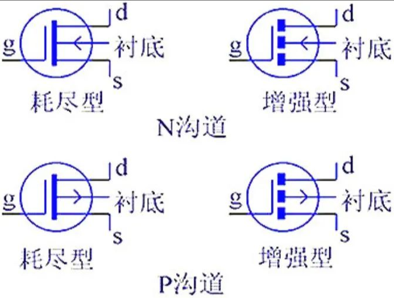

### 1.2. MOS 管的结构
每一个MOS管都提供有三个电极：Gate栅极（表示为“G”）、Source源极（表示为“S”）、Drain漏极（表示为“D”）。接线时，对于N沟道的电源输入为D，输出为S；P沟道的电源输入为S，输出为D；且增强型、耗尽型的接法基本一样。

MOS管的基本结构如下图所示：

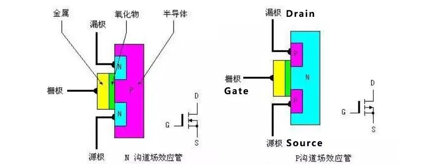

从结构图可发现，N沟道型场效应管的源极和漏极接在N型半导体上，而P沟道型场效应管的源极和漏极则接在P型半导体上。场效应管输出电流由输入的电压（或称场电压）控制，其输入的电流极小或没有电流输入，使得该器件有很高的输入阻抗，这也是MOS管被称为场效应管的重要原因。

## 2. MOS 管的工作原理
### 2.1. 增强型 N（沟道）MOS管的工作原理
#### 2.1.1. 内部结构:
在P型半导体上生成一层 SiO2 薄膜绝缘层，然后用光刻工艺扩散两个高掺杂的N型区，从 N型区引出电极（漏极D、源极S）；

- **栅极（G）** ：在源极和漏极之间的 SiO2 绝缘层上镀一层金属铝作为栅极G；
- **衬底（B）** ： P型半导体称为**衬底**，用符号 B（Bulk）表示。
- **源极（S 极）**：源极是 MOSFET 的一个极，它通过金属连接实现与半导体的衬底相连（也可以通过其他形式的连接实现）。源极与通道（Channel）之间有一段导电区域。源极是 MOSFET 中电流输入的地方，它与衬底相连，用于提供电荷载流子。
- **漏极（D 极）**：漏极是另一个极，位于源极的另一端。当 MOSFET 工作时，电流从源极进入通道，然后通过漏极流出。漏极是 MOSFET 中电流输出的地方，它接收经过通道的电流，并输出到外部电路中。

    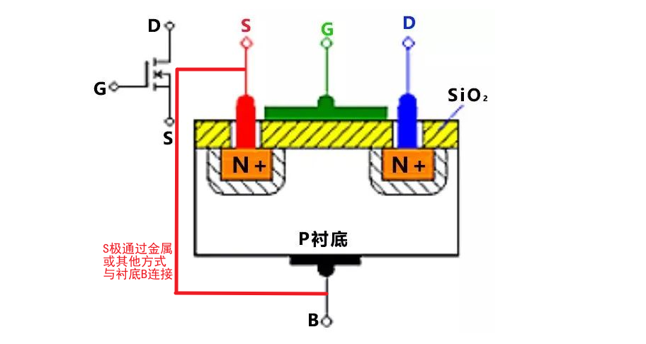

由于栅极G 与其它电极之间是相互绝缘的，所以NMOS又被称为绝缘栅型场效应管。

#### 2.1.2. 工作原理:
当 `Vgs = 0` 时：即栅极G和源极S之间不加任何电压时：
- 由于漏极和源极两个 N+型区之间隔有P型衬底，相当于两个背靠背连接的PN结，相当于两个PN结都处于反向偏置状态，阻止电流流过，即D、S之间不具备导电的沟道。
- 此时，无论在漏、源极之间加何种极性的电压，都不会产生漏极电流 ID。

当 `Vgs ＞ 0` 时：即在栅极G和源极S之间加正电压时：
- 如图（a）所示，由于衬底B与源极S短接，在栅极G与衬底B之间会产生一个由栅极指向衬底的电场。衬底B的金属铝与栅极G的金属铝形成类似电容的结构，“电容”通电后，栅极G下方的半导体表面形成正电荷层，这个正电荷层会吸引衬底中的自由电子。
- 在这个电场的作用下，P衬底表面附近的空穴受到排斥将向下方运动，电子受电场的吸引向衬底表面运动，与衬底表面的空穴复合，形成了一层耗尽层。
- 如果进一步提高 VGS 电压，使 VGS 达到某一电压 VT 时，P衬底表面层中空穴全部被排斥和耗尽，而自由电子大量地被吸引到表面层，由量变到质变，使表面层变成了自由电子为多子的 N型层，称为“反型层”，如图（b）所示。
- 反型层将漏极D 和源极S 两个 N+型区相连通，构成了漏、源极之间的 N型导电沟道。把开始形成导电沟道所需的VGS值称为阈值电压或开启电压，用 `Vgs(th)` 表示。显然，只有 `Vgs > Vgs(th)` 时才有沟道，而且 Vgs 越大，沟道越厚，沟道的导通电阻越小，导电能力越强；“增强型”一词也由此得来。

    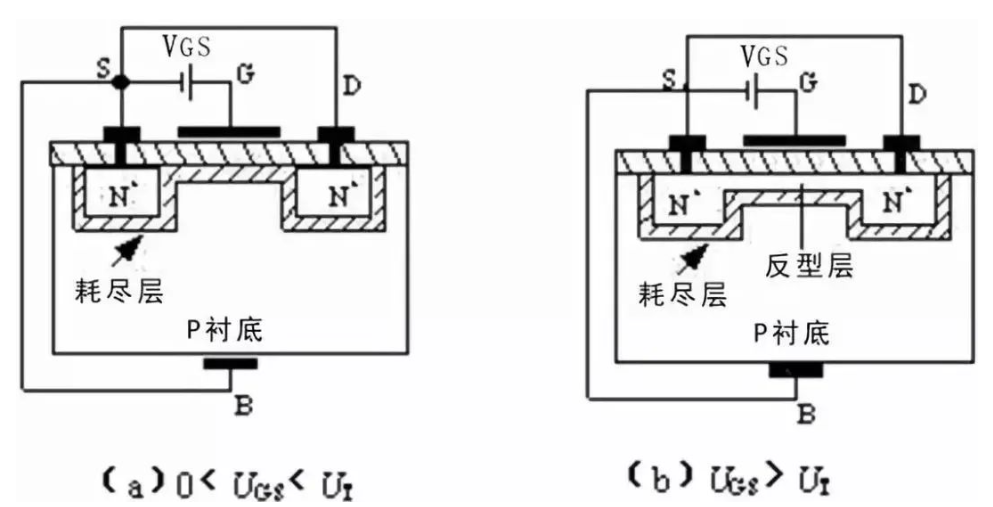

当 `Vgs ＞ Vgs(th)` 时，形成N沟道：
- 如果在漏极D 和源极S 之间加上正电压 `Vds` ，导电沟道就会有电流流通。
- 漏极电流由漏区流向源区，因为沟道有一定的电阻，所以沿着沟道产生电压降，使沟道各点的电位沿沟道由漏区到源区逐渐减小，靠近漏区一端的电压 `Vgd` 最小，其值为 `Vgd = Vgs - Vds` ，相应的沟道最薄；靠近源区一端的电压最大，等于 `Vgs` ，相应的沟道最厚。这样就使得沟道厚度不再是均匀的，整个沟道呈倾斜状。
- 随着 `Vds` 的增大，靠近漏区一端的沟道越来越薄。
- **沟道“预夹断”**：当 `Vds` 增大到某一临界值，使 **`Vgd ≤ Vgs(th)`** 时，漏端的沟道消失，只剩下耗尽层，把这种情况称为沟道“预夹断”，如图（a）所示。
- **沟道“夹断”**：继续增大 `Vds` ，即 **`Vds>Vgs-Vgs(th)`**，夹断点向源极方向移动，如图（b）所示。
- 尽管夹断点在移动，但沟道区（源极S到夹断点）的电压降保持不变，仍等于 `Vgs - Vgs(th)`。因此， `Vds` 多余部分电压 (`Vds - (Vgs - Vgs(th))`) 全部降到夹断区上，在夹断区内形成较强的电场。这时电子沿沟道从源极流向夹断区，当电子到达夹断区边缘时，受夹断区强电场的作用，会很快的漂移到漏极。

    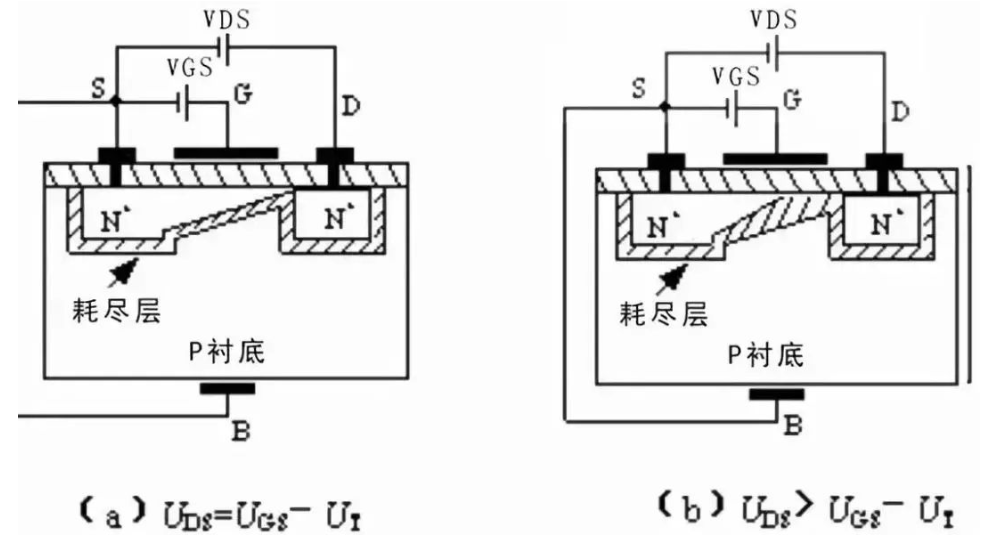

### 2.2. 增强型 P（沟道）MOS管的工作原理
#### 2.2.1. 内部结构:
P沟道增强型MOS管因在N型衬底中生成P型反型层而得名，其通过光刻、扩散的方法或其他手段，在N型衬底（基片）上制作出两个掺杂的P区，分别引出电极（源极S和漏极D），同时在漏极与源极之间的 SiO2 绝缘层上制作金属栅极G。其结构和工作原理与N沟道MOS管类似；只是使用的栅-源和漏-源电压极性与N沟道MOS管相反。

在正常工作时，P沟道增强型MOS管的衬底必须与源极相连，而漏极对源极的电压 `Vds` 应为**负值**，以保证两个P区与衬底之间的PN结均为反偏，同时为了在衬底顶表面附近形成导电沟道，栅极对源极的电压也应为负。

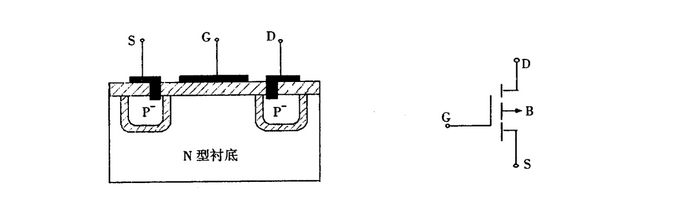

#### 2.2.2. 工作原理:
1. 当 `Vgs(th) < Vgs < 0` ，在栅源之间刚开始加较小的负电压：
    - `Vds = 0` ，由于绝缘层的存在，故没有电流。
    - 此时金属栅极被补充电而聚集负电荷，N型半导体中的多子电子被负电荷排斥向体内运动，表面留下带正电的离子，形成耗尽层。

2. 当 `Vgs(th) = Vgs ` ：
    - 随着G、S间负电压的增加，耗尽层加宽，当 `Vgs` 增大到一定值时，衬底中的空穴（少子）被栅极中的负电荷吸引到表面，在耗尽层和绝缘层之间形成一个P型薄层，称反型层，如图（2）所示。
    - 这个反型层就构成漏源之间的导电沟道，这时的 `Vgs` 称为开启电压 `Vgs(th)` 。
    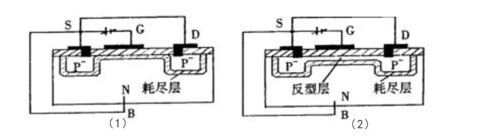

3. 当`Vgs < Vgs(th)` 时，栅源之间施加足够大的负电压：
    - 达到 `Vgs(th)` 后再增加，衬底表面感应的空穴越多，反型层加宽，而耗尽层的宽度却不再变化，这样我们可以用 `Vgs` 的大小控制导电沟道的宽度。

4. 当导电沟道形成以后，D、S间加负向电压时，在源极与漏极之间将有漏极电流 `Id` 流通，而且 `Id` 随 `Vds` 的电压增大而增大， `Id` 沿沟道产生的压降使沟道上各点与栅极间的电压不再相等，该电压削弱了栅极中负电荷电场的作用，使沟道从漏极到源极逐渐变窄，如下图（1）所示。

    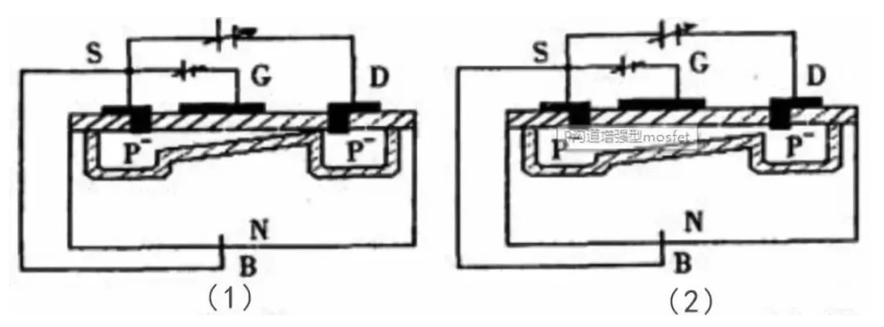

    - **预夹断** ：当 `Vds` 增大到使 `Vgd = Vgs` （即 `Vds = Vgs - Vgs(th)` ），沟道在漏极附近出现预夹断，如上图（2）所示。
    - **夹断** ：再继续增大 `Vds` ，夹断区只是稍有加长，而沟道电流基本上保持预夹断时的数值，其原因是当出现预夹断时再继续增大 `Vds` ， `Vds` 的多余部分就全部加在漏极附近的夹断区上，故形成的漏极电流 `Id` 近似与 `Vds` 无关。

### 2.3. 耗尽型 NMOS 管的工作原理
#### 2.3.1. 内部结构:
耗尽型MOS管的结构与增强型MOS管结构类似，只有一点不同，就是：**耗尽型MOS管在栅极电压 Vgs=0 时，沟道已经存在**。

这是因为在制造过程中采用离子注入法预先在D、S之间衬底的表面、栅极下方的SiO2绝缘层中掺入了大量的金属正离子，该沟道亦称为初始沟道。

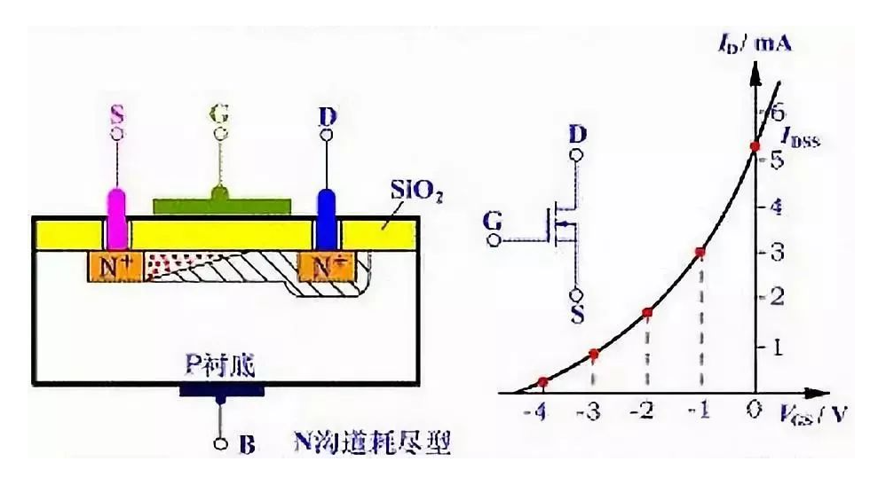

#### 2.3.2. 工作原理:
以 N沟道耗尽型MOS管为例：
- 当 `Vgs = 0` 时，这些正离子已经感应出反型层，形成了沟道，所以只要有漏源电压，就有漏极电流存在；
- 当 `Vgs > 0` 时，将使 `Id` 进一步增加；
- 当 `Vgs < 0` 时，随着 `Vgs` 的减小，漏极电流逐渐减小，直至 `Id = 0` 。对应 `Id = 0` 的 `Vgs` 称为**夹断电压**或**阈值电压**，用符号 `Vgs(off)` 或 `Up` 表示。

由于耗尽型MOSFET在 `Vgs = 0` 时，漏源之间的沟道已经存在，所以只要加上 `Vds` ，就有 Id 流通。如果增加正向栅压 `Vgs` ，栅极与衬底之间的电场将使沟道中感应更多的电子，沟道变厚，沟道的电导增大。

如果在栅极加负电压（即 `Vgs < 0` ），就会在相对应的衬底表面感应出正电荷，这些正电荷抵消N沟道中的电子，从而在衬底表面产生一个耗尽层，使沟道变窄，沟道电导减小。当负栅压增大到某一电压 `Vgs(off)` 时，耗尽区扩展到整个沟道，沟道完全被夹断（耗尽），这时即使 `Vds` 仍存在，也不会产生漏极电流，即 `Id = 0` 。

### 2.4. 耗尽型 PMOS 管的工作原理
P沟道耗尽型MOS管的工作原理与N沟道耗尽型MOS管完全相同，只不过导电的载流子不同，供电电压极性也不同。

### 2.5. 耗尽型与增强型 MOS 管的区别
耗尽型与增强型的主要区别在于：
- 耗尽型 MOS 管在G端（Gate）不加电压时有导电沟道存在，而增强型 MOS 管只有在开启后，才会出现导电沟道；
- 两者的控制方式也不一样，耗尽型 MOS管的 `Vgs` （栅极电压）可以用正、零、负电压控制导通，而增强型 MOS管必须使得 `Vgs > Vgs(th)` （栅极阈值电压）才行。

由于耗尽型N沟道MOS管在SiO2绝缘层中掺有大量的Na+或K+正离子（制造P沟道耗尽型MOS管时掺入负离子），当VGS=0时，这些正离子产生的电场能在P型衬底中感应出足够的电子，形成N型导电沟道；当VGS>0时，将产生较大的ID（漏极电流）；如果使VGS<0，则它将削弱正离子所形成的电场，使N沟道变窄，从而使ID减小。

这些特性使得耗尽型MOS管在实际应用中，当设备开机时可能会误触发MOS管，导致整机失效；不易被控制，使得其应用极少。

因此，日常我们看到的NMOS、PMOS多为增强型MOS管；其中，PMOS可以很方便地用作高端驱动。不过PMOS由于存在导通电阻大、价格贵、替换种类少等问题，在高端驱动中，通常还是使用NMOS替代，这也是市面上无论是应用还是产品种类，增强型NMOS管最为常见的重要原因，尤其在开关电源和马达驱动的应用中，一般都用NMOS管。

## 3. MOS 管的重要特性
### 3.1. 导通特性
导通的意义是作为开关，相当于开关闭合。

NMOS的特性， `Vgs` 大于一定的值就会导通，适用于S源极接地时的情况（低端驱动），只需栅极电压达到4V或10V就可以了。PMOS的特性是，`Vgs`小于一定的值就会导通，适用于S源极接VCC时的情况（高端驱动）。

### 3.2. 损失特性
不管是NMOS还是PMOS，导通后都有导通电阻存在，电流就会被电阻消耗能量，这部分消耗的能量叫做**导通损耗**。小功率MOS管导通电阻一般在几毫欧至几十毫欧左右，选择导通电阻小的MOS管会减小导通损耗。

MOS管在进行导通和截止时，两端的电压有一个降落过程，流过的电流有一个上升的过程，在这段时间内，MOS管的损失是电压和电流的乘积，这称之为开关损失。通常开关损失比导通损失大得多，而且开关频率越快，损失也越大。

导通瞬间电压和电流的乘积越大，构成的损失也就越大。缩短开关时间，可以减小每次导通时的损失；降低开关频率，可以减小单位时间内的开关次数。这两种办法都可以减小开关损失。

### 3.3. 寄生电容驱动特性
在MOS管的结构中可以看到，在GS、GD之间存在寄生电容，而MOS管的驱动，理论上就是对电容的充放电。对电容的充电需要一个电流，由于对电容充电瞬间可以把电容看成短路，所以瞬间电流会比较大。

选择/设计MOS管驱动时第一个要留意的是可提供瞬间短路电流的大小；第二个要留意的是，普遍用于高端驱动的NMOS，导通时需要栅极电压大于源极电压。

而高端驱动的MOS管导通时源极电压与漏极电压（VCC）相同，所以这时栅极导通电压要比VCC高4V或10V，而且电压越高，导通速度越快，导通电阻也越小。

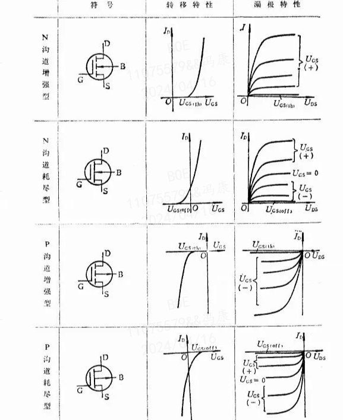

### 3.4. 寄生二极管
漏极和源极之间有一个寄生二极管，即“体二极管”，在驱动感性负载（如马达、继电器）应用中，主要用于保护回路。不过体二极管只在单个MOS管中存在，在集成电路芯片内部通常是没有的。

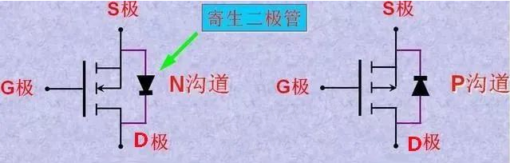

以NMOS为例，体二极管的形成其实是NMOS中的D漏极连接的N型半导体与衬底B连接的P型半导体，组成了一个PN结：
- 衬底B与源极S之间用导体连接，所以就等同于源极S与漏极D之间存在一个PN结，即二极管；
- Vds 为负时，在该二极管处于正向偏置时，即 PN结导通，电流从源极直接流向漏极，MOS管通过 GS 控制的作用就会失效。
- Vds 为负时，在该二极管处于反向偏置时，即 PN结截止。

### 3.5. 不同耐压MOS管特点
不同耐压的MOS管，其导通电阻中各部分电阻比例分布不同。如耐压30V的MOS管，其外延层电阻仅为总导通电阻的29%，耐压600V的MOS管的外延层电阻则是总导通电阻的96.5%。

不同耐压MOS管的区别主要在于，耐高压的MOS管其反应速度比耐低压的MOS管要慢，因此，它们的特性在实际应用中也表现出了不一样之处，如耐中低压MOS管只需要极低的栅极电荷就可以满足强大电流和大功率处理能力，除开关速度快之外，还具有开关损耗低的特点，特别适应PWM输出模式应用；而耐高压MOS管具有输入阻抗高的特性，在电子镇流器、电子变压器、开关电源方面应用较多。

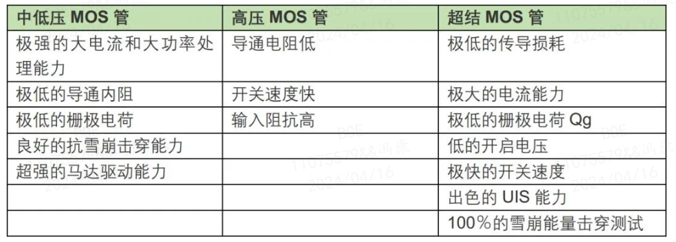

