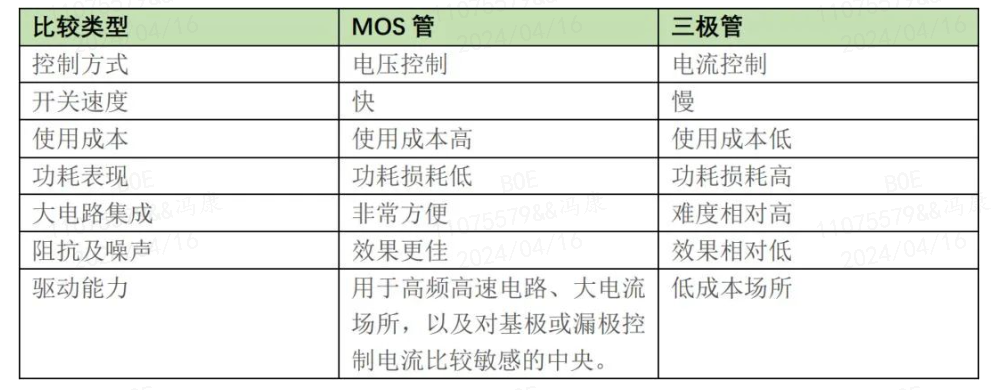

# MOS 管与三极管、IGBT的差别

## 1. MOS 管与三极管的差别
三极管全称为半导体三极管，它的主要作用就是将微小的信号中止放大。MOS管与三极管有着许多相近的地方，也有许多不同之处。

1. 开关速度的不同。
    - 三极管工作时，两个PN结都会感应出电荷，当开关管处于导通状态时，三极管处于饱和状态，假设这时三极管截至，PN结感应的电荷要恢复到平衡状态，这个过程需求时间。而MOS由于工作方式不同，不需要恢复时间，因此可以用作高速开关管。

2. 控制方式不同。
    - MOS管是电压控制元件，而三级管是电流控制元件。在只允许从信号源取较少电流的情况下，应选用MOS管；而在信号电压较低，又允许从信号源取较多电流的条件下，应选用三极管。

3. 载流子种类数量不同。
    - 电力电子技术中提及的单极器件是指只靠一种载流子导电的器件，双极器件是指靠两种载流子导电的器件。MOS管只应用了一种多数载流子导电，所以也称为单极型器件；而三极管是既有多数载流子，也应用少数载流子导电；是为双极型器件。

4. 灵活性不同。有些MOS管的源极和漏极可以互换运用，栅压也可正可负，灵活性比三极管好。

5. 集成能力不同。MOS管能在很小电流和很低电压的条件下工作，而且它的制造工艺可以很方便地把很多MOS管集成在一块硅片上，因此MOS管在大范围集成电路中得到了普遍的应用。

6. 输入阻抗和噪声能力不同。MOS管具有较高输入阻抗和低噪声等优点，被普遍应用于各种电子设备中，特别用MOS管做整个电子设备的输入级，可以获得普通三极管很难达到的性能。

7. 功耗损耗不同。同等情况下，采用MOS管时，功耗损耗低；而选用三极管时，功耗损耗要高出许多。

当然，在使用成本上，MOS管要高于三极管，因此根据两种元件的特性，MOS管常用于高频高速电路、大电流场所，以及对基极或漏极控制电流比较敏感的中央区域；而三极管则用于低成本场所，达不到效果时才会考虑替换选用MOS管。

## 2、MOS管与IBGT的差别

IGBT（Insulated Gate Bipolar Transistor），绝缘栅双极型晶体管，是由BJT（双极型三极管）和MOS绝缘栅型场效应管组成的复合全控型电压驱动式功率半导体器件，兼有MOSFET的高输入阻抗和功率晶体管（GTR）的低导通压降两方面的优点。

GTR饱和压降低，载流密度大，但驱动电流较大；MOSFET驱动功率很小，开关速度快，但导通压降大，载流密度小。IGBT综合了以上两种器件的优点，驱动功率小而饱和压降低。常见的IGBT又分为单管和模块两种，单管的外观和MOS管有点相像，常见生产厂家有富士电机、仙童半导体等，模块产品一般为内部封装了数个单个IGBT，由内部联接成适合的电路。

由于IGBT原理为先开通MOS管，再驱动三极管开通，该原理决定了IGBT的开关速度比MOS管慢，但比三极管快。

制造成本上，IGBT要比MOS管高很多，这是因为IGBT的制作多了薄片背面离子注入、薄片低温退火（如激光退火）工序，而这两个工序都需要专门针对薄片工艺的昂贵机台。

在低压下，低压MOS管的导通压降通常都控制在0.5V以下（基本不会超过1V的），比如IR4110低压MOS管，其内阻为4mΩ，给它100A的导通电流，导通压降是0.4V左右。电流导通压降低，意味着导通损耗小，同时兼具开关损耗小的特性，因此，IGBT相对MOS管在电性能没有优势，加上在性价比上MOS管更具优势，所以基本上看不到低压IGBT。

MOS管的最大劣势是随着耐压升高，内阻迅速增大，所以高压下内阻很大，致使MOS管不能做大功率应用。

在高压领域，MOS管的开关速度仍是最快的，但高压下MOS管的导通压降很大（内阻随耐压升高而迅速升高），即便是耐压600V的COOLMOS管，导通电阻可高达几欧姆，致使耐流很小。

而IGBT在高耐压下，导通压降几乎没明显增大（IGBT的导通电流通过三极管处理），所以高压下IGBT优势明显，既有高开关速度，又有三极管的大电流特性；另外，在新一代IGBT产品中，开关速度高（纳秒级），导通压降、开关损耗等也有了长足进步，使得IGBT耐脉冲电流冲击力更强，且耐压高、驱动功率小等优点更加突出。

在需要耐压超过150V的使用条件下，MOS管已经基本没有优势。以典型的IRFS4115与第四代IGBT型SKW30N60对比中，在150V、20A连续工况下运行，前者开关损耗为6mJ/pulse，而后者只有1.15mJ/pulse，不足前者的1/5；若用极限工作条件，二者功率负荷相差将更悬殊！

目前，诸如冶金、钢铁、高速铁路、船舶等有大功率需求的领域已较少见到MOS管，而是广泛应用IGBT元器件。

总的来说，IGBT更适用于高压、大电流、低频率（20KHZ左右）场所，电压越高，IGBT越有优势，在600v以上，IGBT的优势非常明显；而MOSFET更适用于低电压、小电流、低频率（几十KHz~几MHz）领域，电压越低，MOS管越有优势。