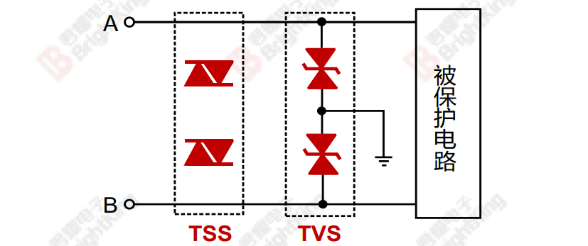

# 1. RS485电路设计
## 1.1. RS485的隔离设计
1. 可以使用光耦进行信号隔离，将CPU的信号与RS485转换芯片的信号进行隔离，避免电气连接，降低CPU损坏概率，该方法需要注意以下要点：
    - 光耦的选型需要考虑隔离距离、传输速率、光信号电平、开关时间等参数，需要根据光耦性能计算电阻大小；
    - 光耦的两侧在 layout 时需要特别注意地的隔离；
    

2. 可以利用数字隔离器实现485电路隔离；
3. 可以利用集成隔离485芯片实现485电路隔离。

## 1.2. RS485的保护电路设计
1. 浪涌保护电路：
    - 一级浪涌保护电路：采用TVS或半导体放电管TSS对RS485接口进行浪涌防护，可获得较高的浪涌防护等级。
    
    - 两级浪涌保护电路：第一级采用GDT进行防护，第二级采用TVS进行防护，在获得较高浪涌防护等级的同时，可获得较低的钳位电压。
    

2. 静电保护电路
    - 采用专用485防护ESD器件对RS485的数据线进行防护:
    

## 1.3. RS485的电路设计示例
1. 示例电路1：
    

# 2. CAN 电路设计
## 1.1. RS485的隔离设计
1. 推荐电路设计
    
    

# 3. USB 电路设计
## 3.1 