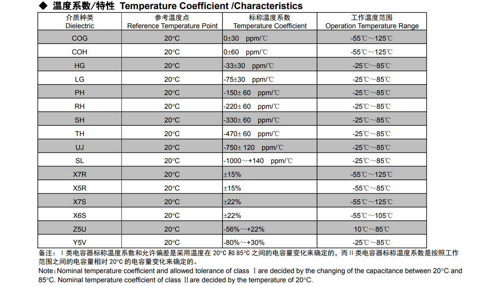

# 贴片电容的介绍和选型
MLCC 贴片电容的主要特征如下：
- 叠层独石结构，具有高可靠性能
- 具有优良的焊接与耐焊性能，适用于回流焊接与波峰焊接
- 具有较高的容量且容量性能稳定

参考手册：
- [风华高科-通用型系列片式容陶瓷电容器](https://www.china-fenghua.com/uploads/category_pdf/%E9%80%9A%E7%94%A8%E5%9E%8B%E7%B3%BB%E5%88%97%E7%89%87%E5%BC%8F%E5%AE%B9%E9%99%B6%E7%93%B7%E7%94%B5%E5%AE%B9%E5%99%A8(2).pdf)

## 1. 贴片电容的介绍
### 1.1 贴片电容的分类
普通贴片电容主要分为两类，主要是根据介质的不同性能进行划分：
- 高频类：此类介质材料的电容器为Ⅰ类电容器。其中 COG、COH 电容器电性能最稳定，几乎不随温度、电压和时间的变化而变化，适用于低损耗，稳定性要求高的高频电路。
- X7R、X5R、X7S、X6S：此类介质材料的电容器为Ⅱ类电容器，具有较高的介电常数，容量比Ⅰ类电容器高，具有较稳定的温度特性，适用于容量范围广，稳定性要求不高的电路中，如隔直、耦合、旁路、鉴频等电路中。

### 1.2 普通贴片电容的关键参数
贴片电容主要关键参数如下：
- 容值；
- 精度；
- 额定电压；
- 温度系数（材质）；

其中，普通 MLCC 中不同介质的度系数和特征如下：

## 2. 不同介质的容量范围及其电压
### 2.1 容值范围对比

### 2.2 不同介质电压范围对比
普通电容器的电压范围在上面容值章节已经提供，除了上述普通电压等级的电容外，还有中高压电容器。

中高压多层片状陶瓷电容器是在多层片状陶瓷电容器的工艺技术、设备基础上，通过采用特殊工艺制作的一种具有良好高压可靠性的产品，该产品适合于表面贴装，适合于多种直流高压线路，可以有效的改善电子线路的性能。其电压和容值范围如下：

## 3. 总结
上述参数可以看出，薄膜电阻的精度和温度系数（温漂系数）都比厚膜电阻要好，但是薄膜电阻的功率要低，耐压更低。

薄膜电阻的应用场景适合精度高的采样等电路，品种相对单一。

厚膜电阻除了上述列出的普通厚膜电阻外，还有很多特殊的种类的厚膜电阻，比如高耐压、高功率、高阻、无磁、抗静电、宽电极、抗硫化、排阻等，可以在某一方面做到特别突出，在选择电阻时，需要判断是否有特殊要求来选择电阻，不可盲目选择电阻种类。