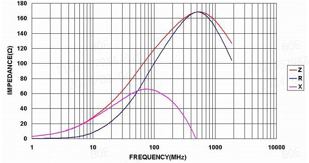
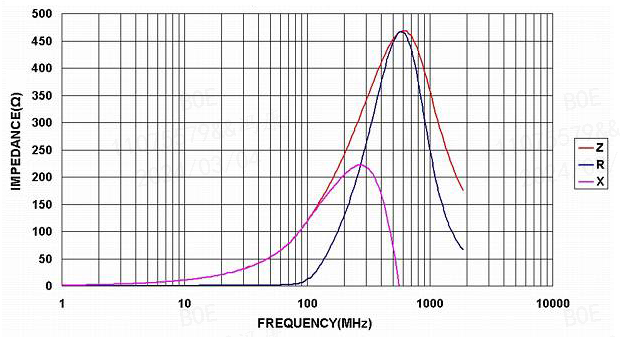
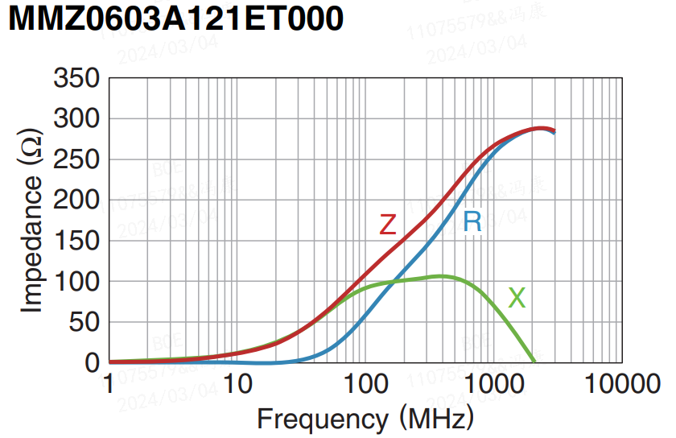
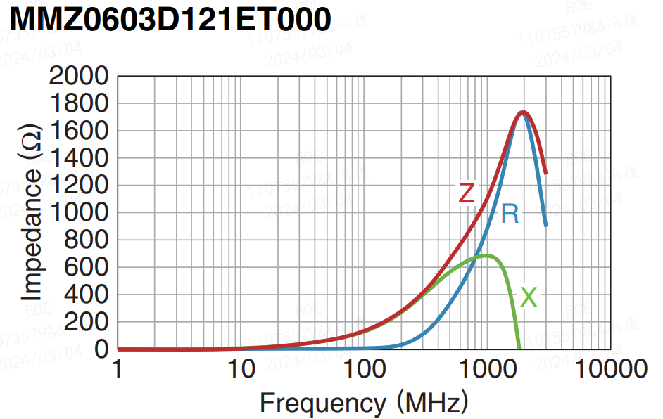
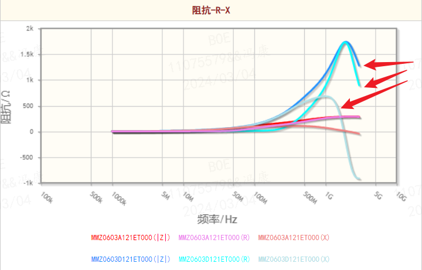
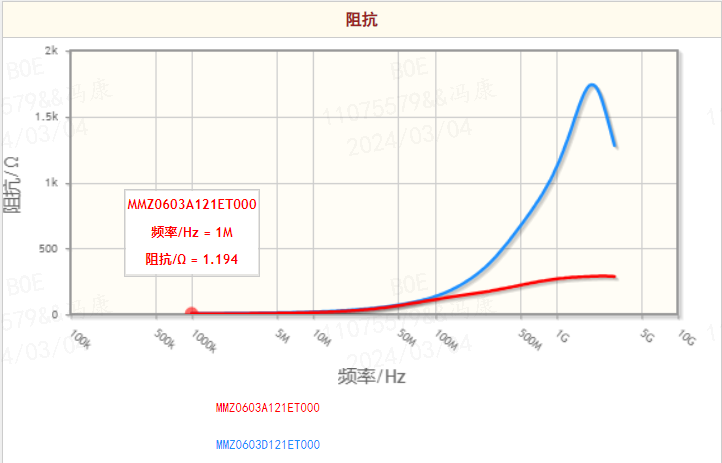

# 磁珠的介绍和选型
磁珠（Ferrite Bead），全称为铁氧体磁珠滤波器(另有一种是非晶合金磁性材料制作的磁珠)，属于EMI静噪元器件。在电路中起到了消除干扰噪声的作用。其等效于电阻电感电容串并联在电路中。其表现出的阻抗特性也会随着电路中工作频率的变化而变化。

## 1. 磁珠的介绍
### 1.1 磁珠的分类
磁珠，主要指铁氧体磁珠，按应用领域划分可以分为如下几种：
- 叠层片式铁氧体高频磁珠:
    - 在 GHz 频带下对 EMI 的抑制有完美效果。
    - 去除家电、手机平板等电子产品的高频噪声。
- 叠层片式铁氧体音频磁珠：
    - 适用于大电流信号的低直流电阻。
    - 应用于 D 级功放电路，音频磁珠在在保障较佳的音频信号情况下起到降噪作用。
- 叠层片式铁氧体（超）大电流磁珠：
    - 低直流电阻，超大额定电流
    - 用于通信设备、计算机、液晶电视等电气设备的电源线或超大电流信号线的噪声抑制。
- 叠层片式铁氧体磁珠：
    - 除去智能手机以及平板终端等移动设备及各类组件的噪音，除去 PC、刻录机、 STB 等家电、智能电网以及产业机器的噪音。

### 1.2 磁珠的关键参数
磁珠主要关键参数如下：
- 误差范围（Tolerance）；
- 标称阻抗（Impedance）/测试频率（MHz）；阻抗部分显示的数值均为磁珠工作在100MHz时所表现的阻抗。有些地方的也表示为75Ω@100MHz形式。其道理是一样的。阻抗越大，抑制噪声的效果越好。 所以在选择时，请务必看下频率-阻抗曲线图，观察阻抗Z最高点时所对应的频率。 即最高点所对应的频率为电路中噪声的频率。
- 直流电阻（DCR Max）；指的是直流工作下。磁珠所呈现的电阻值，一般DCR越小越好，对有用信号的衰减小。
- 额定电流（Ir Max）；指的是磁珠工作时，所允许通过的最大电流。

## 2. 磁珠的选择
磁珠的应用领域主要在电源和信号两个方面。
- 电源方面：磁珠在电源电路中，主要用来滤除电源电压中的噪声，提高电源的稳定性。
- 信号方面：磁珠在信号电路中，主要用来滤除信号中的噪声，提高信号的稳定性。

### 2.1 磁珠的特性曲线对比
在电源和高速信号方面应用的磁珠选型时，主要根据其特性曲线进行选择，两种应用领域选择的磁珠特性曲线有所不同。下面是两种磁珠在相同标称阻抗下的特性曲线对比。
- 电源端：  
    - Impedance Ω(at 100MHz) ：120 ;
    - RDC :　0.09 ;
    - Rated Current(mA)Max :　1400 ;
    - 
- 高速信号端：
    - Impedance Ω(at 100MHz) ：120 ;
    - RDC :　0.4 ;
    - Rated Current(mA)Max: 350 ;
    - 

列举 TDK 公司不同材质的两种磁珠性能对比：
- MMZ0603A121ET000 ：  
    - Impedance Ω(at 100MHz) ：120 ;
    - RDC :　0.44 ;
    - Rated Current(mA)Max : 250;
    - 
- MMZ0603D121ET000 :
    - Impedance Ω(at 100MHz) ：120 ;
    - RDC :　2.4 ;
    - Rated Current(mA)Max: 125 ;
    - 
- 特性对比图：
    - 阻抗-R-X
    
    - 阻抗对比图：
    

### 2.2 磁珠的选择
在上面的特性曲线可以看出：
- 电源端的阻抗-频率曲线属于“矮胖”类型的。其特点是在各个频段都有较低的阻抗，起到了一定的滤波作用。
- 信号端的阻抗-频率曲线属于“瘦高”类型的。因为信号线上的干扰信号往往是高频的，而有用信号属于低频的。所以上图中显示，磁珠在低频段的阻抗很小，所以对有用信号的衰减小。然而高频时阻抗很大，可以完美的消耗高频的能量。
- **在相同标称阻抗的条件下，直流阻抗RDC越大，曲线展示出来的趋势越明显，即曲线越“瘦”。由于阻抗曲线一般写入在芯片手册中，在选型手册没有体现，这时候可以根据该特性进行选择。**

其他选型注意要点：
- 流过磁珠电流需要＜额定电流（r）80% ；

## 3. 总结
在磁珠使用时，除了正确的选择，还注意一些环境下的设计要点：
- 用于dc电源连接时，需要左边右边都加一个电容，形成πlc滤波。
- 根据实际应用环境（电源、信号、高速信号），选择合适的直流阻抗RDC。电源选择低RDC的磁珠，信号选择高RDC的磁珠。