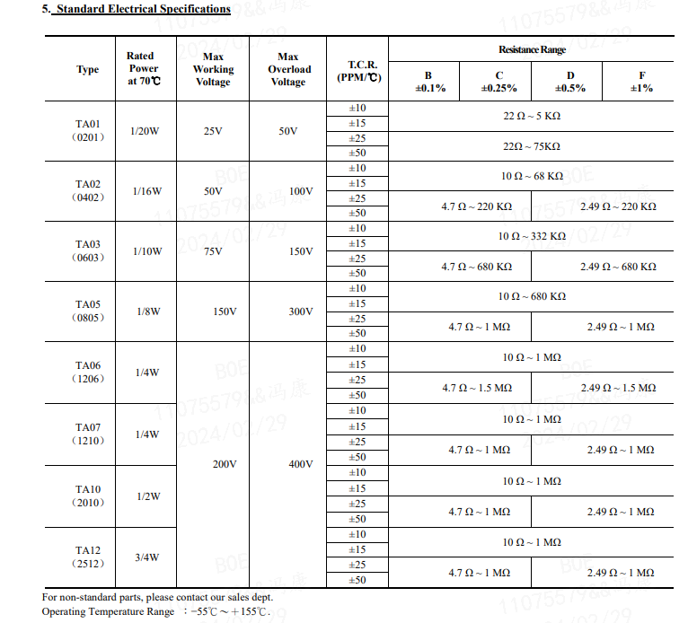
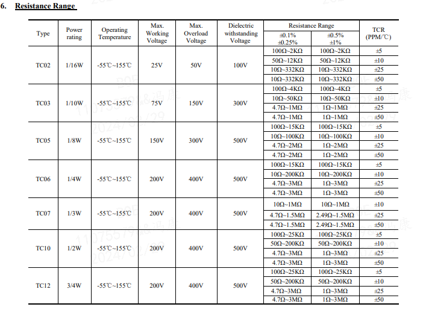
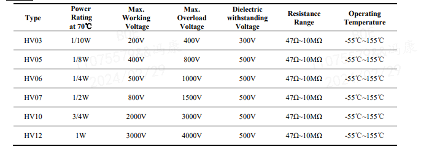

# 贴片电阻的选型

## 1. 贴片电阻的介绍
### 1.1 贴片电阻的分类
贴片电阻主要分为薄膜电阻和厚膜电阻：
1. 制造工艺：
    - 薄膜电阻： 薄膜电阻是通过在陶瓷、石英或玻璃基底上沉积一层非常薄的金属或合金薄膜来制造的。通常采用物理气相沉积（PVD）或化学气相沉积（CVD）等技术将金属或合金材料沉积在基底表面，然后通过光刻、蚀刻等工艺形成所需的电阻元件。
    - 厚膜电阻： 厚膜电阻是通过在陶瓷基底上涂覆一层较厚的电阻材料来制造的。通常使用屏印工艺将电阻材料以浆料的形式印刷在基底表面，然后通过烧结等工艺将电阻材料固化成为电阻元件。

2. 电阻层厚度：
    - 薄膜电阻： 薄膜电阻的电阻层厚度通常在几微米以下，因此具有较高的精度和稳定性。
    - 厚膜电阻： 厚膜电阻的电阻层厚度通常在数十微米至数百微米之间，比薄膜电阻要厚，但制造成本较低。

3. 温度系数：
    - 薄膜电阻： 薄膜电阻的温度系数通常较小，稳定性较好，适用于对温度变化敏感的应用。
    - 厚膜电阻： 厚膜电阻的温度系数较大，稳定性较薄膜电阻略差，但制造成本较低，适用于一般性能要求不太严格的应用。

4. 功率承受能力：
    - 薄膜电阻： 由于薄膜电阻的电阻层较薄，其功率承受能力通常较低。
    - 厚膜电阻： 厚膜电阻由于电阻层较厚，通常具有较高的功率承受能力。

5. 应用领域：
    - 薄膜电阻： 适用于对精度和稳定性要求较高的应用，如精密仪器、传感器等。
    - 厚膜电阻： 适用于一般性能要求的应用，如电源、电路控制等。

总的来说，薄膜电阻通常具有更高的精度、稳定性和温度系数，但制造成本较高；而厚膜电阻则具有较低的制造成本和较高的功率承受能力，但精度和稳定性略低。选择使用哪种电阻器件应根据具体的应用需求和性能要求来决定。

### 1.2 贴片电阻的关键参数
贴片电阻主要关键参数如下：
- 阻值；
- 精度；
- 功率；
- 温度系数（温漂系数）；
- 最大工作电压；

### 1.3 薄膜电阻的参考数据
- 普通薄膜电阻器选择：
    
- 高精度薄膜晶片电阻器
    

### 1.4 厚膜电阻的参考数据
- 普通厚膜电阻器选择：
    
- 高阻厚膜电阻器选择：
    
- 高压厚膜电阻器选择：
    

## 2. 不同封装的常见参数范围
### 2.1 0402 封装电阻常见参数范围
- 阻值：
- 精度：
- 功率：
- 温度系数（温漂系数）：
- 最大工作电压：

### 2.1 0402 封装电阻常见参数范围
- 阻值：`0 ohm ~ 100M ohm`
- 精度：`±0.1% ~ ±10%` 。
    - 薄膜电阻：`±0.1% ~ ±1%` 。
    - 厚膜电阻：`±0.1% ~ ±10%`。
- 温度系数（温漂系数）：`±10ppm/°C ~ ±800ppm/°C` .
    - 薄膜电阻：`±10ppm/°C ~ ±50ppm/°C` 。
    - 厚膜电阻：`±100ppm/°C ~ ±800ppm/°C`。
- 功率：`62.5mW ~ 125mW` 。
    - 薄膜电阻：`62.5mW` 。
    - 厚膜电阻：`62.5mW ~ 125mW`。
- 最大工作电压：`25V~100V` 
    - 薄膜电阻：`25V` 。
    - 厚膜电阻：`50V~100V` 。
- 价格范围：
    - 薄膜电阻：0.120 左右。
    - 厚膜电阻：0.002 左右。

### 2.2 0603 封装电阻常见参数范围
- 阻值：`0 ohm ~ 100M ohm`
    - 薄膜电阻：`0 ohm ~ 1M ohm` 。
    - 厚膜电阻：`0 ohm ~ 100M ohm`。
- 精度：`±0.1% ~ ±10%` 。
    - 薄膜电阻：`±0.1% ~ ±1%` 。
    - 厚膜电阻：`±0.1% ~ ±10%`。
- 温度系数（温漂系数）：`±10ppm/°C ~ ±1500ppm/°C` .
    - 薄膜电阻：`±10ppm/°C ~ ±50ppm/°C` 。
    - 厚膜电阻：`±100ppm/°C ~ ±1500ppm/°C`。
- 功率：`100mW ~ 250mW` 。
    - 薄膜电阻：`100mW ~ 166.667mW` 。
    - 厚膜电阻：`100mW ~ 250mW`。
- 最大工作电压：`75V~300V` 
    - 薄膜电阻：`75V` 。
    - 厚膜电阻：`75V~300V` 。
- 价格范围：
    - 薄膜电阻：0.100 左右。
    - 厚膜电阻：0.004 左右。

### 2.3 0805 封装电阻常见参数范围
- 阻值：`0 ohm ~ 100M ohm`
    - 薄膜电阻：`0 ohm ~ 1M ohm` 。
    - 厚膜电阻：`0 ohm ~ 100M ohm`。
- 精度：`±0.1% ~ ±10%` 。
    - 薄膜电阻：`±0.1% ~ ±1%` 。
    - 厚膜电阻：`±0.1% ~ ±10%`。
- 温度系数（温漂系数）：`±10ppm/°C ~ ±1500ppm/°C` .
    - 薄膜电阻：`±10ppm/°C ~ ±50ppm/°C` 。
    - 厚膜电阻：`±100ppm/°C ~ ±1500ppm/°C`。
- 功率：`125mW ~ 500mW` 。
    - 薄膜电阻：`125mW ~ 250mW` 。
    - 厚膜电阻：`125mW ~ 500mW`。
- 最大工作电压：`150V~500V` 
    - 薄膜电阻：`150V` 。
    - 厚膜电阻：`150V~500V` 。
- 价格范围：
    - 薄膜电阻：0.100 左右。
    - 厚膜电阻：0.008 左右。

### 2.4 1206 封装电阻常见参数范围
- 阻值：`0 ohm ~ 100M ohm`
    - 薄膜电阻：`0 ohm ~ 1M ohm` 。
    - 厚膜电阻：`0 ohm ~ 100M ohm`。
- 精度：`±0.1% ~ ±10%` 。
    - 薄膜电阻：`±0.1% ~ ±1%` 。
    - 厚膜电阻：`±0.1% ~ ±10%`。
- 温度系数（温漂系数）：`±10ppm/°C ~ ±1500ppm/°C` .
    - 薄膜电阻：`±10ppm/°C ~ ±50ppm/°C` 。
    - 厚膜电阻：`±100ppm/°C ~ ±1500ppm/°C`。
- 功率：`250mW ~ 666.667mW` 。
    - 薄膜电阻：`250mW ~ 333.333mW` 。
    - 厚膜电阻：`250mW ~ 666.667mW` 。
- 最大工作电压：`200V~500V` 
    - 薄膜电阻：`200V` 。
    - 厚膜电阻：`200V~500V` 。
- 价格范围：
    - 薄膜电阻：0.100 左右。
    - 厚膜电阻：0.014 左右。

### 2.5 2010 封装电阻常见参数范围
- 阻值：`0 ohm ~ 100M ohm`
    - 薄膜电阻：`0 ohm ~ 1M ohm` 。
    - 厚膜电阻：`0 ohm ~ 100M ohm`。
- 精度：`±0.1% ~ ±10%` 。
    - 薄膜电阻：`±0.1% ~ ±1%` 。
    - 厚膜电阻：`±0.1% ~ ±10%`。
- 温度系数（温漂系数）：`±10ppm/°C ~ ±1500ppm/°C` .
    - 薄膜电阻：`±10ppm/°C ~ ±50ppm/°C` 。
    - 厚膜电阻：`±100ppm/°C ~ ±1500ppm/°C`。
- 功率：`500mW ~ 750mW` 。
    - 薄膜电阻：`500mW` 。
    - 厚膜电阻：`750mW` 。
- 最大工作电压：`200V~500V` 
    - 薄膜电阻：`200V` 。
    - 厚膜电阻：`200V~500V` 。

### 2.6 2512 封装电阻常见参数范围
- 阻值：`0 ohm ~ 100M ohm`
    - 薄膜电阻：`0 ohm ~ 1M ohm` 。
    - 厚膜电阻：`0 ohm ~ 100M ohm`。
- 精度：`±0.1% ~ ±10%` 。
    - 薄膜电阻：`±0.1% ~ ±1%` 。
    - 厚膜电阻：`±0.1% ~ ±10%`。
- 温度系数（温漂系数）：`±10ppm/°C ~ ±1500ppm/°C` .
    - 薄膜电阻：`±10ppm/°C ~ ±50ppm/°C` 。
    - 厚膜电阻：`±100ppm/°C ~ ±1500ppm/°C`。
- 功率：`750mW ~ 1mW` 。
    - 薄膜电阻：`750mW` 。
    - 厚膜电阻：`1W` 。
- 最大工作电压：`200V~500V` 
    - 薄膜电阻：`200V` 。
    - 厚膜电阻：`200V~500V` 。

## 3. 总结
上述参数可以看出，薄膜电阻的精度和温度系数（温漂系数）都比厚膜电阻要好，但是薄膜电阻的功率要低，耐压更低。

薄膜电阻的应用场景适合精度高的采样等电路，品种相对单一。

厚膜电阻除了上述列出的普通厚膜电阻外，还有很多特殊的种类的厚膜电阻，比如高耐压、高功率、高阻、无磁、抗静电、宽电极、抗硫化、排阻等，可以在某一方面做到特别突出，在选择电阻时，需要判断是否有特殊要求来选择电阻，不可盲目选择电阻种类。