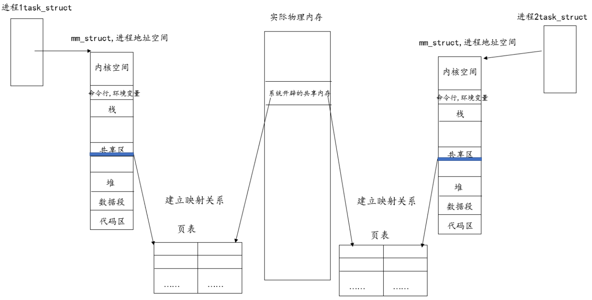
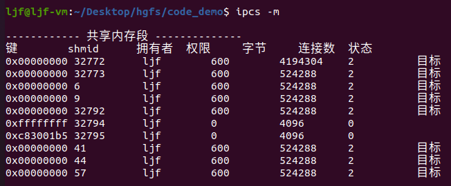
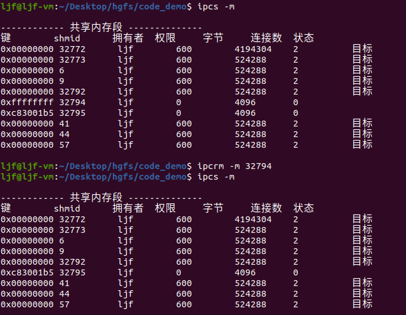

# 共享内存

共享内存是指在操作系统中，多个进程可以**同时访问**同一块物理内存，并且可以直接相互通信。从这个角度看，共享内存的优点非常明显：
- 共享内存实现进程间通信是进程间通信最快的。
- 它能够提高程序运行效率，因为多个进程之间不需要通过消息传递等较为耗时的方式来进行数据交换，而是通过直接访问同一块内存进行交流；此外，由于共享内存只需要把需要共享的内存映射到各进程的虚拟地址空间中，因此也能够节省内存使用量。

但是，共享内存在使用过程中也有自身的**缺点**：

- 管理复杂度高：需要特殊的同步机制才能保证并发操作时数据的正确性和完整性。

- 可能导致死锁：如果多个进程同时访问时没有经过充分规划和管理，可能会出现死锁情况，影响系统稳定性。

- 运行风险大：由于多个进程共享同一个内存区域，一旦出现错误就有可能破坏该内存区域，从而导致整个系统崩溃甚至数据损坏。

在实际使用共享内存时，我们需要注意以下几个方面：

- 同步机制：需要通过锁、信号等同步机制来确保多个进程访问同一块内存时数据的正确性和完整性。

- 内存管理：共享内存需要考虑内存的分配和释放问题，需要注意内存泄露等问题。

- 安全性：由于多个进程共享同一块内存区域，需要避免不合法的操作破坏该内存区域，从而导致系统崩溃或数据损坏。

## 共享内存通信原理

共享内存实际是操作系统在实际物理内存中开辟的一段内存。

共享内存实现进程间通信，是操作系统在实际物理内存开辟一块空间，一个进程在自己的页表中，将该空间和进程地址空间上的共享区的一块地址空间形成映射关系。另外一进程在页表上，将同一块物理空间和该进程地址空间上的共享区的一块地址空间形成映射关系。

当一个进程往该空间写入内容时，另外一进程访问该空间，会得到写入的值，即实现了进程间的通信。



要实现进程间通信需要两个进程能够看到同一块空间，系统开辟的共享内存就是两进程看到的同一资源。

## 共享内存的查看和删除

查看命令：`ipcs -m` ，其中 `-m` 指的是查看共享内存段的IPC对象信息。  
- 示例：  
  

删除命令：`ipcrm -m shmid` ，其中 `-m` 指的是查看共享内存段的IPC对象信息；`shmid`是要删除的共享内存的id。 
- 示例：  
  

## 共享内存的创建

### shmget() 函数
```c
#include <sys/shm.h>

int shmget(key_t key, size_t size, int shmflg);
/*
功能：
    分配一个system V 共享内存段。
参数：
    key:
        创建共享内存段的唯一关键字,一般是IPC_PRIVATE。
        shmget会根据key值创建一个共享内存，因此当创建多个共享内存时，每一个key值要独一无二。
        获得key值可以使用库函数 ftok() 专门获取一个独一无二的 key_t 类型值。
    size:
        用于确定共享内存段的大小。一般而言是4096的整数倍，因为内存的块的大小就是4KB即4096B。
    shmflg：对阻塞信号集的操作方式：
        IPC_CREAT：
            创建一个新段。
            如果不使用此标志，则shmget()将找到与key关联的段，并检查用户是否有权访问该段。
        IPC_EXCL：
            此标志必须与IPC_CREAT一起使用，以确保此调用创建段。如果段已经存在，则调用失败。
        SHM_HUGETLB (since Linux 2.6)：
            使用“huge pages.”分配段。
            有关更多信息，请参阅Linux内核源文件/mm/hugetlbpage.rst。
        SHM_HUGE_2MB, SHM_HUGE_1GB (since Linux 3.8)：
            与SHM_HUGETLB一起使用，在支持多个HUGETLB页面大小的系统上选择可选的HUGETLB页大小（分别为2 MB和1 GB）。
            简单来说，所需的巨页大小可以通过将所需页面大小的基2对数编码在偏移SHM_HUGE_SHIFT处的六个比特中来配置。因此，定义了上述两个常数作为（更多查看mmap(2)）：
                #define SHM_HUGE_2MB    (21 << SHM_HUGE_SHIFT)
                #define SHM_HUGE_1GB    (30 << SHM_HUGE_SHIFT)
        SHM_NORESERVE (since Linux 2.6.15)：
            此标志的作用与mmap（2）MAP_NORESERVE标志相同。不要为该段保留交换空间。
            当保留交换空间时，可以保证可以修改该段。
            当交换空间未被保留时，如果没有可用的物理内存，则可能会在写入时获得SIGSEGV。
返回值：
    成功：返回有效的共享内存段的标识符shmid；
    失败：-1，并把错误设置到errno。  
*/
```
**拓展描述**
- `shmget()` 函数返回与参数 `key` 相关的 system V 共享内存段的标识符。它可以用于获取已经创建的共享内存段的标识符（当 `shmflag` 不为 0 且 `key` 不具有`IPC_PRIVATE`值），或者用于创建新的标识符。
- 如果`key`的值是`IPC_PRIVATE`，或者`key`的值不是`IPC_PRIVATE`但是不存在与密钥对应的共享内存段，并且在shmflg中指定了`IPC_CREAT`，则会创建一个新的共享内存分段，其大小等于四舍五入到PAGE_size的倍数的大小。
- 如果`shmflg()`同时指定了`IPC_CREAT`和`IPC_EXCL`，并且这个 `key`的共享内存段已经存在，那么`shmget()`将返回失败，并将`errno`设置为`EEXIST`。（类似于组合`O_CREAT|O_EXCL`对`open(2)`的效果）。
- 当创建新的共享内存段时，其内容被初始化为零值，并且其相关的数据结构`shmid_ds`会被初始化为如下结构：
  - `shm_perm.cuid` 和` shm_perm.uid` 设置为调用进程的有效用户ID；
  - `shm_perm.cgid` 和 `shm_perm.gid` 设置为调用进程的有效用户组ID；
  - `shm_perm.mode` 的最低9位有效位设置为 `shmflg` 的最低9位有效位；
  - `shm_segsz` 设置为形参 `size` 的值；
  - `shm_lpid`, `shm_nattch`, `shm_atime`, 和 `shm_dtime` 设置为 0；
  - `shm_ctime` 设置为当前时间。  
如果共享内存段已经存在，则验证权限，并检查是否标记为要销毁。

**使用注意事项**
- `Linux`或任何版本的`POSIX`都不需要包含`<sys/types.h>`和`<sys/ipc.h>`。然而，一些旧的实现需要包含这些头文件，SVID也记录了它们的集群。旨在可移植到这种旧系统的应用程序可能需要包括这些头文件。
- `IPC_PRIVATE` 不是一个标志字段，而是一个 `key_t` 类型。如果这个特殊值用于 `key` ，则系统调用将忽略 `shmflg` 中除最低有效位9位之外的所有位，并创建一个新的共享内存段。
- 以下对共享内存段资源的限制会影响`shmget()`调用：
  - **SHMALL**：系统范围内共享内存总量的限制，以系统页面大小为单位：  
    - 在Linux上，可以通过`/proc/sys/kernel/shmall`读取和修改此限制。  
    - 自Linux 3.16以来，此限制的默认值为：`ULONG_MAX - 2^24` 。这个值（适用于32位和64位系统）的作用是对分配没有限制。请参阅`SHMALL`的描述，以了解为什么使用此默认值（而不是`ULONG_MAX`）。  
    - 从Linux 2.2到Linux 3.15，此限制的默认值为0x2000000（32 MB）。
    - 因为不可能只映射共享内存段的一部分，所以虚拟内存的数量对可用内存段的最大大小设置了另一个限制：例如，在i386上，可以映射的最大内存段被映射的大小约为2.8 GB，在x86-64上的限制约为127 TB。
  - **SHMMIN**：共享内存段的最小大小（以字节为单位）：  
    取决于实现（当前为1字节，但PAGE_size是有效的最小大小）
  - **SHMMNI**：系统范围内对共享内存段数量的限制。  
    - 在Linux 2.2中，此限制的默认值为`128`；从Linux 2.4开始，默认值为`4096`。
    - 在Linux上，可以通过`/proc/sys/kernel/shmmni`读取和修改此限制。
  - 该实现对每个进程的共享内存段的最大数量（`SHMSEG`）没有特定限制。
- 在Linux 2.3.30版本之前，Linux将为计划删除的共享内存段上的`shmget()`返回值 `EIDRM ` 。

**个人使用中的问题**
- `shmget()` 函数在使用过程中，如果使用的key已经创建过了一个共享内存，会导致函数直接返回-1，错误是共享内存已存在，不能通过这个函数获取到这个已经存在的`shmid`了。


### ftok() 函数创建key
```c
#include <sys/types.h>
#include <sys/ipc.h>

key_t ftok(const char *pathname, int proj_id);

/*
功能：
    获取一个独一无二的key_t类型值。
参数：
    pathname为路径，必须是真实存在且可以访问的路径。
    proj_id是int类型数字，且必须传入非零值。
返回值：
    成功返回key_t值，失败返回-1。
*/
```
使用ftok创建key来创建共享内存段的代码：  
  `key_t shm_key = ftok(".",200);`  
  `shmget(shm_key,4096,0666|IPC_CREAT|IPC_EXCL);`  
不使用ftok创建key来创建共享内存段的代码：  
  `shmget(IPC_PRIVATE,4096,0666|IPC_CREAT|IPC_EXCL);`   
**使用ftok()创建的key可以实现无亲缘关系的进程间通信，使用IPC_PRIVATE只能用于亲缘关系的进程间通信，相当于匿名管道和命名管道的区别。**

-------------------------------

## 共享内存的附加/连接（attach）

### shmat() 函数
```c

/* Flags for `shmat'.  */
#define SHM_RDONLY	010000		/* attach read-only else read-write */
#define SHM_RND		020000		/* round attach address to SHMLBA */
#define SHM_REMAP	040000		/* take-over region on attach */
#define SHM_EXEC	0100000		/* execution access */

#include <sys/types.h>
#include <sys/shm.h>

void *shmat(int shmid, const void *shmaddr, int shmflg);
// int shmdt(const void *shmaddr);
/*
功能：
    对system V 共享内存段进行操作。
    创建共享内存后还不能直接使用，需要找到内存地址后才能使用，即attach。
参数：
    shmid：共享内存区域的标识符；
    shmaddr：指定共享内存attach到进程地址空间的起始地址，通常是NULL（系统自动选择合适的地址）；
    shmflg：标志位，通常为0（表示不进行特殊操作）.
        0 ：以读写模式访问共享内存。
返回值：
    成功：返回有效的共享内存段的标识符
    失败：(void *) -1，并把错误设置到errno。  
*/
```
**拓展描述**
- 将`shmid`标识的`System V`共享内存段attach到调用进程的地址空间。attach地址由`shmaddr` 指定，符合以下条件之一：
  - 如果`shmaddr`为`NULL`，系统会选择一个适当的未使用的页面对齐地址来attach共享内存段。
  - 如果`shmaddr`不为`NULL`，并且在`shmflg`中指定了`SHM_RND`，则attach发生在等于`shmaddr` 四舍五入到`SHMLBA`的最近倍数的地址。
  - 否则，`shmaddr` 必须是页对齐的地址，attach操作就会在这个地址上进行。
- 除了`SHM_RND`外，还可以在`shmflg`参数中指定以下标志：
  - **SHM_EXEC（Linux特有）：**  
    允许执行共享内存段的内容。调用者必须具有段的执行权限。
  - **SHM_RDONLY:**   
    以只读方式attach内存段，进程需要对该段具有读取权限。若不指定该标志，则attach操作是可读写的，进程需要对该内存段具有读写权限。
  - **SHM_REMAP（Linux特有）：**  
    指定映射该内存段的操作应替换掉位于`shmaddr`和该段大小之间范围内的现有映射 (如果在这个地址范围内已经存在一个映射，正常情况下会导致`EINVAL`错误)。在这种情况下，`shmaddr`不能为NULL。
- 注意，`shmat()`的调用不会更改调用进程的程序结束(brk)值。此共享内存段在进程退出时将自动分离。同一个共享内存段可以作为只读和可读写方式attach，并且在进程地址空间中可以attach多次。
- 成功的`shmat()`调用将以下面的方式更新与共享内存段相关联的`shmid_ds`结构体成员（参见shmctl()）：
  - `shm_atime`被设置为当前时间。
  - `shm_lpid`被设置为调用进程的进程ID。
  - `shm_nattch`增加1。

--------------------------

## 共享内存的分离/断开（detach）

### shmdt() 函数
```c
#include <sys/types.h>
#include <sys/shm.h>

// void *shmat(int shmid, const void *shmaddr, int shmflg);
int shmdt(const void *shmaddr);
/*
功能：
    对system V 共享内存段进行操作。
    将指定地址处的共享内存段从当前进程的地址空间中删除，并释放该段所占用的系统资源。
参数：
    shmaddr：需要被分离的共享内存段的地址。如果是 NULL,则会释放所有已连接的共享内存段.
返回值：
    成功：0；
    失败：-1，并把错误设置到errno。  
*/
```
**拓展描述**
- `shmdt()`从调用进程的地址空间中分离由`shmaddr`指定的共享内存段。要分离的内存段必须使用`shmat()`调用返回值设置的值进行附加。
- 在成功调用`shmdt()`之后, 系统将会更新与共享内存段相关联的`shmid_ds`结构体的成员如下：
  - `shm_dtime`被设置为当前时间。
  - `shm_lpid`被设置为调用进程的进程ID。
  - `shm_nattch`减少1。当其变为0且该段已经标记为删除，则该内存段将被删除。

**使用注意事项**
- 在 `fork(2)` 之后，子进程继承了已连接的共享内存段。
- 在 `execve(2)` 之后，所有已连接的共享内存段都会从进程中分离。
- 在 `_exit(2)` 之后，所有已连接的共享内存段都会从进程中分离。
- 使用 `shmat()` 将 `shmaddr` 设置为 `NULL` 是连接共享内存段的首选、可移植的方法。需要注意的是，以这种方式连接的共享内存段可能在不同的进程中连接到不同的地址上。因此，在共享内存中维护的任何指针必须是相对的(通常是相对于段的起始地址),而不是绝对的。
- 在 Linux 上，即使共享内存段已被标记为要删除，也可以连接它。但是，POSIX.1 没有指定这种行为，并且许多其他实现也不支持它。
- 影响 `shmat()` 系统参数如下：
  - SHMLBA Segment low boundary address multiple：  
    当在调用 `shmat()` 时显式指定 attach 地址时，调用者应确保该地址是此值的倍数。在某些架构上，这是为了确保良好的 CPU 缓存性能或确保同一段的不同连接在 CPU 缓存中有一致的视图而必须的。`SHMLBA` 通常是系统页面大小的一些倍数。(在许多 Linux 架构上，`SHMLBA` 就是系统页面大小。)
- 实现对进程中共享内存段的数量没有内在的限制(`SHMSEG`)。

--------------------------

## 共享内存的控制（control）

### shmctl() 函数
```c
/* Commands for `shmctl'.  */
#define SHM_LOCK	11		/* lock segment (root only) */
#define SHM_UNLOCK	12		/* unlock segment (root only) */

#include <sys/types.h>
#include <sys/shm.h>

int shmctl(int shmid, int cmd, struct shmid_ds *buf);
/*
功能：
    对system V 共享内存段进行控制。
    将指定地址处的共享内存段从当前进程的地址空间中删除，并释放该段所占用的系统资源。
参数：
    shmid：要操作的共享内存对象的ID号，是一个整数。
    cmd：操作命令：
    buf：传递一些操作所需的信息。
返回值：
    成功：成功的IPC_INFO或SHM_INFO操作将返回内核内部数组中记录有关所有共享内存段信息的最高使用条目的索引。(可以将此信息与重复的SHM_STAT或SHM_STAT_ANY操作一起使用，以获取有关系统上所有共享内存段的信息。)成功的SHM_STAT操作将返回该内存段标识符，其索引在shmid中给出。其他操作成功时返回0。
    失败：-1，并把错误设置到errno。  
*/
```
**拓展描述**
- `shmctl()` 函数执行由 `shmid` 指定的 `System V `共享内存段上 `cmd` 指定的控制操作。
- buf 参数是指向 <sys/shm.h> 中定义的 shmid_ds 结构体的指针，其定义如下：
  > ```c
  >struct shmid_ds {
  >    struct ipc_perm shm_perm;    /* Ownership and permissions */
  >    size_t          shm_segsz;   /* Size of segment (bytes) */
  >    time_t          shm_atime;   /* Last attach time */
  >    time_t          shm_dtime;   /* Last detach time */
  >    time_t          shm_ctime;   /* Last change time */
  >    pid_t           shm_cpid;    /* PID of creator */
  >    pid_t           shm_lpid;    /* PID of last shmat(2)/shmdt(2) */
  >    shmatt_t        shm_nattch;  /* No. of current attaches */
  >    ...
  >};
  >```
- `ipc_perm` 结构体定义如下(使用 `IPC_SET` 可以设置高亮字段):
  >```c
  >struct ipc_perm {
  >    key_t          __key;    /* Key supplied to shmget(2) */
  >    uid_t          uid;      /* Effective UID of owner */
  >    gid_t          gid;      /* Effective GID of owner */
  >    uid_t          cuid;     /* Effective UID of creator */
  >    gid_t          cgid;     /* Effective GID of creator */
  >    unsigned short mode;     /* Permissions + SHM_DEST and
  >                                SHM_LOCKED flags */
  >    unsigned short __seq;    /* Sequence number */
  >};
  >```
- `cmd` 的有效值范围如下：
  - **IPC_STAT**  
    将与`shmid`相关联的内核数据结构中的信息复制到指向`buf`的`shmid_ds`结构体中。调用者必须具有共享内存段的读取权限。
    
  - **IPC_SET**   
    将指向`buf`的`shmid_ds`结构体中一些成员的值写入到与此共享内存段相关联的内核数据结构中，并更新其`shm_ctime`成员。可以更改以下字段：`shm_perm.uid`、`shm_perm.gid`和（`shm_perm.mode`的最低9位）。调用进程的有效用户ID必须匹配共享内存段的所有者(`shm_perm.uid`)或创建者(`shm_perm.cuid`)，或者调用者必须具备特权。

  - **IPC_RMID**  
    标记内存段以便被销毁。只有在最后一个进程分离此内存段（即当与之相关的`shmid_ds`结构体中的`shm_nattch`成员为0时）才会实际删除该内存段。调用者必须是该内存段的所有者或创建者，或拥有对该内存段相应权限的用户。缓冲区参数`buf`将被忽略。

    如果一个内存段被标记为待销毁状态，则在`IPC_STAT`所检索的相关数据结构中，`shm_perm.mode`字段中（非标准）`SHM_DEST`标志将被设置。

    调用者必须确保最终销毁该内存段；否则，该内存段中已经加载到内存或交换空间中的页面将会一直存在。

    另请参见`proc(5)`中关于`/proc/sys/kernel/shm_rmid_forced`的描述。

  - **IPC_INFO (Linux-specific)**  
    将系统范围内的共享内存限制和参数的信息返回到指向`buf`的结构体中。如果定义了`_GNU_SOURCE`特性测试宏，则该结构体的类型为`shminfo`（因此需要进行转换），其在`<sys/shm.h>`中定义：

    >```c
    >struct shminfo {
    >    unsigned long shmmax; /* Maximum segment size */
    >    unsigned long shmmin; /* Minimum segment size;
    >                             always 1 */
    >    unsigned long shmmni; /* Maximum number of segments */
    >    unsigned long shmseg; /* Maximum number of segments
    >                             that a process can attach;
    >                             unused within kernel */
    >    unsigned long shmall; /* Maximum number of pages of
    >                             shared memory, system-wide */
    >};
    >```

    可以通过同名的 /proc 文件来更改 shmmni、shmmax 和 shmall 设置；请参见 proc(5) 以获取详细信息。

  - **SHM_INFO (Linux-specific)**  
    返回一个`shm_info`结构体，其中的字段包含有关共享内存消耗的系统资源的信息。如果定义了`_GNU_SOURCE`特性测试宏，则该结构体在`<sys/shm.h>`中定义：

    >```c
    >struct shm_info {
    >    int           used_ids; /* # of currently existing
    >                               segments */
    >    unsigned long shm_tot;  /* Total number of shared
    >                               memory pages */
    >    unsigned long shm_rss;  /* # of resident shared
    >                               memory pages */
    >    unsigned long shm_swp;  /* # of swapped shared
    >                               memory pages */
    >    unsigned long swap_attempts;
    >                            /* Unused since Linux 2.4 */
    >    unsigned long swap_successes;
    >                            /* Unused since Linux 2.4 */
    >};
    >```

  - **SHM_STAT (Linux-specific)**  
    返回一个`shmid_ds`结构体，就像对于`IPC_STAT`一样。但是，`shmid`参数不是一个段标识符，而是一个索引，用于指向内核维护有关系统上所有共享内存段的信息的内部数组。

  - **SHM_STAT_ANY (Linux-specific, since Linux 4.17)**  
    像SHM_STAT一样返回一个`shmid_ds`结构体，但是`shm_perm.mode`不会对`shmid`进行读取访问检查，这意味着任何用户都可以使用此操作（就像任何用户可以读取/proc/sysvipc/shm以获得相同的信息）。

- 调用者可以通过以下`cmd`值来防止或允许与共享内存段进行交换：

  - **SHM_LOCK (Linux-specific)**  
    防止共享内存段的交换。调用者必须加载在启用锁定后需要存在的任何页面。如果一个内存段已经被锁定，则在IPC_STAT所检索的相关数据结构中，shm_perm.mode字段中（非标准）SHM_LOCKED标志将被设置。

  - **SHM_UNLOCK (Linux-specific)**  
    解除该段的锁定，允许它被交换出去。

在2.6.10版本之前的内核中，只有特权进程才能使用`SHM_LOCK`和`SHM_UNLOCK`。自2.6.10内核版本以来，如果调用者的有效用户ID与段的所有者或创建者UID匹配，并且（对于`SHM_LOCK`）要锁定的内存量在`RLIMIT_MEMLOCK`资源限制范围内（参见`setrlimit(2)`），则非特权进程也可以使用这些操作。

**使用注意事项**  
- 在Linux或任何版本的POSIX中，`<sys/types.h>`和`<sys/ipc.h>`的包含不是必需的。然而，一些旧的实现要求包括这些头文件，而SVID还记载了它们的包含。旨在可移植到这些旧系统的应用程序可能需要包括这些头文件。
- `IPC_INFO`、`SHM_STAT`和`SHM_INFO`操作由`ipcs(1)`程序用于提供有关已分配资源的信息。将来，这些操作可能会修改或移动到`/proc`文件系统接口。
- 在`Linux`中，允许进程附加(`shmat(2)`)一个已经被标记为删除的共享内存段，使用`shmctl(IPC_RMID)`功能。但是，在其他UNIX实现中不存在此功能；可移植应用程序应避免依赖它。
- `struct shmid_ds` 中的各个字段在Linux 2.2下被定义为短整型，在Linux 2.4下变为了长整型。为了利用这一点，只需在`glibc-2.1.91`或更高版本下重新编译即可。(内核通过`cmd`中的`IPC_64`标志来区分新旧调用。)