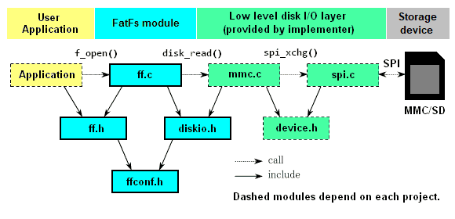
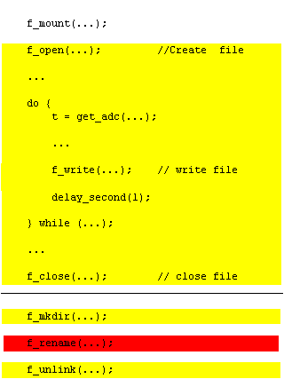
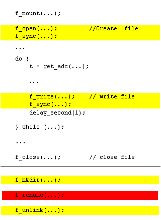

# FatFs 模块应用说明
以下内容为 FatFs 模块应用说明，主要介绍 FatFs 模块的基本概念，如何移植，以及如何使用 FatFs 模块。

原文为地址为：[FatFs Application Note](http://elm-chan.org/fsw/ff/doc/appnote.html)

具体内容可以参照官网地址：[http://elm-chan.org/fsw/ff/00index_e.html](http://elm-chan.org/fsw/ff/00index_e.html)

## 1. 如何移植
### 1.1. 基本注意事项
FatFs 模块在可移植性方面假设以下条件。

- ANSI C
    - FatFs 模块是用 ANSI C （C89） 编写的中间件。只要编译器符合 C89 或更高版本，就没有平台依赖性。
    - 只有 `exFAT` 功能需要 C99。

- 整数类型的大小
    - `char` 的大小必须为 8 位。
    - `int` 的大小以及整数提升，都必须为 16 位或 32 位。
    - `short` 和 `long` 的大小必须分别为 16 位和 32 位。（仅限 C89）

- 依赖
 - C89: string.h.
 - C99: string.h and stdint.h.
 - Optional: stdarg.h and math.h.

### 1.2. FatFs API 中的整数类型
FatF 中使用的整数类型定义在如下描述的 ff.h 文件中。它基于 Win32 API （windef.h）。

这在大多数平台上都不是问题。当与现有定义发生冲突时，您必须小心解决。

**BYTE**
    8 位无符号整数，范围为 0 到 2^8 - 1。

**WORD**
    16 位无符号整数，范围为 0 到 2^16 - 1。

**DWORD**
    32 位无符号整数，范围为 0 到 2^32 - 1。

**QWORD**
    64 位无符号整数，范围为 0 到 2^64 - 1。

**UINT**
    unsigned int 的别名，用于指定任何数字。  

**WCHAR**
    WORD 的别名，用于指定一个 UTF-16 代码单元。

**TCHAR**
    char, WCHAR 或 DWORD 的别名，用于指定一个字符编码单位。

**FSIZE_t**
    DWORD or QWORD 的别名，用于解决文件偏移和指定文件大小。

**LBA_t**
    DWORD or QWORD 的别名，用于对 LBA 中的扇区进行寻址和指定扇区数。

### 1.3. 系统组织
下面显示的依赖关系图是带有 FatFs 模块的嵌入式系统的典型配置，但不是特定的配置。



（a） 如果为 FatFs 提供了可用的磁盘模块，则不需要任何其他内容。
（b） 要附加具有不同接口的现有磁盘驱动程序，需要一些 glue 函数来转换 FatFs 和驱动程序之间的接口。


### 1.4. 所需功能
您只需提供 FatFs 模块所需的 MAI 函数，无需提供其他功能。

如果目标系统有可用的工作设备控制模块，则只需编写 glue 函数即可将其附加到 FatFs 模块。如果没有，则需要移植另一个设备控制模块或从头开始编写。

大多数 MAI 函数并不总是必需的。例如，只读配置中不需要 write 函数。下表显示了所需的函数取决于配置选项。

<table class="lst2">
    <tbody>
        <tr>
            <th>Function</th>
            <th>Required when:</th>
            <th>Note</th>
        </tr>
        <tr>
            <td>disk_status<br>disk_initialize<br>disk_read</td>
            <td>Always</td>
            <td rowspan="5">Disk I/O functions.<br>Samples available in ffsample.zip.<br>There are many implementations on the web.</td>
        </tr>
        <tr>
            <td>disk_write<br>get_fattime<br>disk_ioctl (CTRL_SYNC)</td>
            <td><a href="config.html#fs_readonly">FF_FS_READONLY == 0</a></td>
        </tr>
        <tr>
            <td>disk_ioctl (GET_SECTOR_COUNT)<br>disk_ioctl (GET_BLOCK_SIZE)</td>
            <td><a href="config.html#use_mkfs">FF_USE_MKFS == 1</a></td>
        </tr>
        <tr>
            <td>disk_ioctl (GET_SECTOR_SIZE)</td>
            <td><a href="config.html#max_ss">FF_MAX_SS != FF_MIN_SS</a></td>
        </tr>
        <tr>
            <td>disk_ioctl (CTRL_TRIM)</td>
            <td><a href="config.html#use_trim">FF_USE_TRIM == 1</a></td>
        </tr>
        <tr>
            <td>ff_uni2oem<br>ff_oem2uni<br>ff_wtoupper</td>
            <td><a href="config.html#use_lfn">FF_USE_LFN != 0</a></td>
            <td>Unicode support functions.<br>Add optional module ffunicode.c to the project.</td>
        </tr>
        <tr>
            <td>ff_mutex_create<br>ff_mutex_delete<br>ff_mutex_take<br>ff_mutex_give</td>
            <td><a href="config.html#fs_reentrant">FF_FS_REENTRANT == 1</a></td>
            <td rowspan="2">O/S dependent functions.<br>Sample code is available in ffsystem.c.</td>
        </tr>
        <tr>
            <td>ff_mem_alloc<br>ff_mem_free</td>
            <td>FF_USE_LFN == 3</td>
        </tr>
    </tbody>
</table>

FatFs 既不关心使用哪种存储设备，也不关心它是如何实现的。唯一的要求是它是一个以固定大小的块读取/写入的块设备，可通过上面定义的磁盘 I/O 功能访问。


## 2. 限制
- 文件系统类型：FAT, FAT32(rev0.0) and exFAT(rev1.0).
- 打开的文件数：无限制。（取决于可用内存）
- 卷数：最多 10 个。
- 扇区大小：512、1024、2048 和 4096 字节。
- 最小交易量大小：128 个扇区。
- 最大卷大小：32 位 LBA 中 2^32 - 1 个扇区，使用 exFAT 的 64 位 LBA 中几乎不受限制。
- 最大文件大小：FAT 卷上为 2^32 - 1 字节，exFAT 卷上几乎不受限制。
- 集群大小：FAT 卷上最多 128 个扇区，exFAT 卷上最多 16 MB。

## 3. 内存使用情况
内存使用情况因配置选项而异。

<table class="lst2">
    <tbody>
        <tr>
            <th></th>
            <th>ARM7<small><br>32bit</small></th>
            <th>ARM7<small><br>Thumb</small></th>
            <th>CM3<small><br>Thumb-2</small></th>
            <th>AVR</th>
            <th>H8/300H</th>
            <th>PIC24</th>
            <th>RL78</th>
            <th>V850ES</th>
            <th>SH-2A</th>
            <th>RX600</th>
            <th>IA-32</th>
        </tr>
        <tr class="cal">
            <td>Compiler</td>
            <td>GCC</td>
            <td>GCC</td>
            <td>GCC</td>
            <td>GCC</td>
            <td>CH38</td>
            <td>C30</td>
            <td>CC78K0R</td>
            <td>CA850</td>
            <td>SHC</td>
            <td>RXC</td>
            <td>MSC</td>
        </tr>
        <!--                                                      ARM        Thumb          CM3           AVR            H8          PIC24          RL78       V850ES        SH-2A        RX600        IA-32   -->
        <tr class="ral">
            <td class="cal">.text (Def, R/W)</td>
            <td>10.4k</td>
            <td>6.7k</td>
            <td>6.1k</td>
            <td>12.5k</td>
            <td>11.0k</td>
            <td>11.4k</td>
            <td>13.0k</td>
            <td>8.9k</td>
            <td>9.2k</td>
            <td>6.5k</td>
            <td>8.9k</td>
        </tr>
        <tr class="ral">
            <td class="cal">.text (Min, R/W)</td>
            <td>7.0k</td>
            <td>4.7k</td>
            <td>4.2k</td>
            <td>8.5k</td>
            <td>7.6k</td>
            <td>7.9k</td>
            <td>9.5k</td>
            <td>6.3k</td>
            <td>6.4k</td>
            <td>4.7k</td>
            <td>6.4k</td>
        </tr>
        <tr class="ral">
            <td class="cal">.text (Def, R/O)</td>
            <td>4.9k</td>
            <td>3.2k</td>
            <td>2.7k</td>
            <td>6.1k</td>
            <td>5.2k</td>
            <td>5.4k</td>
            <td>6.5k</td>
            <td>4.3k</td>
            <td>4.2k</td>
            <td>3.2k</td>
            <td>4.3k</td>
        </tr>
        <tr class="ral">
            <td class="cal">.text (Min, R/O)</td>
            <td>3.7k</td>
            <td>2.5k</td>
            <td>2.1k</td>
            <td>4.4k</td>
            <td>4.0k</td>
            <td>4.2k</td>
            <td>5.1k</td>
            <td>3.4k</td>
            <td>3.3k</td>
            <td>2.5k</td>
            <td>3.5k</td>
        </tr>
        <tr class="ral">
            <td class="cal">.bss</td>
            <td>V*4 + 2</td>
            <td>V*4 + 2</td>
            <td>V*4 + 2</td>
            <td>V*2 + 2</td>
            <td>V*4 + 2</td>
            <td>V*2 + 2</td>
            <td>V*2 + 2</td>
            <td>V*4 + 2</td>
            <td>V*4 + 2</td>
            <td>V*4 + 2</td>
            <td>V*4 + 2</td>
        </tr>
        <tr class="ral">
            <td class="cal">Work area<br><small>(FF_FS_TINY == 0)</small></td>
            <td>V*564<br>+ F*552</td>
            <td>V*564<br>+ F*552</td>
            <td>V*564<br>+ F*552</td>
            <td>V*560<br>+ F*546</td>
            <td>V*560<br>+ F*546</td>
            <td>V*560<br>+ F*546</td>
            <td>V*560<br>+ F*546</td>
            <td>V*564<br>+ F*552</td>
            <td>V*564<br>+ F*552</td>
            <td>V*564<br>+ F*552</td>
            <td>V*564<br>+ F*552</td>
        </tr>
        <tr class="ral">
            <td class="cal">Work area<br><small>(FF_FS_TINY == 1)</small></td>
            <td>V*564<br>+ F*40</td>
            <td>V*564<br>+ F*40</td>
            <td>V*564<br>+ F*40</td>
            <td>V*560<br>+ F*34</td>
            <td>V*560<br>+ F*34</td>
            <td>V*560<br>+ F*34</td>
            <td>V*560<br>+ F*34</td>
            <td>V*564<br>+ F*40</td>
            <td>V*564<br>+ F*40</td>
            <td>V*564<br>+ F*40</td>
            <td>V*564<br>+ F*40</td>
        </tr>
    </tbody>
</table>

这些是 FatFs 模块在以下情况下，在一些目标系统上没有下层的内存使用情况。V 表示已挂载卷的数量，F 表示打开的文件的数量。这里的每个示例都优化了代码大小。

FatFs R0.15 选项:
FF_FS_READONLY   0 (R/W, read/write) or 1 (R/O, read only)
FF_FS_MINIMIZE   0 (Def, with all basic functions) or 3 (Min, with fully minimized)
FF_FS_TINY       0 (Default) or 1 (Tiny file object)
和任何其他选项都与原始设置保持不变


## 4. 减小模块尺寸
下面的表格显示了配置选项删除了哪些 API 函数以减小模块大小。要使用 API 函数，该函数的行必须为空。

<table class="lst2">
    <tbody>
        <tr>
            <td rowspan="2">Function</td>
            <td colspan="4"><a href="config.html#fs_minimize">FF_FS_<br>MINIMIZE</a></td>
            <td colspan="2"><a href="config.html#fs_readonly">FF_FS_<br>READONLY</a></td>
            <td colspan="2"><a href="config.html#use_strfunc">FF_USE_<br>STRFUNC</a></td>
            <td colspan="3"><a href="config.html#fs_rpath">FF_FS_<br>RPATH</a></td>
            <td colspan="2"><a href="config.html#use_find">FF_USE_<br>FIND</a></td>
            <td colspan="2"><a href="config.html#use_chmod">FF_USE_<br>CHMOD</a></td>
            <td colspan="2"><a href="config.html#use_expand">FF_USE_<br>EXPAND</a></td>
            <td colspan="2"><a href="config.html#use_label">FF_USE_<br>LABEL</a></td>
            <td colspan="2"><a href="config.html#use_mkfs">FF_USE_<br>MKFS</a></td>
            <td colspan="2"><a href="config.html#use_forward">FF_USE_<br>FORWARD</a></td>
            <td colspan="2"><a href="config.html#multi_partition">FF_MULTI_<br>PARTITION</a></td>
        </tr>
        <tr>
            <td>0</td>
            <td>1</td>
            <td>2</td>
            <td>3</td>
            <td>0</td>
            <td>1</td>
            <td>0</td>
            <td>1</td>
            <td>0</td>
            <td>1</td>
            <td>2</td>
            <td>0</td>
            <td>1</td>
            <td>0</td>
            <td>1</td>
            <td>0</td>
            <td>1</td>
            <td>0</td>
            <td>1</td>
            <td>0</td>
            <td>1</td>
            <td>0</td>
            <td>1</td>
            <td>0</td>
            <td>1</td>
        </tr>
        <tr class="lst3">
            <td>f_mount</td>
            <td> </td>
            <td> </td>
            <td> </td>
            <td> </td>
            <td> </td>
            <td> </td>
            <td> </td>
            <td> </td>
            <td> </td>
            <td> </td>
            <td> </td>
            <td> </td>
            <td> </td>
            <td> </td>
            <td> </td>
            <td> </td>
            <td> </td>
            <td> </td>
            <td> </td>
            <td> </td>
            <td> </td>
            <td> </td>
            <td> </td>
            <td> </td>
            <td> </td>
        </tr>
        <tr>
            <td>f_open</td>
            <td> </td>
            <td> </td>
            <td> </td>
            <td> </td>
            <td> </td>
            <td> </td>
            <td> </td>
            <td> </td>
            <td> </td>
            <td> </td>
            <td> </td>
            <td> </td>
            <td> </td>
            <td> </td>
            <td> </td>
            <td> </td>
            <td> </td>
            <td> </td>
            <td> </td>
            <td> </td>
            <td> </td>
            <td> </td>
            <td> </td>
            <td> </td>
            <td> </td>
        </tr>
        <tr>
            <td>f_close</td>
            <td> </td>
            <td> </td>
            <td> </td>
            <td> </td>
            <td> </td>
            <td> </td>
            <td> </td>
            <td> </td>
            <td> </td>
            <td> </td>
            <td> </td>
            <td> </td>
            <td> </td>
            <td> </td>
            <td> </td>
            <td> </td>
            <td> </td>
            <td> </td>
            <td> </td>
            <td> </td>
            <td> </td>
            <td> </td>
            <td> </td>
            <td> </td>
            <td> </td>
        </tr>
        <tr>
            <td>f_read</td>
            <td> </td>
            <td> </td>
            <td> </td>
            <td> </td>
            <td> </td>
            <td> </td>
            <td> </td>
            <td> </td>
            <td> </td>
            <td> </td>
            <td> </td>
            <td> </td>
            <td> </td>
            <td> </td>
            <td> </td>
            <td> </td>
            <td> </td>
            <td> </td>
            <td> </td>
            <td> </td>
            <td> </td>
            <td> </td>
            <td> </td>
            <td> </td>
            <td> </td>
        </tr>
        <tr>
            <td>f_write</td>
            <td> </td>
            <td> </td>
            <td> </td>
            <td> </td>
            <td> </td>
            <td>x</td>
            <td> </td>
            <td> </td>
            <td> </td>
            <td> </td>
            <td> </td>
            <td> </td>
            <td> </td>
            <td> </td>
            <td> </td>
            <td> </td>
            <td> </td>
            <td> </td>
            <td> </td>
            <td> </td>
            <td> </td>
            <td> </td>
            <td> </td>
            <td> </td>
            <td> </td>
        </tr>
        <tr>
            <td>f_sync</td>
            <td> </td>
            <td> </td>
            <td> </td>
            <td> </td>
            <td> </td>
            <td>x</td>
            <td> </td>
            <td> </td>
            <td> </td>
            <td> </td>
            <td> </td>
            <td> </td>
            <td> </td>
            <td> </td>
            <td> </td>
            <td> </td>
            <td> </td>
            <td> </td>
            <td> </td>
            <td> </td>
            <td> </td>
            <td> </td>
            <td> </td>
            <td> </td>
            <td> </td>
        </tr>
        <tr>
            <td>f_lseek</td>
            <td> </td>
            <td> </td>
            <td> </td>
            <td>x</td>
            <td> </td>
            <td> </td>
            <td> </td>
            <td> </td>
            <td> </td>
            <td> </td>
            <td> </td>
            <td> </td>
            <td> </td>
            <td> </td>
            <td> </td>
            <td> </td>
            <td> </td>
            <td> </td>
            <td> </td>
            <td> </td>
            <td> </td>
            <td> </td>
            <td> </td>
            <td> </td>
            <td> </td>
        </tr>
        <tr>
            <td>f_opendir</td>
            <td> </td>
            <td> </td>
            <td>x</td>
            <td>x</td>
            <td> </td>
            <td> </td>
            <td> </td>
            <td> </td>
            <td> </td>
            <td> </td>
            <td> </td>
            <td> </td>
            <td> </td>
            <td> </td>
            <td> </td>
            <td> </td>
            <td> </td>
            <td> </td>
            <td> </td>
            <td> </td>
            <td> </td>
            <td> </td>
            <td> </td>
            <td> </td>
            <td> </td>
        </tr>
        <tr>
            <td>f_closedir</td>
            <td> </td>
            <td> </td>
            <td>x</td>
            <td>x</td>
            <td> </td>
            <td> </td>
            <td> </td>
            <td> </td>
            <td> </td>
            <td> </td>
            <td> </td>
            <td> </td>
            <td> </td>
            <td> </td>
            <td> </td>
            <td> </td>
            <td> </td>
            <td> </td>
            <td> </td>
            <td> </td>
            <td> </td>
            <td> </td>
            <td> </td>
            <td> </td>
            <td> </td>
        </tr>
        <tr>
            <td>f_readdir</td>
            <td> </td>
            <td> </td>
            <td>x</td>
            <td>x</td>
            <td> </td>
            <td> </td>
            <td> </td>
            <td> </td>
            <td> </td>
            <td> </td>
            <td> </td>
            <td> </td>
            <td> </td>
            <td> </td>
            <td> </td>
            <td> </td>
            <td> </td>
            <td> </td>
            <td> </td>
            <td> </td>
            <td> </td>
            <td> </td>
            <td> </td>
            <td> </td>
            <td> </td>
        </tr>
        <tr>
            <td>f_findfirst</td>
            <td> </td>
            <td> </td>
            <td>x</td>
            <td>x</td>
            <td> </td>
            <td> </td>
            <td> </td>
            <td> </td>
            <td> </td>
            <td> </td>
            <td> </td>
            <td>x</td>
            <td> </td>
            <td> </td>
            <td> </td>
            <td> </td>
            <td> </td>
            <td> </td>
            <td> </td>
            <td> </td>
            <td> </td>
            <td> </td>
            <td> </td>
            <td> </td>
            <td> </td>
        </tr>
        <tr>
            <td>f_findnext</td>
            <td> </td>
            <td> </td>
            <td>x</td>
            <td>x</td>
            <td> </td>
            <td> </td>
            <td> </td>
            <td> </td>
            <td> </td>
            <td> </td>
            <td> </td>
            <td>x</td>
            <td> </td>
            <td> </td>
            <td> </td>
            <td> </td>
            <td> </td>
            <td> </td>
            <td> </td>
            <td> </td>
            <td> </td>
            <td> </td>
            <td> </td>
            <td> </td>
            <td> </td>
        </tr>
        <tr>
            <td>f_stat</td>
            <td> </td>
            <td>x</td>
            <td>x</td>
            <td>x</td>
            <td> </td>
            <td> </td>
            <td> </td>
            <td> </td>
            <td> </td>
            <td> </td>
            <td> </td>
            <td> </td>
            <td> </td>
            <td> </td>
            <td> </td>
            <td> </td>
            <td> </td>
            <td> </td>
            <td> </td>
            <td> </td>
            <td> </td>
            <td> </td>
            <td> </td>
            <td> </td>
            <td> </td>
        </tr>
        <tr>
            <td>f_getfree</td>
            <td> </td>
            <td>x</td>
            <td>x</td>
            <td>x</td>
            <td> </td>
            <td>x</td>
            <td> </td>
            <td> </td>
            <td> </td>
            <td> </td>
            <td> </td>
            <td> </td>
            <td> </td>
            <td> </td>
            <td> </td>
            <td> </td>
            <td> </td>
            <td> </td>
            <td> </td>
            <td> </td>
            <td> </td>
            <td> </td>
            <td> </td>
            <td> </td>
            <td> </td>
        </tr>
        <tr>
            <td>f_truncate</td>
            <td> </td>
            <td>x</td>
            <td>x</td>
            <td>x</td>
            <td> </td>
            <td>x</td>
            <td> </td>
            <td> </td>
            <td> </td>
            <td> </td>
            <td> </td>
            <td> </td>
            <td> </td>
            <td> </td>
            <td> </td>
            <td> </td>
            <td> </td>
            <td> </td>
            <td> </td>
            <td> </td>
            <td> </td>
            <td> </td>
            <td> </td>
            <td> </td>
            <td> </td>
        </tr>
        <tr>
            <td>f_unlink</td>
            <td> </td>
            <td>x</td>
            <td>x</td>
            <td>x</td>
            <td> </td>
            <td>x</td>
            <td> </td>
            <td> </td>
            <td> </td>
            <td> </td>
            <td> </td>
            <td> </td>
            <td> </td>
            <td> </td>
            <td> </td>
            <td> </td>
            <td> </td>
            <td> </td>
            <td> </td>
            <td> </td>
            <td> </td>
            <td> </td>
            <td> </td>
            <td> </td>
            <td> </td>
        </tr>
        <tr>
            <td>f_mkdir</td>
            <td> </td>
            <td>x</td>
            <td>x</td>
            <td>x</td>
            <td> </td>
            <td>x</td>
            <td> </td>
            <td> </td>
            <td> </td>
            <td> </td>
            <td> </td>
            <td> </td>
            <td> </td>
            <td> </td>
            <td> </td>
            <td> </td>
            <td> </td>
            <td> </td>
            <td> </td>
            <td> </td>
            <td> </td>
            <td> </td>
            <td> </td>
            <td> </td>
            <td> </td>
        </tr>
        <tr>
            <td>f_rename</td>
            <td> </td>
            <td>x</td>
            <td>x</td>
            <td>x</td>
            <td> </td>
            <td>x</td>
            <td> </td>
            <td> </td>
            <td> </td>
            <td> </td>
            <td> </td>
            <td> </td>
            <td> </td>
            <td> </td>
            <td> </td>
            <td> </td>
            <td> </td>
            <td> </td>
            <td> </td>
            <td> </td>
            <td> </td>
            <td> </td>
            <td> </td>
            <td> </td>
            <td> </td>
        </tr>
        <tr>
            <td>f_chdir</td>
            <td> </td>
            <td> </td>
            <td> </td>
            <td> </td>
            <td> </td>
            <td> </td>
            <td> </td>
            <td> </td>
            <td>x</td>
            <td> </td>
            <td> </td>
            <td> </td>
            <td> </td>
            <td> </td>
            <td> </td>
            <td> </td>
            <td> </td>
            <td> </td>
            <td> </td>
            <td> </td>
            <td> </td>
            <td> </td>
            <td> </td>
            <td> </td>
            <td> </td>
        </tr>
        <tr>
            <td>f_chdrive</td>
            <td> </td>
            <td> </td>
            <td> </td>
            <td> </td>
            <td> </td>
            <td> </td>
            <td> </td>
            <td> </td>
            <td>x</td>
            <td> </td>
            <td> </td>
            <td> </td>
            <td> </td>
            <td> </td>
            <td> </td>
            <td> </td>
            <td> </td>
            <td> </td>
            <td> </td>
            <td> </td>
            <td> </td>
            <td> </td>
            <td> </td>
            <td> </td>
            <td> </td>
        </tr>
        <tr>
            <td>f_getcwd</td>
            <td> </td>
            <td> </td>
            <td> </td>
            <td> </td>
            <td> </td>
            <td> </td>
            <td> </td>
            <td> </td>
            <td>x</td>
            <td>x</td>
            <td> </td>
            <td> </td>
            <td> </td>
            <td> </td>
            <td> </td>
            <td> </td>
            <td> </td>
            <td> </td>
            <td> </td>
            <td> </td>
            <td> </td>
            <td> </td>
            <td> </td>
            <td> </td>
            <td> </td>
        </tr>
        <tr>
            <td>f_chmod</td>
            <td> </td>
            <td> </td>
            <td> </td>
            <td> </td>
            <td> </td>
            <td>x</td>
            <td> </td>
            <td> </td>
            <td> </td>
            <td> </td>
            <td> </td>
            <td> </td>
            <td> </td>
            <td>x</td>
            <td> </td>
            <td> </td>
            <td> </td>
            <td> </td>
            <td> </td>
            <td> </td>
            <td> </td>
            <td> </td>
            <td> </td>
            <td> </td>
            <td> </td>
        </tr>
        <tr>
            <td>f_utime</td>
            <td> </td>
            <td> </td>
            <td> </td>
            <td> </td>
            <td> </td>
            <td>x</td>
            <td> </td>
            <td> </td>
            <td> </td>
            <td> </td>
            <td> </td>
            <td> </td>
            <td> </td>
            <td>x</td>
            <td> </td>
            <td> </td>
            <td> </td>
            <td> </td>
            <td> </td>
            <td> </td>
            <td> </td>
            <td> </td>
            <td> </td>
            <td> </td>
            <td> </td>
        </tr>
        <tr>
            <td>f_getlabel</td>
            <td> </td>
            <td> </td>
            <td> </td>
            <td> </td>
            <td> </td>
            <td> </td>
            <td> </td>
            <td> </td>
            <td> </td>
            <td> </td>
            <td> </td>
            <td> </td>
            <td> </td>
            <td> </td>
            <td> </td>
            <td> </td>
            <td> </td>
            <td>x</td>
            <td> </td>
            <td> </td>
            <td> </td>
            <td> </td>
            <td> </td>
            <td> </td>
            <td> </td>
        </tr>
        <tr>
            <td>f_setlabel</td>
            <td> </td>
            <td> </td>
            <td> </td>
            <td> </td>
            <td> </td>
            <td>x</td>
            <td> </td>
            <td> </td>
            <td> </td>
            <td> </td>
            <td> </td>
            <td> </td>
            <td> </td>
            <td> </td>
            <td> </td>
            <td> </td>
            <td> </td>
            <td>x</td>
            <td> </td>
            <td> </td>
            <td> </td>
            <td> </td>
            <td> </td>
            <td> </td>
            <td> </td>
        </tr>
        <tr>
            <td>f_expand</td>
            <td> </td>
            <td> </td>
            <td> </td>
            <td> </td>
            <td> </td>
            <td>x</td>
            <td> </td>
            <td> </td>
            <td> </td>
            <td> </td>
            <td> </td>
            <td> </td>
            <td> </td>
            <td> </td>
            <td> </td>
            <td>x</td>
            <td> </td>
            <td> </td>
            <td> </td>
            <td> </td>
            <td> </td>
            <td> </td>
            <td> </td>
            <td> </td>
            <td> </td>
        </tr>
        <tr>
            <td>f_forward</td>
            <td> </td>
            <td> </td>
            <td> </td>
            <td> </td>
            <td> </td>
            <td> </td>
            <td> </td>
            <td> </td>
            <td> </td>
            <td> </td>
            <td> </td>
            <td> </td>
            <td> </td>
            <td> </td>
            <td> </td>
            <td> </td>
            <td> </td>
            <td> </td>
            <td> </td>
            <td> </td>
            <td> </td>
            <td>x</td>
            <td> </td>
            <td> </td>
            <td> </td>
        </tr>
        <tr>
            <td>f_mkfs</td>
            <td> </td>
            <td> </td>
            <td> </td>
            <td> </td>
            <td> </td>
            <td>x</td>
            <td> </td>
            <td> </td>
            <td> </td>
            <td> </td>
            <td> </td>
            <td> </td>
            <td> </td>
            <td> </td>
            <td> </td>
            <td> </td>
            <td> </td>
            <td> </td>
            <td> </td>
            <td>x</td>
            <td> </td>
            <td> </td>
            <td> </td>
            <td> </td>
            <td> </td>
        </tr>
        <tr>
            <td>f_fdisk</td>
            <td> </td>
            <td> </td>
            <td> </td>
            <td> </td>
            <td> </td>
            <td>x</td>
            <td> </td>
            <td> </td>
            <td> </td>
            <td> </td>
            <td> </td>
            <td> </td>
            <td> </td>
            <td> </td>
            <td> </td>
            <td> </td>
            <td> </td>
            <td> </td>
            <td> </td>
            <td>x</td>
            <td> </td>
            <td> </td>
            <td> </td>
            <td>x</td>
            <td> </td>
        </tr>
        <tr>
            <td>f_putc</td>
            <td> </td>
            <td> </td>
            <td> </td>
            <td> </td>
            <td> </td>
            <td>x</td>
            <td>x</td>
            <td> </td>
            <td> </td>
            <td> </td>
            <td> </td>
            <td> </td>
            <td> </td>
            <td> </td>
            <td> </td>
            <td> </td>
            <td> </td>
            <td> </td>
            <td> </td>
            <td> </td>
            <td> </td>
            <td> </td>
            <td> </td>
            <td> </td>
            <td> </td>
        </tr>
        <tr>
            <td>f_puts</td>
            <td> </td>
            <td> </td>
            <td> </td>
            <td> </td>
            <td> </td>
            <td>x</td>
            <td>x</td>
            <td> </td>
            <td> </td>
            <td> </td>
            <td> </td>
            <td> </td>
            <td> </td>
            <td> </td>
            <td> </td>
            <td> </td>
            <td> </td>
            <td> </td>
            <td> </td>
            <td> </td>
            <td> </td>
            <td> </td>
            <td> </td>
            <td> </td>
            <td> </td>
        </tr>
        <tr>
            <td>f_printf</td>
            <td> </td>
            <td> </td>
            <td> </td>
            <td> </td>
            <td> </td>
            <td>x</td>
            <td>x</td>
            <td> </td>
            <td> </td>
            <td> </td>
            <td> </td>
            <td> </td>
            <td> </td>
            <td> </td>
            <td> </td>
            <td> </td>
            <td> </td>
            <td> </td>
            <td> </td>
            <td> </td>
            <td> </td>
            <td> </td>
            <td> </td>
            <td> </td>
            <td> </td>
        </tr>
        <tr>
            <td>f_gets</td>
            <td> </td>
            <td> </td>
            <td> </td>
            <td> </td>
            <td> </td>
            <td> </td>
            <td>x</td>
            <td> </td>
            <td> </td>
            <td> </td>
            <td> </td>
            <td> </td>
            <td> </td>
            <td> </td>
            <td> </td>
            <td> </td>
            <td> </td>
            <td> </td>
            <td> </td>
            <td> </td>
            <td> </td>
            <td> </td>
            <td> </td>
            <td> </td>
            <td> </td>
        </tr>
    </tbody>
</table>

																
## 5. 长文件名
FatFs 模块支持 FAT 文件系统的长文件名 （LFN） 扩展名。

文件的两个不同文件名（短文件名 （SFN） 和 LFN）在 API 上是透明的。默认情况下，对 LFN 功能的支持处于关闭状态。要启用 LFN，请设置为 1、2 或 3，然后添加到项目中。LFN 功能需要一定的工作缓冲区。缓冲区大小可以根据可用内存进行配置。

LFN 规范允许 LFN 的长度最多 255 个字符，因此对于每个现有文件名，应将其设置为 255。如果工作缓冲区的大小不足以容纳输入文件名，则 file 函数将失败。

在 RTOS 环境中使用 LFN 功能对文件 API 的任何重新输入时，必须设置为 2 或 3。在这种情况下， file 函数在堆栈或堆上分配工作缓冲区。启用 exFAT 时，LFN 工作缓冲区会占用字节和其他字节。

Code Page and Module Size 
### 6. 代码页和模块大小
启用 LFN 后，模块大小将根据配置的代码页增加。下表显示了某些代码页中代码大小的增量。

特别是在 CJK 地区，正在使用数以万计的字符。不幸的是，它需要一个巨大的 OEM-Unicode 双向转换表，并且模块大小将急剧增加，如图所示。

因此，启用了 LFN 并带有 DBCS 代码页的 FatF 将无法移植到大多数 8 位 MCU 系统上。如果目标系统是非旧版的，仅采用 Unicode，并且根本不使用任何 ANSI/OEM 代码，则代码页设置将毫无意义。您可以通过使用一些 SBCS 代码页为 Unicode API 配置 FatFs 来减小代码大小。

在开源项目中使用 LFN 有一些限制，因为 FAT 文件系统上的 LFN 扩展名是 Microsoft Corporation 的专利。但是，相关专利都已过期，任何项目都可以免费使用 LFN 功能。

<table class="lst2 rset">
    <caption>With LFN at CM3 + gcc</caption>
    <tbody>
        <tr>
            <th><tt>FF_CODE_PAGE</tt></th>
            <th>Code size</th>
        </tr>
        <tr>
            <td>437-869 (SBCS)</td>
            <td>+3.3k</td>
        </tr>
        <tr>
            <td>932 (Japanese)</td>
            <td>+62k</td>
        </tr>
        <tr>
            <td>936 (Simplified Chinese)</td>
            <td>+177k</td>
        </tr>
        <tr>
            <td>949 (Korean)</td>
            <td>+140k</td>
        </tr>
        <tr>
            <td>950 (Traditional Chinese)</td>
            <td>+111k</td>
        </tr>
        <tr>
            <td>0 (All code pages)</td>
            <td>+486k</td>
        </tr>
    </tbody>
</table>


## 7. Unicode API
默认情况下，FatFs 使用 API 上设置的 ANSI/OEM 代码，即使在 LFN 配置中也是如此。FatFs 还可以通过 configuration option 将 API 上的字符编码切换到 Unicode。这意味着 FatFs 符合全功能 LFN 规范。数据类型指定 API 上的路径名称字符串是 （ANSI/OEM 或 UTF-8）、（UTF-16） 或 （UTF-32） 的别名，具体取决于该选项。有关更多信息，请参阅文件名中的描述。

请注意，当为 Unicode API 配置 FatFs 时，代码页的设置实际上没有任何意义。应将其设置为 437 以减小模块大小。但是，它仍然会影响字符串 I/O 函数的代码转换，并且还会影响与旧系统的向后兼容性。在这种情况下，如果认为代码页有问题，则可能需要正确配置代码页。


## 8. exFAT 文件系统
exFAT（Microsoft 的扩展文件分配表）文件系统是 FAT/FAT32 文件系统的后续版本，已广泛用于嵌入式系统、消费类设备和便携式存储介质。它被 SDA（SD 协会）用作 SDXC 卡的文件系统，64 GB 及更大，它们以这种格式提供。因此，exFAT 是可移动媒体和 FAT 的标准文件系统之一。exFAT 文件系统允许文件大小超过 FAT 文件系统允许的 4 GB 限制，并且还会减少一些文件系统开销，尤其是群集分配延迟。这些功能允许记录大数据而不分成一些文件，并提高文件的写入吞吐量。

请注意，exFAT 文件系统是 Microsoft Corporation 的专利。FatFs 的 exFAT 功能是基于 US 的实现。专利申请 Pub. No. 2009/0164440 A1.FatFs 模块可以通过配置选项 打开或关闭 exFAT。为商业产品启用 exFAT 时，**需要 Microsoft 的许可证**，具体取决于产品的最终目的地。

备注：启用 exFAT 会丢弃 C89 兼容性，并且由于需要 64 位整数类型，因此需要 C99。


## 9. 64 位 LBA
LBA（逻辑块寻址）是一种寻址方法，用于指定数据块（称为扇区）在存储介质上的位置。它是一个简单的线性地址，从 0 开始作为第一个扇区，1 作为第二个扇区，依此类推。主机系统无需考虑如何在存储设备中定位和管理数据块。FatFs 仅支持 LBA 进行媒体访问。32 位 LBA 是大多数 LBA 方案中的常见大小。它最多可以处理 2 个扇区，2 TB，每个扇区 512 字节。当使用大于 2 TB 的存储设备时，将需要更大的扇区大小或 64 位 LBA 来寻址存储设备的整个扇区。

默认情况下，FatFs 在 32 位 LBA 中用于媒体访问。FatFs 还可以通过 configuration option 将其切换到 64 位 LBA 。它还启用 GPT （GUID 分区表） 在存储设备上进行分区管理。有关 GPT 的更多信息，请参阅 和 函数.


## 10. 重入
两个任务对不同卷的文件作始终是可重入的，并且无论配置如何，它都可以并发工作，没有任何互斥，除非使用静态工作缓冲区 （） 启用 LFN。

默认情况下，对同一卷的两个任务的文件作不是线程安全的。FatFs 也可以通过选项 .当另一个任务正在访问卷时调用 file 函数时，该卷的 file 函数将被暂停，直到该任务离开 file 函数。如果等待时间超过 定义的时间段，则文件函数将中止。某些作系统可能不支持超时功能。要启用此功能，需要将依赖于作系统的同步控制函数 添加到项目中。对于某些作系统，有一个示例代码。

请注意，and 函数的重入存在异常。你会知道为什么。这些卷 Management 函数对于正在处理的卷始终不是线程安全的。使用这些功能时，其他任务需要避免访问相应的卷。

<div class="rset">
    <table class="lst2">
        <tbody>
            <tr>
                <th><tt>Function</tt></th>
                <th>Case 1</th>
                <th>Case 2</th>
                <th>Case 3</th>
            </tr>
            <tr>
                <td>disk_status</td>
                <td>Yes</td>
                <td>Yes</td>
                <td>Yes(*)</td>
            </tr>
            <tr>
                <td>disk_initialize</td>
                <td>No</td>
                <td>Yes</td>
                <td>Yes(*)</td>
            </tr>
            <tr>
                <td>disk_read</td>
                <td>No</td>
                <td>Yes</td>
                <td>Yes(*)</td>
            </tr>
            <tr>
                <td>disk_write</td>
                <td>No</td>
                <td>Yes</td>
                <td>Yes(*)</td>
            </tr>
            <tr>
                <td>disk_ioctl</td>
                <td>No</td>
                <td>Yes</td>
                <td>Yes(*)</td>
            </tr>
            <tr>
                <td>get_fattime</td>
                <td>No</td>
                <td>Yes</td>
                <td>Yes</td>
            </tr>
        </tbody>
    </table>
    <small>
        Case 1: Same volume.<br>
        Case 2: Different volume on the same drive.<br>
        Case 3: Different volume on the different drive.<br>
        (*) In only different drive number.
    </small>
</div>

备注：本节介绍 FatFs 模块本身的重入性。该选项仅允许每个文件系统对象的独占使用，而 FatFs 不会阻止重新进入存储设备控制功能。因此，当为不同的卷重新输入 FatFs API 时，设备控制层需要始终是线程安全的。右表显示了在某些情况下重新输入 FatFs API 时可以重新进入的控制功能。


## 11. 打开重复文件
FatFs 模块不支持对重复打开的文件进行读/写冲突控制。仅当文件的每个 open 方法都是 read 模式时，才允许重复的 open。始终禁止使用一种或多种写入模式对文件进行重复的打开，并且打开的文件不得重命名或删除。违反这些规则可能会导致数据整理。

可以通过 `FF_FS_LOCK` 选项启用文件锁定控制。其选项的值定义了要同时管理打开对象的数量。在这种情况下，如果尝试根据上述文件共享规则进行任何打开、重命名或删除作，则文件函数将被 `FR_LOCKED` 拒绝并显示。如果打开的对象、文件和子目录的数量等于 `FF_FS_LOCK` ，则额外 `f_open/f_opendir` 的函数将失败，并显示 `FR_TOO_MANY_OPEN_FILES` 错误 。


## 12. 性能 有效的文件访问
For good read/write throughput on the small embedded systems with limited size of memory, application programmer should consider what process is done in the FatFs module. The file data on the volume is transferred in following sequence by f_read function.
为了在内存大小有限的小型嵌入式系统上实现良好的读/写吞吐量，应用程序程序员应考虑在 FatFs 模块中完成什么过程。卷上的文件数据按功能按以下顺序传输。

图 1.扇区未对齐读取 （short）


图 2.扇区未对齐读取 （long）


图 3.完全扇区对齐的读取


文件 I/O 缓冲区是一个扇区缓冲区，用于读取/写入扇区上的一部分数据。扇区缓冲区是每个文件对象上的文件专用扇区缓冲区，或文件系统对象中的共享扇区缓冲区。buffer 配置选项 `FF_FS_TINY` 决定文件数据传输的扇区缓冲区。

当选择微小缓冲区配置 （1） 时，每个文件对象的数据内存消耗将减少 `FF_MAX_SS` 字节数。在这种情况下，FatFs 模块仅使用文件系统对象中的扇区缓冲区进行文件数据传输和 `FAT/` 目录访问。微小缓冲区配置的缺点是：缓存在扇区缓冲区中的 FAT 数据将因文件数据传输而丢失，并且必须在每个集群边界重新加载。但是，从不错的性能和低内存消耗的角度来看，它将适合大多数应用程序。

图 1 显示部分扇区，即文件的扇区未对齐部分，通过文件 I/O 缓冲区传输。

在图 2 所示的长数据传输中，覆盖一个或多个扇区的传输数据直接传输到应用程序缓冲区。

图 3 显示完全传输数据的情况与扇区边界对齐。在这种情况下，不使用文件 I/O 缓冲区。在直接传输中，一次使用函数读取最大扇区范围，但多扇区传输在群集边界进行划分，即使它是连续的。

因此，努力进行扇区对齐的读/写访问可以消除缓冲数据传输，读/写性能将得到提高。除了效果之外，缓存的 FAT 数据不会被 tiny 配置的文件数据传输 flush，因此它可以达到与非 tiny 配置相同的性能，但占用的内存较小。


## 13. 闪存介质的注意事项
为了最大限度地提高 SDC、CFC 和 U Disk 等闪存介质的写入性能，必须考虑其特性进行控制。

### 13.1. 使用 multitiple-sector write

图 6.多扇区/单扇区写入之间的比较


闪存介质的写入吞吐量在单扇区写入事务中成为最差的。写入吞吐量随着每个写入事务的扇区数而增加，如图 6 所示。

这种效应在更快的接口速度下更为明显，性能比通常会超过10。这一结果清楚地解释了多块写入（W:16K，32个扇区）比单块写入（W:100，1个扇区）快很多，而且更大的卡在单块写入时往往很慢。写入事务的数量也会影响闪存介质的寿命。当以相同的写入数据量进行比较时，上图6中的单扇区写入比下图6中的多扇区写入占用闪存介质多16倍。单扇区写入对于闪存介质来说是相当痛苦的。

因此，应用程序应尽可能以大块写入数据。理想的写入块大小和强度是扇区大小，而集群大小是最好的。当然，应用程序和存储设备之间的所有层都必须考虑多扇区写入，但是大多数开源存储卡驱动程序都缺乏它。不要将多扇区写入请求拆分为单扇区写入事务，否则写入吞吐量会变差。请注意，FatFs 模块及其示例磁盘驱动程序支持多扇区读/写作。

### 13.2. 强制擦除内存
删除具有 f_unlink 函数的文件时，该文件占用的数据簇在 FAT 上标记为“free”。但是包含文件数据的数据扇区没有应用任何过程，因此留下的文件数据作为“活块”占据了闪存阵列的一部分。如果删除文件时可以擦除文件数据，则这些数据块将转换为空闲块池。这可能会在下一次写入作时跳过对数据块的内部块擦除作。因此，写入性能可能会得到提高。FatFs 可以通过设置 `FF_USE_TRIM` 为 1 来管理此功能。

请注意，由于此效果来自对存储设备内部过程的期望，因此并不总是有效。大多数应用程序不需要此功能。此外，删除大文件时，函数可能需要一些时间。

## 14. 关键部分
如果对 FAT 卷的写入作由于意外故障（如突然中断、错误的媒体删除和不可恢复的磁盘错误）而中断，则卷上的 FAT 结构可能会中断。下图显示了 FatFs 模块的关键部分。

图 4.长临界段


图 5.最小化临界部分


在红色部分的中断可能导致交叉链接；结果，正在更改的对象可能会丢失。如果黄色部分发生中断，可能会出现以下一种或多种情况：
- 正在重写的文件数据损坏。
- 正在追加的文件恢复到初始状态。
- 新创建的文件消失。
- 新创建或覆盖的文件仍然存在，但内容为空。
- 由于丢失的簇，磁盘使用效率变差。

每种情况都不会影响未在写入模式下打开的任何文件。为了最大限度地降低数据丢失的风险，可以通过最小化文件在写入模式下打开的时间或使用 function 来最小化关键部分，如图 5 所示。


## 15. FatFs 项目的各种可用函数
这些是扩展使用 FatFs API 的示例。当找到有用的代码示例时，将添加新项目。

1. Open 或 Create File for Append （被 R0.12 中添加的 FA_OPEN_APPEND 标志取代）
2. 删除非空子目录（适用于 R0.12 及更高版本）
3. 创建连续文件（被 R0.12 中添加的 f_expand 函数取代）
4. 测试文件是否为连续文件
5. 存储设备控制模块兼容性检查器
6. 存储设备控制模块的性能检查器
7. FAT Volume Image Creator（预先创建内置 FAT 卷）
8. 虚拟驱动器功能（请参阅 ffsample.zip 中的 lpc176x/）
9. 嵌入式 Unicode 字符串实用程序（OEMxxx→Unicode、Unicode→OEMxxx、Unicode→Unicode）


## 16. 关于 FatFs 许可证
FatFs 是作为作者 ChaN 的个人项目开发的。它不受当前版本中其他人编写的代码的影响。以下代码块显示了源文件中包含的 FatFs 许可证文档的副本。
```c
/*----------------------------------------------------------------------------/
/  FatFs - Generic FAT Filesystem Module  Rx.xx                               /
/-----------------------------------------------------------------------------/
/
/ Copyright (C) 20xx, ChaN, all right reserved.
/
/ FatFs module is an open source software. Redistribution and use of FatFs in
/ source and binary forms, with or without modification, are permitted provided
/ that the following condition is met:
/
/ 1. Redistributions of source code must retain the above copyright notice,
/    this condition and the following disclaimer.
/
/ This software is provided by the copyright holder and contributors "AS IS"
/ and any warranties related to this software are DISCLAIMED.
/ The copyright owner or contributors be NOT LIABLE for any damages caused
/ by use of this software.
/----------------------------------------------------------------------------*/
```
因此，FatFs 许可证是 BSD 风格的许可证之一，但有一个重要的功能。

FatFs 主要用于嵌入式系统。为了扩展商业产品的可用性，二进制形式的 FatFs 的重新分发，例如嵌入式代码、二进制库和任何没有源代码的形式，不需要在文档中包含有关 FatFs 的信息。这相当于 1-clause BSD 许可证。当然，FatFs 与大多数开源软件许可证兼容，包括 GNU GPL。当您重新分发 FatFs 源代码并进行任何更改或创建分支时，许可证也可以更改为 GNU GPL、BSD 样式许可证或任何与 FatFs 许可证兼容的开源软件许可证。