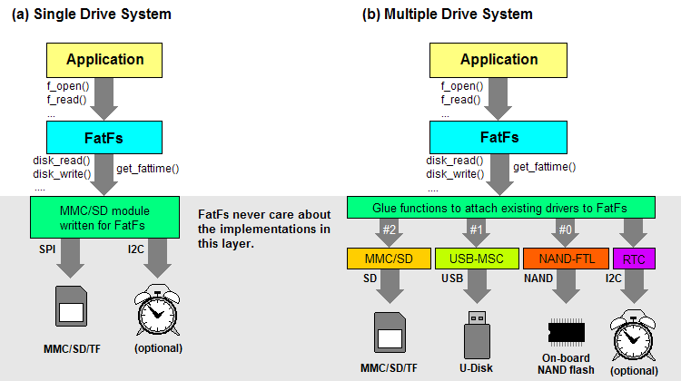

# FatFs 模块应用说明

## 1. 如何移植
Basic Considerations 
### 基本注意事项
The FatFs module assumes following conditions on portability.
FatFs 模块在可移植性方面假设以下条件。

ANSI C 
ANSI C
The FatFs module is a middleware written in ANSI C (C89). There is no platform dependence, so long as the compiler is in compliance with C89 or later. Only exFAT feature requires C99.
FatFs 模块是用 ANSI C （C89） 编写的中间件。只要编译器符合 C89 或更高版本，就没有平台依赖性。只有 exFAT 功能需要 C99。
Size of integer types 
整数类型的大小
Size of char must be 8-bit. 
的大小必须为 8 位。
Size of int, as well as integer promotion, must be 16-bit or 32-bit.
的大小以及整数提升都必须为 16 位或 32 位。
Size of short and long must be 16-bit and 32-bit respectively. (in C89 only)
的大小 和 必须分别为 16 位和 32 位。（仅限 C89）
Dependency 
屬地
C89: string.h. 
C89： .
C99: string.h and stdint.h. 
C99： 和 .
Optional: stdarg.h and math.h. 
可选：和 .
Integer Types in FatFs API 
### FatFs API 中的整数类型
Integer types used in FatFs are defined in ff.h as described below. It is based on Win32 API (windef.h). This will not be a problem on most platform. When a conflict with existing definitions occured, you must resolve it with care.
FatF 中使用的整数类型定义如下所述。它基于 Win32 API （）。这在大多数平台上都不是问题。当与现有定义发生冲突时，您必须小心解决。

BYTE
8-bit unsigned integer in range of 0 to 28 - 1.
8 位无符号整数，范围为 0 到 2 - 1。
WORD
16-bit unsigned integer in range of 0 to 216 - 1.
16 位无符号整数，范围为 0 到 2 - 1。
DWORD
32-bit unsigned integer in range of 0 to 232 - 1.
32 位无符号整数，范围为 0 到 2 - 1。
QWORD
64-bit unsigned integer in range of 0 to 264 - 1.
64 位无符号整数，范围为 0 到 2 - 1。
UINT
Alias of unsigned int used to specify any number.
别名 of 用于指定任何数字。
WCHAR
Alias of WORD used to specify a UTF-16 code unit.
别名 of 用于指定 UTF-16 代码单元。
TCHAR
Alias of char, WCHAR or DWORD used to specify a character encoding unit.
的别名 ，或用于指定字符编码单位。
FSIZE_t
Alias of DWORD or QWORD used to address file offset and to specify file size.
别名或用于解决文件偏移和指定文件大小。
LBA_t
Alias of DWORD or QWORD used to address sectors in LBA and to specify number of sectors.
别名或用于对 LBA 中的扇区进行寻址和指定扇区数。
System Organizations 
### 系统组织
The dependency diagram shown below is a typical, but not specific, configuration of the embedded system with FatFs module.
下面显示的依赖关系图是带有 FatFs 模块的嵌入式系统的典型配置，但不是特定的配置。

dependency diagram

(a) If a working disk module for FatFs is provided, nothing else will be needed. (b) To attach existing disk drivers with different interface, some glue functions are needed to translate the interfaces between FatFs and the driver.
（a） 如果为 FatFs 提供了可用的磁盘模块，则不需要任何其他内容。（b） 要附加具有不同接口的现有磁盘驱动程序，需要一些 glue 函数来转换 FatFs 和驱动程序之间的接口。

functional diagram

Required Functions 
### 所需功能
You need to provide only MAI functions required by FatFs module and nothing else. If a working device control module for the target system is available, you need to write only glue functions to attach it to the FatFs module. If not, you need to port another device control module or write it from scratch. Most of MAI functions are not that always required. For instance, the write function is not required in read-only configuration. Following table shows which function is required depends on the configuration options.
您只需提供 FatFs 模块所需的 MAI 函数，无需提供其他功能。如果目标系统有可用的工作设备控制模块，则只需编写 glue 函数即可将其附加到 FatFs 模块。如果没有，则需要移植另一个设备控制模块或从头开始编写。大多数 MAI 函数并不总是必需的。例如，只读配置中不需要 write 函数。下表显示了所需的函数取决于配置选项。

Function 
功能	Required when: 
在以下情况下是必需的：	Note
disk_status 
disk_status
disk_initialize 
disk_initialize
disk_read 
disk_read	Always 
总是	Disk I/O functions. 
磁盘 I/O 功能。
Samples available in ffsample.zip. 
样品以 ffsample.zip 提供。
There are many implementations on the web.
Web 上有许多实现。
disk_write 
disk_write
get_fattime 
get_fattime
disk_ioctl (CTRL_SYNC) 
disk_ioctl （CTRL_SYNC）	FF_FS_READONLY == 0 
FF_FS_READONLY == 0
disk_ioctl (GET_SECTOR_COUNT) 
disk_ioctl （GET_SECTOR_COUNT）
disk_ioctl (GET_BLOCK_SIZE) 
disk_ioctl （GET_BLOCK_SIZE）	FF_USE_MKFS == 1 
FF_USE_MKFS == 1
disk_ioctl (GET_SECTOR_SIZE) 
disk_ioctl （GET_SECTOR_SIZE）	FF_MAX_SS != FF_MIN_SS 
FF_MAX_SS ！= FF_MIN_SS
disk_ioctl (CTRL_TRIM) 
disk_ioctl （CTRL_TRIM）	FF_USE_TRIM == 1 
FF_USE_TRIM == 1
ff_uni2oem 
ff_uni2oem
ff_oem2uni 
ff_oem2uni
ff_wtoupper 
ff_wtoupper	FF_USE_LFN != 0 
FF_USE_LFN ！= 0	Unicode support functions. 
Unicode 支持函数。
Add optional module ffunicode.c to the project.
将可选模块 ffunicode.c 添加到项目中。
ff_mutex_create 
ff_mutex_create
ff_mutex_delete 
ff_mutex_delete
ff_mutex_take 
ff_mutex_take
ff_mutex_give 
ff_mutex_give	FF_FS_REENTRANT == 1 
FF_FS_REENTRANT == 1	O/S dependent functions. 
O/S 相关函数。
Sample code is available in ffsystem.c.
ffsystem.c 中提供了示例代码。
ff_mem_alloc 
ff_mem_alloc
ff_mem_free 
ff_mem_free	FF_USE_LFN == 3 
FF_USE_LFN == 3
FatFs cares about neither what kind of storage device is used nor how it is implemented. Only a requirement is that it is a block device read/written in fixed-size blocks that accessible via the disk I/O functions defined above.
FatFs 既不关心使用哪种存储设备，也不关心它是如何实现的。唯一的要求是它是一个以固定大小的块读取/写入的块设备，可通过上面定义的磁盘 I/O 功能访问。

Limits 
## 限制
Filesystem type: FAT, FAT32(rev0.0) and exFAT(rev1.0).
文件系统类型：FAT、FAT32（rev0.0） 和 exFAT（rev1.0）。
Number of open files: Unlimited. (depends on available memory)
打开的文件数：无限制。（取决于可用内存）
Number of volumes: Up to 10.
卷数：最多 10 个。
Sector size: 512, 1024, 2048 and 4096 bytes.
扇区大小：512、1024、2048 和 4096 字节。
Minimum volume size: 128 sectors. 
最小交易量大小：128 个扇区。
Maximum volume size: 232 - 1 sectors in 32-bit LBA, virtually unlimited in 64-bit LBA with exFAT.
最大卷大小：32 位 LBA 中 2 - 1 个扇区，使用 exFAT 的 64 位 LBA 中几乎不受限制。
Maximum file size: 232 - 1 bytes on FAT volume, virtually unlimited on exFAT volume.
最大文件大小：FAT 卷上为 2 - 1 字节，exFAT 卷上几乎不受限制。
Cluster size: Upto 128 sectors on FAT volume and up to 16 MB on exFAT volume.
集群大小：FAT 卷上最多 128 个扇区，exFAT 卷上最多 16 MB。
Memory Usage 
## 内存使用情况
The memory usage varies depends on the configuration options.
内存使用情况因配置选项而异。

ARM7
32bit 
ARM732 位	ARM7
Thumb 
ARM7拇指	CM3
Thumb-2 
CM3拇指-2	AVR	H8/300H 
H8/300H 系列	PIC24 
PIC24	RL78	V850ES 
V850ES 发动机	SH-2A 
SH-2A 型	RX600 
RX600 系列	IA-32 
IA-32 型
Compiler 
编译器	GCC	GCC	GCC	GCC	CH38	C30	CC78K0R 
CC78K0R	CA850 
CA850型	SHC	RXC	MSC
.text (Def, R/W) 
.text （def， r/w）	10.4k 
10,4 千米	6.7k	6.1k	12.5k 
12,5 千米	11.0k 
11,0 千米	11.4k 
11,4 千米	13.0k 
13,0 千米	8.9k	9.2k	6.5k	8.9k
.text (Min, R/W) 
.text （最小值、R/W）	7.0k	4.7k	4.2k	8.5k	7.6k	7.9k	9.5k	6.3k	6.4k	4.7k	6.4k
.text (Def, R/O) 
.text （def， r/o）	4.9k	3.2k	2.7k	6.1k	5.2k	5.4k	6.5k	4.3k	4.2k	3.2k	4.3k
.text (Min, R/O) 
.text （最小值、R/O）	3.7k	2.5k	2.1k	4.4k	4.0k	4.2k	5.1k	3.4k	3.3k	2.5k	3.5k
.bss	V*4 + 2 
V*4 + 2	V*4 + 2 
V*4 + 2	V*4 + 2 
V*4 + 2	V*2 + 2 
V*2 + 2	V*4 + 2 
V*4 + 2	V*2 + 2 
V*2 + 2	V*2 + 2 
V*2 + 2	V*4 + 2 
V*4 + 2	V*4 + 2 
V*4 + 2	V*4 + 2 
V*4 + 2	V*4 + 2 
V*4 + 2
Work area 
工作区域
(FF_FS_TINY == 0) 
（FF_FS_TINY == 0）	V*564 
V*564
+ F*552 
+ F*552	V*564 
V*564
+ F*552 
+ F*552	V*564 
V*564
+ F*552 
+ F*552	V*560 
V*560
+ F*546 
+ F*546	V*560 
V*560
+ F*546 
+ F*546	V*560 
V*560
+ F*546 
+ F*546	V*560 
V*560
+ F*546 
+ F*546	V*564 
V*564
+ F*552 
+ F*552	V*564 
V*564
+ F*552 
+ F*552	V*564 
V*564
+ F*552 
+ F*552	V*564 
V*564
+ F*552 
+ F*552
Work area 
工作区域
(FF_FS_TINY == 1) 
（FF_FS_TINY == 1）	V*564 
V*564
+ F*40 
+ F*40	V*564 
V*564
+ F*40 
+ F*40	V*564 
V*564
+ F*40 
+ F*40	V*560 
V*560
+ F*34 
+ F*34	V*560 
V*560
+ F*34 
+ F*34	V*560 
V*560
+ F*34 
+ F*34	V*560 
V*560
+ F*34 
+ F*34	V*564 
V*564
+ F*40 
+ F*40	V*564 
V*564
+ F*40 
+ F*40	V*564 
V*564
+ F*40 
+ F*40	V*564 
V*564
+ F*40 
+ F*40
These are the memory usage of FatFs module without lower layer on some target systems in following condition. V denotes number of mounted volumes and F denotes number of open files. Every samples here are optimezed in code size.
这些是 FatFs 模块在以下情况下，在一些目标系统上没有下层的内存使用情况。V 表示已挂载卷的数量，F 表示打开的文件的数量。这里的每个示例都优化了代码大小。

FatFs R0.15 options:
FF_FS_READONLY   0 (R/W, read/write) or 1 (R/O, read only)
FF_FS_MINIMIZE   0 (Def, with all basic functions) or 3 (Min, with fully minimized)
FF_FS_TINY       0 (Default) or 1 (Tiny file object)
And any other options are left unchanged from original setting.

FatFs R0.15 选项：FF_FS_READONLY 0（R/W，读/写）或 1（R/O，只读）FF_FS_MINIMIZE 0（Def，具有所有基本功能）或 3（Min，完全最小化）FF_FS_TINY 0（默认）或 1（微小文件对象）和任何其他选项都与原始设置保持不变。
Reducing Module Size 
## 减小模块尺寸
Follwing table shows which API function is removed by configuration options to reduce the module size. To use an API function, the row of the function must be clear.
下面的表格显示了配置选项删除了哪些 API 函数以减小模块大小。要使用 API 函数，该函数的行必须为空。

Function 
功能	FF_FS_
MINIMIZE 
FF_FS_MINIMIZE	FF_FS_
READONLY 
FF_FS_READONLY	FF_USE_
STRFUNC 
FF_USE_STRFUNC	FF_FS_
RPATH 
FF_FS_RPATH	FF_USE_
FIND 
FF_USE_FIND	FF_USE_
CHMOD 
FF_USE_CHMOD	FF_USE_
EXPAND 
FF_USE_EXPAND	FF_USE_
LABEL 
FF_USE_LABEL	FF_USE_
MKFS 
FF_USE_MKFS	FF_USE_
FORWARD 
FF_USE_FORWARD	FF_MULTI_
PARTITION 
FF_MULTI_PARTITION
0	1	2	3	0	1	0	1	0	1	2	0	1	0	1	0	1	0	1	0	1	0	1	0	1
f_mount 
f_mount																									
f_open 
f_open																									
f_close 
f_close																									
f_read 
f_read																									
f_write 
f_write						x																			
f_sync 
f_sync						x																			
f_lseek 
f_lseek				x																					
f_opendir 
f_opendir			x	x																					
f_closedir 
f_closedir			x	x																					
f_readdir			x	x																					
f_findfirst			x	x								x													
f_findnext			x	x								x													
f_stat		x	x	x																					
f_getfree		x	x	x		x																			
f_truncate		x	x	x		x																			
f_unlink		x	x	x		x																			
f_mkdir		x	x	x		x																			
f_rename		x	x	x		x																			
f_chdir									x																
f_chdrive									x																
f_getcwd									x	x															
f_chmod						x								x											
f_utime						x								x											
f_getlabel																		x							
f_setlabel						x												x							
f_expand						x										x									
f_forward																						x			
f_mkfs						x														x					
f_fdisk						x														x				x	
f_putc						x	x																		
f_puts						x	x																		
f_printf						x	x																		
f_gets							x																		
Long File Name
## 长文件名
FatFs module supports the long file name (LFN) extension of the FAT filesystem. The two different file names, short file name (SFN) and LFN, of a file are transparent on the API. The support for LFN feature is disabled by default. To enable the LFN, set FF_USE_LFN to 1, 2 or 3, and add ffunicode.c to the project. The LFN feature requiers a certain working buffer. The buffer size can be configured by FF_MAX_LFN according to the available memory. The LFN specification allows the length of LFN up to 255 characters, so that the FF_MAX_LFN should be set to 255 for every existing file name. If the size of working buffer is insufficient for the input file name, the file function fails with FR_INVALID_NAME. When use any re-entry to the file API with LFN feature in RTOS environment, FF_USE_LFN must be set to 2 or 3. In this case, the file function allocates the working buffer on the stack or heap. The LFN working buffer occupies (FF_MAX_LFN + 1) * 2 bytes and additional (FF_MAX_LFN + 44) / 15 * 32 bytes when exFAT is enabled.
FatFs 模块支持 FAT 文件系统的长文件名 （LFN） 扩展名。文件的两个不同文件名（短文件名 （SFN） 和 LFN）在 API 上是透明的。默认情况下，对 LFN 功能的支持处于关闭状态。要启用 LFN，请设置为 1、2 或 3，然后添加到项目中。LFN 功能需要一定的工作缓冲区。缓冲区大小可以根据可用内存进行配置。LFN 规范允许 LFN 的长度最多 255 个字符，因此对于每个现有文件名，应将其设置为 255。如果工作缓冲区的大小不足以容纳输入文件名，则 file 函数将失败。在 RTOS 环境中使用 LFN 功能对文件 API 的任何重新输入时，必须设置为 2 或 3。在这种情况下， file 函数在堆栈或堆上分配工作缓冲区。启用 exFAT 时，LFN 工作缓冲区会占用字节和其他字节。

Code Page and Module Size 
### 代码页和模块大小
With LFN at CM3 + gcc
LFN 为 CM3 + gcc
FF_CODE_PAGE	Code size 
代码大小
437-869 (SBCS) 
437-869 （SBCS）	+3.3k 
+3.3k
932 (Japanese) 
932 （日语）	+62k
936 (Simplified Chinese) 
936 （简体中文）	+177k 
+177 千
949 (Korean) 
949 （韩语）	+140k 
+140k
950 (Traditional Chinese) 
950 （繁体中文）	+111k 
+111k
0 (All code pages) 
0 （所有代码页）	+486k 
+486K
When the LFN is enabled, the module size will be increased depends on the configured code page. Right table shows the increment of code size in some code pages. Especially, in the CJK region, tens of thousands of characters are being used. Unfortunately, it requires a huge OEM-Unicode bidirectional conversion table and the module size will be drastically increased as shown in the table.
启用 LFN 后，模块大小将根据配置的代码页增加。右表显示了某些代码页中代码大小的增量。特别是在 CJK 地区，正在使用数以万计的字符。不幸的是，它需要一个巨大的 OEM-Unicode 双向转换表，并且模块大小将急剧增加，如图所示。

As the result, the FatFs with LFN enabled with DBCS code pages will not able to be ported on the most 8-bit MCU systems. If the target system is in legacy-free, in only Unicode and any ANSI/OEM code is not used at all, the code page setting is meaningless. You will able to reduce the code size by configureing FatFs for Unicode API with some SBCS code page.
因此，启用了 LFN 并带有 DBCS 代码页的 FatF 将无法移植到大多数 8 位 MCU 系统上。如果目标系统是非旧版的，仅采用 Unicode，并且根本不使用任何 ANSI/OEM 代码，则代码页设置将毫无意义。您可以通过使用一些 SBCS 代码页为 Unicode API 配置 FatFs 来减小代码大小。

There ware some restrictions on using the LFN in open source project, because the LFN extension on the FAT filesystem was a patent of Microsoft Corporation. However the related patents all have expired and using the LFN feature is free for any project.
在开源项目中使用 LFN 有一些限制，因为 FAT 文件系统上的 LFN 扩展名是 Microsoft Corporation 的专利。但是，相关专利都已过期，任何项目都可以免费使用 LFN 功能。

Unicode API 
## Unicode API
By default, FatFs uses ANSI/OEM code set on the API even in LFN configuration. FatFs can also switch the character encoding on the API to Unicode by configuration option FF_LFN_UNICODE. This means that FatFs is compliant with the full featured LFN specification. The data type TCHAR specifies path name strings on the API is an alias of either char(ANSI/OEM or UTF-8), WCHAR(UTF-16) or DWORD(UTF-32) depends on that option. For more information, refer to the description in the file name.
默认情况下，FatFs 使用 API 上设置的 ANSI/OEM 代码，即使在 LFN 配置中也是如此。FatFs 还可以通过 configuration option 将 API 上的字符编码切换到 Unicode。这意味着 FatFs 符合全功能 LFN 规范。数据类型指定 API 上的路径名称字符串是 （ANSI/OEM 或 UTF-8）、（UTF-16） 或 （UTF-32） 的别名，具体取决于该选项。有关更多信息，请参阅文件名中的描述。

Note that setting of code page, FF_CODE_PAGE, has actually no meaning when FatFs is configured for the Unicode API. It should be set 437 to reduce the module size. However it still affects code conversion of string I/O functions when FF_STRF_ENCODE == 0, and also backward compatibility with legacy systems. In this case, the code page may need to be configured properly if it is considered a problem.
请注意，当为 Unicode API 配置 FatFs 时，代码页的设置实际上没有任何意义。应将其设置为 437 以减小模块大小。但是，它仍然会影响字符串 I/O 函数的代码转换，并且还会影响与旧系统的向后兼容性。在这种情况下，如果认为代码页有问题，则可能需要正确配置代码页。

exFAT Filesystem 
## exFAT 文件系统
The exFAT (Microsoft's Extended File Allocation Table) filesystem is a succession of the FAT/FAT32 filesystem which has been widely used in embedded systems, consumer devices and portable storage media. It is adopted by SDA (SD Association) as the filesystem for SDXC card, 64 GB and larger, and they are being shipped with this format. Therefore the exFAT is one of the standard filesystems for removable media as well as FAT. The exFAT filesystem allows the file size beyond the 4 GB limit what FAT filesystem allows up to and some filesystem overhead, especially cluster allocation delay, are reduced as well. These features allow to record the large data without dividing into some files and improve the write throughput to the file.
exFAT（Microsoft 的扩展文件分配表）文件系统是 FAT/FAT32 文件系统的后续版本，已广泛用于嵌入式系统、消费类设备和便携式存储介质。它被 SDA（SD 协会）用作 SDXC 卡的文件系统，64 GB 及更大，它们以这种格式提供。因此，exFAT 是可移动媒体和 FAT 的标准文件系统之一。exFAT 文件系统允许文件大小超过 FAT 文件系统允许的 4 GB 限制，并且还会减少一些文件系统开销，尤其是群集分配延迟。这些功能允许记录大数据而不分成一些文件，并提高文件的写入吞吐量。

Note that the exFAT filesystem is a patent of Microsoft Corporation. The exFAT feature of FatFs is an implementation based on US. Pat. App. Pub. No. 2009/0164440 A1. FatFs module can switch the exFAT on or off by a configuration option, FF_FS_EXFAT. When enable the exFAT for the commercial products, a license by Microsoft will be needed depends on the final destination of the products.
请注意，exFAT 文件系统是 Microsoft Corporation 的专利。FatFs 的 exFAT 功能是基于 US 的实现。专利申请 Pub. No. 2009/0164440 A1.FatFs 模块可以通过配置选项 打开或关闭 exFAT。为商业产品启用 exFAT 时，需要 Microsoft 的许可证，具体取决于产品的最终目的地。

Remarks: Enabling exFAT discards C89 compatibility and it wants C99 because of need for 64-bit integer type.
备注：启用 exFAT 会丢弃 C89 兼容性，并且由于需要 64 位整数类型，因此需要 C99。

64-bit LBA 
## 64 位 LBA
LBA (Logical Block Addressing) is an addressing method to specify the location of data block, called sector, on the storage media. It is a simple linear address beginning from 0 as the first sector, 1 as the second sector and so on. The host system does not need to consider how the data block is located and managed in the storage device. FatFs supports only LBA for the media access. 32-bit LBA is a common size in the most LBA scheme. It can address up to 232 sectors, 2 TB in 512 bytes/sector. When a storage device larger than 2 TB is used, larger sector size or 64-bit LBA will be needed to address the entire sectors of the storage device.
LBA（逻辑块寻址）是一种寻址方法，用于指定数据块（称为扇区）在存储介质上的位置。它是一个简单的线性地址，从 0 开始作为第一个扇区，1 作为第二个扇区，依此类推。主机系统无需考虑如何在存储设备中定位和管理数据块。FatFs 仅支持 LBA 进行媒体访问。32 位 LBA 是大多数 LBA 方案中的常见大小。它最多可以处理 2 个扇区，2 TB，每个扇区 512 字节。当使用大于 2 TB 的存储设备时，将需要更大的扇区大小或 64 位 LBA 来寻址存储设备的整个扇区。

By default, FatFs works in 32-bit LBA for media access. FatFs can also switch it to 64-bit LBA by a configuration option FF_LBA64. It also enables GPT (GUID Partition Table) for partition management on the storage device. For further information about GPT, refer to f_mkfs and f_fdisk function.
默认情况下，FatFs 在 32 位 LBA 中用于媒体访问。FatFs 还可以通过 configuration option 将其切换到 64 位 LBA 。它还启用 GPT （GUID 分区表） 在存储设备上进行分区管理。有关 GPT 的更多信息，请参阅 和 函数.

Re-entrancy 
## 重入
The file operations of two tasks to the different volumes each other is always re-entrant and it can work concurrently without any mutual exclusion regardless of the configurations except when LFN is enabled with static working buffer (FF_USE_LFN = 1).
两个任务对不同卷的文件作始终是可重入的，并且无论配置如何，它都可以并发工作，没有任何互斥，除非使用静态工作缓冲区 （） 启用 LFN。

The file operations of two tasks to the same volume is not thread-safe by default. FatFs can also be configured to make it thread-safe by an option FF_FS_REENTRANT. When a file function is called while the volume is being accessed by another task, the file function to the volume will be suspended until that task leaves the file function. If the wait time exceeded a period defined by FF_TIMEOUT, the file function will abort with FR_TIMEOUT. The timeout feature might not be supported on the some OSs. To enable this feature, OS dependent synchronization control functions, ff_mutex_create/ff_mutex_delete/ff_mutex_take/ff_mutex_give, need to be added to the project. There is an example code in the ffsystem.c for some OSs.
默认情况下，对同一卷的两个任务的文件作不是线程安全的。FatFs 也可以通过选项 .当另一个任务正在访问卷时调用 file 函数时，该卷的 file 函数将被暂停，直到该任务离开 file 函数。如果等待时间超过 定义的时间段，则文件函数将中止。某些作系统可能不支持超时功能。要启用此功能，需要将依赖于作系统的同步控制函数 添加到项目中。对于某些作系统，有一个示例代码。

Note that there is an exception on the re-entrancy for f_mount and f_mkfs function. You will know why it is. These volume management functions are always not thread-safe to the volume being processed. When use these functions, other tasks need to avoid to access the corresponding volume.
请注意，and 函数的重入存在异常。你会知道为什么。这些卷 Management 函数对于正在处理的卷始终不是线程安全的。使用这些功能时，其他任务需要避免访问相应的卷。

Function	Case 1 
案例 1	Case 2 
案例 2	Case 3 
案例 3
disk_status 
disk_status	Yes	Yes	Yes(*) 
是（*）
disk_initialize 
disk_initialize	No	Yes	Yes(*) 
是（*）
disk_read 
disk_read	No	Yes	Yes(*) 
是（*）
disk_write 
disk_write	No	Yes	Yes(*) 
是（*）
disk_ioctl 
disk_ioctl	No	Yes	Yes(*) 
是（*）
get_fattime 
get_fattime	No	Yes	Yes
Case 1: Same volume.
Case 2: Different volume on the same drive.
Case 3: Different volume on the different drive.
(*) In only different drive number.
情况 1：相同的交易量。情况 2：同一驱动器上的卷不同。情况 3：不同驱动器上的卷不同。(*)仅在不同的驱动器编号中。
Remarks: This section describes on the re-entrancy of the FatFs module itself. The FF_FS_REENTRANT option enables only exclusive use of each filesystem objects and FatFs does not that prevent to re-enter the storage device control functions. Thus the device control layer needs to be always thread-safe when FatFs API is re-entered for different volumes. Right table shows which control function can be re-entered when FatFs API is re-entered on some conditions.
备注：本节介绍 FatFs 模块本身的重入性。该选项仅允许每个文件系统对象的独占使用，而 FatFs 不会阻止重新进入存储设备控制功能。因此，当为不同的卷重新输入 FatFs API 时，设备控制层需要始终是线程安全的。右表显示了在某些情况下重新输入 FatFs API 时可以重新进入的控制功能。

Duplicated File Open 
## 打开重复文件
FatFs module does not support the read/write collision control of duplicated open to a file. The duplicated open is permitted only when each of open method to a file is read mode. The duplicated open with one or more write mode to a file is always prohibited, and also open file must not be renamed or deleted. A violation of these rules can cause data collaption.
FatFs 模块不支持对重复打开的文件进行读/写冲突控制。仅当文件的每个 open 方法都是 read 模式时，才允许重复的 open。始终禁止使用一种或多种写入模式对文件进行重复的打开，并且打开的文件不得重命名或删除。违反这些规则可能会导致数据整理。

The file lock control can be enabled by FF_FS_LOCK option. The value of option defines the number of open objects to manage simultaneously. In this case, if any opening, renaming or removing against the file shareing rule that described above is attempted, the file function will be rejected with FR_LOCKED. If number of open objects, files and sub-directories, is equal to FF_FS_LOCK, an extra f_open/f_opendir function will fail with FR_TOO_MANY_OPEN_FILES.
可以通过 option 启用文件锁定控制。的值 option 定义要同时管理的打开对象的数量。在这种情况下，如果尝试根据上述文件共享规则进行任何打开、重命名或删除作，则文件函数将被拒绝并显示 。如果打开的对象、文件和子目录的数量等于 ，则额外的函数将失败，并显示 。

Performance Effective File Access 
## 性能 有效的文件访问
For good read/write throughput on the small embedded systems with limited size of memory, application programmer should consider what process is done in the FatFs module. The file data on the volume is transferred in following sequence by f_read function.
为了在内存大小有限的小型嵌入式系统上实现良好的读/写吞吐量，应用程序程序员应考虑在 FatFs 模块中完成什么过程。卷上的文件数据按功能按以下顺序传输。

Figure 1. Sector unaligned read (short)
图 1.扇区未对齐读取 （short）

Figure 2. Sector unaligned read (long)
图 2.扇区未对齐读取 （long）

Figure 3. Fully sector aligned read
图 3.完全扇区对齐的读取

The file I/O buffer is a sector buffer to read/write a part of data on the sector. The sector buffer is either file private sector buffer on each file object or shared sector buffer in the filesystem object. The buffer configuration option FF_FS_TINY determins which sector buffer is used for the file data transfer. When tiny buffer configuration (1) is selected, data memory consumption is reduced FF_MAX_SS bytes each file object. In this case, FatFs module uses only a sector buffer in the filesystem object for file data transfer and FAT/directory access. The disadvantage of the tiny buffer configuration is: the FAT data cached in the sector buffer will be lost by file data transfer and it must be reloaded at every cluster boundary. However it will be suitable for most application from view point of the decent performance and low memory comsumption.
文件 I/O 缓冲区是一个扇区缓冲区，用于读取/写入扇区上的一部分数据。扇区缓冲区是每个文件对象上的文件专用扇区缓冲区或文件系统对象中的共享扇区缓冲区。buffer 配置选项确定用于文件数据传输的扇区缓冲区。当选择微小缓冲区配置 （1） 时，每个文件对象的数据内存消耗将减少字节数。在这种情况下，FatFs 模块仅使用文件系统对象中的扇区缓冲区进行文件数据传输和 FAT/目录访问。微小缓冲区配置的缺点是：缓存在扇区缓冲区中的 FAT 数据将因文件数据传输而丢失，并且必须在每个集群边界重新加载。但是，从不错的性能和低内存消耗的角度来看，它将适合大多数应用程序。

Figure 1 shows that a partial sector, sector unaligned part of the file, is transferred via the file I/O buffer. At long data transfer shown in Figure 2, middle of transfer data that covers one or more sector is transferred to the application buffer directly. Figure 3 shows that the case of entier transfer data is aligned to the sector boundary. In this case, file I/O buffer is not used. On the direct transfer, the maximum extent of sectors are read with disk_read function at a time but the multiple sector transfer is divided at cluster boundary even if it is contiguous.
图 1 显示部分扇区，即文件的扇区未对齐部分，通过文件 I/O 缓冲区传输。在图 2 所示的长数据传输中，覆盖一个或多个扇区的传输数据直接传输到应用程序缓冲区。图 3 显示 entier 传输数据的情况与扇区边界对齐。在这种情况下，不使用文件 I/O 缓冲区。在直接传输中，一次使用函数读取最大扇区范围，但多扇区传输在群集边界进行划分，即使它是连续的。

Therefore taking effort to sector aligned read/write accesss eliminates buffered data transfer and the read/write performance will be improved. Besides the effect, cached FAT data will not be flushed by file data transfer at the tiny configuration, so that it can achieve same performance as non-tiny configuration with small memory footprint.
因此，努力进行扇区对齐的读/写访问可以消除缓冲数据传输，读/写性能将得到提高。除了效果之外，缓存的 FAT 数据不会被 tiny 配置的文件数据传输 flush，因此它可以达到与非 tiny 配置相同的性能，但占用的内存较小。

Considerations on Flash Memory Media 
## 闪存介质的注意事项
To maximize the write performance of flash memory media, such as SDC, CFC and U Disk, it must be controlled in consideration of its characteristitcs.
为了最大限度地提高 SDC、CFC 和 U Disk 等闪存介质的写入性能，必须考虑其特性进行控制。

Using Mutiple-Sector Write 
### 使用 multitiple-sector write
Figure 6. Comparison between Multiple/Single Sector Write
图 6.多扇区/单扇区写入之间的比较
fig.6
The write throughput of the flash memory media becomes the worst at single sector write transaction. The write throughput increases as the number of sectors per a write transaction as shown in Figure 6. This effect more appers at faster interface speed and the performance ratio often becomes grater than ten. This result is clearly explaining how fast is multiple block write (W:16K, 32 sectors) than single block write (W:100, 1 sector), and also larger card tends to be slow at single block write. Number of write transactions also affects life time of the flash memory media. When compared at same amount of write data, the single sector write in Figure 6 above wears flash memory media 16 times more than multiple sector write in Figure 6 below. Single sector write is pretty pain for the flash memory media.
闪存介质的写入吞吐量在单扇区写入事务中成为最差的。写入吞吐量随着每个写入事务的扇区数而增加，如图 6 所示。这种效果会以更快的接口速度获得更多的 appers，并且性能比率通常会变得比 10 更粗糙。这个结果清楚地解释了多块写入（W：16K，32 个扇区）比单块写入（W：100,1 个扇区）快得多，而且更大的卡在单块写入时往往很慢。写入事务数也会影响闪存介质的生命周期。在相同数量的写入数据下进行比较时，上图 6 中的单扇区写入比下面图 6 中的多扇区写入磨损的闪存介质多 16 倍。单扇区写入对于闪存介质来说是相当痛苦的。

Therefore the application program should write the data in large block as possible. The ideal write chunk size and alighment is size of sector, and size of cluster is the best. Of course all layers between the application and the storage device must have consideration on multiple sector write, however most of open-source memory card drivers lack it. Do not split a multiple sector write request into single sector write transactions or the write throughput gets poor. Note that FatFs module and its sample disk drivers supprt multiple sector read/write operation.
因此，应用程序应尽可能以大块写入数据。理想的写入块大小和强度是扇区大小，而集群大小是最好的。当然，应用程序和存储设备之间的所有层都必须考虑多扇区写入，但是大多数开源存储卡驱动程序都缺乏它。不要将多扇区写入请求拆分为单扇区写入事务，否则写入吞吐量会变差。请注意，FatFs 模块及其示例磁盘驱动程序支持多扇区读/写作。

Forcing Memory Erase 
### 强制擦除内存
When remove a file with f_unlink function, the data clusters occupied by the file are marked 'free' on the FAT. But the data sectors containing the file data are not that applied any process, so that the file data left occupies a part of the flash memory array as 'live block'. If the file data can be erased on removing the file, those data blocks will be turned into the free block pool. This may skip internal block erase operation to the data block on next write operation. As the result the write performance might be improved. FatFs can manage this function by setting FF_USE_TRIM to 1. Note that because this effect is from an expectation of internal process of the storage device, it is not that always effective. Most applications will not need this function. Also f_unlink function can take a time when remove a large file.
删除具有 function 的文件时，该文件占用的数据簇在 FAT 上标记为“free”。但是包含文件数据的数据扇区没有应用任何过程，因此留下的文件数据作为“活块”占据了闪存阵列的一部分。如果删除文件时可以擦除文件数据，则这些数据块将转换为空闲块池。这可能会在下一次写入作时跳过对数据块的内部块擦除作。因此，写入性能可能会得到提高。FatFs 可以通过设置为 1 来管理此功能。请注意，由于此效果来自对存储设备内部过程的期望，因此并不总是有效。大多数应用程序不需要此功能。此外，删除大文件时，函数可能需要一些时间。

Critical Section 
## 关键部分
If a write operation to the FAT volume is interrupted due to an accidental failure, such as sudden blackout, wrong media removal and unrecoverable disk error, the FAT structure on the volume can be broken. Following images shows the critical section of the FatFs module.
如果对 FAT 卷的写入作由于意外故障（如突然中断、错误的媒体删除和不可恢复的磁盘错误）而中断，则卷上的 FAT 结构可能会中断。下图显示了 FatFs 模块的关键部分。

Figure 4. Long critical section 
图 4.长临界段
fig.4Figure 5. Minimized critical section 
图 5.最小化临界部分
fig.5
An interruption in the red section can cause a cross link; as a result, the object being changed can be lost. If an interruption in the yellow section is occured, there is one or more possibility listed below.
红色部分的中断可能会导致交联;因此，正在更改的对象可能会丢失。如果黄色部分发生中断，则下面列出了一种或多种可能性。

The file data being rewrited is collapsed.
正在重写的文件数据将折叠。
The file being appended returns initial state.
被追加的文件返回初始状态。
The file created as new is gone.
作为 new 创建的文件将消失。
The file created as new or overwritten remains but no content.
作为新文件或覆盖创建的文件将保留，但不包含任何内容。
Efficiency of disk use gets worse due to lost clusters.
由于集群丢失，磁盘使用效率会变差。
Each case does not affect any file not opened in write mode. To minimize risk of data loss, the critical section can be minimized by minimizing the time that file is opened in write mode or using f_sync function as shown in Figure 5.
每种情况都不会影响未在写入模式下打开的任何文件。为了最大限度地降低数据丢失的风险，可以通过最小化文件在写入模式下打开的时间或使用 function 来最小化关键部分，如图 5 所示。

Various Usable Functions for FatFs Projects
## FatFs 项目的各种可用函数
These are examples of extended use of FatFs APIs. New item will be added when useful code example is found.
这些是扩展使用 FatFs API 的示例。当找到有用的代码示例时，将添加新项目。

Open or Create File for Append (superseded by FA_OPEN_APPEND flag added at R0.12)
Open 或 Create File for Append （被 R0.12 中添加的 FA_OPEN_APPEND 标志取代）
Delete Non-empty Sub-directory (for R0.12 and later)
删除非空子目录（适用于 R0.12 及更高版本）
Create Contiguous File (superseded by f_expand function added at R0.12)
创建连续文件（被 R0.12 中添加的 f_expand 函数取代）
Test if the File is Contiguous or Not
测试文件是否为连续文件
Compatibility Checker for Storage Device Control Module
存储设备控制模块兼容性检查器
Performance Checker for Storage Device Control Module
存储设备控制模块的性能检查器
FAT Volume Image Creator (Pre-creating built-in FAT volume)
FAT Volume Image Creator（预先创建内置 FAT 卷）
Virtual Drive Feature (refer to lpc176x/ in ffsample.zip)
虚拟驱动器功能（请参阅 ffsample.zip 中的 lpc176x/）
Embedded Unicode String Utilities (OEMxxx→Unicode, Unicode→OEMxxx, Unicode→Unicode)
嵌入式 Unicode 字符串实用程序（OEMxxx→Unicode、Unicode→OEMxxx、Unicode→Unicode）
About FatFs License 
## 关于 FatFs 许可证
FatFs has being developped as a personal project of the author, ChaN. It is free from the code anyone else wrote at current release. Following code block shows a copy of the FatFs license document that included in the source files.
FatFs 是作为作者 ChaN 的个人项目开发的。它不受当前版本中其他人编写的代码的影响。以下代码块显示了源文件中包含的 FatFs 许可证文档的副本。

/*----------------------------------------------------------------------------/
/  FatFs - Generic FAT Filesystem Module  Rx.xx                               /
/-----------------------------------------------------------------------------/
/
/ Copyright (C) 20xx, ChaN, all right reserved.
/
/ FatFs module is an open source software. Redistribution and use of FatFs in
/ source and binary forms, with or without modification, are permitted provided
/ that the following condition is met:
/
/ 1. Redistributions of source code must retain the above copyright notice,
/    this condition and the following disclaimer.
/
/ This software is provided by the copyright holder and contributors "AS IS"
/ and any warranties related to this software are DISCLAIMED.
/ The copyright owner or contributors be NOT LIABLE for any damages caused
/ by use of this software.
/----------------------------------------------------------------------------*/

/*----------------------------------------------------------------------------/ / FatFs - 通用 FAT 文件系统模块 Rx.xx / /-----------------------------------------------------------------------------/ / / 版权所有 （C） 20xx，ChaN，保留所有权利。FatFs 模块是一款开源软件。允许以 / 源和二进制形式重新分发和使用，无论是否修改，只要满足以下条件： / / 1.重新分发源代码必须保留上述版权声明、/本条件和以下免责声明。/ / 本软件由版权所有者和贡献者“按原样”提供 / 与本软件相关的任何保证均不予否认。/ 版权所有者或贡献者不对因使用本软件而造成的任何损害负责。/----------------------------------------------------------------------------*/
Therefore FatFs license is one of the BSD-style licenses but there is a significant feature. FatFs is mainly intended for embedded systems. In order to extend the usability for commercial products, the redistributions of FatFs in binary form, such as embedded code, binary library and any forms without source code, does not need to include about FatFs in the documentations. This is equivalent to the 1-clause BSD license. Of course FatFs is compatible with the most of open source software licenses includes GNU GPL. When you redistribute the FatFs source code with any changes or create a fork, the license can also be changed to GNU GPL, BSD-style license or any open source software license that compatible with FatFs license.
因此，FatFs 许可证是 BSD 风格的许可证之一，但有一个重要的功能。FatFs 主要用于嵌入式系统。为了扩展商业产品的可用性，二进制形式的 FatFs 的重新分发，例如嵌入式代码、二进制库和任何没有源代码的形式，不需要在文档中包含有关 FatFs 的信息。这相当于 1-clause BSD 许可证。当然，FatFs 与大多数开源软件许可证兼容，包括 GNU GPL。当您重新分发 FatFs 源代码并进行任何更改或创建分支时，许可证也可以更改为 GNU GPL、BSD 样式许可证或任何与 FatFs 许可证兼容的开源软件许可证。