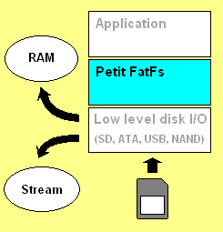

# Petit FatFs文件系统介绍
Petit FatFs 是用于微型 8 位微控制器的 FatFs 模块的子集，它是按照ANSI C编写的。

如下图所示，Petit FatFs 与磁盘 I/O 层完全分离。即使 RAM 大小小于扇区大小，它也可以集成到内存有限的微型微控制器中。功能更齐全的 FAT 文件系统模块可以看 [FatFS](./01.FatFs介绍.md).

**特征**
- 非常小的内存消耗（44 KB工作区 + 固定堆栈）。
- 非常小的代码大小（2K-4K字节）。
- FAT 12、FAT 16和FAT32。
- 单个卷和单个文件。
- 流式文件读取。
- 有一些限制的文件写入功能。

## 1. 应用接口
Petit FatFs 模块提供以下功能。
- `pfmount` -挂载卷
- `pfopen` -打开文件
- `pfread` -读取文件
- `pfwrite` -写入文件
- `pflseek` -移动读/写指针
- `pfopendir` -打开目录
- `pf_readdir` -读取目录项

## 2. 磁盘I/O接口
由于 Petit FatFs 模块与磁盘 I/O 层完全分离，因此它需要以下功能到较低层以从存储设备读取数据。底层磁盘I/O 模块不是 Petit FatFs 模块的一部分，必须由用户提供。参考资料中还提供了示例驱动程序。

- `diskinitialize`-初始化存储设备
- `diskreadp`-读取部分扇区
- `disk_writep`-分区写入扇区