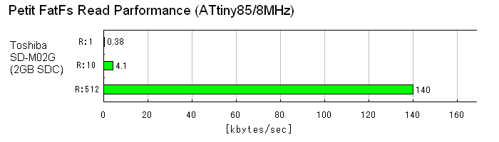

# Petit FatFs文件系统介绍

## 1. 基本注意事项
以下是 FatFs 模块可移植性的假定条件。
- **ANSI C**
    - Petit FatFs 模块是用 ANSI C（C89）编写的中间件。没有平台依赖性，只要编译器符合 C89 或更高版本。
- **整数类型的大小**
    - char 的大小必须为 8 位。
    - int 的大小以及整数提升必须是 16 位或 32 位。
    - 当 C标准在 C89时，short 和 long 类型的大小必须分别为 16 位和 32 位。
    - 在 C99 或更高版本中，stdint.h 用于获得正确的大小。
    - Petit FatFs 中使用的数据类型在 pff.h 中定义。这在大多数平台上都不是问题。当与现有定义发生冲突时，必须小心解决。

## 2. 内存使用情况
<table class="lst2">
<tbody><tr><th></th><th>AVR</th><th>PIC24</th><th>CM0</th></tr>
<tr class="cal"><td>Compiler</td><td>gcc</td><td>C30</td><td>gcc</td></tr>
<tr class="ral"><td class="cal">text (default)</td><td>1948</td><td>1962</td><td>1114</td></tr>
<tr class="ral"><td class="cal">text (!PF_USE_READ)</td><td>-356</td><td>-288</td><td>-196</td></tr>
<tr class="ral"><td class="cal">text (PF_USE_DIR)</td><td>+552</td><td>+528</td><td>+370</td></tr>
<tr class="ral"><td class="cal">text (PF_USE_LSEEK)</td><td>+474</td><td>+432</td><td>+172</td></tr>
<tr class="ral"><td class="cal">text (PF_USE_WRITE)</td><td>+440</td><td>+453</td><td>+276</td></tr>
<tr class="ral"><td class="cal">bss</td><td>2</td><td>2</td><td>4</td></tr>
<tr class="ral"><td class="cal">Work</td><td>42</td><td>42</td><td>44</td></tr>
</tbody></table>

其他选项设置为: PF_FS_FAT16 = 1, PF_FS_FAT12 = 0, PF_FS_FAT32 = 0 且 PF_USE_LCC = 0. 

以上是 Petit FatFs 模块自身的内存大小。为了实现完整的功能，还需要低级磁盘 I/O 模块。例如，AVR 的 MMC/SDC 模块在不带写功能时大小约为 620 字节，带写功能时约为 840 字节。

## 3. 缩减模块大小
以下表格展示了通过配置选项移除函数来减小模块大小：
<table class="lst2">
<tbody><tr><td rowspan="2">Function</td><td>PF_USE_READ</td><td>PF_USE_DIR</td><td>PF_USE_LSEEK</td><td>PF_USE_WRITE</td></tr>
<tr><td>0</td><td>0</td><td>0</td><td>0</td></tr>
<tr class="lst3"><td>pf_mount</td><td></td><td></td><td></td><td></td></tr>
<tr><td>pf_open</td><td></td><td></td><td></td><td></td></tr>
<tr><td>pf_read</td><td>x</td><td></td><td></td><td></td></tr>
<tr><td>pf_lseek</td><td></td><td></td><td>x</td><td></td></tr>
<tr><td>pf_opendir</td><td></td><td>x</td><td></td><td></td></tr>
<tr><td>pf_readdir</td><td></td><td>x</td><td></td><td></td></tr>
<tr><td>pf_write</td><td></td><td></td><td></td><td>x</td></tr>
</tbody></table>

## 4. 高效性能的文件访问
为了在小型嵌入式系统上实现良好的文件读取性能，应用程序开发人员应考虑文件系统模块中执行的处理过程。

Petit FatFs 在没有扇区缓冲区的情况下读取磁盘扇区。这意味着文件系统在每次引用点读取包含所需数据的扇区部分，即使它们位于同一扇区中。然而，通用存储设备不是字节可寻址的，因此磁盘I/O层将读取整个扇区并从读取的数据流中提取数据字节。

当一次从文件中读取 512 字节数据时，数据扇区只会被读取一次。如果以逐字节的方式读取该数据，数据扇区将被读取 512 次。因此，逐字节读取请求将显著降低读取性能。

为了避免这种低效的读取控制，文件数据应尽可能以长块的形式读取。在Petit FatFs 中，扇区对齐访问并不重要。

Petit FatFs 针对的微型微控制器的 RAM 容量有限。它可能无法分配特定大小的读取缓冲区，而大多数文本处理都需要逐字节读取操作。为此，Petit FatFs 支持数据转发功能。

