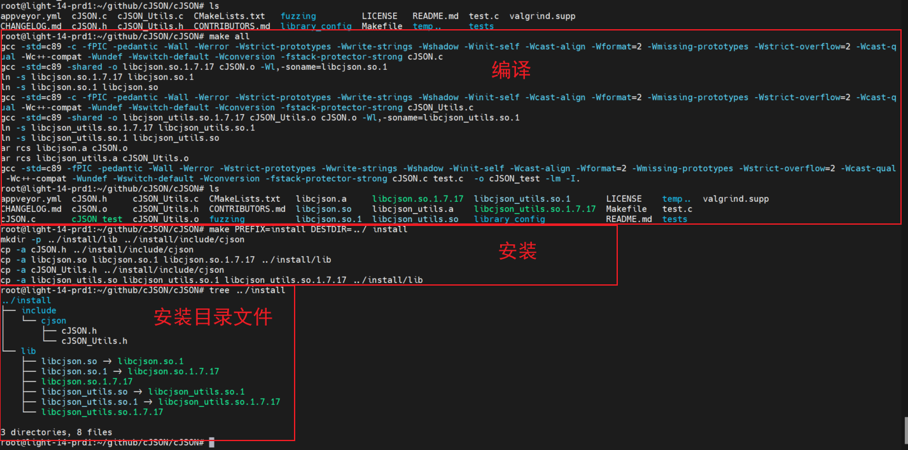

# cJSON 的介绍和安装

## 1. JSON 格式介绍
JSON是一种轻量级的数据交换格式，可读性强、编写简单。键值对组合编写规则，键名使用双引号包裹，冒号：分隔符后面紧跟着数值，有两种常用的数据类型是对象和数组。

对象：使用花括号 { } 包裹起来的内容，数据结构 {"key1": "value1", "key2":"value2" ......}，key为对象的属性，value 为对象的值。

数值：使用中括号 [ ] 包裹起来的内容，数据结构 {"key": ["value1", "value2", "value3" ......]} 。

```json
1. {"name": "JSON"}
2. {"object": "student",
    "info": [
         {
             "name": "lily",
             "age": 20 
         },
         {
              "name":"luci",
              "age":23
          }
       ]
    }
```

## 2. cJSON 安装步骤
### 2.1. 下载 cJSON 源码
- 下载开源库源码，下载地址，可以直接下载发布版的压缩包：
    - [GitHub 项目地址](https://github.com/DaveGamble/cJSON) 。
    - [cJSON Github SSH地址](git@github.com:DaveGamble/cJSON.git)。
    - [cJSON Github HTTPS地址](https://github.com/DaveGamble/cJSON.git)。

- 如果安装了 GIT 工具，可以使用 `git clone` 命令下载。
    ```bash
    git clone https://github.com/DaveGamble/cJSON.git
    ```

### 2.2. 编译和安装
1. 解压并安装到库环境中，如果在交叉编译环境使用，需要交叉编译器编译，并将安装路径下的 lib 放到目标机文件系统。
    ```bash
    # 解压压缩文件（如果使用 git 命令下载则不用解压）
    tar -xvf cJSON-1.3.2.tar.gz
    cd cJSON-1.3.2

    # 编译
    sudo make

    # 安装，可以指定安装路径，示例中的路径指定为 `temp/usr`
    sudo make {PREFIX=/usr} {DESTDIR=temp} install
    ldconfig
    ```

2. 如果采用默认方式安装，默认安装的头文件路径为 `/usr/local/include/cjson` ，默认安装的库文件路径为 `/usr/local/lib` 。
如果需要修改安装目录，可以在安装步骤使用： `make PREFIX=/usr DESTDIR=temp install` 命令指定安装目录，如果需要卸载时，可以使用：`make PREFIX=/usr DESTDIR=temp uninstall` 卸载安装路径下的已安装文件。

3. 完整的安装情况如下：

    

## 3. 常用库函数简介

### 3.1. 创建函数
```C
函数：extern cJSON *cJSON_CreateObject(void)
用法：创建JSON结构对象

函数：extern cJSON *cJSON_CreateNumber(double num)
用法：创建一个整型的数据类型

函数：extern cJSON *cJSON_CreateString(const char *string)
用法：创建一个字符串数据类型

函数：extern cJSON *cJSON_CreateArray(void)
用法：创建一个数组数据类型函数：

cJSON *cJSON_CreateIntArray(const int *numbers, int count)
用法：将多个整型数据类型增加到数组中
```

### 3.2. 解析函数
```C
函数：extern cJSON *cJSON_Parse(const char *value)
用法：从JSON文件数据缓冲区解析JSON的对象结构，使用完成后要必须要释放对象结构
```

### 3.3. 打印
```C
函数：extern char *cJSON_Print(cJSON *item)
用法：将传入JSON结构对象转换为字符串
```

### 3.4. 释放
```C
函数：void cJSON_Delete(cJSON *c)
用法：释放申请的JSON结构缓存空间
```

### 3.5. 添加
```C
函数：void cJSON_AddItemToArray(cJSON *array, cJSON *item)
用法：将数组增加到JSON对象中

函数：void cJSON_AddItemToObject(cJSON *json, cJSON *, cJSON_CreateArray())
用法：向对象中增加对象

函数：void cJSON_AddItemToArray(cJSON *array, cJSON *item)
用法：向数组中增加对象
```

### 3.6. 获取
```C
函数：extern cJSON *cJSON_GetObjectItem(cJSON *object, const char *string)
用法：根据键名在JSON中查找子节点

函数：extern int cJSON_HasObjectItem(cJSON *object, const char *string)
用法：判断JSON对象是否包含键名string。

函数：extern int cJSON_GetArraySize(cJSON *array)
用法：获取数组的大小

函数：extern cJSON *cJSON_GetArrayItem(cJSON *array, int index)
用法：在数组查找指定下标的节点对象
```
