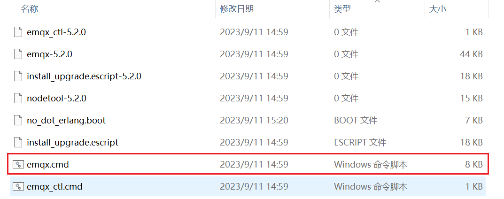
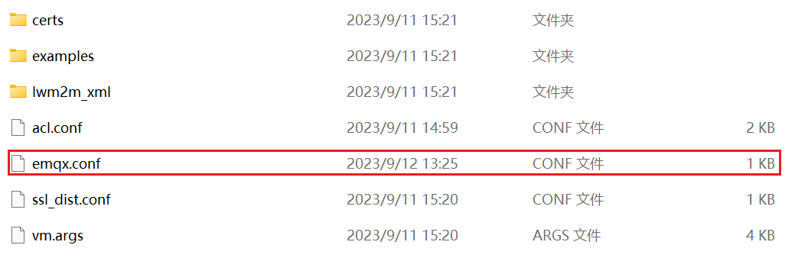

# MQTT 服务器搭建

`Windows` 下搭建 MQTT 服务器需要用到开源软件 `EMQX` ，可以在 `GitHub` 项目上下载，或使用 `git` 工具获取。

点击 [EMQX项目仓库地址](https://github.com/emqx/emqx.git)

## 1. emqx 工具的快速使用

1. 在 `Windows` 资源管理器中，进入解压目录下的 `bin` 目录，里面有个脚本 `emqx.cmd` ；
    
    

2. 用 `Windows` 终端方式（cmd），运行该脚本：

    ```powershell
        PS D:\Software\emqx-windows\bin> .\emqx.cmd start

        #出现以下打印即服务器开启成功
        EMQX_NODE__DB_ROLE [node.role]: core
        EMQX_NODE__DB_BACKEND [node.db_backend]: mnesia
    ```
    
## 2. MQTT 服务器地址配置

在 `etc/` 目录下有一个配置文件 emqx.conf ，可以在该配置文件中修改服务器 IP 地址以及管理网页端口。



文件内容如下：
```ini
node {
  name = "emqx@192.168.1.15"
  cookie = "emqxsecretcookie"
  data_dir = "data"
}

cluster {
  name = emqxcl
  discovery_strategy = manual
}

dashboard {
    listeners.http {
        bind = 18083
    }
}
```
其中：
- 修改 `192.168.1.15` 即可改变 `MQTT` 服务器的地址；
- `bind = 18083` 中的端口不是 `MQTT` 的地址，只是登录管理网页的端口地址，`MQTT` 地址默认为 `1883`.

## 3. MQTT 服务器的管理网页
### 3.1. 网页端登录
该开源项目中有一个 `MQTT` 服务器的管理网页，登录方式在网络浏览器中输入 "`192.168.1.15:18083`" 即可进入登录界面。

- 登录的默认用户名为 `admin1` ，默认密码为 `public` ，第一次运行登录会要求重新修改密码。
- 具体的 MQTT 相关管理参数在该网页进行修改和监控监听。

### 3.2. 修改密码
当密码忘记时，可以通过命令行重新设置密码：
```shell
PS D:\Software\emqx-windows\bin> .\emqx.cmd ctl admins passwd admin admin123456
ok
```

## 4. MQTT 服务器默认参数介绍
### 4.1. EMQX 使用不同协议栈的默认端口
| 端口 | 描述 |
| --- | --- |
| 8083 | mqtt ws 监听端口 |
| 8084 | mqtt wss 监听端口 |
| 1883 | mqtt tcp 监听端口 |
| 8883 | mqtt ssl 监听端口 |
| 18083 | http 监听端口 |
| 4370 | Erlang 分布端口 |
| 5370 | 集群 RPC 端口 |

 4.x 版本的时候还有8081端口，不过在EMQX 5.x时，被合并到18083

 如果需要修改默认端口，需要在 `/etc/emqx.conf` 文件中修改。
