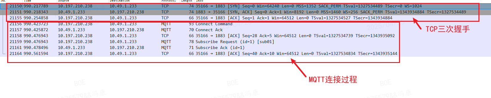
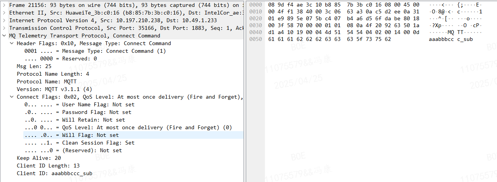
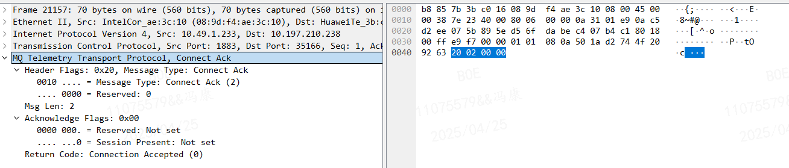
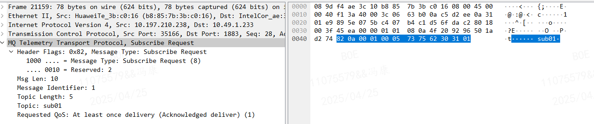
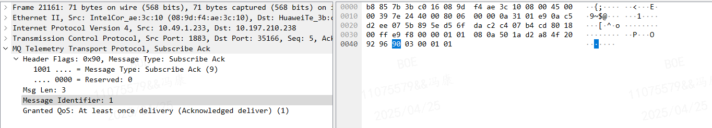

# 根据 Wireshark 抓包工具学习 MQTT 协议报文解析

文章仅对抓包的过程进行解析，不涉及 MQTT 协议的详细讲解，具体的协议标准参考可以查看：
- [MQTT-3.1.1中文版](MQTT-3.1.1-CN.html)

## 1. MQTT 测试环境说明
- MQTT 服务器：
    - 使用 Windows 电脑；
    - IP 地址：10.49.1.233 ；
    - MQTT 服务器搭建采用 EMQX 工具；
- MQTT 客户端：
    - 使用 Linux 服务器，用 Windows 电脑使用 SSH 协议远程；
    - IP 地址：10.197.210.238 ；
    - MQTT 客户端搭建采用 paho_mqtt_c 开源库的客户端 demo；
    - 订阅主题 `sub01`
- 抓包工具：[Wireshark](https://www.wireshark.org/)
- 传输方式：TCP

------------------

## 2. MQTT 明文传输抓包过程
### 2.1 MQTT 程序运行过程
0. 打开 Wireshark 工具，选择网络接口，开始抓包（由于 SSH 远程方式，频繁有数据传输，这里设置筛选条件 `(ip.addr ==  10.197.210.238) && !ssh && tcp.port != 22` 筛选出客户端IP，屏蔽 22 端口）；
1. 使用 `.\emqx.exe start` 启动 EMQX 服务器；
2. 使用 `./mqtt_client` 启动 MQTT 客户端，客户端发起 MQTT 连接；
3. 使用 MQTTX 工具连接到 EMQX 服务器，并订阅主题 `sub01`；
4. 使用 MQTTX 工具发布消息到主题 `sub01`；
5. 使用 MQTTX 工具断开连接；
6. 使用 `./mqtt_client` 客户端断开连接；
7. 使用 `.\emqx.exe stop` 停止 EMQX 服务器；

### 2.2 Wireshark 抓包完整过程
#### 2.2.1. MQTT 连接过程
在还未使用 MQTTX 工具往 topic 发送消息时，会先建立连接，建立连接的过程如下：

- 先建立 TCP 的连接，即 TCP 三次握手；
- 再建立 MQTT 连接，即图中的 `Connect Command` 和 `Connect Ack`;
- 订阅主题 Topic ，即图中的 `Subscribe Request` 和 `Subscribe Ack`;

**1. Connect Command 报文分析**

根据报文分析可知，连接命令控制报文主要包括控制类型、协议版本、连接标志、保持连接时间、客户端标识符等字段；

**2. Connect Ack 报文分析**

连接确认报文不包含特殊信息，仅表示连接结果确认；

**3. Subscribe Request 报文分析**

主题订阅控制报文主要包括控制类型、消息ID、主题名等字段；

**4. Subscribe Ack 报文分析**

主题订阅控制报文主要包括控制类型、消息ID、QOS等字段；
