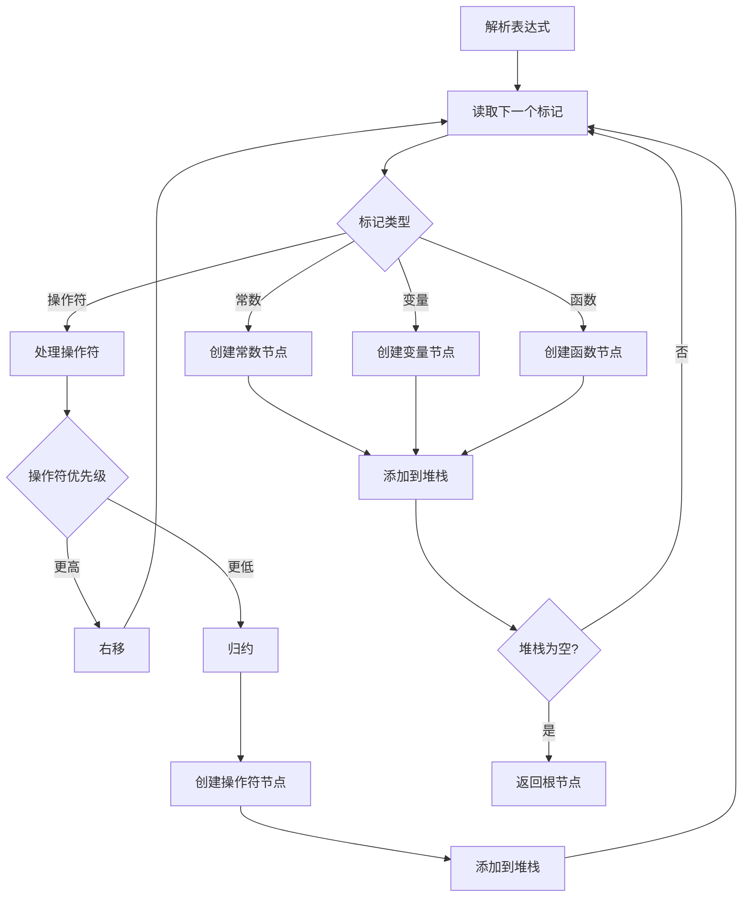
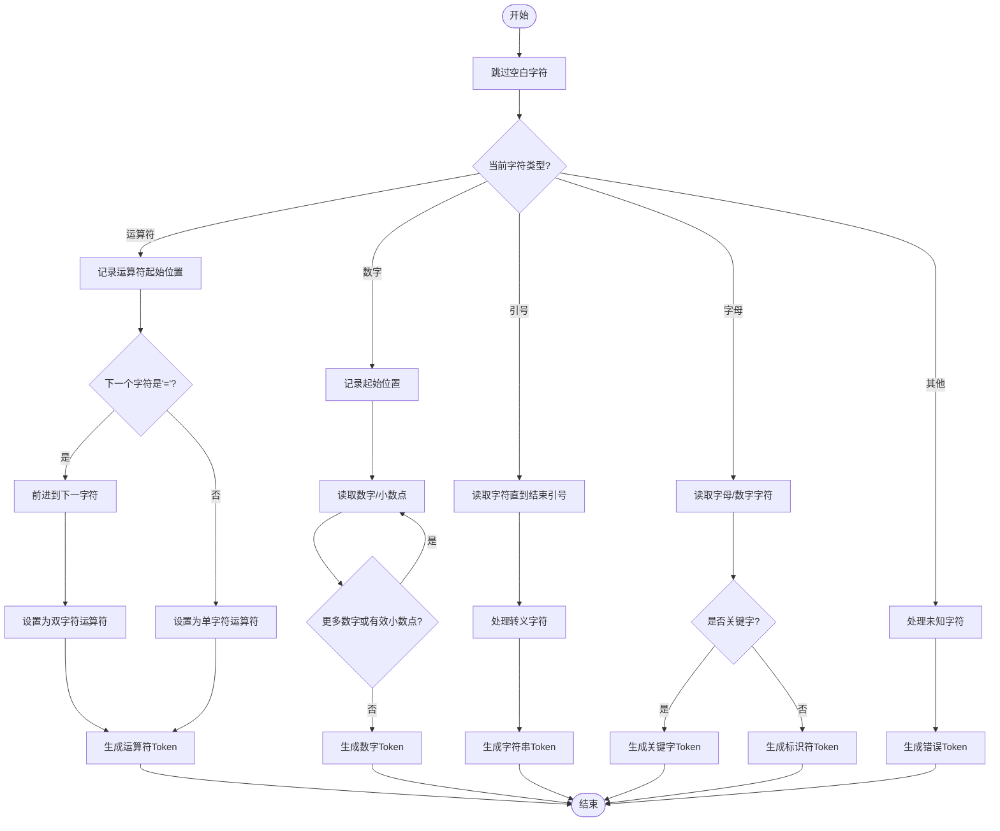

# Tinyexpr 用于解析和求职数学表达式

tinyexpr 是一个简洁且功能强大的数学表达式解析库。通过解析表达式字符串生成表达式树，并提供求值和变量设置的功能。使用 tinyexpr 可以轻松地在 C 语言程序中处理复杂的数学表达式。

## 1. 文件结构
tinyexpr 是一个轻量级的 C 语言库，用于解析和求值数学表达式。它支持基本的数学运算符和函数，并且非常易于使用和集成。

其源码数量非常少，主要包含以下几个文件：

- `tinyexpr.h`：头文件，包含了库的声明和函数原型。
- `tinyexpr.c`：源文件，包含了库的实现。

使用时，仅需要将这两个文件加入工程目录即可，除此之外，该库文件中，还包括一些测试用例和使用实例代码。

## 2. 程序框架


### 2.1. 主要库函数
主要包括一个结构体和多个函数：
```c
/* 表达式结构体，用于存储解析后的表达式，将表达式分为：数值、已绑定的变量、运算函数 */
typedef struct te_expr {
    int type;
    union {double value; const double *bound; const void *function;};
    void *parameters[1];
} te_expr;

typedef struct te_variable {
    const char *name;
    const void *address;
    int type;
    void *context;
} te_variable;

/* 解析输入表达式，求值并释放 */
/* Parses the input expression, evaluates it, and frees it. */
/* Returns NaN on error. */
double te_interp(const char *expression, int *error);

/* 解析输入表达式并绑定变量 */
/* Parses the input expression and binds variables. */
/* Returns NULL on error. */
te_expr *te_compile(const char *expression, const te_variable *variables, int var_count, int *error);

/* 计算表达式 */
/* Evaluates the expression. */
double te_eval(const te_expr *n);

/* 在语法树上打印调试信息 */
/* Prints debugging information on the syntax tree. */
void te_print(const te_expr *n);

/* Frees the expression. */
/* This is safe to call on NULL pointers. */
void te_free(te_expr *n);
```

## 3. 接口函数
主要分为三个函数，其中：
- `te_compile()` 用于表达式的解析，并返回绑定的变量；
- `te_eval` 用于表达式的计算，返回表达式计算结果；
- `te_interp()` 用于无变量的表达式解析和计算，即纯数值计算，是 `te_compile()` 无变量形参加入计算时，返回的 `te_eval` 函数计算结果。

### 3.1. 解析函数层级

```c
    <list>      =    <expr> {"," <expr>}
    <expr>      =    <term> {("+" | "-") <term>}
    <term>      =    <factor> {("*" | "/" | "%") <factor>}
    <factor>    =    <power> {"^" <power>}
    <power>     =    {("-" | "+")} <base>
    <base>      =    <constant>
                   | <variable>
                   | <function-0> {"(" ")"}
                   | <function-1> <power>
                   | <function-X> "(" <expr> {"," <expr>} ")"
                   | "(" <list> ")"
```
有效的变量名由字母和以下任意组合组成：
- 字母、数字*0*到*9*、和下划线。常量可以是整数。
- 浮点数，可以是十进制、十六进制（例如*0x57CEF7*），
- 科学记数法（例如*1e3*表示*1000*）。
- 不需要前导零（例如，*.5*表示*0.5*）。


## 4. 静态函数
以下函数是静态函数，仅在 `tinyexpr.c` 中使用。不对外接口公开，但是为关键函数：
### 4.1. next_token 函数
用于解析表达式中包含的信息，并将信息解析成数值、未知数、函数等。

函数原型
```c
void next_token(state *s)
```
用于解析当前表达式，生成下一个token。

该函数仅用于解析表达式字符串中下一个类型，不进行计算，正常解析到后就会返回。



### 4.2. find_lookup 函数
用于查找并识别设置的变量，如未知数 x，y，z 等。

其中，`s->lookup` 来自 next_token 函数调用前输入的 te_variable 变量。

函数原型：
```c
static const te_variable *find_lookup(const state *s, const char *name, int len) {
    int iters;
    const te_variable *var;
    if (!s->lookup) return 0;

    for (var = s->lookup, iters = s->lookup_len; iters; ++var, --iters) {
        if (strncmp(name, var->name, len) == 0 && var->name[len] == '\0') {
            return var;
        }
    }
    return 0;
}

```

### 4.3. find_builtin 函数
使用二分查找算法，在函数表中查找指定的函数，函数表即已经按顺序排列的 `functions[i]` 结构体数组。

函数原型：
```c
static const te_variable *find_builtin(const char *name, int len) {
    int imin = 0;
    int imax = sizeof(functions) / sizeof(te_variable) - 2;

    /*Binary search.*/
    while (imax >= imin) {
        /* 防止溢出 */
        const int i = (imin + ((imax-imin)/2));
        /* function包含所有的函数名称，已经按名称字母顺序排列。
         * strncmp 可以比较当前名称是否与当前 i 角标下的 function 名称相同，返回 0
         * 如果字母大于 i 角标下的 function 名称，返回正数，反之返回负数 */
        int c = strncmp(name, functions[i].name, len);
        /* 判断字节长度，如果比对完成后，发现名称找到的函数名后续仍有数据，则返回负值，类似于cos找到了cosh */
        if (!c) c = '\0' - functions[i].name[len];
        if (c == 0) {
            return functions + i;
        } else if (c > 0) {
            imin = i + 1;
        } else {
            imax = i - 1;
        }
    }

    return 0;
}
```

## 5. 使用 demo
### 5.1. 无变量表达式使用
```c
#include "tinyexpr.h"
#include <stdio.h>

int main(int argc, char *argv[])
{
    const char *c = "sqrt(5^2+7^2+11^2+(8-2)^2)";
    double r = te_interp(c, 0);
    printf("The expression:\n\t%s\nevaluates to:\n\t%f\n", c, r);
    return 0;
}
```

### 5.2. 带变量表达式使用
```c
#include "tinyexpr.h"
#include <stdio.h>

int main(int argc, char *argv[])
{
    if (argc < 2) {
        printf("Usage: example2 \"expression\"\n");
        return 0;
    }

    const char *expression = argv[1];
    printf("Evaluating:\n\t%s\n", expression);

    /* 绑定变量 x 和 y */
    double x, y;
    te_variable vars[] = {{"x", &x}, {"y", &y}};

    /* 表达式解析 */
    int err;
    te_expr *n = te_compile(expression, vars, 2, &err);

    if (n) {
        /* 变量赋值后进行计算 */
        x = 3; y = 4;
        const double r = te_eval(n); printf("Result:\n\t%f\n", r);

        te_free(n);
    } else {
        /* Show the user where the error is at. */
        printf("\t%*s^\nError near here", err-1, "");
    }

    return 0;
}
```