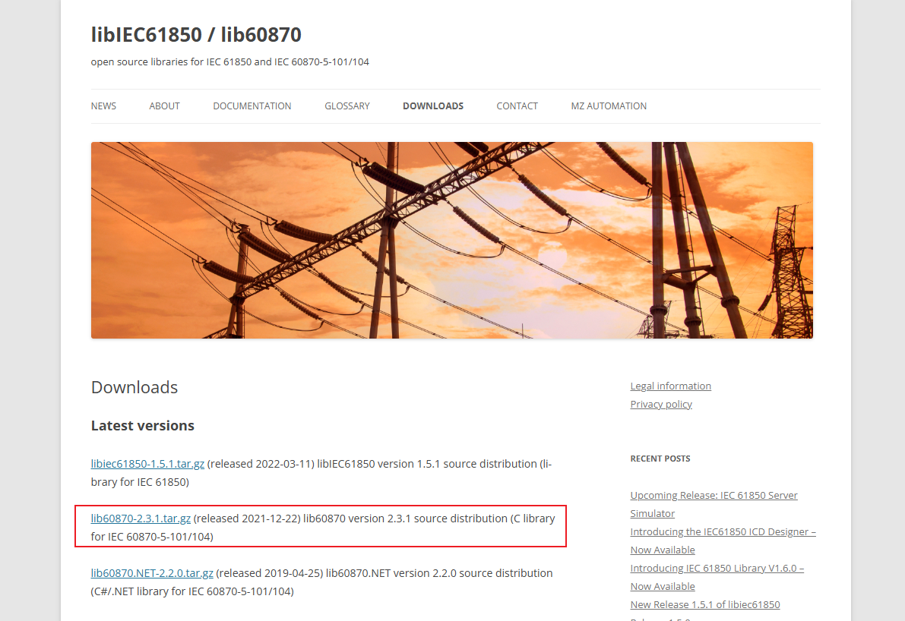

# lib60870 介绍

lib60870 是一个基于 C 语言编写的 IEC 60870-5 协议库。

当前实现包含了 IEC 60870-5-101（应用层和串行链路层）和 IEC 60870-5-104（基于 TCP/IP 的协议）规范中的代码。

主要功能：
- 支持所有应用层消息类型
- 主站和从站
- 平衡和非平衡链路层（用于 CS 101 串行通信）
- CS 104 TCP/IP 通信的客户端/服务器
- CS 104 冗余组支持
- 可移植的 C99 代码

请参考用户指南和 API 参考文档（https://support.mz-automation.de/doc/lib60870/latest/）

## 1. lib60870 代码的下载
lib60870 的源代码可以从开源库的网站直接点击下载：
[libIEC61850 / lib60870](https://libiec61850.com/downloads/)



## 2. 代码库的目录结构
### 2.1. 一级目录介绍
将代码库解压到本地后，可以看到以下一级目录的结构：
```bash
.
├── CHANGELOG
├── COPYING
├── lib60870-C
├── README.md
└── user_guide.adoc
```

这些文件夹有不同的作用：
- CHANGELOG：记录了代码库的更新日志
- COPYING：记录了代码库的版权信息
- lib60870-C：lib60870 的核心代码库
- README.md：代码库的说明文档
- user_guide.adoc：用户指南文档

### 2.2. 二级目录介绍
进入文件夹 `lib60870-C` ，可以看到以下二级目录的结构：
```bash
.
├── build
├── build_win32
├── CMakeLists.txt
├── config
├── dependencies
├── doxydoc
├── Doxyfile
├── examples
├── make
├── Makefile
├── src
└── tests
```
这些文件夹有不同的作用：
- build：构建目录，用于存放构建过程中的文件
- build_win32：Windows 系统下的构建目录
- CMakeLists.txt：CMake 构建文件
- config：配置文件目录
- dependencies：依赖项目录，存放依赖的库和工具
- doxydoc：Doxygen 文档目录，用于生成 API 文档，构建 Doxygen 前文件夹为空。
- Doxyfile：Doxygen 配置文件
- examples：示例代码目录
- make：make 构建文件目录
- Makefile：Makefile 构建文件
- src：源代码目录
- tests：测试代码目录

## 3. 编译和运行示例：
在 lib60870-C 文件夹中，使用 `make` 命令构建库。

进入示例文件夹，使用 `make` 命令在各个示例目录下构建示例程序。

库和示例也可以使用 _CMake_ 构建。

要在单独的文件夹中构建库，请在项目文件夹下创建一个新的子目录，并运行 cmake 生成构建文件：

`mkdir build`

`cd build`

`cmake ..`

## 4. 无公共代码和 HAL 的构建
库包含了一些与 MZ Automation 的其他协议库（例如 libiec61850）共享的公共代码和平台抽象层（HAL）。

为了简化这些协议库的共同使用，可以编译库时不包含公共部分。

这可以通过在调用 make 时使用 *WITHOUT_HAL* 和 *WITHOUT_COMMON* 定义来实现：

`make WITHOUT_HAL=1 WITHOUT_COMMON=1`

## 5. 使用 TLS 支持构建
库可以构建为支持 TLS。为此，您需要下载 mbedtls 版本 2.16.12。

将 mbedtls 压缩包解压到依赖项文件夹中，确保存在以下文件夹：
dependencies/mbedtls-2.16.12

cmake 构建系统将自动检测 mbedtls 源代码，并构建带有 TLS 支持和 mbedtls 包含的库

使用 make 时，您需要使用 WITH_MBEDTLS=1 调用 make：

`make WITH_MBEDTLS=1`

## 6. 库配置
库有不同的运行时和编译时配置选项。

编译时配置选项可用于缩小库的大小，以便用于小型嵌入式系统。编译时配置可以通过修改文件 _config/lib60870_config.h_ 来更改。

## 7. 内存分配
库使用动态内存分配（malloc/calloc 通过自己的函数封装，需要时可以替换）。

CS104 从站仅在设置时使用动态内存分配（调用 _CS104_Slave_create_ 函数和 _CS104_Slave_start_/_CS104_Slave_startThreadless_）。
详情请参阅 _用户指南_。
