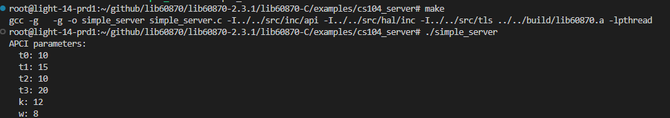
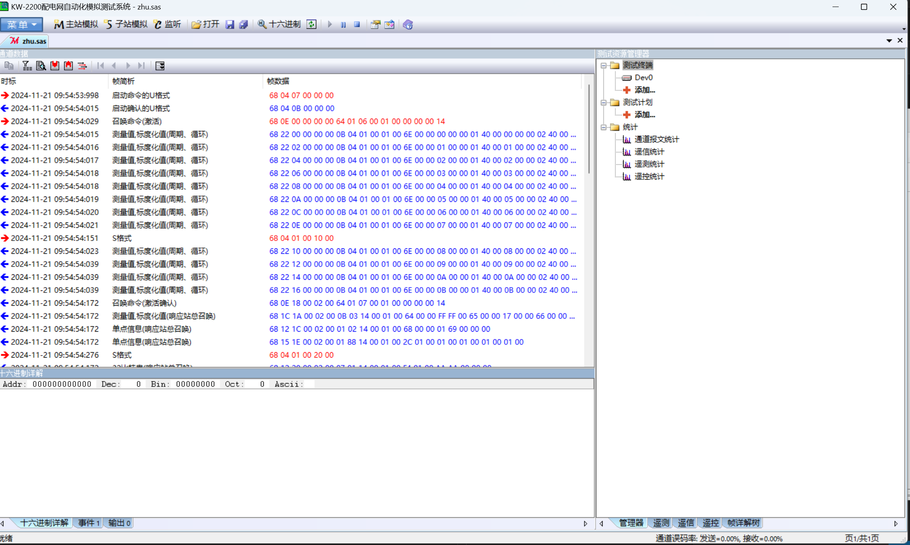
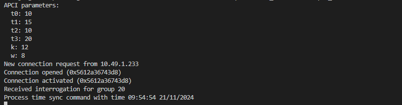

# linux 环境使用 lib60870-104 的 demo

## 1. 安装 lib60870-104
下面将过程分解成几个步骤，在实际使用过程中，如果作用与本机可直接使用 `make all` 命令一键安装。

### 1.1. 编译源码
在 linux 环境下，解压下载好的 lib60870 库的源码文件，进入 `lib60870-C/` 目录，根据程序运行的环境选择对应的编译器，直接 make 运行。

```bash
make CC=gcc
```

make 后程序会在 build 目录下生成很多 .o 格式的中间件：
```bash
.
├── lib60870.a
└── src
    ├── common
    │   └── linked_list.o
    ├── hal
    │   ├── memory
    │   │   └── lib_memory.o
    │   ├── serial
    │   │   └── linux
    │   ├── socket
    │   │   └── linux
    │   ├── thread
    │   │   └── linux
    │   └── time
    │       └── unix
    └── iec60870
        ├── apl
        │   └── cpXXtime2a.o
        ├── cs101
        │   ├── cs101_asdu.o
        │   ├── cs101_bcr.o
        │   ├── cs101_information_objects.o
        │   ├── cs101_master_connection.o
        │   ├── cs101_master.o
        │   ├── cs101_queue.o
        │   └── cs101_slave.o
        ├── cs104
        │   ├── cs104_connection.o
        │   ├── cs104_frame.o
        │   └── cs104_slave.o
        ├── frame.o
        ├── lib60870_common.o
        └── link_layer
            ├── buffer_frame.o
            ├── link_layer.o
            └── serial_transceiver_ft_1_2.o
```

### 1.2. 安装静态库
使用安装命令安装。

```bash
make install
```

安装后会在 `.install` 目录下拷贝静态库和所需要引用的头文件：
```bash
.
├── include
│   ├── cs101_information_objects.h
│   ├── cs101_master.h
│   ├── cs101_slave.h
│   ├── cs104_connection.h
│   ├── cs104_slave.h
│   ├── hal_serial.h
│   ├── hal_socket.h
│   ├── hal_thread.h
│   ├── hal_time.h
│   ├── iec60870_common.h
│   ├── iec60870_master.h
│   ├── iec60870_slave.h
│   ├── link_layer_parameters.h
│   └── tls_config.h
└── lib
    └── lib60870.a
```

将该文件夹拷贝到需要的工程项目下即可使用。

## 2. 运行 demo 程序

### 2.1. 编译 cs104_server 程序 demo
该程序生成一个循环的 104 服务端，并监听 2404 端口，测量数据地址 101 ，数值每一秒加一。

进入 `examples/cs104_server` 目录，直接 make 即可。

运行生成的可执行程序：


电脑创建一个 104 客户端连接该服务器：


打印信息：

