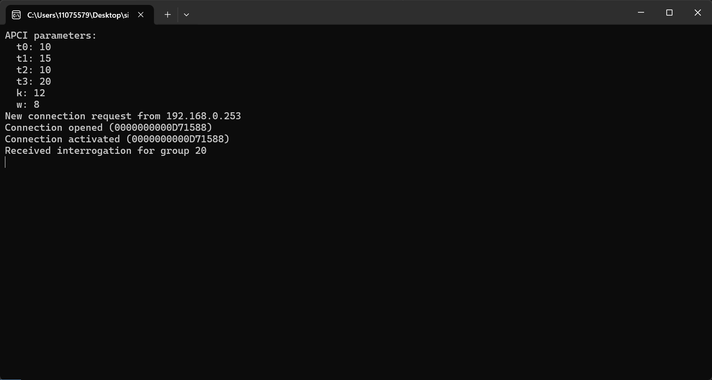

# Windows 环境使用 lib60870-104 的 demo
Windows 环境下使用 lib60870-104 库，可以使用交叉编译器或直接在 Windows 端编译代码。

本文介绍在 linux 环境下使用交叉编译器编译可执行代码，编译时需要使用 MinGW 编译器。

## 1. 安装 MinGW
### 1.1. 在线安装
如果 linux 编译环境可以直接连接外网，可以直接使用命令安装 MinGW 安装包。
```bash
sudo apt-get install mingw-w64
```

安装完成后，会在 `/usr/bin` 目录下生成 `x86_64-w64-mingw32-gcc` 等一系列编译器。

### 1.2. 离线安装
如果 linux 编译环境无法连接外网，可以下载 MinGW 安装包，然后手动安装。

MinGW 安装包下载地址：https://sourceforge.net/projects/mingw-w64/files/

下载完成后，解压安装包，进入安装目录，运行安装程序，选择安装目录，安装完成后，会在安装目录下生成 mingw32-gcc 和 mingw32-g++ 等编译器。

## 2. 编译源码
在 lib60870 库的源码目录下，使用 MinGW 编译器编译源码。
### 2.1. 编译源码
在 linux 环境下，解压下载好的 lib60870 库的源码文件，进入 `lib60870-C/` 目录，根据程序运行的环境选择对应的编译器，直接 make 运行。

```bash
make CC=/usr/bin/x86_64-w64-mingw32-gcc HAL_IMPL=WIN32
```

这里的 宏:
- `CC` 选择编译器路径，这里的编译器类型可以查看 `target_system.mk` 文件，该文件开头指定的 `WIN64` 选择宏为 `MINGW64_TOOLCHAIN_PREFIX=x86_64-w64-mingw32-`，所以选择该编译器 ；
- `HAL_IMPL` 选择硬件抽象层实现，这里选择 `WIN32`，如果不指定该宏，编译 HAL 库时会出错，无法继续进行。添加后只会产生一些警告信息，可以编译通过：
    ```bash
    fatal error: sys/socket.h: No such file or directory
     #include <sys/socket.h>
              ^~~~~~~~~~~~~~
    compilation terminated.
    Makefile:139: recipe for target 'build/src/hal/socket/linux/socket_linux.o' failed
    make: *** [build/src/hal/socket/linux/socket_linux.o] Error 1
    ```

### 2.2. 安装库
编译完成后，执行安装命令：
```bash
make install
```

## 3. 编译可执行程序
进入 `examples/cs_104_server` 目录，该目录已存在 Makefile 文件，该 Makefile 调用了 `target_system.mk` 文件，文件中指定了不同 TARGET 宏的交叉编译器的前缀，所以编译时只需要指定目标版本 make 运行即可。

指定生成的二进制文件名带 exe 后缀，指定目标版本为 WIN64，执行命令：
```bash
make PROJECT_BINARY_NAME=simple_server.exe TARGET=WIN64
```

运行结果如下：
```bash
../../make/target_system.mk:112: winpcap not found - will build without GOOSE support!
x86_64-w64-mingw32-gcc -g -DWIN32 -m64 -DEXCLUDE_ETHERNET_WINDOWS  -g -o simple_server simple_server.c -I../../src/inc/api -I../../src/hal/inc -I../../src/tls ../../build_win32/lib60870.a -lws2_32
root@light:~/lib60870-2.3.1/lib60870-C/examples/cs104_server# ls
CMakeLists.txt  Makefile  simple_server.exe  simple_server.c
```
可见编译成功后会生成 `simple_server.exe` 可执行文件。

## 4. 运行可执行程序
将生成的 `simple_server.exe` 可执行文件下载到 Windows 环境下，双击运行。

