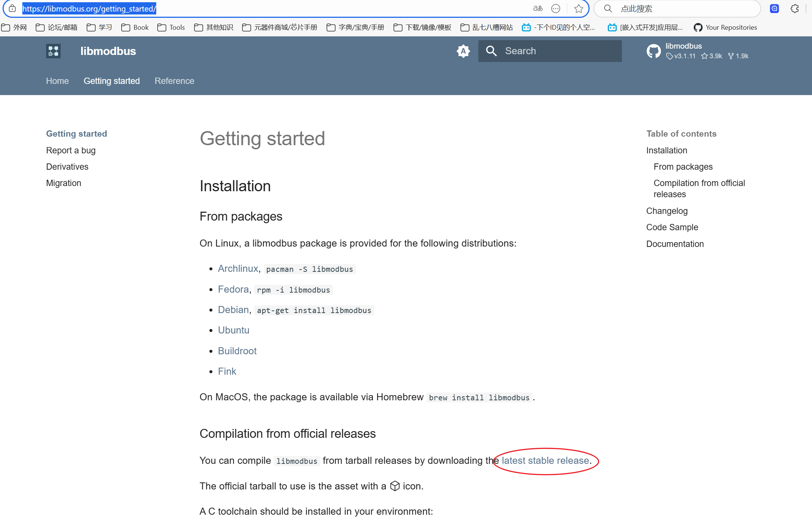
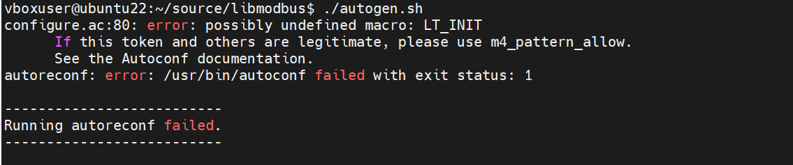

# libmodbus 介绍和安装

libmodbus 是一个使用遵守 Modbus 协议的设备发送/接收数据的库。

该库包含各种后端，用于通过不同网络进行通信（例如，RTU 模式下的串行或 TCP IPv4/IPv6 中的以太网）。

http://www.modbus.org 站点提供了有关 Modbus 规范和实施指南的文档。 

libmodbus 提供了较低通信层的抽象，并在所有支持的平台上提供相同的 API。具体请参考用户指南和 API 参考文档（https://libmodbus.org/reference/）

## 1. libmodbus 代码的下载
### 1.1. 直接下载
1. libmodbus 的源代码可以从 Github 下载；
2. 或从开源库的网站跳转到 Github 下载：[点击 Github 地址](https://github.com/stephane/libmodbus)

3. 直接使用 Github 的网页下载 zip 格式。

### 1.2. 使用 git clone 下载
1. 直接使用 `git clone https://github.com/stephane/libmodbus.git` 下载即可。

### 1.3. Linux 系统在线直接下载
在 Linux 上，为以下发行版提供了 libmodbus 包：
- Archlinux, `pacman -S libmodbus`
- Fedora, `rpm -i libmodbus`
- Debian, `apt-get install libmodbus`
- Ubuntu
- Buildroot
- Fink

## 2. 代码库的编译和安装
### 2.1. 代码库的编译
1. 代码库下载后，文件目录会出现一个 `autogen.sh` 文件，直接运行文件。运行时可能发现如下错误：
    - configuration 生成错误：
        
        - 上述错误是缺少 autoconf 程序，运行`sudo apt-get install -y autoconf` 进行安装。
    - 宏定义缺失错误：
        
        - 上述错误是缺少库依赖，运行`sudo apt-get install -y libtool` 安装 libtool 管理库。

2. `autogen.sh` 文件运行成功后，会生成一个可执行文件 `configure` ，运行 `./configure --prefix=/home/vboxuser/third_party` 命令配置相关文件和安装路径。

3. 使用 `make` 命令编译代码，生成中间文件和可执行文件。

### 2.2. 代码库的安装
1. 编译完成后，直接使用 `make install` 命令将相关依赖的动态链接库、静态链接库、头文件以及文档手册安装到指定目录（即上述的 `/home/vboxuser/third_party` 文件夹）。

2. 安装到目录下的文件如下，使用时需要指定相应依赖库：
```shell
.
├── include
│   ├── modbus
│   │   ├── modbus.h
│   │   ├── modbus-rtu.h
│   │   ├── modbus-tcp.h
│   │   └── modbus-version.h
├── lib
│   ├── libmodbus.la
│   ├── libmodbus.so -> libmodbus.so.5.1.0
│   ├── libmodbus.so.5 -> libmodbus.so.5.1.0
│   ├── libmodbus.so.5.1.0
│   └── pkgconfig
│       └── libmodbus.pc
└── share
    └── doc
        └── libmodbus
            ├── AUTHORS
            ├── NEWS
            └── README.md
```
