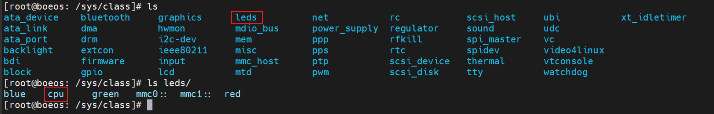

# leds 设备树代码分析

## 1. leds 设备树结构
### 1.1 leds 设备树结构展示
以下内容为野火官方提供的 `ebf_linux_kernel-ebf_4.1.15_imx` 版本的内核中 `imx6ull-14x14-evk.dts` 设备树中的 leds 相关的代码。

```dts
/dts-v1/;

#include <dt-bindings/input/input.h>
#include "imx6ull.dtsi"

/ {
    ...
	leds {
		compatible = "gpio-leds";
		pinctrl-names = "default";
		pinctrl-0 = <&pinctrl_led>;

		led0: cpu {
			label = "cpu";
			gpios = <&gpio5 3 GPIO_ACTIVE_LOW>;
			default-state = "off";
			linux,default-trigger = "none";
		};
	};

	pwm_leds{
		compatible = "pwm-leds";
		status = "okay";

		red {
			label = "red";
			active-low;
			pwms = <&pwm3 0 5000>;
			max-brightness = <255>;
		};

		blue {
			label =  "blue";
			active-low;
			pwms = <&pwm7 0 5000>;
			max-brightness = <255>;
		};

		green {
			label = "green";
			active-low;
			pwms = <&pwm8 0 5000>;
			max-brightness = <255>;
		};
	};
    ...
};
```

### 1.2 初次认识 leds 设备树结构
初次认识时，通过对上述结构中的复杂关键字眼 `linux,default-trigger` 全局搜索，发现了以下文件中出现有相关字眼，通过联想可以得到内核驱动的关联文件为：`driver/leds/gpio-leds.c` 以及 `driver/leds/pwm-leds.c` 。


## 2. 设备树对应 `driver/leds/gpio-leds.c` 驱动文件分析
### 2.1 `compatible = "gpio-leds";`
`compatible` 字段为设备树中的一个关键字，用于指定设备树中的驱动文件与驱动文件所对应的设备驱动的关联。

在 `driver/leds/gpio-leds.c` 驱动文件内搜寻 "gpio-leds" 关键字眼，发现 `compatible` 的定义是在 `static const struct of_device_id` 类型的结构体中定义的，并使用内核模块的宏 `MODULE_DEVICE_TABLE(of, of_gpio_leds_match);` 调用。

**注意：**   
*这里虽然其驱动名称与驱动文件名称相同，但是并不意味着设备树是根据驱动文件的名称去识别驱动的，这里仅仅是因为驱动文件名称与设备树中的 `compatible` 字段相同，所以驱动文件与设备树结构关联。*


```c
MODULE_DEVICE_TABLE(of, of_gpio_leds_match)
```
这是一个宏的使用示例。它定义了一个由设备树匹配函数 `of_gpio_leds_match` 构成的设备列表，用于告诉内核该模块可以处理哪些设备。

其中，`of` 是设备类型，表示设备树中的设备。`of_gpio_leds_match` 是一个设备树匹配函数的名称，用于匹配设备树中的 LED 设备。

设备树匹配函数是用于在设备树中查找并匹配特定设备的函数。`of_gpio_leds_match` 函数用于匹配设备树中的 GPIO LED 设备，并将其与该模块进行匹配。

通过使用 `MODULE_DEVICE_TABLE(of, of_gpio_leds_match)` 宏，内核就能够识别该模块可以处理设备树中的 GPIO LED 设备。当内核加载该模块时，会使用设备树中的信息来匹配适当的设备，并将其分配给该模块进行处理。

需要注意的是，这个宏只是告诉内核该模块可以处理哪些设备，但并不会自动加载这些设备。设备的加载还需要通过其他方式实现，例如设备树配置或者其他驱动程序的协作。

### 2.2 `pinctrl-names` 和 `pinctrl-0`
这两个选项用于指定设备的引脚控制配置。pinctrl-names 是一个字符串数组，指定了引脚控制配置的名称，这里是 "default"。pinctrl-0 是一个引脚控制配置的引用，这里引用了名为 "pinctrl_led" 的引脚控制配置，定义第0种状态需要使用到的引脚配置，如果有多个状态，还可以设置 `pinctrl-1` `pinctrl-2` 定义第n种状态。

通过搜索 `pinctrl_led` 节点，发现调用 freescale 的官方 io 复用节点 `iomuxc_snvs` 。

```dts
<!-- arch/arm/boot/dts/imx6ull-14x14-evk.dts -->
&iomuxc_snvs {
	pinctrl-names = "default_snvs";
        pinctrl-0 = <&pinctrl_tsc_irq>;
        imx6ul-evk {
            ...
        pinctrl_led: ledgrp {
			fsl,pins = <
				MX6ULL_PAD_SNVS_TAMPER3__GPIO5_IO03 0x1b0b0
			>;
		};
        ...
        pinctrl_tsc_irq: tsc_irq {
			fsl,pins = <
				MX6ULL_PAD_SNVS_TAMPER9__GPIO5_IO09        0x4001b8b0
			>;
		};
        ...
    };
};

<!-- arch/arm/boot/dts/imx6ull.dtsi -->
/ {
    ...
    soc {
        ...
        aips3: aips-bus@02200000 {
            compatible = "fsl,aips-bus", "simple-bus";
			#address-cells = <1>;
			#size-cells = <1>;
			reg = <0x02200000 0x100000>;
			ranges;

            ...

            iomuxc_snvs: iomuxc-snvs@02290000 {
			compatible = "fsl,imx6ull-iomuxc-snvs";
			reg = <0x02290000 0x10000>;
			};

            ...
        };
    };
};
```

#### 2.2.1 IOMUXC 引脚复用和寄存器地址
根据上述设备树的信息，可以推断出设备树是通过设置 SNVS（SNVS全称是Secure Non-Volatile Storage，直译过来就是安全的非易性存储。）功能相关引脚的复用，来实现 GPIO 的功能。通过搜索 `MX6ULL_PAD_SNVS_TAMPER3__GPIO5_IO03` 引脚，可以发现以下内容：

```c
/* arch/arm/boot/dts/imx6ull-pinfunc-snvs.h 中 */
#ifndef __DTS_IMX6ULL_PINFUNC_SNVS_H
#define __DTS_IMX6ULL_PINFUNC_SNVS_H
/*
 * The pin function ID is a tuple of
 * <mux_reg conf_reg input_reg mux_mode input_val>
 * <复用寄存器 配置寄存器 输入寄存器 复用模式 输入值>
 */
#define MX6ULL_PAD_SNVS_TAMPER3__GPIO5_IO03     0x0014 0x0058 0x0000 0x5 0x0
/* 这里分别是：
 *  0x0014 ： SW_MUX_CTL_PAD_SNVS_TAMPER3 SW MUX Control Register。
 *           (引脚复用选择寄存器偏移地址)
 *           用设备树设置的 iomuxc-snvs 基地址 0x02290000 + 偏移地址 0x0014；
 *  0x0058 ： SW_PAD_CTL_PAD_SNVS_TAMPER3 SW PAD Control Register
 *           (引脚（PAD）属性控制寄存器偏移地址)
 *           用设备树设置的 iomuxc-snvs 基地址 0x02290000 + 偏移地址 0x0058；
 *  0x0000 ： 称为输入选择寄存器偏移地址，只有某些用作输入的引脚才有，这里没有所以为 0。
 *  0x5 ： 表示将该引脚设置为 ALT5 复用模式，将引脚设置为 GPIO5_IO03。
 *  0x0 ： 称为输入选择寄存器的值，只有某些用作输入的引脚才有，这里没有所以为 0。
 */

#endif /* __DTS_IMX6ULL_PINFUNC_SNVS_H */
```
可以看到，上述头文件已经帮助设置好设备树节点使用的寄存器的偏移地址和 IO 复用模式，还需要设置引脚（PAD）属性值。
```dts
pinctrl_led: ledgrp {
	fsl,pins = <
		MX6ULL_PAD_SNVS_TAMPER3__GPIO5_IO03 0x1b0b0
	>;
};
```
这里的 `0x1b0b0` ，将 `MX6ULL_PAD_SNVS_TAMPER3__GPIO5_IO03` 宏定义展开后就是引脚的六个参数，即引脚（PAD）属性值 `IOMUXC_SNVS_SW_PAD_CTL_PAD_SNVS_TAMPER5` ，该寄存器改动范围较大，需要根据实际的硬件设计进行设置，可以根据芯片用户手册设置，节选的设置贴在 [附录](#附录) 中。

# 附录 
## 附录1 `IOMUXC_SNVS_SW_PAD_CTL_PAD_SNVS_TAMPER5` 寄存器设置


