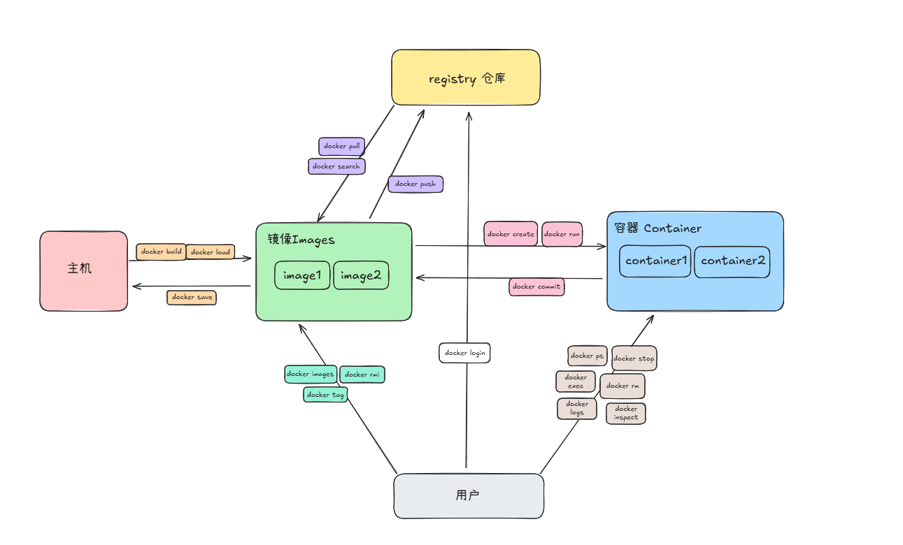

# Docker
## 一、Docker简介与优势
### 1.1 Docker概述
Docker是一个开源的应用容器引擎，基于Go语言开发，允许开发者将应用及其依赖打包到一个可移植的容器中，然后发布到任何支持Docker的机器上。其主要目标是“build, ship and run any app, anywhere”，通过对应用程序组件的封装、分发、部署、运行等生命周期的管理，实现应用及其运行环境的“一次封装，到处运行”。


### 1.2 优势
- **环境一致性**：Docker容器封装了应用的运行环境，包括操作系统、库、依赖等，确保在开发、测试和生产环境中应用表现一致，避免“在我的机器上可以运行”的问题。
- **资源利用率高**：与传统虚拟机相比，Docker容器直接运行在宿主机的操作系统上，没有虚拟机层的开销，资源利用率更高，可以更高效地利用服务器资源。
- **部署灵活**：Docker容器轻量级、启动快，可以快速部署应用，支持微服务架构，方便实现应用的扩展和维护。
- **简化开发流程**：开发者只需关注应用代码和依赖，无需关心底层环境配置，Docker提供了一套标准化的打包、分发和部署流程，简化了开发、测试和上线的复杂性。

## 二、Docker概念与操作
### 2.1 Docker核心名词
- **镜像（Image）**：Docker镜像是用于创建容器的模板，包含了运行容器所需的所有内容，如代码、运行时、库、环境变量和配置文件等。镜像是只读的，可以理解为容器的静态快照。
- **容器（Container）**：容器是镜像的运行实例，是镜像的动态表现形式。容器是隔离的、安全的，并且可以控制其使用的资源。容器之间相互隔离，互不影响。
- **仓库（Repository）**：Docker仓库用于存储和分发镜像，可以是公共仓库如Docker Hub，也可以是私有仓库。仓库中的镜像可以有多个版本，通过标签（Tag）进行区分。

### 2.2 安装
#### 2.2.1 离线安装

下载目录:https://download.docker.com/linux/static/stable/x86_64/

``` bash
#!/bin/bash

#关闭selinux
setenforce 0
sed -i s/"SELINUX=enforcing"/"SELINUX=disable"/ /etc/selinux/config


#安装docker
tar zxvf docker-{安装包版本}-ce.tgz  && mv docker/* /usr/bin


tee /usr/lib/systemd/system/docker.service  << EOF
[Unit]
Description=Docker Application Container Engine
Documentation=https://docs.docker.com
After=network-online.target firewalld.service
Wants=network-online.target
  
[Service]
Type=notify
# the default is not to use systemd for cgroups because the delegate issues still
# exists and systemd currently does not support the cgroup feature set required
# for containers run by docker
ExecStart=/usr/bin/dockerd -H tcp://0.0.0.0:2375 -H unix://var/run/docker.sock
ExecReload=/bin/kill -s HUP $MAINPID
# Having non-zero Limit*s causes performance problems due to accounting overhead
# in the kernel. We recommend using cgroups to do container-local accounting.
LimitNOFILE=infinity
LimitNPROC=infinity
LimitCORE=infinity
# Uncomment TasksMax if your systemd version supports it.
# Only systemd 226 and above support this version.
#TasksMax=infinity
TimeoutStartSec=0
# set delegate yes so that systemd does not reset the cgroups of docker containers
Delegate=yes
# kill only the docker process, not all processes in the cgroup
KillMode=process
# restart the docker process if it exits prematurely
Restart=on-failure
StartLimitBurst=3
StartLimitInterval=60s
  
[Install]
WantedBy=multi-user.target
EOF

systemctl daemon-reload  && systemctl restart docker && systemctl enable docker

```

#### 2.2.2 在线安装

``` bash

yum install -y yum-utils device-mapper-persistent-data lvm2

yum-config-manager --add-repo http://mirrors.aliyun.com/docker-ce/linux/centos/docker-ce.repo

yum makecache fast

yum install docker-ce

```

#### 2.2.3 配置镜像源

``` bash
mkdir -p /etc/docker  && tee /etc/docker/daemon.json << EOF
{
  "registry-mirrors": [
        "https://j5sokfju.mirror.aliyuncs.com",
        "https://hub-mirror.c.163.com",
        "https://docker.mirrors.ustc.edu.cn",
        "https://mirror.iscas.ac.cn",
        "https://dockerproxy.net",
        "https://docker.m.daocloud.io",
        "https://dockerpull.org"
  ]
}
EOF
systemctl restart docker  && systemctl enable docker

```

### 2.3 Docker常用命令



- **镜像**
  - `docker images`：列出本地所有镜像。
  - `docker search <image>`：在Docker Hub上搜索镜像。
  - `docker pull <image>`：从仓库下载镜像。
  - `docker rmi <image>`：删除本地镜像。
  - `docker tag <image>  <new_image>` : 给镜像打标签，经常在push之前修改仓库地址
  - `docker save`   将镜像导出成一个tar包
  - `docker load`   将外部导出的tar包导入到镜像中
  - `docker build `  基于Dockerfile构建镜像
  
- **容器**
  - `docker run <image>`：创建并启动一个容器。
    - `-v`  目录挂载 宿主机:容器
    - `-p`  端口映射
    - `-e`  环境变量
    - `--name`  容器名
    - `--link`  容器互联
  - `docker ps`：列出所有正在运行的容器。
  - `docker create ` 创建一个容器
  - `docker stop <container>`：停止一个正在运行的容器。
  - `docker start <container>`： 启动一个容器
  - `docker restart <container>`：重启一个容器
  - `docker rm <container>`：删除一个容器。
  - `docker exec -it <container> /bin/bash`：进入正在运行的容器。
  - `docker logs <container>` 查看容器的日志
  - `docker cp <src>  <dest <container:dir>>` 容器内部文件和宿主机的互相拷贝 
  - `docker inspect <container>` 查看容器的详细信息
  - `docker commit  <container>  <image>` 基于容器创建一个镜像
  - `docker export`  基于容器导出一个tar包
  - `docker import`  将导出的tar包导入到容器中
- **仓库**
  - `docker push`  将镜像推送到远程仓库
  - `docker login`  登录的远程仓库
- **其他**  
  - `docker info`  本地docker软件的信息（版本等）
  

## 三、Docker实战
### 3.1 构建镜像
以部署一个Spring Boot应用为例：
1. **编写Dockerfile**：在Spring Boot项目的根目录下创建一个Dockerfile，内容如下：
```dockerfile
# 使用官方的Java 8镜像作为基础镜像
FROM openjdk:8-jre

# 将构建好的jar文件复制到容器的/app目录下
COPY target/test.jar /app/

# 设置容器启动时执行的命令
ENTRYPOINT ["java", "-jar", "/app/test.jar"]
```
2. **构建镜像**：在项目根目录下运行`docker build -t myapp:1.0 .`命令，构建一个名为myapp,tag为1.0的镜像。


### 3.2 部署服务
以部署MySQL为例：
1. **拉取MySQL镜像**：运行`docker pull mysql`命令，从Docker Hub下载MySQL镜像。
2. **运行MySQL容器**：使用`docker run -d --name mysql-container -p 3306:3306 -e MYSQL_ROOT_PASSWORD=my-secret-pw mysql`命令启动一个MySQL容器。其中，`-d`表示后台运行，`--name`指定容器名称，`-p`将容器的3306端口映射到宿主机的3306端口，`-e`设置环境变量，指定MySQL的root密码。


## 四、注意事项
- **使用合适的镜像基础**：选择与应用语言和运行环境相匹配的基础镜像，避免使用过于庞大的基础镜像。例如，对于Java应用，可以选择官方的Java镜像。
- **合理组织Dockerfile指令**：利用Docker的层缓存机制，将不经常变化的指令放在Dockerfile的前面，将经常变化的指令放在后面。例如，先安装依赖，再复制应用代码。
- **清理不必要的文件**：在构建镜像时，删除不必要的文件和缓存，以减小镜像大小。例如，在安装软件包后，删除安装包和缓存文件。

## 五、常用软件部署

### Mysql

``` bash
mkdir -p /home/data/mysql  && chmod -R 777  /home/data/mysql
docker pull mysql:5.7.25
docker run -d -p 3306:3306 -v /home/data/mysql:/var/lib/mysql    --name mysql  -e MYSQL_ROOT_PASSWORD=123456 mysql:5.7.25

```


### MongoDB

``` bash
mkdir -p /home/data/mongo   && chmod -R 777  /home/data/mongo
docker pull mongo:4.2.6
docker run -d -p 27017:27017 -v /home/data/mongo:/data/db     -e MONGO_INITDB_ROOT_USERNAME=root  \
-e MONGO_INITDB_ROOT_PASSWORD=123456  --name mongo  mongo:4.2.6    --wiredTigerCacheSizeGB 1

```


### RabbitMQ

``` bash
mkdir -p /home/data/rabbitmq  && chmod -R 777  /home/data/rabbitmq
docker pull rabbitmq:3.8.4-management
docker run -d -p 5672:5672 -p 15672:15672 -v /home/data/rabbitmq:/var/lib/rabbitmq --name rabbitmq -e RABBITMQ_DEFAULT_USER=root -e RABBITMQ_DEFAULT_PASS=123456   rabbitmq:3.8.4-management

#控制台添加用户
#docker exec -it -d  rabbitmq rabbitmqctl  add_user openstack  123456
#docker exec -it -d  rabbitmq rabbitmqctl  set_user_tags openstack administrator
#docker exec -it -d  rabbitmq rabbitmqctl  set_permissions openstack ".*" ".*" ".*"

```


### Redis

``` bash
mkdir -p /home/data/redis   && chmod -R 777  /home/data/redis
docker pull redis:5.0.5
docker run -d -p 6379:6379  -v /home/data/redis:/data/   --name redis  redis:5.0.5  --requirepass '123456'

```

### Nacos
``` bash
mkdir -p /home/data/nacos   && chmod -R 777  /home/data/nacos
docker pull nacos/nacos-server:v2.4.3
docker run -d -p 8848:8848 -p 9848:9848 -v /home/data/nacos:/home/nacos/logs -e MODE=standalone  -e NACOS_AUTH_ENABLE=true \
-e NACOS_AUTH_IDENTITY_KEY=serverIdentity -e NACOS_AUTH_IDENTITY_VALUE=security \
-e NACOS_AUTH_TOKEN=SecretKey012345678901234567890123456789012345678901234567890123456789  \
--name nacos  nacos/nacos-server:v2.4.3

```

### Elasticsearch
``` bash
mkdir -p /home/data/es   && chmod -R 777  /home/data/es
docker pull elasticsearch:7.17.26
docker run -d --name elasticsearch -v /home/data/es/:/usr/share/elasticsearch/data  -p 9200:9200 -p 9300:9300 -e  "discovery.type=single-node" -e ES_JAVA_OPTS="-Xms256m -Xmx512m" elasticsearch:7.17.26

```

### EMQX(MQTT server)
```bash
mkdir -p /home/data/emqx   && chmod -R 777  /home/data/emqx
docker pull emqx/emqx:5.6.1
docker run -d --name emqx  -v /home/data/emqx:/opt/emqx/data -p 1883:1883 -p 8083:8083 -p 8084:8084 -p 8883:8883 -p 18083:18083 emqx/emqx:5.6.1
#默认用户名密码 admin/public

```
### Gogs(Git server)
```bash
mkdir -p /home/data/gogs   && chmod -R 777  /home/data/gogs
docker pull gogs/gogs
docker run -d -p 10022:22 -p 3000:3000  --name gogs -v /home/data/gogs:/data gogs/gogs
```

### Jenkins(CI)
``` bash
mkdir -p /home/data/jenkins && chmod -R 777  /home/data/jenkins
docker pull jenkinsci/blueocean
docker run -d -p 8080:8080 -p 50000:50000 -v /home/data/jenkins:/var/jenkins_home  --name jenkins  jenkinsci/blueocean
```

### Nginx
```bash
mkdir -p /home/data/nginx/{html,conf}  && chmod -R 777  /home/data/nginx
tee  /home/data/nginx/conf/default.conf  << EOF
server {
    listen       80;
    listen  [::]:80;
    server_name  localhost;
	root /usr/share/nginx/html;
    location / {
        index  index.html index.htm;
    }
}
EOF

docker pull nginx:1.19.2
docker run -p 80:80 -d -v /home/data/nginx/conf:/etc/nginx/conf.d  -v /home/data/nginx/html:/usr/share/nginx/html --name nginx  nginx:1.19.2
```


# Docker Compose


Docker Compose是一个用于定义和运行多容器Docker应用的工具。通过一个YAML文件，可以配置应用的多个服务。例如，部署一个包含Spring Boot应用和MySQL数据库的微服务应用
1. **安装**

   - 安装包下载 https://github.com/docker/compose/releases/
    ``` bash
    mv docker-compose /usr/bin/
    chmod +x /usr/bin/docker-compose
    ```
   - 在线下载安装包
    ``` bash
    curl -L "https://github.com/docker/compose/releases/download/1.29.1/docker-compose-$(uname -s)-$(uname -m)" -o /usr/bin/docker-compose
    
    chmod +x /usr/bin/docker-compose
    ```


2. **编写docker-compose.yml文件**：
```yaml
version: 3
services:
  elasticsearch:
    image: elasticsearch:7.13.3
    container_name: elasticsearch
    environment:
      - "discovery.type=single-node" 
      - "ES_JAVA_OPTS=-Xms512m -Xmx1096m" 
    ports:
      - 9200:9200
      - 9300:9300
    volumes:
      - /home/data/es:/usr/share/elasticsearch/data   
    networks:
      - custom-network 

  kibana:
    image: kibana:7.13.3
    container_name: kibana
    depends_on:
      - elasticsearch 
    environment:
      ELASTICSEARCH_HOSTS: http://elasticsearch:9200   # elasticsearch 容器互联使用容器名访问es
    ports:
      - 5601:5601
    links:
      - elasticsearch
    networks:
      - custom-network

networks:
    custom-network:
        driver: bridge

```
3. **部署应用**：在docker-compose.yml文件所在目录下运行`docker-compose up`命令，Docker Compose会根据配置文件创建并启动所有服务。
4. **常用命令**
   -  `docker-compose up`
   -  `docker-compose down`
   -  `docker-compose ps`
   -  `docker-compose logs`
   -  `docker-compose build`
