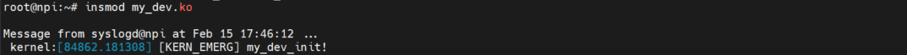
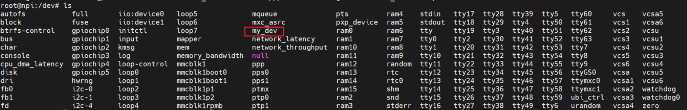
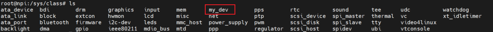
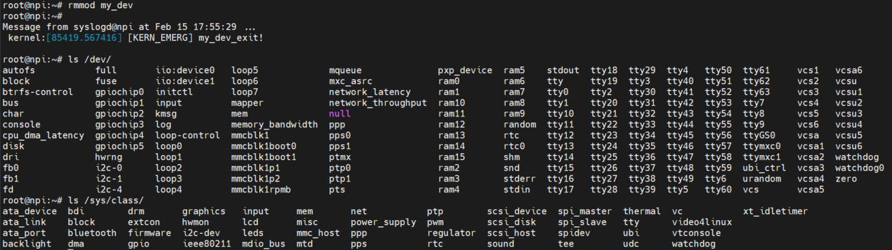

# Linux 驱动基础——设备节点生成
**驱动源码书写步骤：**
1. 分别生成一个 class 和 device 的结构体；
2. 填充 file_operations 结构体；
3. ~~调用 registry_chrdev() 注册字符设备（旧款内核注册方式）；~~
3. ~~调用 registry_chrdev() 注册字符设备（旧款内核注册方式）；~~
4. 调用 class_create() 在 /sys/class/ 目录下注册一个类；
5. 调用 device_create() 在 /dev/ 目录下创建一个设备节点。

对于新建的 `xxx-dev.c` 的驱动文件编写，可以参照 Linux 内核源码的 `drivers/i2c/` 目录下的 `i2c-dev.c` 文件，里面有完整的驱动文件编写。

**完成驱动源码后的应用步骤：**
1. 将驱动源码指定内核源码后编译成 .ko 的内核模块；
2. 传输到目标机后，用 insmod 命令加载内核模块；
3. 编写字符设备的应用层驱动源码；
4. 编译并运行字符设备应用程序，检测字符设备是否正常工作。

## 1. 头文件的编写
可以复制 `i2c-dev.c` 文件（或其他驱动）中的头文件，删除 i2c 强相关的头文件。

## 2. 填充 file_operations 结构体
- 可以参照 `i2c-dev.c` 文件中的书写方式，完成结构体中需要指定的重要函数地址，主要有 owner 、 open 、 read 、 write 等函数。
- 结构体的完整定义在内核源码中的 `include/linux/fs.h` 中。

## 3. 实现 file_operations 结构体中，指定的操作函数代码编写：
***结构体中的函数原型都可以在 `file_operations` 结构体定义中可以看到。***
### 3.1 open() 函数
- 原型 ：`int (*open)(struct inode *inode, struct file *filp)` 。
- 作用 ：在操作设备前先要调用 `open()` 函数打开文件，在该函数里可以初始化设备操作。
- 返回值 ：打开成功时， `open()` 返回 0 。
- 注意 ：如果不实现该函数，驱动会默认设备的打开永远成功。

### 3.2 release() 函数
- 原型 ：`int (*release)(struct inode *inode, struct file *filp)` 。
- 作用 ：当设备文件被关闭时，内核会调用该函数。
- 返回值 ：释放成功时， `release()` 返回 0 。
- 注意 ：并不是每个close系统调用都会引起对release方法的调用，只有那些真正释放设备数据结构的close调用才会调用这个方法。如果不实现该函数，函数默认为 NULL ，关闭设备永远成功。

### 3.3 read() 函数
- 原型 ：`ssize_t (*read) (struct file *file, char __user *buf, size_t count, loff_t *offset)` 。
- 作用 ：内核先获取文件描述符 `*file` 的位置 ，通过 `copy_to_user(void __user * to,const void * from,unsigned long n);` 函数复制到用户空间，其中的 `*buf` 为用户空间内存地址； `count` 指示要复制到用户空间的内容大小；`*offset` 为读的位置相对于文件开头的偏移，这个指针一般都会移动，移动的值为要读取信息的长度值。
- 函数参数 ：
    - `*file` ： 设备文件描述符。
    - `*buf` ： 用户空间中的缓存的指针。
    - `count` ： 请求传输的数据的大小。
    - `*offset` ： 用户正在存取的文件位置。
- 返回值 ：成功读取的缓存大小 。

### 3.4 write() 函数
- 原型 ：`ssize_t (*write) (struct file *file, const char __user *buf, size_t count, loff_t *offset)` 。
- 作用 ：内核先获取文件描述符 `*file` 的位置 ，通过 `copy_from_user(void * to,const void __user * from, unsigned long n);` 函数将用户空间的内容写入到内核空间。
- 函数参数 ：
    - `*file` ： 设备文件描述符。
    - `*buf` ： 用户空间中的缓存的指针。
    - `count` ： 请求写入的数据的大小。
    - `*offset` ： 用户正在存取的文件位置。
- 返回值 ：成功读取的缓存大小 。

## 4. 注册字符设备
- 先实现驱动模块加载函数 `my_dev_init()` 和卸载函数 `my_dev_exit()`
- 在函数 `my_dev_init()` 中注册字符设备，设备注册可分为动态注册和静态注册，动态注册由系统分配主设备号，静态注册直接设定主设备号。

### register_chrdev_region() 静态注册字符设备函数
- 原型 ：`int register_chrdev_region(dev_t dev, unsigned int count, const char *name)` 。
- 作用 ：静态注册字符设备。
- 函数参数 ：
    - `dev` ： 要分配的设备编号范围的初始值，明确了主设备号和起始次设备号。
    - `count` ： 设备个数，即次设备号个数。
    - `name` ： 相关联的设备名称. (可在 `/proc/devices` 目录下查看到)， 也即本组设备的驱动名称。
- 注意 ：静态注册只有在事先知道要使用的主、次设备号时使用的；要先查看 `cat /proc/devices` 去查看没有使用的。

### alloc_chrdev_region() 动态注册字符设备函数
- 原型 ：`int alloc_chrdev_region(dev_t *dev, unsigned int baseminor, unsigned int count, const char *name)` 。
- 作用 ：动态注册字符设备。
- 函数参数 ：
    - `*dev` ： 这个函数的第一个参数，是输出型参数，获得一个分配到的设备号。可以用MAJOR宏和MINOR宏，将主设备号和次设备号，提取打印出来，看是自动分配的是多少，方便我们在mknod创建设备文件时用到主设备号和次设备号。 `mknod /dev/xxx c 主设备号 次设备号`
    - `firstminor` ： 次设备号的基准，即从哪个次设备号开始分配。
    - `count` ： 次设备号的个数。
    - `name` ： 驱动的名字。
- 返回值 ：小于0，则自动分配设备号错误。否则分配得到的设备号就被第一个参数带出来。

### ~~register_chrdev() 注册函数（旧）~~
- 原型 ：`int register_chrdev(unsigned int major, const char *name, const struct file_operations *fops)` 。
- 作用 ：注册字符设备，其中 major 为 0，时表示使用动态注册；非 0 时表示静态注册。
- 函数参数 ：
    - `major` : 设备的主设备号。
    - `name` ： 设备的名字。
    - `*fops` ： 字符设备文件操作结构体指针。
- 返回值 ：成功返回注册设备的主设备号 ，失败返回负数。
- 注意 ：`register_chrdev()` 函数在新版 Linux 内核中已经减少使用了。

### ~~unregister_chrdev() 注销函数（旧）~~
- 原型 ：`void unregister_chrdev(unsigned int major, const char *name)` 。
- 作用 ：注销字符设备。
- 函数参数 ：
    - `major` : 设备的主设备号。
    - `name` ： 设备的名字。
- 注意 ：`unregister_chrdev()` 函数在新版 Linux 内核中已经减少使用了。

## 5. 注册一个 class 类
调用 class_create() 在 /sys/class/ 目录下注册一个类。
### class_create() 函数
- 原型 ：`struct class *class_create(struct module *owner, const char *name)` 。
- 作用 ：在 /sys/class/ 目录下注册一个类。
- 函数参数 ：
    - `*owner` ： 模块的拥有者。
    - `*name` ： 类的名字。
- 返回值 ：成功返回类结构体指针，失败返回 NULL。

### class_destroy() 函数
- 原型 ：`void class_destroy(struct class *class)` 。
- 作用 ：销毁一个类。
- 函数参数 ：
    - `*class` ： 类的结构体指针。
- 返回值 ：无。

## 6. 生成一个 device 节点
调用 device_create() 在 /dev/ 目录下创建一个设备节点。
### device_create() 函数
- 原型 ：`int device_create(struct class *class, struct device *device, dev_t devt, const char *dev_name, void *drvdata)` 。
- 作用 ：在 /dev/ 目录下创建一个设备节点。
- 函数参数 ：
    - `*class` ： 类的结构体指针。
    - `*device` ： 设备的结构体指针。
    - `*devt` ： 设备号。
    - `*dev_name` ： 设备的名字。
    - `*drvdata` ： 设备的数据。
- 返回值 ：成功返回 0，失败返回负数。

### device_unregister() 函数
- 原型 ：`void device_unregister(struct device *device)` 。
- 作用 ：注销一个设备节点。
- 函数参数 ：
    - `*device` ： 设备的结构体指针。
- 返回值 ：无。

## 7. 编译并安装模块节点和类
- 通过编写 `Makefile` 来指定目标机内核的源码路径，交叉编译写好的 `my_dev.c` 文件，生成 `my_dev.ko` 文件。
- 将 `my_dev.ko` 文件传输到文件系统中，使用 `insmod` 命令安装设备模块；
    
- 查看 `/dev` 目录下有一个 `my_dev` 设备节点。
    
-  查看 `/sys/class/my_dev` 目录下有 `my_dev` 类；
    
- 使用 `rmmod` 命令卸载设备模块；可以看到 my_dev 类以及 my_dev 设备节点都被清除。
    

## 完整内核驱动模块代码
```c
/* 1. 复制 `i2c-dev.c` 文件中的头文件，删除 i2c 强相关的头文件 */
#include <linux/cdev.h>
#include <linux/device.h>
#include <linux/fs.h>
// #include <linux/i2c-dev.h>
// #include <linux/i2c.h>
#include <linux/init.h>
#include <linux/jiffies.h>
#include <linux/kernel.h>
#include <linux/list.h>
#include <linux/module.h>
#include <linux/notifier.h>
#include <linux/slab.h>
#include <linux/uaccess.h>
#include <linux/compat.h>

static struct class *my_dev_class;
static struct device *my_dev_class_dev;
static char val;

/* 3.1 open() 函数的实现 */
static int my_dev_open(struct inode *inode, struct file *file)
{
    return 0;
}

/* 3.3 read() 函数的实现 */
static ssize_t my_dev_read(struct file *file, char __user *buf, size_t count,
		loff_t *offset)
{
	int ret;

	ret = copy_to_user(buf, &val, count);
    if(ret < 0)
    {
        printk("ret = %d\n", ret);
        return ret;
    }
	printk("my_dev_read\n");
	return 0;
}

/* 3.3 write() 函数的实现 */
static ssize_t my_dev_write(struct file *file, const char __user *buf,
		size_t count, loff_t *offset)
{
	int ret;

	ret = copy_from_user(&val, buf, count);
    if(ret < 0)
    {
        printk("ret = %d\n", ret);
        return ret;
    }
	printk("my_dev_write\n");
	return 0;
}

/* 2. 填充 file_operations 结构体，结构体的完整定义在内核源码中的 include/linux/fs.h 中 */
static const struct file_operations my_dev_fops = {
	.owner		= THIS_MODULE,              /*  */
	// .llseek		= no_llseek,
	.read		= my_dev_read,              /* 填充 read() 操作的函数地址 */
	.write		= my_dev_write,             /* 填充 write() 操作的函数地址 */
	// .unlocked_ioctl	= my_dev_ioctl,
	// .compat_ioctl	= compat_my_dev_ioctl,
	.open		= my_dev_open,              /* 填充 open() 操作的函数地址 */
	// .release	= my_dev_release,
};

/* 实现驱动模块加载函数 my_dev_init() 和卸载函数 my_dev_exit() */
int major;
static int __init my_dev_init(void)
{
    printk(KERN_EMERG "[KERN_EMERG] my_dev_init!\n");

    /* 4. registry_chrdev() 注册字符设备 */
    major = register_chrdev(0, "my_dev", &my_dev_fops);
    /* 5. 调用 class_create() 在 /sys/class/my_dev 目录下注册一个类 */
    my_dev_class = class_create(THIS_MODULE, "my_dev");
    /* 6. 调用 device_create() 在 /dev/my_dev 目录下生成一个节点 */
    my_dev_class_dev = device_create(my_dev_class, NULL, MKDEV(major, 0), NULL, "my_dev");
    return 0;
}

static void __exit my_dev_exit(void)
{
    printk(KERN_EMERG "[KERN_EMERG] my_dev_exit!\n");
    /* 卸载字符设备 */
    unregister_chrdev(major, "my_dev");
    /* 注销设备 */
    device_unregister(my_dev_class_dev);
    /* 销毁定义的类 */
    class_destroy(my_dev_class);
}

module_init(my_dev_init);
module_exit(my_dev_exit);

MODULE_LICENSE("GPL");
MODULE_AUTHOR("fengkang");
MODULE_VERSION("V0.1");
MODULE_DESCRIPTION("my_dev module");
/* ------------------------------------------------------------- */

```

## Makefile 源码
```makefile
ifneq ($(KERNELRELEASE),)
obj-m := my_dev.o
else
KDIR=/opt/kernel/ebf_linux_kernel
CROSS_COMPILE=arm-linux-gnueabihf-
all:
        make -C $(KDIR) M=$(PWD) modules ARCH=arm CROSS_COMPILE=$(CROSS_COMPILE)
clean:
        rm -rf *.o *.ko *.mod.o *.mod.c *.symvers module* .hello.* .tmp_versions .*.*.cmd
help:
        @echo "make KDIR=<your kernel path> CROSS_COMPILE=<your CROSS_COMPILE>"
endif
```
