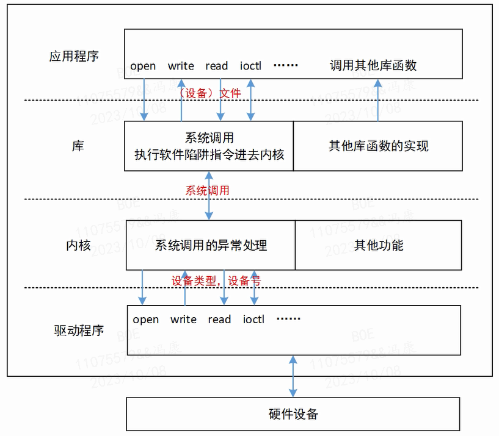
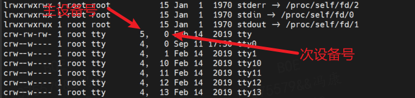

# Linux驱动基础概念

## Linux 驱动的角色

## Linux 驱动的设备类型

Linux系统将设备分成三种基本类型：
1. 字符设备
2. 块设备
3. 网络设备

### 1. 字符设备（char device）

字符设备是个能够像字节流（类似文件）一样被访问的设备，驱动程序通常要事项 open 、 close 、 read 、 write 系统调用。提供连续的数据流，应用程序可以顺序读取。**通常不支持随机存取**，此类设备支持按字节或者字符来读写数据。

例如：led、lcd、串口、键盘、触摸屏。

### 2. 块设备（block device）

块设备是一种具有一定结构的随机存取设备，对这种设备的读写是按块进行的，主要通过传输固定大小的数据（一般为512或1k）来访问设备。它使用缓存区来存放暂时的数据，然后从缓存一次性写入设备或者从设备一次性读到缓冲区。

例如：SD卡、U盘、NAND Flash、Nor Flash、磁盘。

### 3. 网络设备（network device）

网络设备不同于字符设备和块设备，它是面向报文的而不是面向流的，它不支持随机访问，也没有请求缓冲区。在Linux里一个网络设备也可以叫做一个网络接口，如 eth0 ，应用程序是通过 Socket（套接字） 而不是设备节点来访问网络设备，在系统里根本不存在网络设备节点。

例如：网卡、蓝牙、WIFI。

### 设备类型的区别

1. 字符设备只能以字节为最小单位访问；
2. 块设备以块为单位访问，例如 512 字节， 1024 字节等；
3. 字符设备只能顺序访问按字节访问，而块设备可随机访问；
4. 网络设备是面向报文的，没有设备节点。

### 主设备号和次设备号

在 /dev 目录下使用 ls -l 就可以看到主设备号和次设备号，如：

主设备号用来表示一个特定的驱动程序；  
次设备号用来表示使用该驱动程序的各设备。

## Linux 驱动程序与应用程序的区别
1. 应用程序以 main 开始，驱动程序没有 main ，它以一个模块初始化函数 `module_init()` 作为入口；
2. 应用程序没有出口，驱动程序由 `module_exit()` 指定；
3. 应用程序从头到尾执行一个程序，驱动程序完成初始化之后不在运行，等待系统调用；
4. 应用程序可以使用 `glibc` 等标准 C 函数库，驱动程序不能使用标准 C 库。

## Linux 设备树（Device Tree）

`DTS(Device Tree Source)`，文件路径在内核源码： `arch/arm/boot/dts` 

`Device Tree` 是一种描述硬件的数据结构，许多硬件的细节可以直接透过它传递给 Linux ，它就是为了取代板级信息代码而推出的。所以大量在 `arch/arm/plat-xxx` , `arch/arm/mach-xxxx` 中做的工作不再是必要的了。

`Device Tree` 的引入对 BSP 和驱动造成影响和变更。

