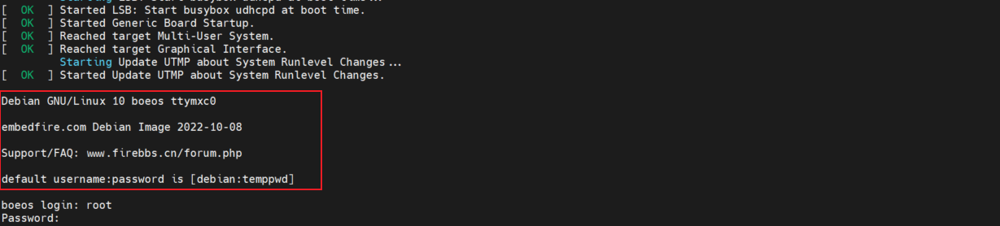
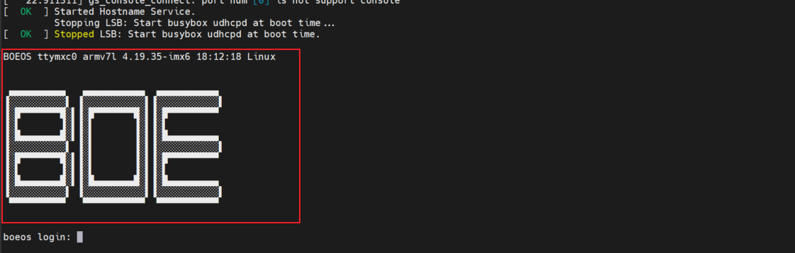

# 自定义文件系统技巧

## 1. 系统主机名 hostname 的修改
- 文件目录： `/etc/hostname` 。
- 修改方式：
    - 修改文件内容，将 `hostname` 修改为想要的主机名。
    - 重启系统生效。
- 示例：
    ```bash
    root@npi:~# cat /etc/hostname
    npi
    root@npi:~# vi /etc/hostname
    boeos
    root@npi:~# reboot

    <!-- 发现主机名已变更 -->
    boeos login: root
    Password:
    root@boeos:~#
    ```

## 2. 开机打印信息 issue 的修改(欢迎信息或开机LOGO)
### 2.1 开机打印信息 issue 的使用
- 文件目录：
    - 针对本地登录（串口）的文件： `/etc/issue` 。
    - 针对远程登录（SHH、telnet）的文件： `/etc/issue.net` 。如果要让 `/etc/issue.net` 生效，还需要先配置 `/etc/ssh/sshd_config` 的 `Banner` 属性，而且，`/etc/issue.net` 只会输出原始数据，不会自行转换。
- 修改方式：
    - 修改文件内容，将 `issue` 修改为想要的内容。
    - 重启系统生效。
- 可用代码：
    - `\l` : 显示第几个终端机接口
    - `\m` : 显示硬件的等级（i386/i686...）
    - `\n` : 显示主机的网络名称
    - `\o` : 显示 domain name
    - `\r` : 显示操作系统的版本
    - `\t` : 显示本地端时间的时间
    - `\s` : 显示操作系统的名称
    - `\v` : 显示操作系统的版本
- 示例：

    
    ```bash
    root@npi:~# vi /etc/issue
    BOEOS \l \m \r \t \s

     ▄▄▄▄▄▄▄▄▄▄   ▄▄▄▄▄▄▄▄▄▄▄  ▄▄▄▄▄▄▄▄▄▄▄ 
    ▐░░░░░░░░░░▌ ▐░░░░░░░░░░░▌▐░░░░░░░░░░░▌
    ▐░█▀▀▀▀▀▀▀█░▌▐░█▀▀▀▀▀▀▀█░▌▐░█▀▀▀▀▀▀▀▀▀ 
    ▐░▌       ▐░▌▐░▌       ▐░▌▐░▌          
    ▐░█▄▄▄▄▄▄▄█░▌▐░▌       ▐░▌▐░█▄▄▄▄▄▄▄▄▄ 
    ▐░░░░░░░░░░▌ ▐░▌       ▐░▌▐░░░░░░░░░░░▌
    ▐░█▀▀▀▀▀▀▀█░▌▐░▌       ▐░▌▐░█▀▀▀▀▀▀▀▀▀ 
    ▐░▌       ▐░▌▐░▌       ▐░▌▐░▌          
    ▐░█▄▄▄▄▄▄▄█░▌▐░█▄▄▄▄▄▄▄█░▌▐░█▄▄▄▄▄▄▄▄▄ 
    ▐░░░░░░░░░░▌ ▐░░░░░░░░░░░▌▐░░░░░░░░░░░▌
     ▀▀▀▀▀▀▀▀▀▀   ▀▀▀▀▀▀▀▀▀▀▀  ▀▀▀▀▀▀▀▀▀▀▀ 
                                       
    root@npi:~# reboot
    ```
    

### 2.2 拓展：
1. 开机欢迎语；
2. 生成开机LOGO：可以使用文字转字符画的在线工具将文字字符转化为字符画的形式，实现简单的黑白 LOGO 打印，如果需要打印相对复杂或者有色彩的 LOGO ，需要安装特定的软件插件，再次不叙述。可用的在线网站如下：
    - 文字 [http://patorjk.com/software/taag](http://patorjk.com/software/taag)
    - 文字 [http://www.network-science.de/ascii/](http://www.network-science.de/ascii/)
    - 图片 [http://www.degraeve.com/img2txt.php](http://www.degraeve.com/img2txt.php)
    - 文字 [http://life.chacuo.net/convertfont2char](http://life.chacuo.net/convertfont2char)

## 