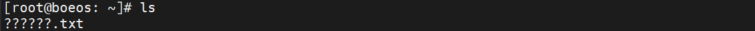
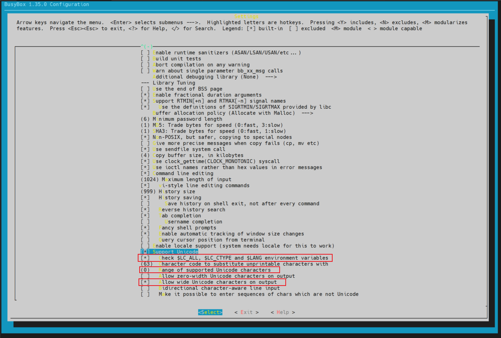
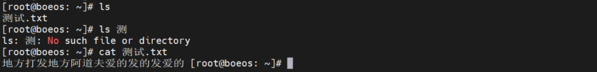

# Buildroot 增加中文支持
在使用 buildroot 编译 arm 镜像时，默认是不支持中文的，且无法输入中文字符，需要修改 buildroot 中的配置，增加中文支持。


## 1. Buildroot 镜像修改

### 1.1 修改 busybox 配置
1. 使用 `make ARCH=arm CROSS_COMPILE=arm-linux-gnueabihf- busybox-menuconfig` 命令修改 buildroot 中的 busybox 配置。

2. 选择进入 ` Settings  --->` 菜单栏，拉到菜单栏最后找到并选择上 `[ ] Support Unicode` 选项，修改红色框出的部分选择：

    
    其中
    - `[*]   Check $LC_ALL, $LC_CTYPE and $LANG environment variables` :  (`CONFIG_FEATURE_CHECK_UNICODE_IN_ENV`)：启用此选项后，只有与区域设置相关的变量的值为“xxxx.utf8”时，才会激活Unicode支持。否则，Unicode支持将始终处于启用状态。
    - `(0)   Range of supported Unicode characters` :  
    (`CONFIG_LAST_SUPPORTED_WCHAR`)：任何Unicode值大于此值的字符都被认为在输出设备上不可打印。许多小程序用替换字符替换这些字符。其想法是，许多有效的可打印Unicode字符仍然无法正确显示。想想把几十种古代文字中的字符字符、双宽象形文字、晦涩字符结合起来。。。许多终端、终端模拟器、xterm等将无法正确处理它们。选择适合您需求的最小值。  
    0-off时，将打印任何有效的可打印Unicode字符。
    - `[*]   Allow wide Unicode characters on output`：  
    (`CONFIG_UNICODE_WIDE_WCHARS`)：禁用此选项后，任何宽度>1的Unicode字符都将在输出中被替换。

### 1.2 在 /etc/profile 中修改环境变量
修改`board/freescale/imx6ullboe/rootfs_overlay` overlay 目录中的 `/etc/profile` 文件，在文件末尾添加如下内容：
```bash
export LANG=zh_CN.UTF-8
export LC_CTYPE=zh_CN.UTF-8
```

### 1.3 重新编译 buildroot 镜像
为保险性，在编译之前，先执行 `make clean` 命令清除之前编译生成的文件。

## 2. 烧写并测试镜像
使用工具烧写镜像到开发板，并测试是否支持中文。

这里在 Windows 中创建一个 `UTF-8` 格式的文本文档，用 ssh 传输到开发板中：

图中展示的结果表明：
- 使用 ls 命令时，中文文件名已经可以显示；
- 可以使用中文输入法输入中文字符；
- 可以正常显示中文文档的中文内容。


