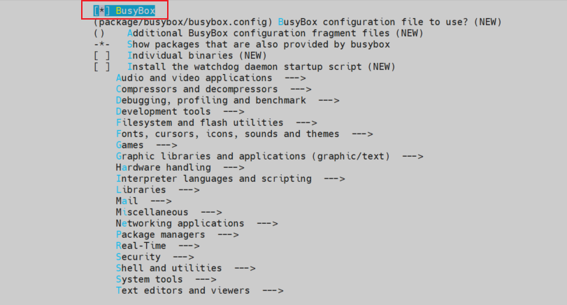

# 自定义文件系统技巧

## 1. 文件系统加载后仅在 Linux 登录界面，无法进入命令行
### 1.1 错误展示：
    ```bash
    Welcome to Buildroot
    buildroot login: root

    Welcome to Buildroot
    buildroot login: root
    ```

### 1.2 分析和解决：

在 buildroot 创建文件系统的 config 中，没有指定 busybox 的软件包(`"BR2_PACKAGE_BUSYBOX"`)，导致系统无法运行命令行工具相关控件，可以在 `"Target packages"` 选项中添加 `"BusyBox"` 软件包，重新生成文件系统即可。



在 buildroot 创建文件系统的 config 中，替代 `BR2_PACKAGE_BUSYBOX` 的配置:
- 使能每个单独命令的包,如busybox-sh、busybox-mount等,替代Busybox，但这样会增加二进制文件的体积,并不实用。
- 使用守护进程型工作系统,通过独立服务替代Busybox功能，但这需要重新设计整个系统架构。
