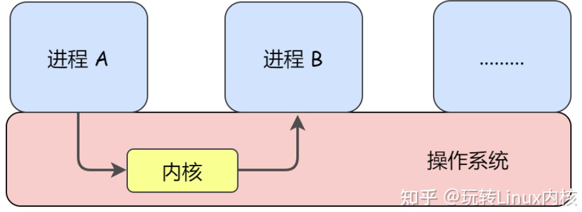
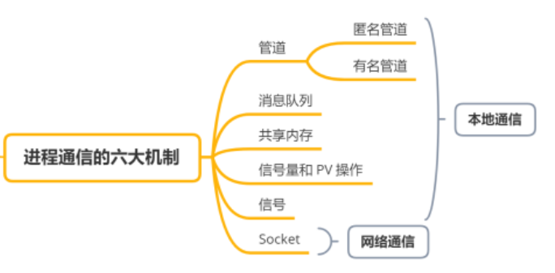

# 进程通信

## 进程通信的定义
进程通信（ InterProcess Communication，IPC）就是指进程之间的信息交换。

从操作系统层面直观的看：进程通信与线程不同，每个进程的用户地址空间都是独立的，一般而言一个进程不能直接访问另一个进程的地址空间，即进程之间无法像线程一样通过用户层面直接通信，也就无法通过全局变量的方式进行通信。

不过内核空间是每个进程都共享的，所以进程之间想要进行信息交换就必须通过内核。

## 进程通信的原理
进程间通信需要依赖内核，进程A与进程B通信，需要先写入信息到内核中的对象，再由进程B读出内核对象中的信息。

根据对象类型的不同，有不同的通信方式。

## 进程通信的类型

1. **管道**，也称作共享文件，分为无名管道和有名管道。
   **通信实体是字节流**。
   管道在内存中是由队列实现的，入队为写，出队为读。  
    - **无名管道(pipe)**，调用 `pipe()` 函数，文件系统中没有文件名。
    - **有名管道(namedpipe)**，调用 `mkfifo()` 函数，文件系统中有文件名。

2. **IPC-消息队列(messagequeue)**，UNIX下不同进程之间可实现共享资源的一种机制；
   **通信实体是消息队列**。
   UNIX允许不同进程将格式化的数据流以消息形式发送给任意进程。对消息队列具有操作权限的进程都可以使用msget完成对消息队列的操作控制。通过使用消息类型，进程可以按任何顺序读消息，或为消息安排优先级顺序。

3. **IPC-共享内存(shared memory)**，共享内存就是映射一段能被其他进程所访问的内存，这段共享内存由一个进程创建，但多个进程都可以访问。
   **通信实体是共享内存区域**。
   **共享内存是最快的 IPC 方式**，它是针对其他进程间通信方式运行效率低而专门设计的。它往往与其他通信机制，如信号量，配合使用，来实现进程间的同步和通信。

4. **IPC-信号灯(semaphore light)**，是一种用于进程通信的机制，可以使用在进程直接互相通信的环境中。它可以协调多个进程间访问系统资源，从而使得所有进程能够正确的完成任务。等待进程必须等待某个条件变为真或一段时间过去之后才可以继续执行。当一个进程需要改变条件时，它向其他进程发送一个信号，通常被称为“事件”，其他进程在接收到信号后就知道条件已经发生了变化，从而继续执行。信号灯经常用于线程之间、进程之间异步通信。
   **信号灯主要用于进程间通信。**

5. **信号量(semaphore)**，信号量是一个计数器，可以用来控制多个进程对共享资源的访问。它常作为一种锁机制，防止某进程正在访问共享资源时，其他进程也访问该资源。因此，主要作为进程间以及同一进程内不同线程之间的同步手段。
   **信号量主要用于进程和系统资源之间的同步**

6. **信号(sinal)**，信号是一种比较复杂的通信方式，用于通知接收进程某个事件已经发生。
   **通信实体是信号量**

7. **套接字(socket)**，套接口也是一种进程间通信机制，与其他通信机制不同的是，它可用于不同设备及其间的进程通信。
   **通信实体是Socket套接字**

## 几种通讯方式总结

1. **无名管道**：速度慢，容量有限，只有父子进程能通讯。

2. **有名管道**：任何进程间都能通讯，但速度慢，不适合进程间频繁地交换数据，并且管道只能传输无格式的字节流。

3. **消息队列**：消息队列的本质就是存放在内存中的消息的链表，而消息本质上是用户自定义的数据结构。如果进程从消息队列中读取了某个消息，这个消息就会被从消息队列中删除。容量受到系统限制，且要注意第一次读的时候，要考虑上一次没有读完数据的问题。消息队列速度比命名管道快，但每次数据的写入和读取都需要经过用户态与内核态之间数据的拷贝过程，所以比共享内存慢。

4. **信号量**：不能传递复杂消息，只能用来同步。

5. **共享内存区**：能够很容易控制容量，速度快，但要保持同步，比如一个进程在写的时候，另一个进程要注意读写的问题，相当于线程中的线程安全，当然，共享内存区同样可以用作线程间通讯，不过没这个必要，线程间本来就已经共享了同一进程内的一块内存。

6. **信号**：是进程通信机制中唯一的异步通信机制，它可以在任何时候发送信号给某个进程。通过发送指定信号来通知进程某个异步事件的发送，以迫使进程执行信号处理程序。信号处理完毕后，被中断进程将恢复执行。用户、内核和进程都能生成和发送信号。
   
7. **Socket** ：套接字是网络通信的基石，是支持 TCP/IP 协议的网络通信的基本操作单元。它是网络通信过程中端点的抽象表示，包含进行网络通信必须的五种信息：连接使用的协议，本地主机的 IP 地址，本地进程的协议端口，远地主机的 IP 地址，远地进程的协议端口。Socket 的本质其实是一个编程接口（API），是应用层与 TCP/IP 协议族通信的中间软件抽象层，它对 TCP/IP 进行了封装。它把复杂的 TCP/IP 协议族隐藏在 Socket 接口后面。对用户来说，只要通过一组简单的 API 就可以实现网络的连接。 
